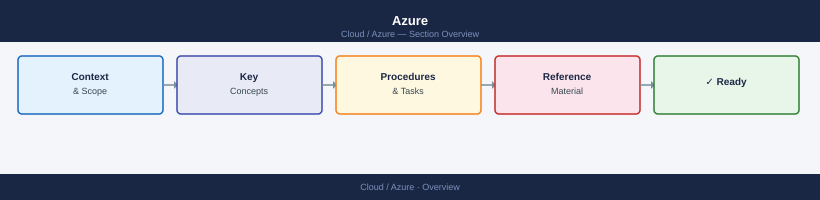

---
tags:
  - azure
---
# Azure

Microsoft Azure knowledge base covering compute, storage, networking, identity, monitoring, backup, security, governance, and cost management. Includes architecture references, operational procedures, CLI commands, and troubleshooting guides.

*Applies to: Azure*

<a class="kb-card" href="architecture/"><strong>Architecture</strong>Overview, components, integrations, and standards.</a>
<a class="kb-card" href="deploy/"><strong>Deploy</strong>Subscription setup, Management Groups, landing zone, and initial workload deployment.</a>
<a class="kb-card" href="identity/"><strong>Identity</strong>Entra ID, RBAC, PIM, Conditional Access, service principals, and managed identities.</a>
<a class="kb-card" href="networking/"><strong>Networking</strong>VNet, subnets, NSG, route tables, ExpressRoute, VPN Gateway, and Virtual WAN.</a>
<a class="kb-card" href="compute/"><strong>Compute</strong>VMs, VMSS, AKS, App Service, Functions, and instance sizing.</a>
<a class="kb-card" href="storage/"><strong>Storage</strong>Blob, Managed Disks, Azure Files, ADLS Gen2 — lifecycle, tiers, and access control.</a>
<a class="kb-card" href="security/"><strong>Security</strong>Defender for Cloud, Sentinel, Key Vault, Policy, and compliance scanning.</a>
<a class="kb-card" href="monitoring/"><strong>Monitoring</strong>Azure Monitor, Log Analytics, Application Insights, and alert rules.</a>
<a class="kb-card" href="governance/"><strong>Governance</strong>Management Groups, Azure Policy, Blueprints, and compliance frameworks.</a>
<a class="kb-card" href="cost/"><strong>Cost</strong>Cost Management, budgets, reserved instances, savings plans, and rightsizing.</a>
<a class="kb-card" href="backup-dr/"><strong>Backup & DR</strong>Azure Backup, Site Recovery, cross-region replication, and restore procedures.</a>
<a class="kb-card" href="operations/"><strong>Operations</strong>Health checks, procedures, lifecycle, and operational runbooks.</a>
<a class="kb-card" href="cli-reference/"><strong>CLI Reference</strong>az CLI and Azure PowerShell command reference with syntax and common patterns.</a>
<a class="kb-card" href="troubleshooting/"><strong>Troubleshooting</strong>Common issues, diagnostics, and escalation.</a>
<a class="kb-card" href="certifications/"><strong>Certifications</strong>Azure certification study notes — exam tracking, practice notes, weak areas, and review plans.</a>

