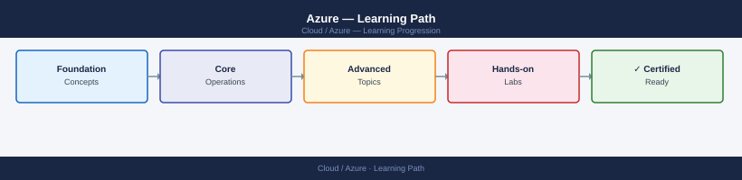

---
tags:
  - azure
  - learning-path
---
# Azure — Learning Path

<div class="kb-summary">
Recommended reading order for Microsoft Azure. Follow these stages in order to build a complete mental model before working with it in production.

*Applies to: Azure*
</div>



| Stage | Focus | Time investment |
|-------|-------|----------------|
| 1 — Architecture | Management hierarchy, VNet, Entra ID | 4–6 h |
| 2 — Deployment | ARM/Bicep, Update Manager, image lifecycle | 2–3 h |
| 3 — Operations | Azure Monitor, backups, runbooks | ongoing |
| 4 — Security | RBAC, Defender, Key Vault, Policy | 3–4 h |
| 5 — Troubleshooting | Log Analytics, Network Watcher, support | as needed |

---

```d2
direction: right

stage_1_architecture: "Stage 1 — Architecture" {shape: rectangle}
stage_2_deployment: "Stage 2 — Deployment" {shape: rectangle}
stage_3_operations: "Stage 3 — Operations" {shape: rectangle}
stage_4_security: "Stage 4 — Security" {shape: rectangle}
stage_5_troubleshooting: "Stage 5 — Troubleshooting" {shape: rectangle}

stage_1_architecture -> stage_2_deployment: next
stage_2_deployment -> stage_3_operations: next
stage_3_operations -> stage_4_security: next
stage_4_security -> stage_5_troubleshooting: next
```

## Stage 1 — Architecture

**Goal**: Understand Azure's management hierarchy — tenants, management groups, subscriptions, and resource groups — and how VNet topology, Entra ID, and Azure Policy govern everything beneath them.

**Read in this order**:

- [How It Works](../architecture/how-it-works/) — regions, availability zones, paired regions, and the Azure Resource Manager (ARM) control plane that mediates all resource operations
- [Design Standards](../architecture/design-standards/) — hub-and-spoke VNet topology, subscription segmentation by environment or workload, naming conventions, and resource group design principles
- [Integrations](../architecture/integrations/) — ExpressRoute for on-premises connectivity, Entra ID Connect (Azure AD Connect) for hybrid identity sync, and partner service integrations via Private Link

**Key concepts before moving on**:

- Entra ID (Azure AD) is the identity backbone — every resource access decision passes through it
- Azure Policy evaluates at resource creation time; non-compliant resources can be denied, audited, or auto-remediated
- VNet address spaces cannot overlap across peered networks — plan CIDR allocation across all regions before deploying
- Management group policy and RBAC cascade down to subscriptions, resource groups, and individual resources

**Why first**: Azure's identity model (Entra ID) and management hierarchy determine who can do what to every resource. Understanding these before provisioning anything prevents irreversible structural mistakes.

---

## Stage 2 — Deployment

**Goal**: Provision Azure resources repeatably using ARM templates or Bicep, without bypassing governance guardrails.

**Read**:

- [Deploy](../deploy/) — ARM and Bicep deployment patterns, Azure DevOps / GitHub Actions pipelines for IaC, and policy-compliant resource creation via deployment stacks
- [Install & Upgrade](../operations/install-upgrade/) — VM image lifecycle with Azure Compute Gallery, Update Manager for OS patching, and extension deployment via Azure Policy guest configuration

**Deployment principles**:

- Deploy all production resources via IaC — avoid portal-only changes that won't be reflected in your template state
- Use Bicep parameter files per environment (dev, test, prod) to avoid hard-coding values
- Assign mandatory tags at the resource group level using Azure Policy `deployIfNotExists` remediation
- Test deployments in `what-if` mode before applying to production subscriptions

---

## Stage 3 — Operations

**Goal**: Keep Azure workloads healthy — monitoring VM performance, costs, and platform events on every shift.

**Read in this order**:

- [Health Checks](../operations/health-checks/) — run the routine first on every shift; Azure Monitor dashboards, Service Health alerts, resource health per-VM, and Backup job status in Recovery Services Vault
- [CLI Reference](../operations/cli-reference/) — `az vm`, `az network`, `az storage`, `az monitor`, `az backup` patterns; `--query` JMESPath and `--output table` for readable output
- [Procedures](../operations/procedures/) — runbooks: VM resize, managed disk snapshot restore, subscription quota increase, and Recovery Services Vault failover test
- [Backup & Restore](../operations/backup-restore/) — Recovery Services Vault backup policies, Azure Backup job monitoring, Azure Site Recovery failover and failback procedures, and restore testing cadence
- [Scripts](../operations/scripts/) — PowerShell and Azure CLI scripts for tag compliance reporting, stale resource identification, cost allocation by tag, and backup policy audit

**Daily rhythm**: Service Health → Monitor alerts → Backup job outcomes → Cost Management anomalies → resource health checks.

---

## Stage 4 — Security

**Goal**: Apply least-privilege RBAC, enforce policy compliance, and protect data at rest and in transit across all subscriptions.

**Read**:

- [Access Control](../security/access-control/) — Azure RBAC role assignments at management group/subscription/resource scope, custom role definitions, and PIM for just-in-time privileged access activation
- [Authentication](../security/authentication/) — Entra ID Conditional Access policies, MFA enforcement, managed identities for service-to-service authentication without credentials, and Workload Identity Federation
- [Encryption](../security/encryption/) — Azure Key Vault key and secret management, disk encryption sets with customer-managed keys (CMK), and storage service encryption configuration
- [Hardening](../security/hardening/) — Defender for Cloud secure score improvement, Azure Policy CIS initiative assignment, private endpoint adoption to eliminate public internet exposure, and Just-in-Time VM access

---

## Stage 5 — Troubleshooting

**Goal**: Diagnose Azure failures using platform-native tooling — logs, metrics, and network diagnostics — without guessing.

**Read**:

- [Common Issues](../troubleshooting/common-issues/) — VM boot failures (boot diagnostics serial console), NSG blocking traffic (effective security rules), storage connectivity errors, and RBAC denial root cause with Activity Log
- [Diagnostics](../troubleshooting/diagnostics/) — Log Analytics KQL queries for VM and platform logs, Network Watcher IP flow verify and packet capture, Activity Log correlation for ARM operations, and Connection Monitor for end-to-end testing
- [Escalation](../troubleshooting/escalation/) — Azure Support case creation (severity and required data), Advisor recommendations for proactive issue resolution, and Microsoft account team escalation for business-critical outages

**Why last**: Troubleshooting makes most sense once you know the normal operating state of Azure's control plane, ARM, and the specific services you run.

---

## See also

- [Azure — Deploy](../deploy/)
- [Azure — Procedures](../operations/procedures/)
- [Azure — Common Issues](../troubleshooting/common-issues/)
