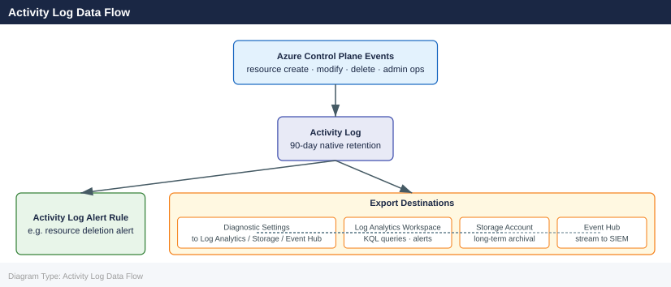

---
tags:
  - azure
description: "The Azure Activity Log is a platform log that records subscription-level events — resource creation, modification, deletion, and administrative..."
---
# Activity Log

<div class="kb-summary">
The Azure Activity Log is a platform log that records subscription-level events — resource creation, modification, deletion, and administrative operations. It is retained for 90 days natively and can be exported for longer-term storage or querying.

*Applies to: Azure*
</div>

## Activity Log Data Flow



## Querying the Activity Log

Use `az monitor activity-log list` to retrieve events. Filter by resource group, resource type, time range, or caller.

```bash
# List events for a resource group in the last 24 hours
az monitor activity-log list \
  --resource-group myRG \
  --start-time $(date -u -v-1d +%Y-%m-%dT%H:%MZ) \
  --output table

# Filter by caller and status
az monitor activity-log list \
  --resource-group myRG \
  --caller user@example.com \
  --status Succeeded \
  --output json

# Events for a specific resource
az monitor activity-log list \
  --resource /subscriptions/<sub-id>/resourceGroups/myRG/providers/Microsoft.Compute/virtualMachines/myVM \
  --start-time 2026-05-01T00:00:00Z \
  --output table
```


```text title="Expected output"
EventTimestamp                 ResourceGroup      OperationName                          Status    Caller
2026-05-15T14:32:18.123456Z   myRG               Microsoft.Compute/virtualMachines/write Succeeded admin@contoso.com
2026-05-15T13:47:02.654321Z   myRG               Microsoft.Storage/storageAccounts/read Succeeded user@example.com
2026-05-15T12:15:44.987654Z   myRG               Microsoft.Network/networkSecurityGroups/write Succeeded automation@contoso.com
2026-05-15T11:22:33.456789Z   myRG               Microsoft.Compute/virtualMachines/delete Failed     user@example.com
2026-05-15T10:05:17.234567Z   myRG               Microsoft.KeyVault/vaults/write        Succeeded admin@contoso.com

[
  {
    "eventTimestamp": "2026-05-15T09:18:45.123456Z",
    "resourceGroup": "myRG",
    "operationName": {
      "value": "Microsoft.Compute/virtualMachines/write",
      "localizedValue": "Create or Update Virtual Machine"
    },
    "status": "Succeeded",
    "caller": "user@example.com",
    "resourceId": "/subscriptions/12345678-1234-1234-1234-123456789012/resourceGroups/myRG/providers/Microsoft.Compute/virtualMachines/myVM"
  }
]

EventTimestamp                 ResourceGroup      OperationName                          Status    Caller
2026-05-15T08:42:19.876543Z   myRG               Microsoft.Compute/virtualMachines/write Succeeded admin@contoso.com
2026-05-15T07:33:05.345678Z   myRG               Microsoft.Compute/virtualMachines/read Succeeded user@example.com
2026-05-15T06:21:47.654321Z   myRG               Microsoft.Compute/virtualMachines/delete Succeeded automation@contoso.com
```

!!! warning "Common errors"
    | Error | Fix |
    |---|---|
    | `ResourceGroupNotFound` | Verify the resource group name with `az group list` and ensure you have access to the subscription. |
    | `InvalidDateFormat` | Use ISO 8601 format (YYYY-MM-DDTHH:MM:SSZ) for `--start-time` and `--end-time` parameters. |
    | `AuthorizationFailed` | Ensure your Azure account has at least Reader role on the resource group using `az role assignment list --resource-group myRG`. |
## Exporting to a Log Analytics Workspace

Export the activity log to a Log Analytics workspace for long-term KQL querying and integration with alert rules.

```bash
# Create a diagnostic setting targeting a LA workspace
az monitor diagnostic-settings create \
  --name "activity-to-law" \
  --resource /subscriptions/<sub-id> \
  --workspace /subscriptions/<sub-id>/resourceGroups/myRG/providers/Microsoft.OperationalInsights/workspaces/myWorkspace \
  --logs '[{"category":"Administrative","enabled":true},{"category":"Security","enabled":true},{"category":"ServiceHealth","enabled":true},{"category":"Alert","enabled":true},{"category":"Policy","enabled":true},{"category":"ResourceHealth","enabled":true}]'

# Verify the setting
az monitor diagnostic-settings show \
  --name "activity-to-law" \
  --resource /subscriptions/<sub-id>
```


```text title="Expected output"
{
  "id": "/subscriptions/a1b2c3d4-e5f6-4a5b-8c9d-0e1f2a3b4c5d/providers/microsoft.insights/diagnosticsettings/activity-to-law",
  "identity": null,
  "kind": null,
  "location": null,
  "name": "activity-to-law",
  "resourceGroup": null,
  "tags": null,
  "type": "Microsoft.Insights/diagnosticSettings",
  "properties": {
    "workspaceId": "/subscriptions/a1b2c3d4-e5f6-4a5b-8c9d-0e1f2a3b4c5d/resourceGroups/myRG/providers/Microsoft.OperationalInsights/workspaces/myWorkspace",
    "logs": [
      {
        "category": "Administrative",
        "categoryGroup": null,
        "enabled": true,
        "retentionPolicy": {
          "days": 0,
          "enabled": false
        }
      },
      {
        "category": "Security",
        "enabled": true,
        "retentionPolicy": {
          "days": 0,
          "enabled": false
        }
      },
      {
        "category": "ServiceHealth",
        "enabled": true,
        "retentionPolicy": {
          "days": 0,
          "enabled": false
        }
      },
      {
        "category": "Policy",
        "enabled": true,
        "retentionPolicy": {
          "days": 0,
          "enabled": false
        }
      }
    ],
    "metrics": [],
    "eventHubAuthorizationRuleId": null,
    "eventHubName": null,
    "storageAccountId": null
  }
}
```

!!! warning "Common errors"
    | Error | Fix |
    |---|---|
    | `BadRequest: The resource /subscriptions/<sub-id> is not a valid resource for diagnostic settings.` | Use the full resource ID of a specific resource (e.g., `/subscriptions/<sub-id>/resourceGroups/myRG/providers/Microsoft.Compute/virtualMachines/myVM`) or omit `--resource` to target the subscription-level Activity Log. |
    | `ResourceNotFound: The Log Analytics workspace with id /subscriptions/<sub-id>/resourceGroups/myRG/providers/Microsoft.OperationalInsights/workspaces/myWorkspace could not be found.` | Verify the workspace name, resource group, and subscription ID are correct using `az monitor log-analytics workspace list`. |
    | `InvalidJsonFormat: Invalid JSON in logs parameter.` | Ensure the JSON string is properly escaped and uses valid category names; test with `echo '<json>' | jq` before passing to the command. |
Once exported, query with KQL using the `AzureActivity` table:

```kql
AzureActivity
| where TimeGenerated > ago(7d)
| where OperationNameValue contains "delete"
| summarize count() by Caller, ResourceGroup
| order by count_ desc
```

## Retention and Archival Destinations

The default platform retention is 90 days. Export to extend this.

| Destination       | Retention         | Use Case                               |
|-------------------|-------------------|----------------------------------------|
| Log Analytics     | Up to 2 years     | Interactive querying and alerting      |
| Storage Account   | Configurable      | Compliance archival, cold storage      |
| Event Hub         | 1–7 days (EH)     | SIEM forwarding, stream processing     |
| Partner solution  | Varies            | Third-party observability platforms    |

```bash
# Export to a storage account with 365-day retention policy
az monitor diagnostic-settings create \
  --name "activity-to-storage" \
  --resource /subscriptions/<sub-id> \
  --storage-account /subscriptions/<sub-id>/resourceGroups/myRG/providers/Microsoft.Storage/storageAccounts/myStorageAccount \
  --logs '[{"category":"Administrative","enabled":true,"retentionPolicy":{"enabled":true,"days":365}}]'
```


```text title="Expected output"
{
  "id": "/subscriptions/12345678-1234-1234-1234-123456789012/providers/microsoft.insights/diagnosticsettings/activity-to-storage",
  "identity": null,
  "kind": null,
  "location": null,
  "name": "activity-to-storage",
  "properties": {
    "logs": [
      {
        "category": "Administrative",
        "enabled": true,
        "retentionPolicy": {
          "days": 365,
          "enabled": true
        }
      }
    ],
    "metrics": [],
    "serviceBusRuleId": null,
    "storageAccountId": "/subscriptions/12345678-1234-1234-1234-123456789012/resourceGroups/myRG/providers/Microsoft.Storage/storageAccounts/myStorageAccount",
    "workspaceId": null
  },
  "resourceGroup": null,
  "tags": null,
  "type": "Microsoft.Insights/diagnosticSettings"
}
```

!!! warning "Common errors"
    | Error | Fix |
    |---|---|
    | `ResourceNotFound: The resource '/subscriptions/<sub-id>' does not exist.` | Replace `<sub-id>` with your actual subscription ID from `az account show --query id -o tsv`. |
    | `InvalidResourceId: The provided resource ID for storage account is invalid or the account does not exist.` | Verify the storage account exists in the specified resource group with `az storage account show --name myStorageAccount --resource-group myRG`. |
    | `AuthorizationFailed: The client does not have permission to perform action 'microsoft.insights/diagnosticSettings/write'.` | Ensure your Azure account has the Monitoring Contributor or Owner role on the subscription with `az role assignment list --assignee <your-email>`. |
## Alerts on Activity Log Events

Activity log alerts fire when a specific event matches defined conditions. Common uses include detecting VM deletions, role assignment changes, or policy state changes.

```bash
# Create an action group
az monitor action-group create \
  --name "ops-action-group" \
  --resource-group myRG \
  --short-name "OpsAG" \
  --action email ops-email ops@example.com

# Alert on VM deletion
az monitor activity-log alert create \
  --name "alert-vm-delete" \
  --resource-group myRG \
  --condition category=Administrative operationName=Microsoft.Compute/virtualMachines/delete \
  --action-group /subscriptions/<sub-id>/resourceGroups/myRG/providers/microsoft.insights/actionGroups/ops-action-group \
  --description "Fires when a VM is deleted"

# Alert on RBAC role assignment write
az monitor activity-log alert create \
  --name "alert-rbac-change" \
  --resource-group myRG \
  --condition category=Administrative operationName=Microsoft.Authorization/roleAssignments/write \
  --action-group /subscriptions/<sub-id>/resourceGroups/myRG/providers/microsoft.insights/actionGroups/ops-action-group
```


```text title="Expected output"
{
  "id": "/subscriptions/12345678-1234-1234-1234-123456789012/resourceGroups/myRG/providers/microsoft.insights/actionGroups/ops-action-group",
  "location": "global",
  "name": "ops-action-group",
  "resourceGroup": "myRG",
  "shortName": "OpsAG",
  "tags": {},
  "type": "Microsoft.Insights/actionGroups"
}
{
  "actions": {
    "actionGroups": [],
    "emailReceivers": [
      {
        "emailAddress": "ops@example.com",
        "name": "ops-email",
        "status": "Enabled"
      }
    ],
    "itsm": [],
    "webhooks": []
  },
  "condition": "category=Administrative operationName=Microsoft.Compute/virtualMachines/delete",
  "description": "Fires when a VM is deleted",
  "enabled": true,
  "id": "/subscriptions/12345678-1234-1234-1234-123456789012/resourceGroups/myRG/providers/microsoft.insights/activityLogAlerts/alert-vm-delete",
  "name": "alert-vm-delete",
  "resourceGroup": "myRG"
}
{
  "actions": {
    "actionGroups": [],
    "emailReceivers": [],
    "itsm": [],
    "webhooks": []
  },
  "condition": "category=Administrative operationName=Microsoft.Authorization/roleAssignments/write",
  "enabled": true,
  "id": "/subscriptions/12345678-1234-1234-1234-123456789012/resourceGroups/myRG/providers/microsoft.insights/activityLogAlerts/alert-rbac-change",
  "name": "alert-rbac-change",
  "resourceGroup": "myRG"
}
```

!!! warning "Common errors"
    | Error | Fix |
    |---|---|
    | `ResourceGroupNotFound : The resource group 'myRG' could not be found.` | Verify the resource group exists in your subscription with `az group list` and use the correct name. |
    | `InvalidTemplate : The provided action group resource ID is invalid or does not exist.` | Replace `<sub-id>` with your actual subscription ID from `az account show --query id -o tsv` and ensure the action group was created successfully. |
    | `BadRequest : The condition format is invalid.` | Ensure condition parameters are space-separated key=value pairs without quotes, e.g., `category=Administrative operationName=Microsoft.Compute/virtualMachines/delete`. |
## Activity Log Categories

| Category        | Description                                          |
|-----------------|------------------------------------------------------|
| Administrative  | CRUD operations on resources via ARM                 |
| Security        | Alerts generated by Microsoft Defender for Cloud     |
| ServiceHealth   | Azure service incidents affecting your subscription  |
| ResourceHealth  | Changes to individual resource health state          |
| Alert           | Activations of Azure Monitor alerts                  |
| Policy          | Policy evaluation results (effect actions)           |
| Autoscale       | Scale-in and scale-out events                        |
| Recommendation  | Azure Advisor recommendation events                  |

## Audit and Compliance Queries

```bash
# Find all operations by a specific service principal
az monitor activity-log list \
  --caller <service-principal-object-id> \
  --start-time 2026-04-01T00:00:00Z \
  --output json | jq '.[].operationName.value'

# Find failed deployments in the last 7 days
az monitor activity-log list \
  --status Failed \
  --start-time $(date -u -v-7d +%Y-%m-%dT%H:%MZ) \
  --output table

# Export to file for audit review
az monitor activity-log list \
  --resource-group myRG \
  --start-time 2026-05-01T00:00:00Z \
  --output json > activity-log-export.json
```


```text title="Expected output"
Microsoft.Compute/virtualMachines/write
Microsoft.Network/networkInterfaces/write
Microsoft.Storage/storageAccounts/read
Microsoft.Authorization/roleAssignments/write
Microsoft.Resources/deployments/write

Time                 ResourceGroup    OperationName                          Status    Caller
-------------------  ---------------  ------------------------------------  -------  -------------------------
2026-04-28T14:32:15  myRG             Microsoft.Compute/virtualMachines/delete  Failed   user@contoso.onmicrosoft.com
2026-04-27T09:18:42  myRG             Microsoft.Network/publicIPAddresses/write  Failed   sp-deploy@contoso.onmicrosoft.com
2026-04-26T16:45:03  myRG             Microsoft.Storage/storageAccounts/write  Failed   automation@contoso.onmicrosoft.com
2026-04-25T11:22:19  myRG             Microsoft.Authorization/roleAssignments/delete  Failed   admin@contoso.onmicrosoft.com

(no output — command completes silently)
```

!!! warning "Common errors"
    | Error | Fix |
    |---|---|
    | `The start-time value '2026-04-01T00:00:00Z' is invalid. Specify a valid ISO 8601 datetime.` | Use a past date or ensure the datetime format is exactly `YYYY-MM-DDTHH:MM:SSZ` in UTC. |
    | `The caller '<service-principal-object-id>' does not exist or is invalid.` | Verify the service principal object ID with `az ad sp list --query "[].objectId"` and use the correct UUID. |
    | `date: illegal time format` | On macOS, replace `date -u -v-7d` with `date -u -d '7 days ago'` or use `gdate` from GNU coreutils. |