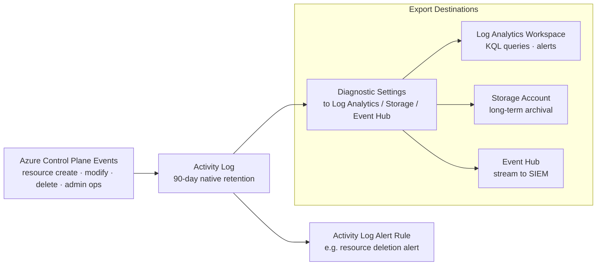

---
tags:
  - azure
---
# Activity Log


<div class="kb-summary">
The Azure Activity Log is a platform log that records subscription-level events — resource creation, modification, deletion, and administrative operations. It is retained for 90 days natively and can be exported for longer-term storage or querying.
</div>
```text
┌─────────────────────────────────────── Cloud Azure Monitoring ────────────────────────────────────────┐
│                                                                                                       │
│   ┌───────────────────────────────────────────────────────────────────────────────────────────────┐   │
│   │                             Azure: Cloud Azure Monitoring platform                            │   │
│   │                                  Protocols: Various protocols                                 │   │
│   │                     Management: Cloud Azure Monitoring management console                     │   │
│   │                Sections: Architecture · Operations · Security · Troubleshooting               │   │
│   └───────────────────────────────────────────────────────────────────────────────────────────────┘   │
│                                                                                                       │
│    Architecture → Operations → Security → Troubleshooting → Escalation                                │
│                                                                                                       │
│                  ▼                                ▼                                ▼                  │
│                                                                                                       │
│   ┌─────────────────────────────┐  ┌─────────────────────────────┐  ┌─────────────────────────────┐   │
│   │            Layer            │  │          Component          │  │            Notes            │   │
│   │             Core            │  │       Primary service       │  │        Main function        │   │
│   │          Management         │  │        Control plane        │  │         Admin access        │   │
│   │          Monitoring         │  │         Health/perf         │  │      Alerts/dashboards      │   │
│   │           Security          │  │         Auth/encrypt        │  │        Access control       │   │
│   │         Integration         │  │        APIs/plug-ins        │  │         Third-party         │   │
│   └─────────────────────────────┘  └─────────────────────────────┘  └─────────────────────────────┘   │
│                                                                                                       │
│                          ▼                                                 ▼                          │
│                                                                                                       │
│   ┌───────────────────────────────────────────────────────────────────────────────────────────────┐   │
│   │      Layer       │    Component     │      Function     │      Notes       │       Auth       │   │
│   │       Core       │ Primary service  │   Main function   │     See docs     │       RBAC       │   │
│   │    Management    │  Control plane   │    Admin access   │     See docs     │       RBAC       │   │
│   │    Monitoring    │   Health/perf    │  Alerts/dashboard │     See docs     │       RBAC       │   │
│   │     Security     │   Auth/encrypt   │   Access control  │     See docs     │       RBAC       │   │
│   └───────────────────────────────────────────────────────────────────────────────────────────────┘   │
│                                                                                                       │
│    Physical: Cloud Azure Monitoring infrastructure · management network · monitoring                  │
│                                                                                                       │
│    Key terms:                                                                                         │
│                                                                                                       │
│    Azure              = Cloud Azure Monitoring platform overview and core concepts                    │
│    Management         = management console and command-line interface for administration              │
│    Monitoring         = health and performance monitoring dashboards and alerting                     │
│    Automation         = REST API, scripting, and pipeline integration capabilities                    │
│    Security           = access control, authentication, and encryption configuration                  │
│    Backup             = backup and recovery procedures and schedule configuration                     │
│    Upgrade            = software version upgrades and firmware patching procedures                    │
│    Troubleshooting    = diagnostic procedures and common issue resolution steps                       │
│    Escalation         = vendor support escalation path and severity triage process                    │
│    Documentation      = vendor knowledge base and official product documentation                      │
│    Change management  = change ticket requirements for production modifications                       │
│    Audit log          = admin action logging for compliance and security review                       │
│                                                                                                       │
└───────────────────────────────────────────────────────────────────────────────────────────────────────┘
```


## Activity Log Data Flow



## Querying the Activity Log

Use `az monitor activity-log list` to retrieve events. Filter by resource group, resource type, time range, or caller.

```bash
# List events for a resource group in the last 24 hours
az monitor activity-log list \
  --resource-group myRG \
  --start-time $(date -u -v-1d +%Y-%m-%dT%H:%MZ) \
  --output table

# Filter by caller and status
az monitor activity-log list \
  --resource-group myRG \
  --caller user@example.com \
  --status Succeeded \
  --output json

# Events for a specific resource
az monitor activity-log list \
  --resource /subscriptions/<sub-id>/resourceGroups/myRG/providers/Microsoft.Compute/virtualMachines/myVM \
  --start-time 2026-05-01T00:00:00Z \
  --output table
```

## Exporting to a Log Analytics Workspace

Export the activity log to a Log Analytics workspace for long-term KQL querying and integration with alert rules.

```bash
# Create a diagnostic setting targeting a LA workspace
az monitor diagnostic-settings create \
  --name "activity-to-law" \
  --resource /subscriptions/<sub-id> \
  --workspace /subscriptions/<sub-id>/resourceGroups/myRG/providers/Microsoft.OperationalInsights/workspaces/myWorkspace \
  --logs '[{"category":"Administrative","enabled":true},{"category":"Security","enabled":true},{"category":"ServiceHealth","enabled":true},{"category":"Alert","enabled":true},{"category":"Policy","enabled":true},{"category":"ResourceHealth","enabled":true}]'

# Verify the setting
az monitor diagnostic-settings show \
  --name "activity-to-law" \
  --resource /subscriptions/<sub-id>
```

Once exported, query with KQL using the `AzureActivity` table:

```kql
AzureActivity
| where TimeGenerated > ago(7d)
| where OperationNameValue contains "delete"
| summarize count() by Caller, ResourceGroup
| order by count_ desc
```

## Retention and Archival Destinations

The default platform retention is 90 days. Export to extend this.

| Destination       | Retention         | Use Case                               |
|-------------------|-------------------|----------------------------------------|
| Log Analytics     | Up to 2 years     | Interactive querying and alerting      |
| Storage Account   | Configurable      | Compliance archival, cold storage      |
| Event Hub         | 1–7 days (EH)     | SIEM forwarding, stream processing     |
| Partner solution  | Varies            | Third-party observability platforms    |

```bash
# Export to a storage account with 365-day retention policy
az monitor diagnostic-settings create \
  --name "activity-to-storage" \
  --resource /subscriptions/<sub-id> \
  --storage-account /subscriptions/<sub-id>/resourceGroups/myRG/providers/Microsoft.Storage/storageAccounts/myStorageAccount \
  --logs '[{"category":"Administrative","enabled":true,"retentionPolicy":{"enabled":true,"days":365}}]'
```

## Alerts on Activity Log Events

Activity log alerts fire when a specific event matches defined conditions. Common uses include detecting VM deletions, role assignment changes, or policy state changes.

```bash
# Create an action group
az monitor action-group create \
  --name "ops-action-group" \
  --resource-group myRG \
  --short-name "OpsAG" \
  --action email ops-email ops@example.com

# Alert on VM deletion
az monitor activity-log alert create \
  --name "alert-vm-delete" \
  --resource-group myRG \
  --condition category=Administrative operationName=Microsoft.Compute/virtualMachines/delete \
  --action-group /subscriptions/<sub-id>/resourceGroups/myRG/providers/microsoft.insights/actionGroups/ops-action-group \
  --description "Fires when a VM is deleted"

# Alert on RBAC role assignment write
az monitor activity-log alert create \
  --name "alert-rbac-change" \
  --resource-group myRG \
  --condition category=Administrative operationName=Microsoft.Authorization/roleAssignments/write \
  --action-group /subscriptions/<sub-id>/resourceGroups/myRG/providers/microsoft.insights/actionGroups/ops-action-group
```

## Activity Log Categories

| Category        | Description                                          |
|-----------------|------------------------------------------------------|
| Administrative  | CRUD operations on resources via ARM                 |
| Security        | Alerts generated by Microsoft Defender for Cloud     |
| ServiceHealth   | Azure service incidents affecting your subscription  |
| ResourceHealth  | Changes to individual resource health state          |
| Alert           | Activations of Azure Monitor alerts                  |
| Policy          | Policy evaluation results (effect actions)           |
| Autoscale       | Scale-in and scale-out events                        |
| Recommendation  | Azure Advisor recommendation events                  |

## Audit and Compliance Queries

```bash
# Find all operations by a specific service principal
az monitor activity-log list \
  --caller <service-principal-object-id> \
  --start-time 2026-04-01T00:00:00Z \
  --output json | jq '.[].operationName.value'

# Find failed deployments in the last 7 days
az monitor activity-log list \
  --status Failed \
  --start-time $(date -u -v-7d +%Y-%m-%dT%H:%MZ) \
  --output table

# Export to file for audit review
az monitor activity-log list \
  --resource-group myRG \
  --start-time 2026-05-01T00:00:00Z \
  --output json > activity-log-export.json
```
