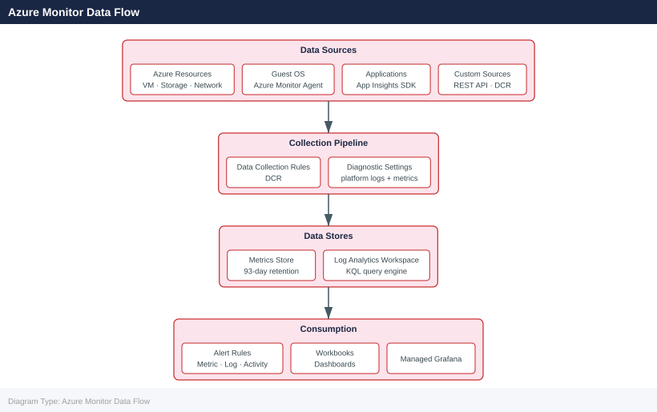

---
tags:
  - azure
---
# Azure Monitor

<div class="kb-summary">
Azure Monitor is the unified observability platform for Azure. It collects metrics and logs from Azure resources, operating systems, applications, and custom sources, then provides tools for analysis, alerting, and visualisation.

*Applies to: Azure*
</div>

## Azure Monitor Data Flow



## Metrics vs Logs

| Aspect          | Metrics                              | Logs                                         |
|-----------------|--------------------------------------|----------------------------------------------|
| Storage         | Time-series database (93 days)       | Log Analytics workspace                      |
| Latency         | Near real-time (< 1 min)             | Ingestion latency typically 2–5 minutes      |
| Query language  | Metrics explorer, REST API           | KQL (Kusto Query Language)                   |
| Cost            | Free for platform metrics            | Charged per GB ingested and retained         |
| Use case        | Alerting, dashboards, autoscale      | Troubleshooting, audit, trend analysis       |

## Data Collection Rules (DCRs)

Data Collection Rules define what data to collect, how to transform it, and where to send it. They replace legacy agents and MMA configurations.

```bash
# Create a Data Collection Rule for VM performance counters
az monitor data-collection rule create \
  --name "vm-perf-dcr" \
  --resource-group myRG \
  --location eastus \
  --data-flows '[{"streams":["Microsoft-Perf"],"destinations":["myWorkspace"]}]' \
  --destinations '{"logAnalytics":[{"workspaceResourceId":"/subscriptions/<sub-id>/resourceGroups/myRG/providers/Microsoft.OperationalInsights/workspaces/myWorkspace","name":"myWorkspace"}]}' \
  --performance-counters '[{"streams":["Microsoft-Perf"],"samplingFrequencyInSeconds":60,"counterSpecifiers":["\\Processor(_Total)\\% Processor Time","\\Memory\\Available MBytes"],"name":"perfCounters"}]'

# Associate a DCR with a VM
az monitor data-collection rule association create \
  --name "vm-dcr-assoc" \
  --resource /subscriptions/<sub-id>/resourceGroups/myRG/providers/Microsoft.Compute/virtualMachines/myVM \
  --rule-id /subscriptions/<sub-id>/resourceGroups/myRG/providers/Microsoft.Insights/dataCollectionRules/vm-perf-dcr

# List DCRs in a resource group
az monitor data-collection rule list \
  --resource-group myRG \
  --output table
```


```text title="Expected output"
{
  "dataFlows": [
    {
      "destinations": [
        "myWorkspace"
      ],
      "streams": [
        "Microsoft-Perf"
      ]
    }
  ],
  "destinations": {
    "logAnalytics": [
      {
        "name": "myWorkspace",
        "workspaceResourceId": "/subscriptions/12345678-1234-1234-1234-123456789012/resourceGroups/myRG/providers/Microsoft.OperationalInsights/workspaces/myWorkspace"
      }
    ]
  },
  "etag": "\"6f00b8e0-0000-0100-0000-65a4c2d10000\"",
  "id": "/subscriptions/12345678-1234-1234-1234-123456789012/resourceGroups/myRG/providers/Microsoft.Insights/dataCollectionRules/vm-perf-dcr",
  "location": "eastus",
  "name": "vm-perf-dcr",
  "performanceCounters": [
    {
      "counterSpecifiers": [
        "\\Processor(_Total)\\% Processor Time",
        "\\Memory\\Available MBytes"
      ],
      "name": "perfCounters",
      "samplingFrequencyInSeconds": 60,
      "streams": [
        "Microsoft-Perf"
      ]
    }
  ],
  "resourceGroup": "myRG",
  "type": "Microsoft.Insights/dataCollectionRules"
}
{
  "etag": "\"3a00d4f2-0000-0100-0000-65a4c3a80000\"",
  "id": "/subscriptions/12345678-1234-1234-1234-123456789012/resourceGroups/myRG/providers/Microsoft.Insights/dataCollectionRuleAssociations/vm-dcr-assoc",
  "name": "vm-dcr-assoc",
  "resourceGroup": "myRG",
  "type": "Microsoft.Insights/dataCollectionRuleAssociations"
}
Name          ResourceGroup    Location    ProvisioningState
-----------   ---------------  ----------  -------------------
vm-perf-dcr   myRG             eastus      Succeeded
app-logs-dcr  myRG             eastus      Succeeded
```

!!! warning "Common errors"
    **`(ResourceNotFound) The resource '/subscriptions/<sub-id>/resourceGroups/myRG/providers/Microsoft.OperationalInsights/workspaces/myWorkspace' could not be found.`** — Verify the Log Analytics workspace exists in the specified subscription and resource group, and use the correct workspace resource ID.
    **`(InvalidParameter) The resource '/subscriptions/<sub-id>/resourceGroups/myRG/providers/Microsoft.Compute/virtualMachines/myVM' does not exist.`** — Ensure the VM exists in the specified resource group and subscription before creating the DCR association.
    **`(BadRequest) Invalid JSON in --data-flows or --destinations parameter.`** — Validate JSON syntax by escaping quotes properly or using a JSON file with `@filename` syntax instead of inline strings.
## Azure Monitor Agents

The Azure Monitor Agent (AMA) replaces the legacy Log Analytics Agent (MMA/OMS) and Diagnostics Extension. It uses DCRs for configuration.

```bash
# Install AMA on a Linux VM via extension
az vm extension set \
  --resource-group myRG \
  --vm-name myVM \
  --name AzureMonitorLinuxAgent \
  --publisher Microsoft.Azure.Monitor \
  --version 1.0 \
  --auto-upgrade-minor-version true

# Install AMA on a Windows VM
az vm extension set \
  --resource-group myRG \
  --vm-name myWinVM \
  --name AzureMonitorWindowsAgent \
  --publisher Microsoft.Azure.Monitor \
  --version 1.0 \
  --auto-upgrade-minor-version true

# Check extension status
az vm extension show \
  --resource-group myRG \
  --vm-name myVM \
  --name AzureMonitorLinuxAgent \
  --output table
```


```text title="Expected output"
{
  "autoUpgradeMinorVersion": true,
  "forceUpdateTag": null,
  "id": "/subscriptions/12a34b5c-6d7e-8f9g-0h1i-2j3k4l5m6n7o/resourceGroups/myRG/providers/Microsoft.Compute/virtualMachines/myVM/extensions/AzureMonitorLinuxAgent",
  "instanceView": null,
  "name": "AzureMonitorLinuxAgent",
  "protectedSettings": null,
  "provisioningState": "Succeeded",
  "publisher": "Microsoft.Azure.Monitor",
  "resourceGroup": "myRG",
  "settings": null,
  "tags": null,
  "type": "Microsoft.Compute/virtualMachines/extensions",
  "typeHandlerVersion": "1.0",
  "virtualMachineExtensionType": "AzureMonitorLinuxAgent"
}
{
  "autoUpgradeMinorVersion": true,
  "forceUpdateTag": null,
  "id": "/subscriptions/12a34b5c-6d7e-8f9g-0h1i-2j3k4l5m6n7o/resourceGroups/myRG/providers/Microsoft.Compute/virtualMachines/myWinVM/extensions/AzureMonitorWindowsAgent",
  "instanceView": null,
  "name": "AzureMonitorWindowsAgent",
  "provisioningState": "Succeeded",
  "publisher": "Microsoft.Azure.Monitor",
  "resourceGroup": "myRG",
  "typeHandlerVersion": "1.0",
  "virtualMachineExtensionType": "AzureMonitorWindowsAgent"
}
Name                          ResourceGroup    VmName    Publisher              Version    TypeHandlerVersion    ProvisioningState
------------------------------  ---------------  --------  ---------------------  ---------  ---------------------  -------------------
AzureMonitorLinuxAgent        myRG             myVM      Microsoft.Azure.Monitor  1.0        1.0                    Succeeded
```

!!! warning "Common errors"
    **`ResourceNotFound: The Resource 'Microsoft.Compute/virtualMachines/myVM' under resource group 'myRG' was not found.`** — Verify the VM name and resource group name are correct with `az vm list --resource-group myRG`.
    **`The extension with name 'AzureMonitorLinuxAgent' could not be found on virtual machine 'myVM'.`** — Ensure the extension was successfully installed by checking the provisioningState in the first command output.
## Diagnostics Settings Pipeline

Diagnostic settings route resource-level logs and metrics to one or more destinations.

```bash
# Enable diagnostic settings for a Storage Account
az monitor diagnostic-settings create \
  --name "storage-diag" \
  --resource /subscriptions/<sub-id>/resourceGroups/myRG/providers/Microsoft.Storage/storageAccounts/myStorageAccount \
  --workspace /subscriptions/<sub-id>/resourceGroups/myRG/providers/Microsoft.OperationalInsights/workspaces/myWorkspace \
  --metrics '[{"category":"Transaction","enabled":true}]' \
  --logs '[{"category":"StorageRead","enabled":true},{"category":"StorageWrite","enabled":true},{"category":"StorageDelete","enabled":true}]'

# List existing diagnostic settings on a resource
az monitor diagnostic-settings list \
  --resource /subscriptions/<sub-id>/resourceGroups/myRG/providers/Microsoft.Storage/storageAccounts/myStorageAccount

# Delete a diagnostic setting
az monitor diagnostic-settings delete \
  --name "storage-diag" \
  --resource /subscriptions/<sub-id>/resourceGroups/myRG/providers/Microsoft.Storage/storageAccounts/myStorageAccount
```


```text title="Expected output"
{
  "id": "/subscriptions/12345678-1234-1234-1234-123456789012/resourcegroups/myRG/providers/microsoft.storage/storageaccounts/myStorageAccount/providers/microsoft.insights/diagnosticsettings/storage-diag",
  "name": "storage-diag",
  "resourceGroup": "myRG",
  "logs": [
    {
      "category": "StorageRead",
      "categoryGroup": null,
      "enabled": true,
      "retentionPolicy": {
        "days": 0,
        "enabled": false
      }
    },
    {
      "category": "StorageWrite",
      "enabled": true,
      "retentionPolicy": {
        "days": 0,
        "enabled": false
      }
    },
    {
      "category": "StorageDelete",
      "enabled": true,
      "retentionPolicy": {
        "days": 0,
        "enabled": false
      }
    }
  ],
  "metrics": [
    {
      "category": "Transaction",
      "enabled": true,
      "retentionPolicy": {
        "days": 0,
        "enabled": false
      }
    }
  ],
  "workspaceId": "/subscriptions/12345678-1234-1234-1234-123456789012/resourcegroups/myRG/providers/microsoft.operationalinsights/workspaces/myWorkspace"
}

[
  {
    "id": "/subscriptions/12345678-1234-1234-1234-123456789012/resourcegroups/myRG/providers/microsoft.storage/storageaccounts/myStorageAccount/providers/microsoft.insights/diagnosticsettings/storage-diag",
    "name": "storage-diag",
    "resourceGroup": "myRG",
    "logs": [...],
    "metrics": [...]
  }
]

(no output — command completes silently)
```

!!! warning "Common errors"
    **`(ResourceNotFound) The resource '/subscriptions/<sub-id>/resourceGroups/myRG/providers/Microsoft.Storage/storageAccounts/myStorageAccount' could not be found.`** — Verify the subscription ID, resource group name, and storage account name are correct and exist in your Azure subscription.
    **`(InvalidResourceId) The provided resource ID is invalid or malformed.`** — Ensure the resource ID follows the exact format with correct casing and no trailing slashes: `/subscriptions/<sub-id>/resourceGroups/<rg>/providers/Microsoft.Storage/storageAccounts/<name>`.
    **`(WorkspaceNotFound) The Log Analytics workspace does not exist or you do not have access to it.`** — Confirm the workspace exists in the same subscription and resource group, and that your account has `Microsoft.OperationalInsights/workspaces/read` permissions.
## Key Azure Monitor Components

| Component              | Purpose                                              |
|------------------------|------------------------------------------------------|
| Metrics explorer       | Visualise and pin metric charts                      |
| Log Analytics          | KQL-based log querying and alerting                  |
| Alerts                 | Metric, log, activity log, and health alerts         |
| Workbooks              | Rich interactive reporting dashboards                |
| Dashboards             | Shared pinned charts for quick visibility            |
| Application Insights   | APM: traces, dependencies, exceptions, availability  |
| Network Watcher        | Network diagnostic and flow monitoring               |
| Service Health         | Azure platform health and incident notifications     |

## Querying Metrics from CLI

```bash
# Query CPU percentage metric for a VM
az monitor metrics list \
  --resource /subscriptions/<sub-id>/resourceGroups/myRG/providers/Microsoft.Compute/virtualMachines/myVM \
  --metric "Percentage CPU" \
  --interval PT5M \
  --start-time 2026-05-07T00:00:00Z \
  --end-time 2026-05-07T06:00:00Z \
  --output table

# List available metrics for a resource type
az monitor metrics list-definitions \
  --resource /subscriptions/<sub-id>/resourceGroups/myRG/providers/Microsoft.Compute/virtualMachines/myVM \
  --output table
```


```text title="Expected output"
Time                 Avg    Min    Max    Total    Count
-------------------  -----  -----  -----  -------  -------
2026-05-07T00:05:00Z  12.34  8.12   18.76  N/A      1
2026-05-07T00:10:00Z  14.21  10.05  22.43  N/A      1
2026-05-07T00:15:00Z  11.87  7.34   19.92  N/A      1
2026-05-07T00:20:00Z  13.56  9.11   21.08  N/A      1
2026-05-07T00:25:00Z  15.43  11.22  24.67  N/A      1
...

Name                 Type                 Unit         Dimensions
-------------------  -------------------  -----------  -------------------------
Percentage CPU       Microsoft.Compute    Percent      {"name":"VMName"}
Available Memory     Microsoft.Compute    Bytes        {"name":"VMName"}
Network In Total     Microsoft.Compute    Bytes        {"name":"VMName"}
Network Out Total    Microsoft.Compute    Bytes        {"name":"VMName"}
Disk Read Bytes      Microsoft.Compute    Bytes        {"name":"VMName"}
Disk Write Bytes     Microsoft.Compute    Bytes        {"name":"VMName"}
```

!!! warning "Common errors"
    **`ResourceNotFound: The resource '/subscriptions/<sub-id>/resourceGroups/myRG/providers/Microsoft.Compute/virtualMachines/myVM' could not be found.`** — Verify the subscription ID, resource group name, and VM name are correct using `az vm list --output table`.
    **`InvalidMetricName: The metric 'Percentage CPU' is not valid for this resource type.`** — Use `az monitor metrics list-definitions` to retrieve the exact metric name for your resource type.
    **`AuthorizationFailed: The client '<user-id>' with object id '<object-id>' does not have authorization to perform action 'microsoft.insights/metrics/read' over scope '/subscriptions/<sub-id>/resourceGroups/myRG/providers/Microsoft.Compute/virtualMachines/myVM'.`** — Assign the "Monitoring Reader" role to your user account using `az role assignment create --role "Monitoring Reader" --assignee <user-email> --scope <resource-id>`.