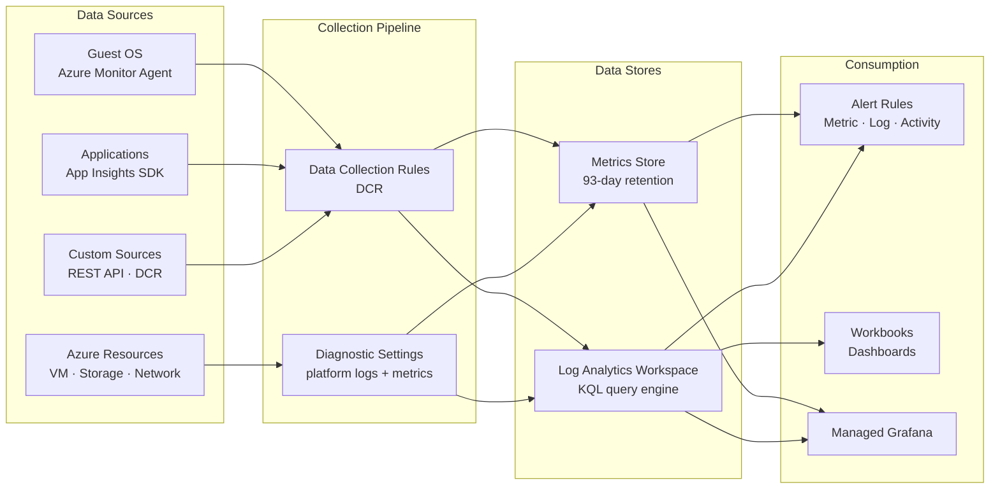

---
tags:
  - azure
---
# Azure Monitor

<div class="kb-summary">
Azure Monitor is the unified observability platform for Azure. It collects metrics and logs from Azure resources, operating systems, applications, and custom sources, then provides tools for analysis, alerting, and visualisation.

*Applies to: Azure*
</div>

## Azure Monitor Data Flow



## Metrics vs Logs

| Aspect          | Metrics                              | Logs                                         |
|-----------------|--------------------------------------|----------------------------------------------|
| Storage         | Time-series database (93 days)       | Log Analytics workspace                      |
| Latency         | Near real-time (< 1 min)             | Ingestion latency typically 2–5 minutes      |
| Query language  | Metrics explorer, REST API           | KQL (Kusto Query Language)                   |
| Cost            | Free for platform metrics            | Charged per GB ingested and retained         |
| Use case        | Alerting, dashboards, autoscale      | Troubleshooting, audit, trend analysis       |

## Data Collection Rules (DCRs)

Data Collection Rules define what data to collect, how to transform it, and where to send it. They replace legacy agents and MMA configurations.

```bash
# Create a Data Collection Rule for VM performance counters
az monitor data-collection rule create \
  --name "vm-perf-dcr" \
  --resource-group myRG \
  --location eastus \
  --data-flows '[{"streams":["Microsoft-Perf"],"destinations":["myWorkspace"]}]' \
  --destinations '{"logAnalytics":[{"workspaceResourceId":"/subscriptions/<sub-id>/resourceGroups/myRG/providers/Microsoft.OperationalInsights/workspaces/myWorkspace","name":"myWorkspace"}]}' \
  --performance-counters '[{"streams":["Microsoft-Perf"],"samplingFrequencyInSeconds":60,"counterSpecifiers":["\\Processor(_Total)\\% Processor Time","\\Memory\\Available MBytes"],"name":"perfCounters"}]'

# Associate a DCR with a VM
az monitor data-collection rule association create \
  --name "vm-dcr-assoc" \
  --resource /subscriptions/<sub-id>/resourceGroups/myRG/providers/Microsoft.Compute/virtualMachines/myVM \
  --rule-id /subscriptions/<sub-id>/resourceGroups/myRG/providers/Microsoft.Insights/dataCollectionRules/vm-perf-dcr

# List DCRs in a resource group
az monitor data-collection rule list \
  --resource-group myRG \
  --output table
```

## Azure Monitor Agents

The Azure Monitor Agent (AMA) replaces the legacy Log Analytics Agent (MMA/OMS) and Diagnostics Extension. It uses DCRs for configuration.

```bash
# Install AMA on a Linux VM via extension
az vm extension set \
  --resource-group myRG \
  --vm-name myVM \
  --name AzureMonitorLinuxAgent \
  --publisher Microsoft.Azure.Monitor \
  --version 1.0 \
  --auto-upgrade-minor-version true

# Install AMA on a Windows VM
az vm extension set \
  --resource-group myRG \
  --vm-name myWinVM \
  --name AzureMonitorWindowsAgent \
  --publisher Microsoft.Azure.Monitor \
  --version 1.0 \
  --auto-upgrade-minor-version true

# Check extension status
az vm extension show \
  --resource-group myRG \
  --vm-name myVM \
  --name AzureMonitorLinuxAgent \
  --output table
```

## Diagnostics Settings Pipeline

Diagnostic settings route resource-level logs and metrics to one or more destinations.

```bash
# Enable diagnostic settings for a Storage Account
az monitor diagnostic-settings create \
  --name "storage-diag" \
  --resource /subscriptions/<sub-id>/resourceGroups/myRG/providers/Microsoft.Storage/storageAccounts/myStorageAccount \
  --workspace /subscriptions/<sub-id>/resourceGroups/myRG/providers/Microsoft.OperationalInsights/workspaces/myWorkspace \
  --metrics '[{"category":"Transaction","enabled":true}]' \
  --logs '[{"category":"StorageRead","enabled":true},{"category":"StorageWrite","enabled":true},{"category":"StorageDelete","enabled":true}]'

# List existing diagnostic settings on a resource
az monitor diagnostic-settings list \
  --resource /subscriptions/<sub-id>/resourceGroups/myRG/providers/Microsoft.Storage/storageAccounts/myStorageAccount

# Delete a diagnostic setting
az monitor diagnostic-settings delete \
  --name "storage-diag" \
  --resource /subscriptions/<sub-id>/resourceGroups/myRG/providers/Microsoft.Storage/storageAccounts/myStorageAccount
```

## Key Azure Monitor Components

| Component              | Purpose                                              |
|------------------------|------------------------------------------------------|
| Metrics explorer       | Visualise and pin metric charts                      |
| Log Analytics          | KQL-based log querying and alerting                  |
| Alerts                 | Metric, log, activity log, and health alerts         |
| Workbooks              | Rich interactive reporting dashboards                |
| Dashboards             | Shared pinned charts for quick visibility            |
| Application Insights   | APM: traces, dependencies, exceptions, availability  |
| Network Watcher        | Network diagnostic and flow monitoring               |
| Service Health         | Azure platform health and incident notifications     |

## Querying Metrics from CLI

```bash
# Query CPU percentage metric for a VM
az monitor metrics list \
  --resource /subscriptions/<sub-id>/resourceGroups/myRG/providers/Microsoft.Compute/virtualMachines/myVM \
  --metric "Percentage CPU" \
  --interval PT5M \
  --start-time 2026-05-07T00:00:00Z \
  --end-time 2026-05-07T06:00:00Z \
  --output table

# List available metrics for a resource type
az monitor metrics list-definitions \
  --resource /subscriptions/<sub-id>/resourceGroups/myRG/providers/Microsoft.Compute/virtualMachines/myVM \
  --output table
```
