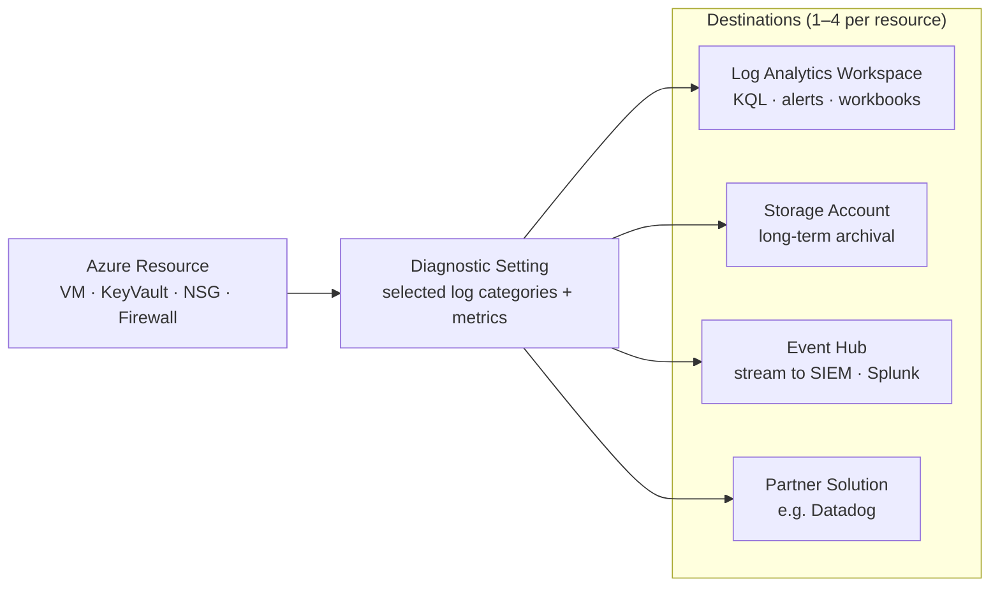

---
tags:
  - azure
---
# Diagnostic Settings

<div class="kb-summary">
Diagnostic settings control which resource logs and metrics are exported from an Azure resource and where they are sent. Each resource supports its own set of log categories; enabling them is a prerequisite for log-based alerting, compliance archival, and operational analysis.

*Applies to: Azure*
</div>

## Diagnostic Settings Routing



## Enabling Diagnostic Settings

```bash
# Enable diagnostic settings on a Key Vault
az monitor diagnostic-settings create \
  --name "kv-diag" \
  --resource /subscriptions/<sub-id>/resourceGroups/myRG/providers/Microsoft.KeyVault/vaults/myKeyVault \
  --workspace /subscriptions/<sub-id>/resourceGroups/myRG/providers/Microsoft.OperationalInsights/workspaces/myWorkspace \
  --logs '[{"category":"AuditEvent","enabled":true,"retentionPolicy":{"enabled":true,"days":90}}]' \
  --metrics '[{"category":"AllMetrics","enabled":true}]'

# Enable on an Azure Firewall
az monitor diagnostic-settings create \
  --name "fw-diag" \
  --resource /subscriptions/<sub-id>/resourceGroups/myRG/providers/Microsoft.Network/azureFirewalls/myFirewall \
  --workspace /subscriptions/<sub-id>/resourceGroups/myRG/providers/Microsoft.OperationalInsights/workspaces/myWorkspace \
  --logs '[{"category":"AzureFirewallApplicationRule","enabled":true},{"category":"AzureFirewallNetworkRule","enabled":true},{"category":"AzureFirewallDnsProxy","enabled":true}]'

# List current diagnostic settings on a resource
az monitor diagnostic-settings list \
  --resource /subscriptions/<sub-id>/resourceGroups/myRG/providers/Microsoft.KeyVault/vaults/myKeyVault
```

## Log Categories by Resource Type

| Resource Type          | Common Log Categories                                         |
|------------------------|---------------------------------------------------------------|
| Key Vault              | AuditEvent, AzurePolicyEvaluationDetails                     |
| Azure Firewall         | AzureFirewallApplicationRule, NetworkRule, DnsProxy           |
| Application Gateway    | ApplicationGatewayAccessLog, FirewallLog, PerformanceLog      |
| Storage Account        | StorageRead, StorageWrite, StorageDelete                      |
| Virtual Network        | VMProtectionAlerts                                            |
| NSG                    | NetworkSecurityGroupEvent, NetworkSecurityGroupRuleCounter     |
| Azure SQL              | SQLSecurityAuditEvents, AutomaticTuning, Errors               |

## Supported Destinations

```bash
# Send to a Storage Account (archival)
az monitor diagnostic-settings create \
  --name "kv-diag-storage" \
  --resource /subscriptions/<sub-id>/resourceGroups/myRG/providers/Microsoft.KeyVault/vaults/myKeyVault \
  --storage-account /subscriptions/<sub-id>/resourceGroups/myRG/providers/Microsoft.Storage/storageAccounts/myStorageAccount \
  --logs '[{"category":"AuditEvent","enabled":true,"retentionPolicy":{"enabled":true,"days":365}}]'

# Send to an Event Hub (SIEM forwarding)
az monitor diagnostic-settings create \
  --name "kv-diag-eh" \
  --resource /subscriptions/<sub-id>/resourceGroups/myRG/providers/Microsoft.KeyVault/vaults/myKeyVault \
  --event-hub myEventHub \
  --event-hub-rule /subscriptions/<sub-id>/resourceGroups/myRG/providers/Microsoft.EventHub/namespaces/myEHNamespace/authorizationRules/RootManageSharedAccessKey \
  --logs '[{"category":"AuditEvent","enabled":true}]'
```

## Checking Coverage at Scale

Use Azure Policy to audit which resources are missing diagnostic settings.

```bash
# List all diagnostic settings across a subscription (using Resource Graph)
az graph query -q "
  Resources
  | where type == 'microsoft.insights/diagnosticsettings'
  | project name, resourceGroup, properties.workspaceId
  | order by resourceGroup asc
" --output table

# Show categories supported for a specific resource type
az monitor diagnostic-settings categories list \
  --resource /subscriptions/<sub-id>/resourceGroups/myRG/providers/Microsoft.KeyVault/vaults/myKeyVault \
  --output table
```

## Updating and Deleting

```bash
# Update — re-create the setting with the same name to modify categories
az monitor diagnostic-settings create \
  --name "kv-diag" \
  --resource /subscriptions/<sub-id>/resourceGroups/myRG/providers/Microsoft.KeyVault/vaults/myKeyVault \
  --workspace /subscriptions/<sub-id>/resourceGroups/myRG/providers/Microsoft.OperationalInsights/workspaces/myWorkspace \
  --logs '[{"category":"AuditEvent","enabled":true},{"category":"AzurePolicyEvaluationDetails","enabled":true}]' \
  --metrics '[{"category":"AllMetrics","enabled":true}]'

# Delete a diagnostic setting
az monitor diagnostic-settings delete \
  --name "kv-diag" \
  --resource /subscriptions/<sub-id>/resourceGroups/myRG/providers/Microsoft.KeyVault/vaults/myKeyVault
```

## Destination Comparison

| Destination      | Cost Model          | Latency     | Retention Control     |
|------------------|---------------------|-------------|-----------------------|
| Log Analytics    | Per GB ingested     | 2–5 minutes | Workspace table level |
| Storage Account  | Per GB stored       | ~5 minutes  | Blob lifecycle policy |
| Event Hub        | Per throughput unit | < 1 minute  | 1–7 days (EH policy)  |
