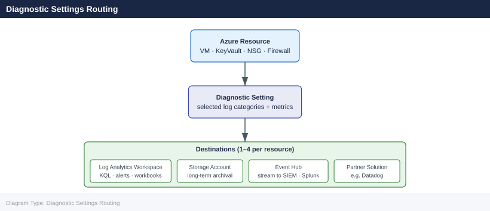

---
tags:
  - azure
description: "Diagnostic settings control which resource logs and metrics are exported from an Azure resource and where they are sent. Each resource supports its own..."
---
# Diagnostic Settings

<div class="kb-summary">
Diagnostic settings control which resource logs and metrics are exported from an Azure resource and where they are sent. Each resource supports its own set of log categories; enabling them is a prerequisite for log-based alerting, compliance archival, and operational analysis.

*Applies to: Azure*
</div>

## Diagnostic Settings Routing



## Enabling Diagnostic Settings

```bash
# Enable diagnostic settings on a Key Vault
az monitor diagnostic-settings create \
  --name "kv-diag" \
  --resource /subscriptions/<sub-id>/resourceGroups/myRG/providers/Microsoft.KeyVault/vaults/myKeyVault \
  --workspace /subscriptions/<sub-id>/resourceGroups/myRG/providers/Microsoft.OperationalInsights/workspaces/myWorkspace \
  --logs '[{"category":"AuditEvent","enabled":true,"retentionPolicy":{"enabled":true,"days":90}}]' \
  --metrics '[{"category":"AllMetrics","enabled":true}]'

# Enable on an Azure Firewall
az monitor diagnostic-settings create \
  --name "fw-diag" \
  --resource /subscriptions/<sub-id>/resourceGroups/myRG/providers/Microsoft.Network/azureFirewalls/myFirewall \
  --workspace /subscriptions/<sub-id>/resourceGroups/myRG/providers/Microsoft.OperationalInsights/workspaces/myWorkspace \
  --logs '[{"category":"AzureFirewallApplicationRule","enabled":true},{"category":"AzureFirewallNetworkRule","enabled":true},{"category":"AzureFirewallDnsProxy","enabled":true}]'

# List current diagnostic settings on a resource
az monitor diagnostic-settings list \
  --resource /subscriptions/<sub-id>/resourceGroups/myRG/providers/Microsoft.KeyVault/vaults/myKeyVault
```


```text title="Expected output"
{
  "id": "/subscriptions/a1b2c3d4-e5f6-4a7b-8c9d-0e1f2a3b4c5d/resourcegroups/myRG/providers/microsoft.keyvault/vaults/myKeyVault/providers/microsoft.insights/diagnosticsettings/kv-diag",
  "location": null,
  "name": "kv-diag",
  "resourceGroup": "myRG",
  "type": "Microsoft.Insights/diagnosticSettings"
}
{
  "id": "/subscriptions/a1b2c3d4-e5f6-4a7b-8c9d-0e1f2a3b4c5d/resourcegroups/myRG/providers/microsoft.network/azurefirewalls/myFirewall/providers/microsoft.insights/diagnosticsettings/fw-diag",
  "location": null,
  "name": "fw-diag",
  "resourceGroup": "myRG",
  "type": "Microsoft.Insights/diagnosticSettings"
}
[
  {
    "id": "/subscriptions/a1b2c3d4-e5f6-4a7b-8c9d-0e1f2a3b4c5d/resourcegroups/myRG/providers/microsoft.keyvault/vaults/myKeyVault/providers/microsoft.insights/diagnosticsettings/kv-diag",
    "logs": [
      {
        "category": "AuditEvent",
        "enabled": true,
        "retentionPolicy": {
          "days": 90,
          "enabled": true
        }
      }
    ],
    "metrics": [
      {
        "category": "AllMetrics",
        "enabled": true
      }
    ],
    "name": "kv-diag",
    "workspaceId": "/subscriptions/a1b2c3d4-e5f6-4a7b-8c9d-0e1f2a3b4c5d/resourcegroups/myRG/providers/microsoft.operationalinsights/workspaces/myWorkspace"
  }
]
```

!!! warning "Common errors"
    | Error | Fix |
    |---|---|
    | `ResourceNotFound: The resource '/subscriptions/<sub-id>/resourceGroups/myRG/providers/Microsoft.KeyVault/vaults/myKeyVault' could not be found.` | Verify the subscription ID, resource group name, and Key Vault name are correct and exist in your Azure subscription. |
    | `InvalidTemplate: The template is invalid: The JSON is not valid.` | Ensure the `--logs` and `--metrics` JSON strings are properly formatted with escaped quotes and no trailing commas. |
    | `AuthorizationFailed: The client 'user@contoso.com' with object id 'xxxxxxxx-xxxx-xxxx-xxxx-xxxxxxxxxxxx' does not have authorization to perform action 'microsoft.insights/diagnosticSettings/write' over scope '/subscriptions/<sub-id>/resourceGroups/myRG/providers/Microsoft.KeyVault/vaults/myKeyVault'.` | Assign the Monitoring Contributor role to your user account on the target resource or subscription. |
## Log Categories by Resource Type

| Resource Type          | Common Log Categories                                         |
|------------------------|---------------------------------------------------------------|
| Key Vault              | AuditEvent, AzurePolicyEvaluationDetails                     |
| Azure Firewall         | AzureFirewallApplicationRule, NetworkRule, DnsProxy           |
| Application Gateway    | ApplicationGatewayAccessLog, FirewallLog, PerformanceLog      |
| Storage Account        | StorageRead, StorageWrite, StorageDelete                      |
| Virtual Network        | VMProtectionAlerts                                            |
| NSG                    | NetworkSecurityGroupEvent, NetworkSecurityGroupRuleCounter     |
| Azure SQL              | SQLSecurityAuditEvents, AutomaticTuning, Errors               |

## Supported Destinations

```bash
# Send to a Storage Account (archival)
az monitor diagnostic-settings create \
  --name "kv-diag-storage" \
  --resource /subscriptions/<sub-id>/resourceGroups/myRG/providers/Microsoft.KeyVault/vaults/myKeyVault \
  --storage-account /subscriptions/<sub-id>/resourceGroups/myRG/providers/Microsoft.Storage/storageAccounts/myStorageAccount \
  --logs '[{"category":"AuditEvent","enabled":true,"retentionPolicy":{"enabled":true,"days":365}}]'

# Send to an Event Hub (SIEM forwarding)
az monitor diagnostic-settings create \
  --name "kv-diag-eh" \
  --resource /subscriptions/<sub-id>/resourceGroups/myRG/providers/Microsoft.KeyVault/vaults/myKeyVault \
  --event-hub myEventHub \
  --event-hub-rule /subscriptions/<sub-id>/resourceGroups/myRG/providers/Microsoft.EventHub/namespaces/myEHNamespace/authorizationRules/RootManageSharedAccessKey \
  --logs '[{"category":"AuditEvent","enabled":true}]'
```


```text title="Expected output"
{
  "id": "/subscriptions/a1b2c3d4-e5f6-4a5b-8c9d-0e1f2a3b4c5d/resourceGroups/myRG/providers/Microsoft.KeyVault/vaults/myKeyVault/providers/microsoft.insights/diagnosticSettings/kv-diag-storage",
  "name": "kv-diag-storage",
  "properties": {
    "storageAccountId": "/subscriptions/a1b2c3d4-e5f6-4a5b-8c9d-0e1f2a3b4c5d/resourceGroups/myRG/providers/Microsoft.Storage/storageAccounts/myStorageAccount",
    "logs": [
      {
        "category": "AuditEvent",
        "enabled": true,
        "retentionPolicy": {
          "enabled": true,
          "days": 365
        }
      }
    ],
    "metrics": []
  },
  "type": "Microsoft.Insights/diagnosticSettings"
}
{
  "id": "/subscriptions/a1b2c3d4-e5f6-4a5b-8c9d-0e1f2a3b4c5d/resourceGroups/myRG/providers/Microsoft.KeyVault/vaults/myKeyVault/providers/microsoft.insights/diagnosticSettings/kv-diag-eh",
  "name": "kv-diag-eh",
  "properties": {
    "eventHubAuthorizationRuleId": "/subscriptions/a1b2c3d4-e5f6-4a5b-8c9d-0e1f2a3b4c5d/resourceGroups/myRG/providers/Microsoft.EventHub/namespaces/myEHNamespace/authorizationRules/RootManageSharedAccessKey",
    "eventHubName": "myEventHub",
    "logs": [
      {
        "category": "AuditEvent",
        "enabled": true,
        "retentionPolicy": {
          "enabled": false,
          "days": 0
        }
      }
    ],
    "metrics": []
  },
  "type": "Microsoft.Insights/diagnosticSettings"
}
```

!!! warning "Common errors"
    | Error | Fix |
    |---|---|
    | `(InvalidResourceId) The resource ID is invalid.` | Verify the subscription ID, resource group name, and resource name match exactly in the resource ID path. |
    | `(AuthorizationFailed) The client has permission to perform action 'microsoft.insights/diagnosticSettings/write' on scope...` | Ensure your Azure account has the Monitoring Contributor or Owner role on the target resource. |
    | `(ResourceNotFound) The resource 'Microsoft.Storage/storageAccounts/myStorageAccount' could not be found.` | Confirm the storage account exists in the specified resource group and subscription before creating the diagnostic setting. |
## Checking Coverage at Scale

Use Azure Policy to audit which resources are missing diagnostic settings.

```bash
# List all diagnostic settings across a subscription (using Resource Graph)
az graph query -q "
  Resources
  | where type == 'microsoft.insights/diagnosticsettings'
  | project name, resourceGroup, properties.workspaceId
  | order by resourceGroup asc
" --output table

# Show categories supported for a specific resource type
az monitor diagnostic-settings categories list \
  --resource /subscriptions/<sub-id>/resourceGroups/myRG/providers/Microsoft.KeyVault/vaults/myKeyVault \
  --output table
```


```text title="Expected output"
Name                          ResourceGroup      Properties.WorkspaceId
-----------------------------  -----------------  ----------------------------------------------------------------
app-insights-diag-01          prod-rg            /subscriptions/a1b2c3d4-e5f6-4a5b-9c8d-7e6f5a4b3c2d/resourcegroups/prod-rg/providers/microsoft.operationalinsights/workspaces/prod-logs
keyvault-diag-settings        prod-rg            /subscriptions/a1b2c3d4-e5f6-4a5b-9c8d-7e6f5a4b3c2d/resourcegroups/prod-rg/providers/microsoft.operationalinsights/workspaces/prod-logs
sql-audit-diag                staging-rg         /subscriptions/a1b2c3d4-e5f6-4a5b-9c8d-7e6f5a4b3c2d/resourcegroups/staging-rg/providers/microsoft.operationalinsights/workspaces/staging-logs
vm-perf-monitoring            prod-rg            (no workspace configured)

LogType                        Enabled    RetentionPolicy.Enabled    RetentionPolicy.Days
---------------------------    ---------  -------------------------  ----------------------
AuditEvent                     True       True                       90
AzurePolicyEvaluationDetails   True       False                      0
KeyVaultEvents                 True       True                       365
```

!!! warning "Common errors"
    | Error | Fix |
    |---|---|
    | `ERROR: The resource 'microsoft.insights/diagnosticsettings' does not exist in the current subscription.` | Verify the subscription ID with `az account show` and ensure diagnostic settings have been created for at least one resource. |
    | `ERROR: The provided resource ID is invalid or the resource does not exist.` | Confirm the subscription ID, resource group name, and resource name are correct by listing resources with `az resource list --resource-group myRG`. |
## Updating and Deleting

```bash
# Update — re-create the setting with the same name to modify categories
az monitor diagnostic-settings create \
  --name "kv-diag" \
  --resource /subscriptions/<sub-id>/resourceGroups/myRG/providers/Microsoft.KeyVault/vaults/myKeyVault \
  --workspace /subscriptions/<sub-id>/resourceGroups/myRG/providers/Microsoft.OperationalInsights/workspaces/myWorkspace \
  --logs '[{"category":"AuditEvent","enabled":true},{"category":"AzurePolicyEvaluationDetails","enabled":true}]' \
  --metrics '[{"category":"AllMetrics","enabled":true}]'

# Delete a diagnostic setting
az monitor diagnostic-settings delete \
  --name "kv-diag" \
  --resource /subscriptions/<sub-id>/resourceGroups/myRG/providers/Microsoft.KeyVault/vaults/myKeyVault
```


```text title="Expected output"
{
  "id": "/subscriptions/a1b2c3d4-e5f6-4a5b-8c9d-0e1f2a3b4c5d/resourcegroups/myRG/providers/microsoft.keyvault/vaults/myKeyVault/providers/microsoft.insights/diagnosticsettings/kv-diag",
  "identity": null,
  "kind": null,
  "location": null,
  "name": "kv-diag",
  "resourceGroup": "myRG",
  "systemData": {
    "createdAt": "2024-01-15T10:32:47.123456+00:00",
    "createdBy": "admin@contoso.com",
    "createdByType": "User",
    "lastModifiedAt": "2024-01-15T10:32:47.123456+00:00",
    "lastModifiedBy": "admin@contoso.com",
    "lastModifiedByType": "User"
  },
  "type": "Microsoft.Insights/diagnosticSettings",
  "logs": [
    {
      "category": "AuditEvent",
      "categoryGroup": null,
      "enabled": true,
      "retentionPolicy": {
        "days": 0,
        "enabled": false
      }
    },
    {
      "category": "AzurePolicyEvaluationDetails",
      "categoryGroup": null,
      "enabled": true,
      "retentionPolicy": {
        "days": 0,
        "enabled": false
      }
    }
  ],
  "metrics": [
    {
      "category": "AllMetrics",
      "enabled": true,
      "retentionPolicy": {
        "days": 0,
        "enabled": false
      },
      "timeGrain": null
    }
  ],
  "workspaceId": "/subscriptions/a1b2c3d4-e5f6-4a5b-8c9d-0e1f2a3b4c5d/resourcegroups/myRG/providers/microsoft.operationalinsights/workspaces/myWorkspace"
}
```

!!! warning "Common errors"
    | Error | Fix |
    |---|---|
    | `ResourceNotFound : The resource '/subscriptions/<sub-id>/resourceGroups/myRG/providers/Microsoft.KeyVault/vaults/myKeyVault' could not be found.` | Verify the subscription ID, resource group name, and vault name are correct and the resource exists in the specified region. |
    | `InvalidResourceId : The resource ID is invalid or malformed.` | Ensure the resource ID follows the exact format with correct casing for provider names (e.g., `Microsoft.KeyVault`, `Microsoft.OperationalInsights`). |
    | `WorkspaceNotFound : The Log Analytics workspace '/subscriptions/<sub-id>/resourceGroups/myRG/providers/Microsoft.OperationalInsights/workspaces/myWorkspace' does not exist.` | Confirm the workspace exists in the same subscription and resource group, or create it before linking to diagnostic settings. |
## Destination Comparison

| Destination      | Cost Model          | Latency     | Retention Control     |
|------------------|---------------------|-------------|-----------------------|
| Log Analytics    | Per GB ingested     | 2–5 minutes | Workspace table level |
| Storage Account  | Per GB stored       | ~5 minutes  | Blob lifecycle policy |
| Event Hub        | Per throughput unit | < 1 minute  | 1–7 days (EH policy)  |
