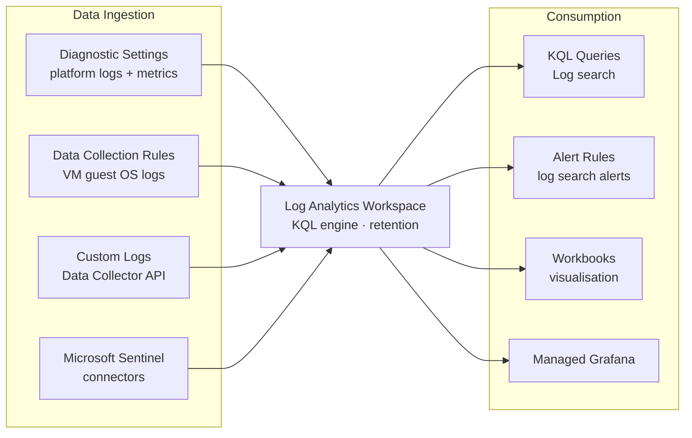

# Log Analytics


<div class="kb-summary">
Azure Log Analytics is the primary platform for collecting, querying, and alerting on log data in Azure Monitor. Data is stored in a Log Analytics workspace and queried using KQL (Kusto Query Language).
</div>

## Log Analytics Data Flow



## Workspace Configuration

```bash
# Create a Log Analytics workspace
az monitor log-analytics workspace create \
  --resource-group myRG \
  --workspace-name myWorkspace \
  --location eastus \
  --sku PerGB2018 \
  --retention-time 90

# List workspaces in a subscription
az monitor log-analytics workspace list \
  --output table

# Show workspace details including workspace ID and customer ID
az monitor log-analytics workspace show \
  --resource-group myRG \
  --workspace-name myWorkspace \
  --output json
```

## Running KQL Queries

```bash
# Run a KQL query from CLI
az monitor log-analytics query \
  --workspace /subscriptions/<sub-id>/resourceGroups/myRG/providers/Microsoft.OperationalInsights/workspaces/myWorkspace \
  --analytics-query "Heartbeat | summarize LastHeartbeat=max(TimeGenerated) by Computer | order by LastHeartbeat asc" \
  --output table

# Query for syslog errors in the last hour
az monitor log-analytics query \
  --workspace /subscriptions/<sub-id>/resourceGroups/myRG/providers/Microsoft.OperationalInsights/workspaces/myWorkspace \
  --analytics-query "Syslog | where SeverityLevel == 'err' | where TimeGenerated > ago(1h) | project TimeGenerated, Computer, SyslogMessage" \
  --output table

# Query Azure activity for failed operations
az monitor log-analytics query \
  --workspace /subscriptions/<sub-id>/resourceGroups/myRG/providers/Microsoft.OperationalInsights/workspaces/myWorkspace \
  --analytics-query "AzureActivity | where ActivityStatusValue == 'Failure' | summarize count() by OperationNameValue, Caller" \
  --output table
```

## Common KQL Patterns

```kql
// Top 10 VMs by CPU (requires AzureMetrics table)
AzureMetrics
| where MetricName == "Percentage CPU"
| summarize AvgCPU=avg(Average) by Resource
| top 10 by AvgCPU desc

// Count of events by severity in last 24h
Event
| where TimeGenerated > ago(24h)
| summarize count() by EventLevelName
| order by count_ desc

// Security events — failed logins
SecurityEvent
| where EventID == 4625
| summarize FailedLogins=count() by Account, Computer
| where FailedLogins > 5
| order by FailedLogins desc
```

## Table Retention Settings

Each table in a workspace has an interactive retention period (default 30 days) and an archive tier (up to 7 years).

```bash
# Set interactive retention for a table to 90 days
az monitor log-analytics workspace table update \
  --resource-group myRG \
  --workspace-name myWorkspace \
  --name SecurityEvent \
  --retention-time 90

# List all tables and their retention
az monitor log-analytics workspace table list \
  --resource-group myRG \
  --workspace-name myWorkspace \
  --output table
```

## Retention Tiers

| Tier              | Queryable  | Cost             | Max Duration |
|-------------------|------------|------------------|--------------|
| Interactive       | Yes (KQL)  | Per GB/day       | 730 days     |
| Archive           | Search job | Reduced rate     | 7 years      |
| Exported (blob)   | External   | Storage rate     | Unlimited    |

## Saved Queries

```bash
# Create a saved query in a workspace
az monitor log-analytics query-pack query create \
  --resource-group myRG \
  --query-pack-name myQueryPack \
  --query-id "heartbeat-check" \
  --body "Heartbeat | summarize LastHeartbeat=max(TimeGenerated) by Computer | where LastHeartbeat < ago(10m)" \
  --description "Identifies VMs with no heartbeat in 10 minutes" \
  --display-name "Missing Heartbeat"
```

## Log Search Alerts

```bash
# Create a log alert for failed logins
az monitor scheduled-query create \
  --name "failed-login-alert" \
  --resource-group myRG \
  --scopes /subscriptions/<sub-id>/resourceGroups/myRG/providers/Microsoft.OperationalInsights/workspaces/myWorkspace \
  --condition-query "SecurityEvent | where EventID == 4625 | summarize count() by bin(TimeGenerated, 5m)" \
  --condition-threshold 10 \
  --condition-operator GreaterThan \
  --evaluation-frequency 5m \
  --window-duration 15m \
  --severity 2 \
  --action-groups /subscriptions/<sub-id>/resourceGroups/myRG/providers/microsoft.insights/actionGroups/ops-ag \
  --description "More than 10 failed logins in 5 minutes"
```
