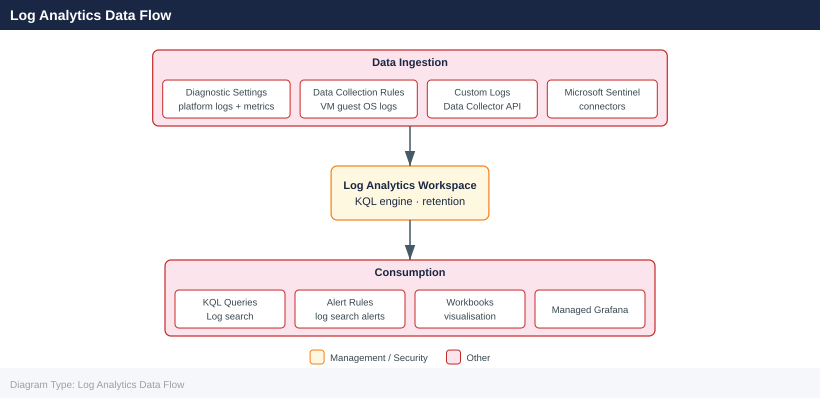

---
tags:
  - azure
description: "Azure Log Analytics is the primary platform for collecting, querying, and alerting on log data in Azure Monitor. Data is stored in a Log Analytics..."
---
# Log Analytics

<div class="kb-summary">
Azure Log Analytics is the primary platform for collecting, querying, and alerting on log data in Azure Monitor. Data is stored in a Log Analytics workspace and queried using KQL (Kusto Query Language).

*Applies to: Azure*
</div>

## Log Analytics Data Flow



## Workspace Configuration

```bash
# Create a Log Analytics workspace
az monitor log-analytics workspace create \
  --resource-group myRG \
  --workspace-name myWorkspace \
  --location eastus \
  --sku PerGB2018 \
  --retention-time 90

# List workspaces in a subscription
az monitor log-analytics workspace list \
  --output table

# Show workspace details including workspace ID and customer ID
az monitor log-analytics workspace show \
  --resource-group myRG \
  --workspace-name myWorkspace \
  --output json
```


```text title="Expected output"
{
  "id": "/subscriptions/12a34b56-c789-0d12-e345-f67890ab1cde/resourcegroups/myRG/providers/microsoft.operationalinsights/workspaces/myWorkspace",
  "location": "eastus",
  "name": "myWorkspace",
  "provisioningState": "Succeeded",
  "resourceGroup": "myRG",
  "retentionInDays": 90,
  "sku": {
    "name": "PerGB2018"
  },
  "customerId": "a1b2c3d4-e5f6-7890-abcd-ef1234567890",
  "workspaceId": "a1b2c3d4-e5f6-7890-abcd-ef1234567890"
}

ResourceGroup    Name         Location    Sku         RetentionDays    CustomerId
---------------  -----------  ----------  ----------  ---------------  ------------------------------------
myRG             myWorkspace  eastus      PerGB2018   90               a1b2c3d4-e5f6-7890-abcd-ef1234567890
prodRG           prodWS       westus2     PerGB2018   365              b2c3d4e5-f678-9012-bcde-f12345678901
devRG            devWS        centralus   PerGB2018   30               c3d4e5f6-7890-1234-cdef-123456789012
```

!!! warning "Common errors"
    **`(ResourceNotFound) Resource 'myWorkspace' does not exist in resource group 'myRG'.`** — Verify the workspace name and resource group name are correct with `az monitor log-analytics workspace list`.
    **`(InvalidSkuName) The provided SKU 'PerGB2018' is invalid or deprecated.`** — Use a valid SKU such as `PerGB2018`, `Standard`, or `Premium` by checking available SKUs with `az monitor log-analytics workspace list --query "[].sku.name" -o tsv`.
## Running KQL Queries

```bash
# Run a KQL query from CLI
az monitor log-analytics query \
  --workspace /subscriptions/<sub-id>/resourceGroups/myRG/providers/Microsoft.OperationalInsights/workspaces/myWorkspace \
  --analytics-query "Heartbeat | summarize LastHeartbeat=max(TimeGenerated) by Computer | order by LastHeartbeat asc" \
  --output table

# Query for syslog errors in the last hour
az monitor log-analytics query \
  --workspace /subscriptions/<sub-id>/resourceGroups/myRG/providers/Microsoft.OperationalInsights/workspaces/myWorkspace \
  --analytics-query "Syslog | where SeverityLevel == 'err' | where TimeGenerated > ago(1h) | project TimeGenerated, Computer, SyslogMessage" \
  --output table

# Query Azure activity for failed operations
az monitor log-analytics query \
  --workspace /subscriptions/<sub-id>/resourceGroups/myRG/providers/Microsoft.OperationalInsights/workspaces/myWorkspace \
  --analytics-query "AzureActivity | where ActivityStatusValue == 'Failure' | summarize count() by OperationNameValue, Caller" \
  --output table
```


```text title="Expected output"
Computer                          LastHeartbeat
--------------------------------  --------------------------
web-prod-02.contoso.com          2024-01-15T08:22:14.567Z
db-primary-01.contoso.com        2024-01-15T08:19:43.891Z
app-cache-03.contoso.com         2024-01-15T08:18:09.234Z
monitoring-agent-01.contoso.com  2024-01-15T08:15:52.445Z

TimeGenerated                 Computer              SyslogMessage
----------------------------  --------------------  -----------------------------------------------
2024-01-15T09:34:22.123Z      web-prod-02          kernel: Out of memory: Kill process sshd
2024-01-15T09:28:15.456Z      app-worker-04        sudo: pam_unix(sudo:auth): authentication failure
2024-01-15T09:12:44.789Z      db-replica-02        systemd: Failed to start PostgreSQL Database Server

OperationNameValue                              Caller                    count_
--------------------------------------------------  ----------------------  -------
Microsoft.Compute/virtualMachines/write          user@contoso.com         3
Microsoft.Storage/storageAccounts/delete         automation@contoso.com   1
Microsoft.Network/networkSecurityGroups/write    admin@contoso.com        2
```

!!! warning "Common errors"
    **`BadRequest: The workspace ID is invalid or the workspace does not exist.`** — Verify the subscription ID, resource group name, and workspace name are correct by running `az monitor log-analytics workspace list --resource-group myRG`.
    **`AuthorizationFailed: The client does not have authorization to perform action 'Microsoft.OperationalInsights/workspaces/query/read' on resource.`** — Ensure your Azure account has the Log Analytics Reader or Contributor role assigned to the workspace using `az role assignment create --assignee <user-id> --role "Log Analytics Reader" --scope <workspace-resource-id>`.
    **`BadRequest: The KQL query syntax is invalid.`** — Test the KQL query in the Azure Portal's Log Analytics Query Editor first to validate syntax before running via CLI.
## Common KQL Patterns

```kql
// Top 10 VMs by CPU (requires AzureMetrics table)
AzureMetrics
| where MetricName == "Percentage CPU"
| summarize AvgCPU=avg(Average) by Resource
| top 10 by AvgCPU desc

// Count of events by severity in last 24h
Event
| where TimeGenerated > ago(24h)
| summarize count() by EventLevelName
| order by count_ desc

// Security events — failed logins
SecurityEvent
| where EventID == 4625
| summarize FailedLogins=count() by Account, Computer
| where FailedLogins > 5
| order by FailedLogins desc
```

## Table Retention Settings

Each table in a workspace has an interactive retention period (default 30 days) and an archive tier (up to 7 years).

```bash
# Set interactive retention for a table to 90 days
az monitor log-analytics workspace table update \
  --resource-group myRG \
  --workspace-name myWorkspace \
  --name SecurityEvent \
  --retention-time 90

# List all tables and their retention
az monitor log-analytics workspace table list \
  --resource-group myRG \
  --workspace-name myWorkspace \
  --output table
```


```text title="Expected output"
(no output — command completes silently)

Name                    RetentionInDays    TotalRetentionInDays    ArchiveRetentionInDays
----------------------  -----------------  ----------------------  ----------------------
SecurityEvent           90                 90                      0
Syslog                  30                 30                      0
Heartbeat               30                 30                      0
AzureActivity           90                 90                      0
CommonSecurityLog       30                 30                      0
WindowsEvent            30                 30                      0
OfficeActivity          180                180                     0
...
```

!!! warning "Common errors"
    **`ResourceNotFound: The resource 'myWorkspace' does not exist in resource group 'myRG'.`** — Verify the workspace name and resource group name match exactly using `az monitor log-analytics workspace list --resource-group myRG`.
    **`InvalidArgument: Table 'SecurityEvent' does not exist in workspace 'myWorkspace'.`** — Check available tables with `az monitor log-analytics workspace table list --resource-group myRG --workspace-name myWorkspace` and use the correct table name.
## Retention Tiers

| Tier              | Queryable  | Cost             | Max Duration |
|-------------------|------------|------------------|--------------|
| Interactive       | Yes (KQL)  | Per GB/day       | 730 days     |
| Archive           | Search job | Reduced rate     | 7 years      |
| Exported (blob)   | External   | Storage rate     | Unlimited    |

## Saved Queries

```bash
# Create a saved query in a workspace
az monitor log-analytics query-pack query create \
  --resource-group myRG \
  --query-pack-name myQueryPack \
  --query-id "heartbeat-check" \
  --body "Heartbeat | summarize LastHeartbeat=max(TimeGenerated) by Computer | where LastHeartbeat < ago(10m)" \
  --description "Identifies VMs with no heartbeat in 10 minutes" \
  --display-name "Missing Heartbeat"
```


```text title="Expected output"
{
  "id": "/subscriptions/12345678-1234-1234-1234-123456789012/resourceGroups/myRG/providers/Microsoft.OperationalInsights/queryPacks/myQueryPack/queries/heartbeat-check",
  "name": "heartbeat-check",
  "type": "Microsoft.OperationalInsights/queryPacks/queries",
  "properties": {
    "body": "Heartbeat | summarize LastHeartbeat=max(TimeGenerated) by Computer | where LastHeartbeat < ago(10m)",
    "displayName": "Missing Heartbeat",
    "description": "Identifies VMs with no heartbeat in 10 minutes",
    "related": null,
    "tags": [],
    "categories": [],
    "resourceGroup": "myRG"
  }
}
```

!!! warning "Common errors"
    **`ResourceNotFound : The Resource 'Microsoft.OperationalInsights/queryPacks/myQueryPack' under resource group 'myRG' was not found.`** — Create the query pack first using `az monitor log-analytics query-pack create --resource-group myRG --name myQueryPack`.
    **`InvalidTemplateDeployment : The template deployment 'queryDeploy' is not valid according to the schema.`** — Escape special characters in the KQL query body or wrap it in single quotes to prevent shell interpretation.
    **`AuthorizationFailed : The client 'user@contoso.com' with object id '98765432-4321-4321-4321-210987654321' does not have authorization to perform action 'Microsoft.OperationalInsights/queryPacks/queries/write' over scope '/subscriptions/12345678-1234-1234-1234-123456789012/resourceGroups/myRG/providers/Microsoft.OperationalInsights/queryPacks/myQueryPack'.`** — Ensure your Azure account has the Log Analytics Contributor role assigned to the resource group or subscription.
## Log Search Alerts

```bash
# Create a log alert for failed logins
az monitor scheduled-query create \
  --name "failed-login-alert" \
  --resource-group myRG \
  --scopes /subscriptions/<sub-id>/resourceGroups/myRG/providers/Microsoft.OperationalInsights/workspaces/myWorkspace \
  --condition-query "SecurityEvent | where EventID == 4625 | summarize count() by bin(TimeGenerated, 5m)" \
  --condition-threshold 10 \
  --condition-operator GreaterThan \
  --evaluation-frequency 5m \
  --window-duration 15m \
  --severity 2 \
  --action-groups /subscriptions/<sub-id>/resourceGroups/myRG/providers/microsoft.insights/actionGroups/ops-ag \
  --description "More than 10 failed logins in 5 minutes"
```


```text title="Expected output"
{
  "id": "/subscriptions/12345678-1234-1234-1234-123456789012/resourceGroups/myRG/providers/microsoft.insights/scheduledQueryRules/failed-login-alert",
  "location": "eastus",
  "name": "failed-login-alert",
  "resourceGroup": "myRG",
  "severity": 2,
  "enabled": true,
  "scopes": [
    "/subscriptions/12345678-1234-1234-1234-123456789012/resourceGroups/myRG/providers/Microsoft.OperationalInsights/workspaces/myWorkspace"
  ],
  "evaluationFrequency": "PT5M",
  "windowSize": "PT15M",
  "criteria": {
    "allOf": [
      {
        "query": "SecurityEvent | where EventID == 4625 | summarize count() by bin(TimeGenerated, 5m)",
        "threshold": 10,
        "operator": "GreaterThan"
      }
    ]
  },
  "actions": {
    "actionGroups": [
      "/subscriptions/12345678-1234-1234-1234-123456789012/resourceGroups/myRG/providers/microsoft.insights/actionGroups/ops-ag"
    ]
  },
  "description": "More than 10 failed logins in 5 minutes",
  "type": "Microsoft.Insights/scheduledQueryRules"
}
```

!!! warning "Common errors"
    **`ResourceNotFound: The resource 'Microsoft.OperationalInsights/workspaces/myWorkspace' could not be found.`** — Verify the workspace name and subscription ID are correct, and that the workspace exists in the specified resource group.
    **`InvalidResourceId: The provided scope is invalid or malformed.`** — Ensure all resource IDs follow the exact format `/subscriptions/<sub-id>/resourceGroups/<rg>/providers/...` with no extra slashes or typos.
    **`ActionGroupNotFound: The action group at the specified resource ID does not exist.`** — Confirm the action group name and resource group are correct, and create the action group if it doesn't exist.