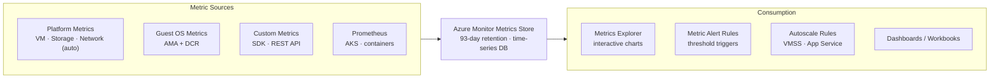

---
tags:
  - azure
---
# Metrics

<div class="kb-summary">
Azure Monitor Metrics is a time-series database that stores numeric data from Azure resources at near-real-time frequency. Platform metrics are collected automatically at no cost; custom metrics can be emitted from application code or agents.

*Applies to: Azure*
</div>

## Metrics Collection and Consumption



## Platform Metrics vs Custom Metrics

| Type             | Source                          | Cost            | Retention  |
|------------------|---------------------------------|-----------------|------------|
| Platform metrics | Azure resource providers        | Free            | 93 days    |
| Guest OS metrics | Azure Monitor Agent + DCR       | Free (agent)    | 93 days    |
| Custom metrics   | SDK / REST API / Telegraf       | Per data point  | 93 days    |
| Prometheus       | AKS / container environments    | Per series      | 18 months  |

## Querying Metrics

```bash
# List CPU metric data for a VM
az monitor metrics list \
  --resource /subscriptions/<sub-id>/resourceGroups/myRG/providers/Microsoft.Compute/virtualMachines/myVM \
  --metric "Percentage CPU" \
  --interval PT5M \
  --aggregation Average \
  --start-time 2026-05-07T00:00:00Z \
  --end-time 2026-05-07T06:00:00Z \
  --output table

# Query multiple metrics at once
az monitor metrics list \
  --resource /subscriptions/<sub-id>/resourceGroups/myRG/providers/Microsoft.Compute/virtualMachines/myVM \
  --metric "Percentage CPU" "Available Memory Bytes" \
  --interval PT1M \
  --aggregation Average Maximum \
  --output json

# List available metric definitions for a resource
az monitor metrics list-definitions \
  --resource /subscriptions/<sub-id>/resourceGroups/myRG/providers/Microsoft.Network/applicationGateways/myAppGW \
  --output table
```


```text title="Expected output"
Time                 Aggregation    Value
-------------------  ---------------  -------
2026-05-07T00:05:00Z  Average        12.45
2026-05-07T00:10:00Z  Average        14.32
2026-05-07T00:15:00Z  Average        11.89
2026-05-07T00:20:00Z  Average        15.67
2026-05-07T00:25:00Z  Average        13.21
2026-05-07T00:30:00Z  Average        16.54
...

{
  "value": [
    {
      "name": {
        "value": "Percentage CPU",
        "localizedValue": "Percentage CPU"
      },
      "type": "Microsoft.Insights/metrics",
      "id": "/subscriptions/a1b2c3d4-e5f6-7890-abcd-ef1234567890/resourceGroups/myRG/providers/Microsoft.Compute/virtualMachines/myVM/providers/Microsoft.Insights/metrics/Percentage CPU",
      "unit": "Percent",
      "timeseries": [
        {
          "metadatavalues": [],
          "data": [
            {
              "timeStamp": "2026-05-07T00:00:00Z",
              "average": 12.45,
              "maximum": 18.92
            },
            {
              "timeStamp": "2026-05-07T00:01:00Z",
              "average": 13.12,
              "maximum": 19.34
            }
          ]
        }
      ]
    }
  ]
}

Name                                  Type                                    Unit
------------------------------------  ----------------------------------------  --------
Percentage CPU                        Microsoft.Insights/metrics                Percent
Available Memory Bytes                Microsoft.Insights/metrics                Bytes
Network In Total                      Microsoft.Insights/metrics                Bytes
Network Out Total                     Microsoft.Insights/metrics                Bytes
Disk Read Bytes                       Microsoft.Insights/metrics                Bytes
Disk Write Bytes                      Microsoft.Insights/metrics                Bytes
```

!!! warning "Common errors"
    **`ResourceNotFound: The resource '/subscriptions/<sub-id>/resourceGroups/myRG/providers/Microsoft.Compute/virtualMachines/myVM' could not be found.`** — Verify the subscription ID, resource group name, and VM name are correct using `az vm list --output table`.
    **`InvalidMetricName: The metric 'Percentage CPU' is not valid for this resource type.`** — List available metrics for your resource type with `az monitor metrics list-definitions --resource <resource-id>` to find the correct metric name.
    **`AuthorizationFailed: The client '<client-id>' with object id '<object-id>' does not have authorization to perform action 'microsoft.insights/metrics/read' over scope '<scope>'.`** — Ensure your Azure account has the "Monitoring Reader" role assigned to the resource group or subscription.
## Aggregation Types

| Aggregation | Description                                     |
|-------------|-------------------------------------------------|
| Average     | Mean value over the interval                    |
| Minimum     | Lowest value observed in the interval           |
| Maximum     | Highest value observed in the interval          |
| Total       | Sum of all values in the interval               |
| Count       | Number of data points collected                 |

Not all aggregation types are valid for every metric. Use `list-definitions` to check supported aggregations.

## Metric Alerts

```bash
# Alert when disk read latency exceeds 100ms
az monitor metrics alert create \
  --name "disk-latency-alert" \
  --resource-group myRG \
  --scopes /subscriptions/<sub-id>/resourceGroups/myRG/providers/Microsoft.Compute/virtualMachines/myVM \
  --condition "avg Data Disk Read Operations/Sec > 100" \
  --window-size 5m \
  --evaluation-frequency 1m \
  --severity 2 \
  --action /subscriptions/<sub-id>/resourceGroups/myRG/providers/microsoft.insights/actionGroups/ops-ag

# Alert on Application Gateway unhealthy host count
az monitor metrics alert create \
  --name "appgw-unhealthy-hosts" \
  --resource-group myRG \
  --scopes /subscriptions/<sub-id>/resourceGroups/myRG/providers/Microsoft.Network/applicationGateways/myAppGW \
  --condition "total UnhealthyHostCount > 0" \
  --window-size 5m \
  --evaluation-frequency 1m \
  --severity 1 \
  --action /subscriptions/<sub-id>/resourceGroups/myRG/providers/microsoft.insights/actionGroups/ops-ag
```


```text title="Expected output"
{
  "id": "/subscriptions/12a34b56-c789-0d12-e345-f67890ab1234/resourceGroups/myRG/providers/microsoft.insights/metricsAlerts/disk-latency-alert",
  "location": "global",
  "name": "disk-latency-alert",
  "resourceGroup": "myRG",
  "severity": 2,
  "enabled": true,
  "windowSize": "PT5M",
  "evaluationFrequency": "PT1M",
  "scopes": [
    "/subscriptions/12a34b56-c789-0d12-e345-f67890ab1234/resourceGroups/myRG/providers/Microsoft.Compute/virtualMachines/myVM"
  ],
  "criteria": {
    "allOf": [
      {
        "name": "Data Disk Read Operations/Sec",
        "metricName": "Data Disk Read Operations/Sec",
        "operator": "GreaterThan",
        "threshold": 100,
        "timeAggregation": "Average"
      }
    ]
  },
  "actions": [
    {
      "actionGroupId": "/subscriptions/12a34b56-c789-0d12-e345-f67890ab1234/resourceGroups/myRG/providers/microsoft.insights/actionGroups/ops-ag"
    }
  ]
}
{
  "id": "/subscriptions/12a34b56-c789-0d12-e345-f67890ab1234/resourceGroups/myRG/providers/microsoft.insights/metricsAlerts/appgw-unhealthy-hosts",
  "location": "global",
  "name": "appgw-unhealthy-hosts",
  "resourceGroup": "myRG",
  "severity": 1,
  "enabled": true,
  "windowSize": "PT5M",
  "evaluationFrequency": "PT1M",
  "scopes": [
    "/subscriptions/12a34b56-c789-0d12-e345-f67890ab1234/resourceGroups/myRG/providers/Microsoft.Network/applicationGateways/myAppGW"
  ],
  "criteria": {
    "allOf": [
      {
        "name": "UnhealthyHostCount",
        "metricName": "UnhealthyHostCount",
        "operator": "GreaterThan",
        "threshold": 0,
        "timeAggregation": "Total"
      }
    ]
  },
  "actions": [
    {
      "actionGroupId": "/subscriptions/12a34b56-c789-0d12-e345-f67890ab1234/resourceGroups/myRG/providers/microsoft.insights/actionGroups/ops-ag"
    }
  ]
}
```

!!! warning "Common errors"
    **`(ResourceNotFound) The resource '/subscriptions/<sub-id>/resourceGroups/myRG/providers/Microsoft.Compute/virtualMachines/myVM' could not be found.`** — Verify the VM exists in the specified resource group and subscription using `az vm list -g myRG`.
    **`
## Dimension Filtering

Many metrics support dimensions — additional labels that let you filter or split data (e.g., per disk, per backend pool).

```bash
# CPU per core using dimension filter
az monitor metrics list \
  --resource /subscriptions/<sub-id>/resourceGroups/myRG/providers/Microsoft.Compute/virtualMachines/myVM \
  --metric "Percentage CPU" \
  --dimension VMName \
  --interval PT5M \
  --aggregation Average \
  --output table
```


```text title="Expected output"
Timestamp            Aggregation    Value
-------------------  --------------  -------
2024-01-15T14:30:00Z  Average         12.5
2024-01-15T14:25:00Z  Average         14.2
2024-01-15T14:20:00Z  Average         11.8
2024-01-15T14:15:00Z  Average         13.7
2024-01-15T14:10:00Z  Average         10.3
2024-01-15T14:05:00Z  Average         15.1
2024-01-15T14:00:00Z  Average         9.6
```

!!! warning "Common errors"
    **`ResourceNotFound`** — Verify the subscription ID, resource group name, and VM name are correct using `az vm list --resource-group myRG`.
    **`InvalidDimension`** — Replace `--dimension VMName` with a valid dimension like `--dimension "Processor Number"` or remove it if the metric doesn't support dimensions.
    **`AuthorizationFailed`** — Ensure your Azure account has `Microsoft.Insights/metrics/read` permissions on the VM resource.
## Custom Metrics via REST

Applications can emit custom metrics directly to the Azure Monitor ingestion endpoint.

```bash
# Example: emit a custom metric using curl (bearer token required)
curl -X POST \
  "https://<region>.monitoring.azure.com/subscriptions/<sub-id>/resourceGroups/myRG/providers/Microsoft.Compute/virtualMachines/myVM/metrics" \
  -H "Authorization: Bearer <access-token>" \
  -H "Content-Type: application/json" \
  -d '{
    "time": "2026-05-07T10:00:00Z",
    "data": {
      "baseData": {
        "metric": "QueueDepth",
        "namespace": "MyApp",
        "dimNames": ["Environment"],
        "series": [{"dimValues":["production"],"sum":42,"count":1,"min":42,"max":42}]
      }
    }
  }'
```


```text title="Expected output"
{
  "statusCode": 200,
  "message": "Metric ingestion accepted",
  "ingestionId": "a7f2c9e1-4b3d-47e8-9f21-6d8c5a2b1e9f",
  "timestamp": "2026-05-07T10:00:01.234Z"
}
```

!!! warning "Common errors"
    **`401 Unauthorized`** — Verify the access token is valid and not expired by regenerating it with `az account get-access-token --resource https://monitoring.azure.com`.
    **`400 Bad Request: Invalid metric namespace`** — Ensure the namespace matches your custom metrics namespace registered in Azure Monitor; check with `az monitor metrics list-definitions --resource /subscriptions/<sub-id>/resourceGroups/myRG/providers/Microsoft.Compute/virtualMachines/myVM`.
    **`404 Not Found`** — Confirm the subscription ID, resource group name, and VM name are correct and that the resource exists in the specified region.
## Metric Explorer Tips

- Pin charts directly to a shared dashboard from Metrics Explorer
- Use the "Split by" option to break metrics down by dimensions such as `ApiName` or `StatusCodeClass`
- Save chart views as favourites for quick access
- Export chart data as CSV via the portal for offline analysis
