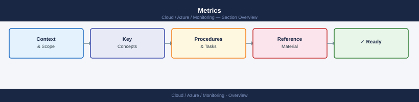
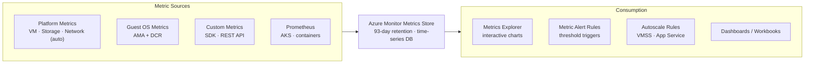

---
tags:
  - azure
---
# Metrics


<div class="kb-summary">
Azure Monitor Metrics is a time-series database that stores numeric data from Azure resources at near-real-time frequency. Platform metrics are collected automatically at no cost; custom metrics can be emitted from application code or agents.

*Applies to: Azure*
</div>



```d2
direction: right

center: "Azure" {shape: hexagon}
metrics_collection_and_consumption: "Metrics Collection and Consumption" {shape: rectangle}
platform_metrics_vs_custom_metrics: "Platform Metrics vs Custom Metrics" {shape: rectangle}
querying_metrics: "Querying Metrics" {shape: rectangle}
aggregation_types: "Aggregation Types" {shape: rectangle}
metric_alerts: "Metric Alerts" {shape: rectangle}
dimension_filtering: "Dimension Filtering" {shape: rectangle}

center -> metrics_collection_and_consumption
center -> platform_metrics_vs_custom_metrics
center -> querying_metrics
center -> aggregation_types
center -> metric_alerts
center -> dimension_filtering
```

## Metrics Collection and Consumption



## Platform Metrics vs Custom Metrics

| Type             | Source                          | Cost            | Retention  |
|------------------|---------------------------------|-----------------|------------|
| Platform metrics | Azure resource providers        | Free            | 93 days    |
| Guest OS metrics | Azure Monitor Agent + DCR       | Free (agent)    | 93 days    |
| Custom metrics   | SDK / REST API / Telegraf       | Per data point  | 93 days    |
| Prometheus       | AKS / container environments    | Per series      | 18 months  |

## Querying Metrics

```bash
# List CPU metric data for a VM
az monitor metrics list \
  --resource /subscriptions/<sub-id>/resourceGroups/myRG/providers/Microsoft.Compute/virtualMachines/myVM \
  --metric "Percentage CPU" \
  --interval PT5M \
  --aggregation Average \
  --start-time 2026-05-07T00:00:00Z \
  --end-time 2026-05-07T06:00:00Z \
  --output table

# Query multiple metrics at once
az monitor metrics list \
  --resource /subscriptions/<sub-id>/resourceGroups/myRG/providers/Microsoft.Compute/virtualMachines/myVM \
  --metric "Percentage CPU" "Available Memory Bytes" \
  --interval PT1M \
  --aggregation Average Maximum \
  --output json

# List available metric definitions for a resource
az monitor metrics list-definitions \
  --resource /subscriptions/<sub-id>/resourceGroups/myRG/providers/Microsoft.Network/applicationGateways/myAppGW \
  --output table
```

## Aggregation Types

| Aggregation | Description                                     |
|-------------|-------------------------------------------------|
| Average     | Mean value over the interval                    |
| Minimum     | Lowest value observed in the interval           |
| Maximum     | Highest value observed in the interval          |
| Total       | Sum of all values in the interval               |
| Count       | Number of data points collected                 |

Not all aggregation types are valid for every metric. Use `list-definitions` to check supported aggregations.

## Metric Alerts

```bash
# Alert when disk read latency exceeds 100ms
az monitor metrics alert create \
  --name "disk-latency-alert" \
  --resource-group myRG \
  --scopes /subscriptions/<sub-id>/resourceGroups/myRG/providers/Microsoft.Compute/virtualMachines/myVM \
  --condition "avg Data Disk Read Operations/Sec > 100" \
  --window-size 5m \
  --evaluation-frequency 1m \
  --severity 2 \
  --action /subscriptions/<sub-id>/resourceGroups/myRG/providers/microsoft.insights/actionGroups/ops-ag

# Alert on Application Gateway unhealthy host count
az monitor metrics alert create \
  --name "appgw-unhealthy-hosts" \
  --resource-group myRG \
  --scopes /subscriptions/<sub-id>/resourceGroups/myRG/providers/Microsoft.Network/applicationGateways/myAppGW \
  --condition "total UnhealthyHostCount > 0" \
  --window-size 5m \
  --evaluation-frequency 1m \
  --severity 1 \
  --action /subscriptions/<sub-id>/resourceGroups/myRG/providers/microsoft.insights/actionGroups/ops-ag
```

## Dimension Filtering

Many metrics support dimensions — additional labels that let you filter or split data (e.g., per disk, per backend pool).

```bash
# CPU per core using dimension filter
az monitor metrics list \
  --resource /subscriptions/<sub-id>/resourceGroups/myRG/providers/Microsoft.Compute/virtualMachines/myVM \
  --metric "Percentage CPU" \
  --dimension VMName \
  --interval PT5M \
  --aggregation Average \
  --output table
```

## Custom Metrics via REST

Applications can emit custom metrics directly to the Azure Monitor ingestion endpoint.

```bash
# Example: emit a custom metric using curl (bearer token required)
curl -X POST \
  "https://<region>.monitoring.azure.com/subscriptions/<sub-id>/resourceGroups/myRG/providers/Microsoft.Compute/virtualMachines/myVM/metrics" \
  -H "Authorization: Bearer <access-token>" \
  -H "Content-Type: application/json" \
  -d '{
    "time": "2026-05-07T10:00:00Z",
    "data": {
      "baseData": {
        "metric": "QueueDepth",
        "namespace": "MyApp",
        "dimNames": ["Environment"],
        "series": [{"dimValues":["production"],"sum":42,"count":1,"min":42,"max":42}]
      }
    }
  }'
```

## Metric Explorer Tips

- Pin charts directly to a shared dashboard from Metrics Explorer
- Use the "Split by" option to break metrics down by dimensions such as `ApiName` or `StatusCodeClass`
- Save chart views as favourites for quick access
- Export chart data as CSV via the portal for offline analysis
