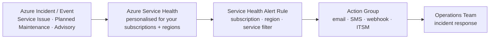

---
tags:
  - azure
---
# Service Health

<div class="kb-summary">
Azure Service Health provides personalised alerts and guidance for Azure service issues, planned maintenance, and health advisories that affect the services and regions you use. It combines three views: Service Issues, Planned Maintenance, and Health Advisories.

*Applies to: Azure*
</div>

## Service Health Alert Flow



## Service Health Components

| Component           | Description                                                      |
|---------------------|------------------------------------------------------------------|
| Service Issues      | Active incidents impacting Azure services in your regions        |
| Planned Maintenance | Upcoming maintenance that may require action or cause downtime   |
| Health Advisories   | Feature deprecations, breaking changes, required migrations      |
| Resource Health     | Per-resource availability state (Available, Degraded, Unavailable) |
| Security Advisories | Security-related events affecting Azure services                 |

## Querying Service Health Events

```bash
# List all active service health events for a subscription
az monitor activity-log list \
  --start-time $(date -u -v-7d +%Y-%m-%dT%H:%MZ) \
  --filters "category eq 'ServiceHealth'" \
  --output table

# Get resource health for a specific VM
az resource health show \
  --resource-type Microsoft.Compute/virtualMachines \
  --resource-group myRG \
  --resource-name myVM \
  --output json

# List resource health events for a resource
az resource health event list \
  --resource-type Microsoft.Compute/virtualMachines \
  --resource-group myRG \
  --resource-name myVM \
  --output table
```

## Creating Service Health Alerts

Service Health alerts notify your team when an incident, planned maintenance, or advisory affects services in regions you select.

```bash
# Create an action group for service health notifications
az monitor action-group create \
  --name "service-health-ag" \
  --resource-group myRG \
  --short-name "SvcHlth" \
  --action email infra-lead infra@example.com

# Create a Service Health alert for incidents in East US
az monitor activity-log alert create \
  --name "svc-health-incident-alert" \
  --resource-group myRG \
  --condition "category=ServiceHealth and properties.incidentType=Incident and properties.impactedServices[*].ServiceName=Virtual Machines and properties.impactedServices[*].ImpactedRegions[*].RegionName=East US" \
  --action-group /subscriptions/<sub-id>/resourceGroups/myRG/providers/microsoft.insights/actionGroups/service-health-ag \
  --description "Alert for VM incidents in East US"

# Alert for planned maintenance events
az monitor activity-log alert create \
  --name "svc-health-maintenance-alert" \
  --resource-group myRG \
  --condition "category=ServiceHealth and properties.incidentType=Maintenance" \
  --action-group /subscriptions/<sub-id>/resourceGroups/myRG/providers/microsoft.insights/actionGroups/service-health-ag
```

## Resource Health States

| State        | Meaning                                                         |
|--------------|-----------------------------------------------------------------|
| Available    | Resource is operating normally                                  |
| Degraded     | Resource is available but with reduced performance              |
| Unavailable  | Resource is not available (platform or customer initiated)      |
| Unknown      | Resource health state has not been received for > 10 minutes    |

```bash
# List all resources in a resource group with non-Available health
az resource health list \
  --resource-group myRG \
  --output table

# Get availability status for all VMs in subscription
az graph query -q "
  HealthResources
  | where type == 'microsoft.resourcehealth/availabilitystatuses'
  | where properties.availabilityState != 'Available'
  | project name, resourceGroup, properties.availabilityState
" --output table
```

## Planned Maintenance Queries

```bash
# Query activity log for upcoming maintenance events
az monitor activity-log list \
  --start-time $(date -u -v-30d +%Y-%m-%dT%H:%MZ) \
  --filters "category eq 'ServiceHealth' and properties.incidentType eq 'Maintenance'" \
  --output json | jq '.[] | {time: .eventTimestamp, title: .properties.title, services: .properties.impactedServices}'
```

## Root Cause Analysis (RCA) Reports

After a service incident is resolved, Microsoft publishes a Post-Incident Review (PIR) / RCA document. Access it via the Service Health blade in the Azure portal under the specific incident, or subscribe to email notifications that include the PIR link when published.

```bash
# Get incident details from activity log
az monitor activity-log list \
  --start-time 2026-05-01T00:00:00Z \
  --filters "category eq 'ServiceHealth'" \
  --output json | jq '.[] | select(.properties.incidentType == "Incident") | {title: .properties.title, summary: .properties.communication, stage: .properties.stage}'
```
