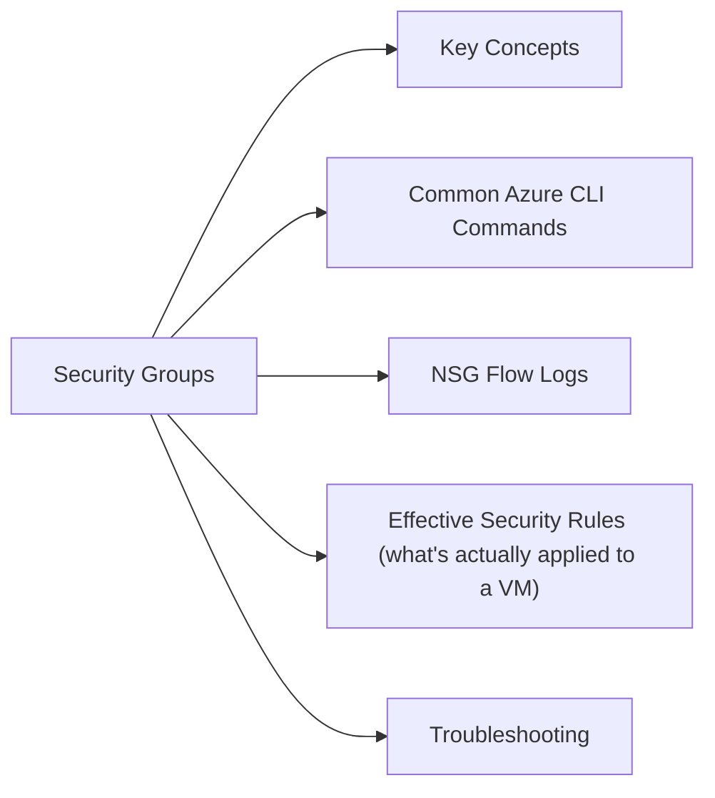

# Network Security Groups

Azure NSGs — stateful firewall rules for controlling inbound and outbound traffic to Azure resources.



## Key Concepts

| Concept | Description |
|---|---|
| Inbound rules | Control traffic arriving at the associated subnet or NIC |
| Outbound rules | Control traffic leaving the associated subnet or NIC |
| Priority | Lower number = higher priority (100–4096); first matching rule wins |
| Default rules | Allow VNet-to-VNet and LB inbound; deny all internet inbound |
| Service tag | Named group of IP ranges (e.g., `Internet`, `AzureLoadBalancer`, `VirtualNetwork`) |
| Application Security Group (ASG) | Logical grouping of VMs — use ASGs in rules instead of IPs |

## Common Azure CLI Commands

```bash
# List NSGs in a resource group
az network nsg list -g <rg> --query '[*].{Name:name,Location:location}' -o table

# Show rules for an NSG
az network nsg rule list -g <rg> --nsg-name <nsg-name> \
  --query '[*].{Priority:priority,Name:name,Direction:direction,Access:access,Protocol:protocol,Port:destinationPortRange,Source:sourceAddressPrefix}' \
  --output table

# Create an inbound allow rule
az network nsg rule create \
  -g <rg> --nsg-name <nsg-name> \
  --name Allow-HTTPS-Inbound \
  --priority 200 \
  --direction Inbound \
  --access Allow \
  --protocol Tcp \
  --destination-port-ranges 443 \
  --source-address-prefixes 10.0.0.0/8

# Create deny rule (catch-all, high priority number)
az network nsg rule create \
  -g <rg> --nsg-name <nsg-name> \
  --name Deny-All-Inbound \
  --priority 4000 \
  --direction Inbound \
  --access Deny \
  --protocol '*' \
  --destination-port-ranges '*'

# Delete a rule
az network nsg rule delete -g <rg> --nsg-name <nsg-name> --name <rule-name>

# Associate NSG with a subnet
az network vnet subnet update \
  -g <rg> --vnet-name <vnet-name> \
  --name <subnet-name> \
  --network-security-group <nsg-name>
```

## NSG Flow Logs

```bash
# Enable flow logs (requires Network Watcher and storage account)
az network watcher flow-log create \
  --location <region> \
  --name <flow-log-name> \
  --nsg <nsg-resource-id> \
  --storage-account <storage-account-id> \
  --enabled true \
  --retention 30 \
  --log-version 2

# Enable Traffic Analytics (Log Analytics workspace required)
az network watcher flow-log update \
  --location <region> \
  --name <flow-log-name> \
  --traffic-analytics true \
  --workspace <log-analytics-workspace-id> \
  --interval 10
```

## Effective Security Rules (what's actually applied to a VM)

```bash
# See the merged effective rules for a VM NIC
az network nic show-effective-nsg \
  --name <nic-name> \
  -g <rg> \
  --query 'effectiveSecurityRules[*].{Name:name,Direction:direction,Access:access,Priority:priority,Dest:destinationAddressPrefix,Port:destinationPortRange}' \
  -o table
```

## Troubleshooting

| Symptom | Check | Action |
|---|---|---|
| VM can't receive traffic | NSG effective rules | Run `show-effective-nsg`; check for blocking deny rule |
| VM can't reach internet | Outbound NSG | Verify no outbound deny overriding Azure default |
| App accessible in some VMs, not others | NSG at subnet vs NIC level | Both levels apply; check both NSGs if attached to NIC and subnet |
| IP Connectivity test fails | Network Watcher IP Flow Verify | Use `az network watcher test-ip-flow` to simulate traffic |

```bash
# Test if traffic is allowed (Network Watcher)
az network watcher test-ip-flow \
  --direction Inbound \
  --protocol Tcp \
  --local <vm-private-ip>:443 \
  --remote <source-ip>:* \
  --vm <vm-resource-id> \
  --nic <nic-resource-id>
```
