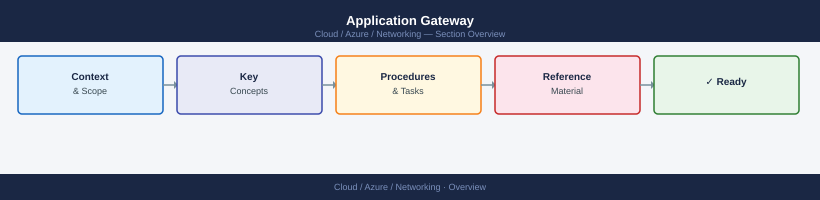
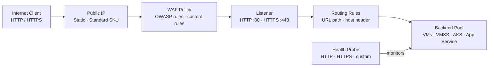

---
tags:
  - azure
  - networking
---
# Application Gateway


<div class="kb-summary">
Azure Application Gateway is a Layer 7 load balancer that provides SSL termination, URL-based routing, Web Application Firewall (WAF), and autoscaling. It operates at the application layer and is the preferred entry point for HTTP/HTTPS workloads.

*Applies to: Azure*
</div>



```d2
direction: right

center: "Azure" {shape: hexagon}
application_gateway_traffic_flow: "Application Gateway Traffic Flow" {shape: rectangle}
creating_an_application_gateway: "Creating an Application Gateway" {shape: rectangle}
waf_mode_configuration: "WAF Mode Configuration" {shape: rectangle}
listener_configuration: "Listener Configuration" {shape: rectangle}
backend_pools_and_health_probes: "Backend Pools and Health Probes" {shape: rectangle}
ssl_termination_and_tls_policy: "SSL Termination and TLS Policy" {shape: rectangle}

center -> application_gateway_traffic_flow
center -> creating_an_application_gateway
center -> waf_mode_configuration
center -> listener_configuration
center -> backend_pools_and_health_probes
center -> ssl_termination_and_tls_policy
```

## Application Gateway Traffic Flow



## Creating an Application Gateway

```bash
# Create a public IP for the Application Gateway
az network public-ip create \
  --resource-group myRG \
  --name appgw-pip \
  --sku Standard \
  --allocation-method Static

# Create the Application Gateway (WAF_v2 SKU)
az network application-gateway create \
  --name myAppGW \
  --resource-group myRG \
  --location eastus \
  --sku WAF_v2 \
  --capacity 2 \
  --vnet-name myVNet \
  --subnet appgw-subnet \
  --public-ip-address appgw-pip \
  --frontend-port 443 \
  --http-settings-port 80 \
  --http-settings-protocol Http \
  --routing-rule-type Basic \
  --priority 100
```

## WAF Mode Configuration

WAF can run in Detection mode (log only) or Prevention mode (block and log). Start with Detection and switch to Prevention after validating no false positives.

```bash
# Enable WAF in Prevention mode
az network application-gateway waf-config set \
  --gateway-name myAppGW \
  --resource-group myRG \
  --enabled true \
  --firewall-mode Prevention \
  --rule-set-type OWASP \
  --rule-set-version 3.2

# Check current WAF config
az network application-gateway waf-config show \
  --gateway-name myAppGW \
  --resource-group myRG \
  --output json
```

## Listener Configuration

Listeners define the frontend IP, port, and protocol. Multi-site listeners use host headers to route to different backends.

```bash
# Add an HTTPS listener with SSL certificate
az network application-gateway ssl-cert create \
  --gateway-name myAppGW \
  --resource-group myRG \
  --name mySSLCert \
  --cert-file cert.pfx \
  --cert-password "P@ssword123"

az network application-gateway http-listener create \
  --gateway-name myAppGW \
  --resource-group myRG \
  --name https-listener \
  --frontend-ip appGatewayFrontendIP \
  --frontend-port 443 \
  --ssl-cert mySSLCert
```

## Backend Pools and Health Probes

```bash
# Add a backend pool
az network application-gateway address-pool create \
  --gateway-name myAppGW \
  --resource-group myRG \
  --name myBackendPool \
  --servers 10.0.1.4 10.0.1.5

# Create a custom health probe
az network application-gateway probe create \
  --gateway-name myAppGW \
  --resource-group myRG \
  --name myHealthProbe \
  --protocol Http \
  --host-name-from-http-settings true \
  --path /health \
  --interval 30 \
  --timeout 30 \
  --threshold 3

# Create HTTP settings referencing the probe
az network application-gateway http-settings create \
  --gateway-name myAppGW \
  --resource-group myRG \
  --name myHTTPSettings \
  --port 80 \
  --protocol Http \
  --probe myHealthProbe \
  --cookie-based-affinity Disabled
```

## SSL Termination and TLS Policy

```bash
# Set TLS policy to enforce minimum TLS 1.2
az network application-gateway ssl-policy set \
  --gateway-name myAppGW \
  --resource-group myRG \
  --policy-type Predefined \
  --policy-name AppGwSslPolicy20220101

# List available SSL policies
az network application-gateway ssl-policy list-options \
  --output table
```

## SKU and Capacity Summary

| SKU          | WAF Support | Autoscale | Use Case                       |
|--------------|-------------|-----------|--------------------------------|
| Standard_v2  | No          | Yes       | General HTTP/HTTPS load balancing |
| WAF_v2       | Yes         | Yes       | Internet-facing workloads needing WAF |
| Standard v1  | No          | No        | Legacy, not recommended        |
| WAF v1       | Yes         | No        | Legacy, not recommended        |

```bash
# Show Application Gateway operational state and backend health
az network application-gateway show \
  --name myAppGW \
  --resource-group myRG \
  --output table

az network application-gateway show-backend-health \
  --name myAppGW \
  --resource-group myRG \
  --output json
```
