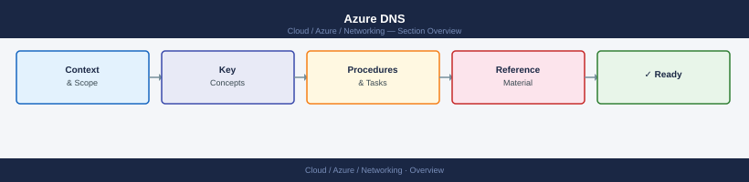
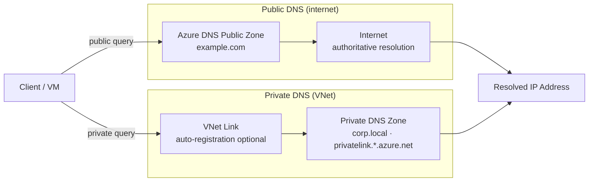

---
tags:
  - azure
  - networking
---
# Azure DNS


<div class="kb-summary">
Azure DNS hosts DNS zones and provides name resolution using the Azure infrastructure. It supports both public DNS zones (internet-facing) and private DNS zones (resolution within VNets). Azure DNS offers high availability with a 100% SLA for authoritative name resolution.

*Applies to: Azure*
</div>



```d2
direction: right

center: "Azure" {shape: hexagon}
azure_dns_resolution_flow: "Azure DNS Resolution Flow" {shape: rectangle}
public_dns_zones: "Public DNS Zones" {shape: rectangle}
record_types_and_cli_commands: "Record Types and CLI Commands" {shape: rectangle}
alias_records: "Alias Records" {shape: rectangle}
supported_record_types: "Supported Record Types" {shape: rectangle}
private_dns_zones: "Private DNS Zones" {shape: rectangle}

center -> azure_dns_resolution_flow
center -> public_dns_zones
center -> record_types_and_cli_commands
center -> alias_records
center -> supported_record_types
center -> private_dns_zones
```

## Azure DNS Resolution Flow



## Public DNS Zones

```bash
# Create a public DNS zone
az network dns zone create \
  --resource-group myRG \
  --name example.com

# List DNS zones
az network dns zone list \
  --resource-group myRG \
  --output table

# Show zone details (includes NS and SOA records)
az network dns zone show \
  --resource-group myRG \
  --name example.com \
  --output json
```

After creation, delegate the zone by updating the registrar's NS records with the four nameservers Azure assigns.

## Record Types and CLI Commands

```bash
# Create an A record
az network dns record-set a add-record \
  --resource-group myRG \
  --zone-name example.com \
  --record-set-name www \
  --ipv4-address 20.10.5.100

# Create a CNAME record
az network dns record-set cname set-record \
  --resource-group myRG \
  --zone-name example.com \
  --record-set-name api \
  --cname api-backend.azurewebsites.net

# Create an MX record
az network dns record-set mx add-record \
  --resource-group myRG \
  --zone-name example.com \
  --record-set-name "@" \
  --exchange mail.example.com \
  --preference 10

# Create a TXT record (for SPF or domain verification)
az network dns record-set txt add-record \
  --resource-group myRG \
  --zone-name example.com \
  --record-set-name "@" \
  --value "v=spf1 include:spf.protection.outlook.com -all"

# List all record sets in a zone
az network dns record-set list \
  --resource-group myRG \
  --zone-name example.com \
  --output table
```

## Alias Records

Alias records are Azure-native and allow a DNS record to point to an Azure resource (e.g., Public IP, Traffic Manager, Front Door) rather than a static IP. The alias resolves the current IP of the target resource automatically.

```bash
# Create an alias A record pointing to a public IP
az network dns record-set a create \
  --resource-group myRG \
  --zone-name example.com \
  --record-set-name "@" \
  --ttl 300 \
  --target-resource /subscriptions/<sub-id>/resourceGroups/myRG/providers/Microsoft.Network/publicIPAddresses/myPIP
```

## Supported Record Types

| Record Type | Purpose                                           |
|-------------|---------------------------------------------------|
| A           | Maps hostname to IPv4 address                     |
| AAAA        | Maps hostname to IPv6 address                     |
| CNAME       | Canonical name alias                              |
| MX          | Mail exchange                                     |
| NS          | Nameserver delegation                             |
| PTR         | Reverse DNS lookup                                |
| SOA         | Start of Authority (auto-managed)                 |
| SRV         | Service location                                  |
| TXT         | Arbitrary text (SPF, DKIM, domain verification)   |
| CAA         | Certification Authority Authorization             |

## Private DNS Zones

Private DNS zones provide name resolution within VNets without exposing records on the internet.

```bash
# Create a private DNS zone
az network private-dns zone create \
  --resource-group myRG \
  --name privatelink.blob.core.windows.net

# Link a VNet to the private DNS zone (enable auto-registration for VMs)
az network private-dns link vnet create \
  --resource-group myRG \
  --zone-name privatelink.blob.core.windows.net \
  --name myVNetLink \
  --virtual-network myVNet \
  --registration-enabled false

# Add an A record in the private zone (used with private endpoints)
az network private-dns record-set a add-record \
  --resource-group myRG \
  --zone-name privatelink.blob.core.windows.net \
  --record-set-name mystorageaccount \
  --ipv4-address 10.0.1.10

# List VNet links for a private zone
az network private-dns link vnet list \
  --resource-group myRG \
  --zone-name privatelink.blob.core.windows.net \
  --output table
```

## DNS Delegation

To delegate a subdomain to Azure DNS:

```bash
# Get the NS records assigned to the zone
az network dns zone show \
  --resource-group myRG \
  --name example.com \
  --query nameServers \
  --output tsv
```

Update the parent domain's registrar (e.g., Namecheap, GoDaddy) with these NS records to complete delegation.
