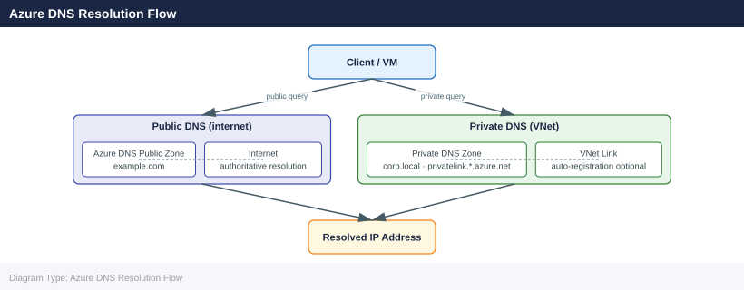

---
tags:
  - azure
  - networking
---
# Azure DNS

<div class="kb-summary">
Azure DNS hosts DNS zones and provides name resolution using the Azure infrastructure. It supports both public DNS zones (internet-facing) and private DNS zones (resolution within VNets). Azure DNS offers high availability with a 100% SLA for authoritative name resolution.

*Applies to: Azure*
</div>

## Azure DNS Resolution Flow



## Public DNS Zones

```bash
# Create a public DNS zone
az network dns zone create \
  --resource-group myRG \
  --name example.com

# List DNS zones
az network dns zone list \
  --resource-group myRG \
  --output table

# Show zone details (includes NS and SOA records)
az network dns zone show \
  --resource-group myRG \
  --name example.com \
  --output json
```


```text title="Expected output"
{
  "id": "/subscriptions/12345678-1234-1234-1234-123456789012/resourceGroups/myRG/providers/Microsoft.Network/dnsZones/example.com",
  "location": "global",
  "name": "example.com",
  "nameServers": [
    "ns1-08.azure-dns.com.",
    "ns2-08.azure-dns.net.",
    "ns3-08.azure-dns.org.",
    "ns4-08.azure-dns.info."
  ],
  "resourceGroup": "myRG",
  "type": "Microsoft.Network/dnsZones"
}

Name          ResourceGroup    NameServers
-----------   ---------------  -----------------------------------------------
example.com   myRG             ns1-08.azure-dns.com., ns2-08.azure-dns.net., ...

{
  "etag": "W/\"a1b2c3d4-e5f6-7890-abcd-ef1234567890\"",
  "id": "/subscriptions/12345678-1234-1234-1234-123456789012/resourceGroups/myRG/providers/Microsoft.Network/dnsZones/example.com",
  "location": "global",
  "name": "example.com",
  "nameServers": [
    "ns1-08.azure-dns.com.",
    "ns2-08.azure-dns.net.",
    "ns3-08.azure-dns.org.",
    "ns4-08.azure-dns.info."
  ],
  "resourceGroup": "myRG",
  "type": "Microsoft.Network/dnsZones"
}
```

!!! warning "Common errors"
    **`ResourceGroupNotFound`** — Verify the resource group name with `az group list` and ensure it exists in the correct subscription.
    **`DnsZoneAlreadyExists`** — Delete the existing zone with `az network dns zone delete --resource-group myRG --name example.com` or use a different zone name.
After creation, delegate the zone by updating the registrar's NS records with the four nameservers Azure assigns.

## Record Types and CLI Commands

```bash
# Create an A record
az network dns record-set a add-record \
  --resource-group myRG \
  --zone-name example.com \
  --record-set-name www \
  --ipv4-address 20.10.5.100

# Create a CNAME record
az network dns record-set cname set-record \
  --resource-group myRG \
  --zone-name example.com \
  --record-set-name api \
  --cname api-backend.azurewebsites.net

# Create an MX record
az network dns record-set mx add-record \
  --resource-group myRG \
  --zone-name example.com \
  --record-set-name "@" \
  --exchange mail.example.com \
  --preference 10

# Create a TXT record (for SPF or domain verification)
az network dns record-set txt add-record \
  --resource-group myRG \
  --zone-name example.com \
  --record-set-name "@" \
  --value "v=spf1 include:spf.protection.outlook.com -all"

# List all record sets in a zone
az network dns record-set list \
  --resource-group myRG \
  --zone-name example.com \
  --output table
```


```text title="Expected output"
{
  "TTL": 3600,
  "etag": "00000002-0000-0000-0000-65a4c8f1",
  "id": "/subscriptions/12345678-1234-1234-1234-123456789012/resourceGroups/myRG/providers/Microsoft.Network/dnszones/example.com/A/www",
  "name": "www",
  "resourceGroup": "myRG",
  "type": "Microsoft.Network/dnszones/A",
  "aRecords": [
    {
      "ipv4Address": "20.10.5.100"
    }
  ]
}
{
  "TTL": 3600,
  "etag": "00000003-0000-0000-0000-65a4c8f2",
  "id": "/subscriptions/12345678-1234-1234-1234-123456789012/resourceGroups/myRG/providers/Microsoft.Network/dnszones/example.com/CNAME/api",
  "name": "api",
  "resourceGroup": "myRG",
  "type": "Microsoft.Network/dnszones/CNAME",
  "cnameRecord": {
    "cname": "api-backend.azurewebsites.net"
  }
}
{
  "TTL": 3600,
  "etag": "00000004-0000-0000-0000-65a4c8f3",
  "id": "/subscriptions/12345678-1234-1234-1234-123456789012/resourceGroups/myRG/providers/Microsoft.Network/dnszones/example.com/MX/%40",
  "name": "@",
  "resourceGroup": "myRG",
  "type": "Microsoft.Network/dnszones/MX",
  "mxRecords": [
    {
      "exchange": "mail.example.com",
      "preference": 10
    }
  ]
}
{
  "TTL": 3600,
  "etag": "00000005-0000-0000-0000-65a4c8f4",
  "id": "/subscriptions/12345678-1234-1234-1234-123456789012/resourceGroups/myRG/providers/Microsoft.Network/dnszones/example.com/TXT/%40",
  "name": "@",
  "resourceGroup": "myRG",
  "type": "Microsoft.Network/dnszones/TXT",
  "txtRecords": [
    {
      "value": [
        "v=spf1 include:spf.protection.outlook.com -all"
      ]
    }
  ]
}
Name    Type    TTL    ResourceGroup
------  ------  -----  ---------------
www     A       3600   myRG
api     CNAME   3600   myRG
@       MX      3600   myRG
@       TXT     3600   myRG
```

!!! warning "Common errors"
    **`ResourceGroupNotFound: Resource group 'myRG' could not be found.`** — Verify the resource group exists with `az group list` and use the correct name.
    **`DnsZ
## Alias Records

Alias records are Azure-native and allow a DNS record to point to an Azure resource (e.g., Public IP, Traffic Manager, Front Door) rather than a static IP. The alias resolves the current IP of the target resource automatically.

```bash
# Create an alias A record pointing to a public IP
az network dns record-set a create \
  --resource-group myRG \
  --zone-name example.com \
  --record-set-name "@" \
  --ttl 300 \
  --target-resource /subscriptions/<sub-id>/resourceGroups/myRG/providers/Microsoft.Network/publicIPAddresses/myPIP
```


```text title="Expected output"
{
  "etag": "W/\"a1b2c3d4-e5f6-47g8-h9i0-j1k2l3m4n5o6\"",
  "fqdn": "example.com.",
  "id": "/subscriptions/12345678-1234-1234-1234-123456789012/resourceGroups/myRG/providers/Microsoft.Network/dnsZones/example.com/A/@",
  "name": "@",
  "resourceGroup": "myRG",
  "ttl": 300,
  "type": "Microsoft.Network/dnsZones/A",
  "aRecords": [
    {
      "ipv4Address": "203.0.113.42"
    }
  ],
  "targetResource": {
    "id": "/subscriptions/12345678-1234-1234-1234-123456789012/resourceGroups/myRG/providers/Microsoft.Network/publicIPAddresses/myPIP"
  }
}
```

!!! warning "Common errors"
    **`ResourceNotFound: The Resource 'Microsoft.Network/dnsZones/example.com' under resource group 'myRG' was not found.`** — Verify the DNS zone exists in the specified resource group using `az network dns zone list --resource-group myRG`.
    **`InvalidResourceId: The provided resource ID is invalid or does not exist.`** — Confirm the public IP address resource ID is correct and exists by running `az network public-ip show --resource-group myRG --name myPIP --query id`.
## Supported Record Types

| Record Type | Purpose                                           |
|-------------|---------------------------------------------------|
| A           | Maps hostname to IPv4 address                     |
| AAAA        | Maps hostname to IPv6 address                     |
| CNAME       | Canonical name alias                              |
| MX          | Mail exchange                                     |
| NS          | Nameserver delegation                             |
| PTR         | Reverse DNS lookup                                |
| SOA         | Start of Authority (auto-managed)                 |
| SRV         | Service location                                  |
| TXT         | Arbitrary text (SPF, DKIM, domain verification)   |
| CAA         | Certification Authority Authorization             |

## Private DNS Zones

Private DNS zones provide name resolution within VNets without exposing records on the internet.

```bash
# Create a private DNS zone
az network private-dns zone create \
  --resource-group myRG \
  --name privatelink.blob.core.windows.net

# Link a VNet to the private DNS zone (enable auto-registration for VMs)
az network private-dns link vnet create \
  --resource-group myRG \
  --zone-name privatelink.blob.core.windows.net \
  --name myVNetLink \
  --virtual-network myVNet \
  --registration-enabled false

# Add an A record in the private zone (used with private endpoints)
az network private-dns record-set a add-record \
  --resource-group myRG \
  --zone-name privatelink.blob.core.windows.net \
  --record-set-name mystorageaccount \
  --ipv4-address 10.0.1.10

# List VNet links for a private zone
az network private-dns link vnet list \
  --resource-group myRG \
  --zone-name privatelink.blob.core.windows.net \
  --output table
```


```text title="Expected output"
{
  "etag": "W/\"a1b2c3d4-e5f6-47g8-h9i0-j1k2l3m4n5o6\"",
  "id": "/subscriptions/12345678-1234-1234-1234-123456789012/resourceGroups/myRG/providers/Microsoft.Network/privateDnsZones/privatelink.blob.core.windows.net",
  "location": "global",
  "name": "privatelink.blob.core.windows.net",
  "resourceGroup": "myRG",
  "type": "Microsoft.Network/privateDnsZones"
}
{
  "etag": "W/\"b2c3d4e5-f6g7-48h9-i0j1-k2l3m4n5o6p7\"",
  "id": "/subscriptions/12345678-1234-1234-1234-123456789012/resourceGroups/myRG/providers/Microsoft.Network/privateDnsZones/privatelink.blob.core.windows.net/virtualNetworkLinks/myVNetLink",
  "name": "myVNetLink",
  "registrationEnabled": false,
  "resourceGroup": "myRG",
  "virtualNetwork": {
    "id": "/subscriptions/12345678-1234-1234-1234-123456789012/resourceGroups/myRG/providers/Microsoft.Network/virtualNetworks/myVNet"
  }
}
{
  "aRecords": [
    {
      "ipv4Address": "10.0.1.10"
    }
  ],
  "etag": "W/\"c3d4e5f6-g7h8-49i0-j1k2-l3m4n5o6p7q8\"",
  "fqdn": "mystorageaccount.privatelink.blob.core.windows.net",
  "id": "/subscriptions/12345678-1234-1234-1234-123456789012/resourceGroups/myRG/providers/Microsoft.Network/privateDnsZones/privatelink.blob.core.windows.net/A/mystorageaccount",
  "name": "mystorageaccount",
  "ttl": 3600,
  "type": "Microsoft.Network/privateDnsZones/A"
}
Name          Type                                                                    Etag
------------  ----------------------------------------------------------------------  ------------------------------------
myVNetLink    Microsoft.Network/privateDnsZones/virtualNetworkLinks                   W/\"c3d4e5f6-g7h8-49i0-j1k2-l3m4n5o6p7q8\"
```

!!! warning "Common errors"
    **`ResourceGroupNotFound`** — Verify the resource group name with `az group list` and ensure it exists in your subscription.
    **`VirtualNetworkNotFound`** — Confirm the VNet name and resource group are correct using `az network vnet list --resource-group myRG`.
    **`PrivateDnsZoneNotFound`** — Ensure the private DNS zone was created successfully before attempting to add records or links to it.
## DNS Delegation

To delegate a subdomain to Azure DNS:

```bash
# Get the NS records assigned to the zone
az network dns zone show \
  --resource-group myRG \
  --name example.com \
  --query nameServers \
  --output tsv
```


```text title="Expected output"
ns1-08.azure-dns.com.
ns2-08.azure-dns.net.
ns3-08.azure-dns.org.
ns4-08.azure-dns.info.
```

!!! warning "Common errors"
    **`ResourceNotFound : The Resource 'Microsoft.Network/dnsZones/example.com' under resource group 'myRG' was not found.`** — Verify the DNS zone name and resource group name are correct with `az network dns zone list --resource-group myRG`.
    **`AuthorizationFailed : The client 'user@contoso.com' with object id 'xxxxxxxx-xxxx-xxxx-xxxx-xxxxxxxxxxxx' does not have authorization to perform action 'Microsoft.Network/dnsZones/read' over scope '/subscriptions/xxxxxxxx-xxxx-xxxx-xxxx-xxxxxxxxxxxx/resourceGroups/myRG/providers/Microsoft.Network/dnsZones/example.com'.`** — Ensure your Azure account has at least Reader role on the resource group or DNS zone.
Update the parent domain's registrar (e.g., Namecheap, GoDaddy) with these NS records to complete delegation.
