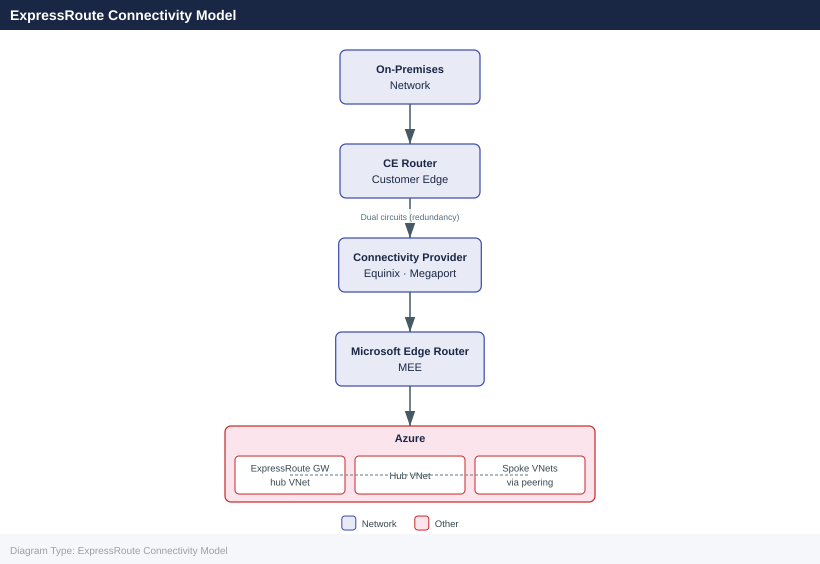

---
tags:
  - azure
  - networking
description: "Azure ExpressRoute provides dedicated private connectivity between on-premises networks and Azure, bypassing the public internet. It offers predictable..."
---
# ExpressRoute

<div class="kb-summary">
Azure ExpressRoute provides dedicated private connectivity between on-premises networks and Azure, bypassing the public internet. It offers predictable latency, higher bandwidth options, and built-in redundancy through dual circuits.

*Applies to: Azure*
</div>

## ExpressRoute Connectivity Model



## Circuit Creation

```bash
# Create an ExpressRoute circuit
az network express-route create \
  --name myERCircuit \
  --resource-group myRG \
  --location eastus \
  --bandwidth 1000 \
  --peering-location "Washington DC" \
  --provider "Equinix" \
  --sku-family MeteredData \
  --sku-tier Standard

# Show circuit state (provisioning status)
az network express-route show \
  --name myERCircuit \
  --resource-group myRG \
  --output json

# List all ExpressRoute circuits
az network express-route list \
  --resource-group myRG \
  --output table
```


```text title="Expected output"
{
  "id": "/subscriptions/12345678-1234-1234-1234-123456789012/resourceGroups/myRG/providers/Microsoft.Network/expressRouteCircuits/myERCircuit",
  "name": "myERCircuit",
  "type": "Microsoft.Network/expressRouteCircuits",
  "location": "eastus",
  "tags": null,
  "sku": {
    "name": "Standard_MeteredData",
    "tier": "Standard",
    "family": "MeteredData"
  },
  "provisioningState": "Succeeded",
  "circuitProvisioningState": "NotProvisioned",
  "serviceProviderProvisioningState": "NotProvisioned",
  "peerings": [],
  "authorizations": [],
  "serviceKey": "a1b2c3d4-e5f6-7890-abcd-ef1234567890",
  "serviceProviderProperties": {
    "serviceProviderName": "Equinix",
    "peeringLocation": "Washington DC",
    "bandwidthInMbps": 1000
  }
}

Name          ResourceGroup    Location    ProvisioningState    CircuitProvisioningState
------------  ---------------  ----------  -------------------  --------------------------
myERCircuit    myRG             eastus      Succeeded            NotProvisioned
```

!!! warning "Common errors"
    **`ResourceNotFound: The Resource 'Microsoft.Network/expressRouteCircuits/myERCircuit' under resource group 'myRG' was not found.`** — Verify the resource group name and circuit name match exactly, and ensure the circuit was successfully created in the previous step.
    **`InvalidSkuFamily: The SKU family 'MeteredData' is not valid for the specified tier 'Standard'.`** — Use `--sku-family MeteredData` with `--sku-tier Standard`, or switch to `--sku-family UnlimitedData` if required.
    **`ServiceProviderNotFound: The service provider 'Equinix' is not available at peering location 'Washington DC'.`** — Run `az network express-route list-service-providers` to verify available providers and peering locations in your region.
After creation, share the `ServiceKey` with your connectivity provider so they can configure the physical circuit. The `CircuitProvisioningState` moves from `NotProvisioned` to `Provisioned` when the provider completes their side.

## Peering Types

| Peering Type         | Purpose                                                    |
|----------------------|------------------------------------------------------------|
| Azure Private        | Reach Azure VNets (VMs, internal load balancers)           |
| Azure Microsoft      | Reach Azure public services (Storage, SQL, M365) via private path |
| Azure Public (legacy)| Deprecated — replaced by Microsoft peering                |

```bash
# Configure Azure Private Peering
az network express-route peering create \
  --circuit-name myERCircuit \
  --resource-group myRG \
  --peering-type AzurePrivatePeering \
  --peer-asn 65001 \
  --primary-peer-subnet 10.100.0.0/30 \
  --secondary-peer-subnet 10.100.0.4/30 \
  --vlan-id 100

# Configure Microsoft Peering
az network express-route peering create \
  --circuit-name myERCircuit \
  --resource-group myRG \
  --peering-type MicrosoftPeering \
  --peer-asn 65001 \
  --primary-peer-subnet 203.0.113.0/30 \
  --secondary-peer-subnet 203.0.113.4/30 \
  --vlan-id 200 \
  --advertised-public-prefixes 203.0.113.0/24

# Show peering details
az network express-route peering show \
  --circuit-name myERCircuit \
  --resource-group myRG \
  --name AzurePrivatePeering
```


```text title="Expected output"
{
  "azureAsn": 12076,
  "connections": [],
  "etag": "W/\"a1b2c3d4-e5f6-47g8-h9i0-j1k2l3m4n5o6\"",
  "id": "/subscriptions/12345678-1234-1234-1234-123456789012/resourceGroups/myRG/providers/Microsoft.Network/expressRouteCircuits/myERCircuit/peerings/AzurePrivatePeering",
  "lastModifiedBy": "user@contoso.com",
  "lastModifiedTime": "2024-01-15T14:32:18.456789+00:00",
  "microsoftPeeringConfig": null,
  "name": "AzurePrivatePeering",
  "peerAsn": 65001,
  "peeringType": "AzurePrivatePeering",
  "primaryAzurePort": "ERDev-06GMR-01DBU-PRIMARY-80",
  "primaryPeerAddressPrefix": "10.100.0.0/30",
  "provisioningState": "Succeeded",
  "resourceGroup": "myRG",
  "secondaryAzurePort": "ERDev-06GMR-01DBU-SECONDARY-80",
  "secondaryPeerAddressPrefix": "10.100.0.4/30",
  "sharedKey": null,
  "state": "Enabled",
  "stats": {
    "primarybytesIn": 1048576,
    "primarybytesOut": 2097152,
    "secondarybytesIn": 1572864,
    "secondarybytesOut": 2621440
  },
  "vlanId": 100
}
```

!!! warning "Common errors"
    **`InvalidArgumentsUsage: unrecognized arguments: --advertised-public-prefixes`** — Use `--advertised-public-prefixes 203.0.113.0/24` only with MicrosoftPeering; remove it from AzurePrivatePeering commands.
    **`ResourceNotFound: The Resource 'Microsoft.Network/expressRouteCircuits/myERCircuit' under resource group 'myRG' was not found.`** — Verify the circuit name and resource group exist by running `az network express-route circuit list --resource-group myRG`.
    **`BadRequest: Peering AzurePrivatePeering already exists on circuit myERCircuit.`** — Delete the existing peering with `az network express-route peering delete --circuit-name myERCircuit --resource-group myRG --name AzurePrivatePeering` before recreating it.
## Connecting to a Virtual Network Gateway

```bash
# Create an ExpressRoute Virtual Network Gateway
az network vnet-gateway create \
  --name myERGateway \
  --resource-group myRG \
  --location eastus \
  --vnet myVNet \
  --gateway-type ExpressRoute \
  --sku ErGw1AZ \
  --public-ip-address er-gw-pip

# Create the connection between the gateway and the circuit
az network vpn-connection create \
  --name myERConnection \
  --resource-group myRG \
  --vnet-gateway1 myERGateway \
  --express-route-circuit2 myERCircuit \
  --routing-weight 0
```


```text title="Expected output"
{
  "activeActive": false,
  "bgpSettings": null,
  "enableBgp": false,
  "etag": "W/\"a1b2c3d4-e5f6-47g8-h9i0-j1k2l3m4n5o6\"",
  "gatewayDefaultSite": null,
  "gatewayType": "ExpressRoute",
  "id": "/subscriptions/12345678-1234-1234-1234-123456789012/resourceGroups/myRG/providers/Microsoft.Network/virtualNetworkGateways/myERGateway",
  "ipConfigurations": [
    {
      "id": "/subscriptions/12345678-1234-1234-1234-123456789012/resourceGroups/myRG/providers/Microsoft.Network/virtualNetworkGateways/myERGateway/ipConfigurations/vnetGatewayConfig",
      "name": "vnetGatewayConfig",
      "privateIpAddress": "10.0.1.4",
      "privateIpAllocationMethod": "Dynamic",
      "publicIpAddress": "/subscriptions/12345678-1234-1234-1234-123456789012/resourceGroups/myRG/providers/Microsoft.Network/publicIPAddresses/er-gw-pip",
      "subnet": "/subscriptions/12345678-1234-1234-1234-123456789012/resourceGroups/myRG/providers/Microsoft.Network/virtualNetworks/myVNet/subnets/GatewaySubnet"
    }
  ],
  "location": "eastus",
  "name": "myERGateway",
  "provisioningState": "Succeeded",
  "resourceGroup": "myRG",
  "sku": {
    "capacity": 1,
    "name": "ErGw1AZ",
    "tier": "ErGw1AZ"
  },
  "tags": null,
  "type": "Microsoft.Network/virtualNetworkGateways"
}
{
  "authorizationKey": null,
  "connectionProtocol": "IKEv2",
  "connectionStatus": "Connecting",
  "connectionType": "ExpressRoute",
  "egressBytesTransferred": 0,
  "enableBgp": false,
  "etag": "W/\"f7g8h9i0-j1k2-l3m4-n5o6-p7q8r9s0t1u2\"",
  "expressRouteGatewayBypass": false,
  "id": "/subscriptions/12345678-1234-1234-1234-123456789012/resourceGroups/myRG/providers/Microsoft.Network/connections/myERConnection",
  "ingressBytesTransferred": 0,
  "location": "eastus",
  "name": "myERConnection",
  "peer": "/subscriptions/12345678-1234-1234-1234-123456789012/resourceGroups/myRG/providers/Microsoft.Network/expressRouteCircuits/myERCircuit",
  "provisioningState": "Succeeded",
  "resource
```
## Redundancy

ExpressRoute requires two physical links (primary and secondary) for redundancy. Always configure both peers.

```bash
# Check circuit redundancy state
az network express-route show \
  --name myERCircuit \
  --resource-group myRG \
  --query "circuitProvisioningState" \
  --output tsv

# Monitor circuit metrics (BitsInPerSecond, BitsOutPerSecond)
az monitor metrics list \
  --resource /subscriptions/<sub-id>/resourceGroups/myRG/providers/Microsoft.Network/expressRouteCircuits/myERCircuit \
  --metric "BitsInPerSecond" "BitsOutPerSecond" \
  --interval PT5M \
  --aggregation Average \
  --output table
```


```text title="Expected output"
Provisioned

TimeStamp                     Name                Aggregation    Value
2024-01-15T14:32:00+00:00     BitsInPerSecond     Average        1247856000
2024-01-15T14:37:00+00:00     BitsInPerSecond     Average        1156432000
2024-01-15T14:42:00+00:00     BitsInPerSecond     Average        1389120000
2024-01-15T14:32:00+00:00     BitsOutPerSecond    Average        987654000
2024-01-15T14:37:00+00:00     BitsOutPerSecond    Average        1023456000
2024-01-15T14:42:00+00:00     BitsOutPerSecond    Average        945280000
```

!!! warning "Common errors"
    **`ResourceNotFound: The Resource 'Microsoft.Network/expressRouteCircuits/myERCircuit' under resource group 'myRG' was not found.`** — Verify the circuit name and resource group name are correct using `az network express-route list --resource-group myRG`.
    **`AuthorizationFailed: The client 'user@contoso.com' with object id 'xxxxxxxx-xxxx-xxxx-xxxx-xxxxxxxxxxxx' does not have authorization to perform action 'Microsoft.Network/expressRouteCircuits/read' over scope '/subscriptions/<sub-id>/resourceGroups/myRG/providers/Microsoft.Network/expressRouteCircuits/myERCircuit'.`** — Ensure your Azure account has at least Reader role on the resource group or subscription.
## SKU and Bandwidth Options

| SKU Tier   | Geographic Scope                    |
|------------|-------------------------------------|
| Standard   | Geopolitical region (e.g., Americas)|
| Premium    | Global (cross-geopolitical access)  |

| Family       | Billing                            |
|--------------|------------------------------------|
| MeteredData  | Charged per GB outbound            |
| UnlimitedData| Flat rate regardless of egress     |

## Monitoring ExpressRoute

```bash
# Enable diagnostic settings on the circuit
az monitor diagnostic-settings create \
  --name "er-diag" \
  --resource /subscriptions/<sub-id>/resourceGroups/myRG/providers/Microsoft.Network/expressRouteCircuits/myERCircuit \
  --workspace /subscriptions/<sub-id>/resourceGroups/myRG/providers/Microsoft.OperationalInsights/workspaces/myWorkspace \
  --logs '[{"category":"PeeringRouteLog","enabled":true}]' \
  --metrics '[{"category":"AllMetrics","enabled":true}]'
```


```text title="Expected output"
{
  "id": "/subscriptions/12a34b56-c789-0d12-e345-f67890ab1234/resourceGroups/myRG/providers/Microsoft.Insights/diagnosticSettings/er-diag",
  "identity": null,
  "kind": null,
  "location": null,
  "managedBy": null,
  "name": "er-diag",
  "properties": {
    "logs": [
      {
        "category": "PeeringRouteLog",
        "categoryGroup": null,
        "enabled": true,
        "retentionPolicy": {
          "days": 0,
          "enabled": false
        }
      }
    ],
    "metrics": [
      {
        "category": "AllMetrics",
        "enabled": true,
        "retentionPolicy": {
          "days": 0,
          "enabled": false
        }
      }
    ],
    "serviceBusRuleId": null,
    "storageAccountId": null,
    "workspaceId": "/subscriptions/12a34b56-c789-0d12-e345-f67890ab1234/resourcegroups/myrg/providers/microsoft.operationalinsights/workspaces/myworkspace"
  },
  "resourceGroup": "myRG",
  "tags": null,
  "type": "Microsoft.Insights/diagnosticSettings"
}
```

!!! warning "Common errors"
    **`ResourceNotFound: The resource '/subscriptions/<sub-id>/resourceGroups/myRG/providers/Microsoft.Network/expressRouteCircuits/myERCircuit' could not be found.`** — Verify the subscription ID, resource group name, and ExpressRoute circuit name are correct and exist in your subscription.
    **`InvalidResourceId: The provided resource ID is invalid or the resource does not have permission to send diagnostics to the workspace.`** — Ensure the Log Analytics workspace exists and the ExpressRoute circuit's managed identity has the "Log Analytics Contributor" role on the workspace resource group.