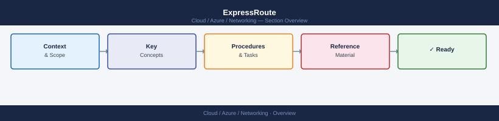
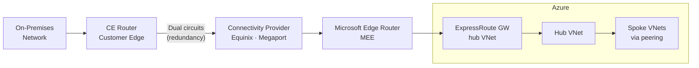

---
tags:
  - azure
  - networking
---
# ExpressRoute


<div class="kb-summary">
Azure ExpressRoute provides dedicated private connectivity between on-premises networks and Azure, bypassing the public internet. It offers predictable latency, higher bandwidth options, and built-in redundancy through dual circuits.

*Applies to: Azure*
</div>



## ExpressRoute Connectivity Model



## Circuit Creation

```bash
# Create an ExpressRoute circuit
az network express-route create \
  --name myERCircuit \
  --resource-group myRG \
  --location eastus \
  --bandwidth 1000 \
  --peering-location "Washington DC" \
  --provider "Equinix" \
  --sku-family MeteredData \
  --sku-tier Standard

# Show circuit state (provisioning status)
az network express-route show \
  --name myERCircuit \
  --resource-group myRG \
  --output json

# List all ExpressRoute circuits
az network express-route list \
  --resource-group myRG \
  --output table
```

After creation, share the `ServiceKey` with your connectivity provider so they can configure the physical circuit. The `CircuitProvisioningState` moves from `NotProvisioned` to `Provisioned` when the provider completes their side.

## Peering Types

| Peering Type         | Purpose                                                    |
|----------------------|------------------------------------------------------------|
| Azure Private        | Reach Azure VNets (VMs, internal load balancers)           |
| Azure Microsoft      | Reach Azure public services (Storage, SQL, M365) via private path |
| Azure Public (legacy)| Deprecated — replaced by Microsoft peering                |

```bash
# Configure Azure Private Peering
az network express-route peering create \
  --circuit-name myERCircuit \
  --resource-group myRG \
  --peering-type AzurePrivatePeering \
  --peer-asn 65001 \
  --primary-peer-subnet 10.100.0.0/30 \
  --secondary-peer-subnet 10.100.0.4/30 \
  --vlan-id 100

# Configure Microsoft Peering
az network express-route peering create \
  --circuit-name myERCircuit \
  --resource-group myRG \
  --peering-type MicrosoftPeering \
  --peer-asn 65001 \
  --primary-peer-subnet 203.0.113.0/30 \
  --secondary-peer-subnet 203.0.113.4/30 \
  --vlan-id 200 \
  --advertised-public-prefixes 203.0.113.0/24

# Show peering details
az network express-route peering show \
  --circuit-name myERCircuit \
  --resource-group myRG \
  --name AzurePrivatePeering
```

## Connecting to a Virtual Network Gateway

```bash
# Create an ExpressRoute Virtual Network Gateway
az network vnet-gateway create \
  --name myERGateway \
  --resource-group myRG \
  --location eastus \
  --vnet myVNet \
  --gateway-type ExpressRoute \
  --sku ErGw1AZ \
  --public-ip-address er-gw-pip

# Create the connection between the gateway and the circuit
az network vpn-connection create \
  --name myERConnection \
  --resource-group myRG \
  --vnet-gateway1 myERGateway \
  --express-route-circuit2 myERCircuit \
  --routing-weight 0
```

## Redundancy

ExpressRoute requires two physical links (primary and secondary) for redundancy. Always configure both peers.

```bash
# Check circuit redundancy state
az network express-route show \
  --name myERCircuit \
  --resource-group myRG \
  --query "circuitProvisioningState" \
  --output tsv

# Monitor circuit metrics (BitsInPerSecond, BitsOutPerSecond)
az monitor metrics list \
  --resource /subscriptions/<sub-id>/resourceGroups/myRG/providers/Microsoft.Network/expressRouteCircuits/myERCircuit \
  --metric "BitsInPerSecond" "BitsOutPerSecond" \
  --interval PT5M \
  --aggregation Average \
  --output table
```

## SKU and Bandwidth Options

| SKU Tier   | Geographic Scope                    |
|------------|-------------------------------------|
| Standard   | Geopolitical region (e.g., Americas)|
| Premium    | Global (cross-geopolitical access)  |

| Family       | Billing                            |
|--------------|------------------------------------|
| MeteredData  | Charged per GB outbound            |
| UnlimitedData| Flat rate regardless of egress     |

## Monitoring ExpressRoute

```bash
# Enable diagnostic settings on the circuit
az monitor diagnostic-settings create \
  --name "er-diag" \
  --resource /subscriptions/<sub-id>/resourceGroups/myRG/providers/Microsoft.Network/expressRouteCircuits/myERCircuit \
  --workspace /subscriptions/<sub-id>/resourceGroups/myRG/providers/Microsoft.OperationalInsights/workspaces/myWorkspace \
  --logs '[{"category":"PeeringRouteLog","enabled":true}]' \
  --metrics '[{"category":"AllMetrics","enabled":true}]'
```
