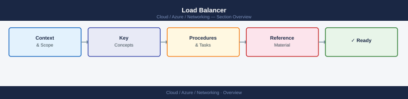

---
tags:
  - azure
  - networking
---
# Load Balancer


<div class="kb-summary">
Azure Load Balancer is a Layer 4 (TCP/UDP) load balancer for distributing inbound traffic to backend VMs or scale sets.

*Applies to: Azure*
</div>



## Frontend IPs

```bash
# Add an additional frontend IP (internal, for private load balancing)
az network lb frontend-ip create \
  --resource-group myRG \
  --lb-name myLB \
  --name myInternalFrontend \
  --vnet-name myVNet \
  --subnet mySubnet \
  --private-ip-address 10.0.1.100 \
  --private-ip-address-version IPv4

# List frontend IP configs
az network lb frontend-ip list \
  --resource-group myRG \
  --lb-name myLB \
  --output table
```

## Backend Pools

```bash
# Add a VM NIC to the backend pool
az network lb address-pool address add \
  --resource-group myRG \
  --lb-name myLB \
  --pool-name myBackendPool \
  --name vm1-ip \
  --vnet /subscriptions/<sub-id>/resourceGroups/myRG/providers/Microsoft.Network/virtualNetworks/myVNet \
  --ip-address 10.0.1.4

# Add a second address
az network lb address-pool address add \
  --resource-group myRG \
  --lb-name myLB \
  --pool-name myBackendPool \
  --name vm2-ip \
  --vnet /subscriptions/<sub-id>/resourceGroups/myRG/providers/Microsoft.Network/virtualNetworks/myVNet \
  --ip-address 10.0.1.5

# List backend pool addresses
az network lb address-pool address list \
  --resource-group myRG \
  --lb-name myLB \
  --pool-name myBackendPool \
  --output table
```

## Health Probes

```bash
# Create a TCP health probe on port 80
az network lb probe create \
  --resource-group myRG \
  --lb-name myLB \
  --name myHealthProbe \
  --protocol Tcp \
  --port 80 \
  --interval 15 \
  --threshold 2

# Create an HTTP probe with a custom path
az network lb probe create \
  --resource-group myRG \
  --lb-name myLB \
  --name httpProbe \
  --protocol Http \
  --port 80 \
  --path /health \
  --interval 15 \
  --threshold 2
```

## Load Balancing Rules

```bash
# Create a load balancing rule for HTTPS
az network lb rule create \
  --resource-group myRG \
  --lb-name myLB \
  --name HTTPS-Rule \
  --protocol Tcp \
  --frontend-port 443 \
  --backend-port 443 \
  --frontend-ip-name myFrontendIP \
  --backend-pool-name myBackendPool \
  --probe-name myHealthProbe \
  --idle-timeout 4 \
  --enable-tcp-reset true

# List all LB rules
az network lb rule list \
  --resource-group myRG \
  --lb-name myLB \
  --output table
```

## Inbound NAT Rules

Inbound NAT rules map a specific frontend port to a backend VM port for direct access (e.g., SSH/RDP).

```bash
# Create an inbound NAT rule for SSH to vm1
az network lb inbound-nat-rule create \
  --resource-group myRG \
  --lb-name myLB \
  --name ssh-vm1 \
  --protocol Tcp \
  --frontend-port 2201 \
  --backend-port 22 \
  --frontend-ip-name myFrontendIP
```

## SKU Comparison

| Feature                 | Basic SKU    | Standard SKU         |
|-------------------------|--------------|----------------------|
| Availability zones      | No           | Yes (zone-redundant) |
| SLA                     | None         | 99.99%               |
| Backend pool type       | Availability set | Any VM/VMSS       |
| Secure by default       | No           | Yes (requires NSG)   |
| Diagnostics             | Limited      | Full metrics/logs    |
| HTTPS probes            | No           | Yes                  |
