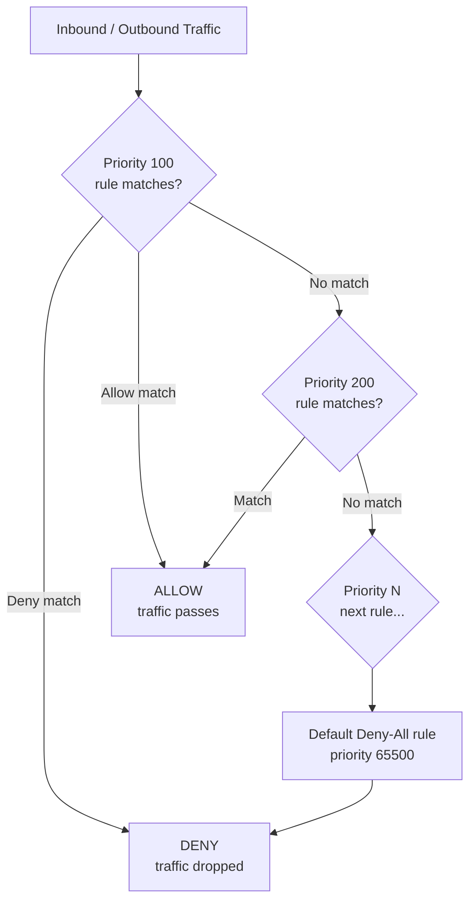

---
tags:
  - azure
  - networking
---
# Network Security Groups

<div class="kb-summary">
Network Security Groups (NSGs) are stateful packet filters that control inbound and outbound traffic to Azure resources. They can be associated with subnets or individual network interfaces. Rules are evaluated by priority — the lowest number wins.

*Applies to: Azure*
</div>

## NSG Rule Evaluation



## Creating and Managing NSGs

```bash
# Create an NSG
az network nsg create \
  --resource-group myRG \
  --name myNSG \
  --location eastus

# List NSGs in a resource group
az network nsg list \
  --resource-group myRG \
  --output table

# Show all rules in an NSG
az network nsg show \
  --resource-group myRG \
  --name myNSG \
  --output json
```

## Inbound and Outbound Rules

```bash
# Allow HTTPS inbound from the internet
az network nsg rule create \
  --nsg-name myNSG \
  --resource-group myRG \
  --name Allow-HTTPS \
  --priority 100 \
  --direction Inbound \
  --access Allow \
  --protocol Tcp \
  --source-address-prefixes Internet \
  --source-port-ranges '*' \
  --destination-address-prefixes '*' \
  --destination-port-ranges 443

# Allow SSH inbound from a specific management IP range
az network nsg rule create \
  --nsg-name myNSG \
  --resource-group myRG \
  --name Allow-SSH-Management \
  --priority 110 \
  --direction Inbound \
  --access Allow \
  --protocol Tcp \
  --source-address-prefixes 10.0.0.0/24 \
  --source-port-ranges '*' \
  --destination-address-prefixes '*' \
  --destination-port-ranges 22

# Deny all other inbound traffic explicitly
az network nsg rule create \
  --nsg-name myNSG \
  --resource-group myRG \
  --name Deny-All-Inbound \
  --priority 4000 \
  --direction Inbound \
  --access Deny \
  --protocol '*' \
  --source-address-prefixes '*' \
  --source-port-ranges '*' \
  --destination-address-prefixes '*' \
  --destination-port-ranges '*'

# Allow outbound to Azure Monitor endpoints
az network nsg rule create \
  --nsg-name myNSG \
  --resource-group myRG \
  --name Allow-AzureMonitor-Out \
  --priority 200 \
  --direction Outbound \
  --access Allow \
  --protocol Tcp \
  --source-address-prefixes VirtualNetwork \
  --source-port-ranges '*' \
  --destination-address-prefixes AzureMonitor \
  --destination-port-ranges 443
```

## Rule Priority and Default Rules

| Priority Range | Guideline                                   |
|----------------|---------------------------------------------|
| 100–999        | Critical allow rules (specific sources)     |
| 1000–3999      | Broader allow rules                         |
| 4000–4096      | Explicit deny rules                         |
| 65000–65500    | Azure default rules (cannot be deleted)     |

Default rules that exist in every NSG:

| Rule Name                     | Direction | Action | Notes                              |
|-------------------------------|-----------|--------|------------------------------------|
| AllowVNetInBound              | Inbound   | Allow  | Allow traffic from same VNet/peered VNets |
| AllowAzureLoadBalancerInBound | Inbound   | Allow  | Allow load balancer health probes  |
| DenyAllInBound                | Inbound   | Deny   | Block everything else              |
| AllowVNetOutBound             | Outbound  | Allow  | Allow traffic to same VNet         |
| AllowInternetOutBound         | Outbound  | Allow  | Allow outbound to internet         |
| DenyAllOutBound               | Outbound  | Deny   | Block everything else              |

## Application Security Groups (ASGs)

ASGs group VMs logically so NSG rules can reference the group name instead of IP ranges, simplifying rule management as VMs scale.

```bash
# Create an ASG for web servers
az network asg create \
  --resource-group myRG \
  --name web-servers-asg

# Associate a NIC with an ASG
az network nic update \
  --resource-group myRG \
  --name myVM-nic \
  --application-security-groups web-servers-asg

# Allow HTTPS inbound to the ASG
az network nsg rule create \
  --nsg-name myNSG \
  --resource-group myRG \
  --name Allow-HTTPS-to-WebServers \
  --priority 120 \
  --direction Inbound \
  --access Allow \
  --protocol Tcp \
  --source-address-prefixes Internet \
  --source-port-ranges '*' \
  --destination-asgs web-servers-asg \
  --destination-port-ranges 443
```

## NSG Flow Logs

NSG Flow Logs record accepted and denied traffic for compliance analysis and troubleshooting.

```bash
# Enable NSG flow logs (v2 with traffic analytics)
az network watcher flow-log create \
  --location eastus \
  --name myFlowLog \
  --nsg myNSG \
  --storage-account /subscriptions/<sub-id>/resourceGroups/myRG/providers/Microsoft.Storage/storageAccounts/myStorageAccount \
  --workspace /subscriptions/<sub-id>/resourceGroups/myRG/providers/Microsoft.OperationalInsights/workspaces/myWorkspace \
  --interval 10 \
  --traffic-analytics true \
  --resource-group myRG
```

## Associating NSGs

```bash
# Associate NSG with a subnet
az network vnet subnet update \
  --resource-group myRG \
  --vnet-name myVNet \
  --name mySubnet \
  --network-security-group myNSG

# Associate NSG with a NIC
az network nic update \
  --resource-group myRG \
  --name myVM-nic \
  --network-security-group myNSG
```
