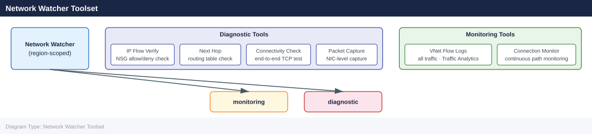

---
tags:
  - azure
  - networking
---
# Network Watcher

<div class="kb-summary">
Azure Network Watcher provides tools for monitoring, diagnosing, and gaining insights into network traffic in Azure. It is region-scoped and must be enabled in each region where you want to use it.

*Applies to: Azure*
</div>

## Network Watcher Toolset



## Enabling Network Watcher

```bash
# Network Watcher is auto-enabled when you create a VNet, but you can enable explicitly
az network watcher configure \
  --resource-group NetworkWatcherRG \
  --locations eastus \
  --enabled true

# List Network Watcher instances
az network watcher list \
  --output table
```


```text title="Expected output"
(no output — command completes silently)

Name                Location    ResourceGroup      ProvisioningState
------------------  ----------  -----------------  -------------------
NetworkWatcher_eastus  eastus      NetworkWatcherRG   Succeeded
NetworkWatcher_westus  westus      NetworkWatcherRG   Succeeded
NetworkWatcher_centralus  centralus   NetworkWatcherRG   Succeeded
NetworkWatcher_eastus2  eastus2     NetworkWatcherRG   Succeeded
```

!!! warning "Common errors"
    **`ResourceGroupNotFound`** — Verify the resource group exists with `az group list` and use the correct name.
    **`AuthorizationFailed: The client 'user@contoso.com' with object id 'xxxxxxxx-xxxx-xxxx-xxxx-xxxxxxxxxxxx' does not have authorization to perform action 'Microsoft.Network/networkWatchers/write'`** — Assign the Network Contributor or higher role to your user account on the subscription or resource group.
## Connection Troubleshoot

Tests the connectivity between a source (VM) and a destination (IP/FQDN/Azure resource) and returns latency and hop-by-hop path.

```bash
# Test connectivity from a VM to a public endpoint
az network watcher test-connectivity \
  --source-resource /subscriptions/<sub-id>/resourceGroups/myRG/providers/Microsoft.Compute/virtualMachines/myVM \
  --dest-address 8.8.8.8 \
  --dest-port 443 \
  --resource-group NetworkWatcherRG \
  --watcher-name myNetworkWatcher

# Test VM-to-VM connectivity
az network watcher test-connectivity \
  --source-resource /subscriptions/<sub-id>/resourceGroups/myRG/providers/Microsoft.Compute/virtualMachines/vm1 \
  --dest-resource /subscriptions/<sub-id>/resourceGroups/myRG/providers/Microsoft.Compute/virtualMachines/vm2 \
  --dest-port 22 \
  --resource-group NetworkWatcherRG \
  --watcher-name myNetworkWatcher
```


```text title="Expected output"
{
  "avgLatencyInMs": 24,
  "connectionStatus": "Reachable",
  "hops": [
    {
      "address": "10.0.1.4",
      "id": 1,
      "issues": [],
      "nextHopIds": [2],
      "resourceId": "/subscriptions/12345678-1234-1234-1234-123456789abc/resourceGroups/myRG/providers/Microsoft.Compute/virtualMachines/myVM",
      "type": "VirtualMachine"
    },
    {
      "address": "8.8.8.8",
      "id": 2,
      "issues": [],
      "nextHopIds": [],
      "type": "Internet"
    }
  ],
  "maxLatencyInMs": 31,
  "minLatencyInMs": 18,
  "probesFailed": 0,
  "probesSent": 100
}
{
  "avgLatencyInMs": 3,
  "connectionStatus": "Reachable",
  "hops": [
    {
      "address": "10.0.1.5",
      "id": 1,
      "issues": [],
      "nextHopIds": [2],
      "resourceId": "/subscriptions/12345678-1234-1234-1234-123456789abc/resourceGroups/myRG/providers/Microsoft.Compute/virtualMachines/vm1",
      "type": "VirtualMachine"
    },
    {
      "address": "10.0.2.6",
      "id": 2,
      "issues": [],
      "nextHopIds": [],
      "resourceId": "/subscriptions/12345678-1234-1234-1234-123456789abc/resourceGroups/myRG/providers/Microsoft.Compute/virtualMachines/vm2",
      "type": "VirtualMachine"
    }
  ],
  "maxLatencyInMs": 5,
  "minLatencyInMs": 2,
  "probesFailed": 0,
  "probesSent": 100
}
```

!!! warning "Common errors"
    **`ResourceNotFound: The resource '/subscriptions/<sub-id>/resourceGroups/myRG/providers/Microsoft.Compute/virtualMachines/myVM' could not be found.`** — Verify the subscription ID, resource group name, and VM name are correct using `az vm list --resource-group myRG`.
    **`The Network Watcher 'myNetworkWatcher' does not exist in resource group 'NetworkWatcherRG'.`** — Create the Network Watcher first with `az network watcher configure --resource-group NetworkWatcherRG --locations eastus --enabled true`.
    **`AuthorizationFailed: The client 'user@example.com' with object id '...' does not have authorization to perform action 'Microsoft.Network/networkWatchers/connectivityCheck/action'.`** — Assign the Network Contributor or higher role to your user on the Network Watcher resource group.
## IP Flow Verify

Checks whether a packet is allowed or denied by an NSG rule for a specific direction and 5-tuple (source IP, source port, destination IP, destination port, protocol).

```bash
# Check if inbound HTTPS traffic is allowed on a VM
az network watcher test-ip-flow \
  --direction Inbound \
  --local 10.0.1.4:443 \
  --protocol TCP \
  --remote 203.0.113.10:54321 \
  --vm myVM \
  --resource-group myRG \
  --nic myVM-nic

# Check outbound traffic
az network watcher test-ip-flow \
  --direction Outbound \
  --local 10.0.1.4:54321 \
  --protocol TCP \
  --remote 1.1.1.1:443 \
  --vm myVM \
  --resource-group myRG
```


```text title="Expected output"
{
  "access": "Allow",
  "ruleName": "AllowHTTPSInbound"
}
{
  "access": "Allow",
  "ruleName": "AllowAzureLoadBalancer"
}
```

!!! warning "Common errors"
    **`(ResourceNotFound) The Resource 'Microsoft.Compute/virtualMachines/myVM' under resource group 'myRG' was not found.`** — Verify the VM name and resource group name are correct with `az vm list --resource-group myRG`.
    **`(InvalidParameter) The NIC 'myVM-nic' is not associated with the VM 'myVM'.`** — Omit the `--nic` parameter and let Azure automatically detect the primary NIC, or confirm the NIC name with `az vm nic list --resource-group myRG --vm-name myVM`.
## Next Hop

Identifies the next hop for a packet from a VM, revealing the effective route (VNet Gateway, Internet, Virtual Appliance, etc.).

```bash
# Find next hop for traffic destined for 8.8.8.8
az network watcher show-next-hop \
  --resource-group myRG \
  --vm myVM \
  --source-ip 10.0.1.4 \
  --dest-ip 8.8.8.8

# Find next hop for traffic to on-prem
az network watcher show-next-hop \
  --resource-group myRG \
  --vm myVM \
  --source-ip 10.0.1.4 \
  --dest-ip 192.168.10.0
```


```text title="Expected output"
{
  "nextHopIpAddress": "10.0.1.1",
  "nextHopType": "VirtualAppliance",
  "routeTableId": "/subscriptions/12a34b56-c789-0d12-e345-f67890123456/resourceGroups/myRG/providers/Microsoft.Network/routeTables/myRouteTable"
}
{
  "nextHopIpAddress": "192.168.1.1",
  "nextHopType": "VirtualNetworkGateway",
  "routeTableId": "/subscriptions/12a34b56-c789-0d12-e345-f67890123456/resourceGroups/myRG/providers/Microsoft.Network/routeTables/myRouteTable"
}
```

!!! warning "Common errors"
    **`The VM 'myVM' could not be found in resource group 'myRG'.`** — Verify the VM name and resource group are correct using `az vm list --resource-group myRG`.
    **`Network Watcher is not enabled for region 'eastus'.`** — Enable Network Watcher for your region with `az network watcher configure --resource-group NetworkWatcherRG --locations eastus --enabled`.
    **`The source IP '10.0.1.4' is not assigned to any NIC on VM 'myVM'.`** — Confirm the source IP matches an actual NIC on the VM using `az vm nic list --resource-group myRG --vm-name myVM`.
## Packet Capture

Captures network packets on a VM for deep analysis. Output saved to storage or the VM locally.

```bash
# Start a packet capture (captures 100MB or 600s, whichever comes first)
az network watcher packet-capture create \
  --resource-group myRG \
  --vm myVM \
  --name myCapture \
  --storage-account /subscriptions/<sub-id>/resourceGroups/myRG/providers/Microsoft.Storage/storageAccounts/myStorageAccount \
  --time-limit 600 \
  --total-bytes-per-session 104857600

# Check capture status
az network watcher packet-capture show-status \
  --resource-group NetworkWatcherRG \
  --watcher-name myNetworkWatcher \
  --packet-capture-name myCapture

# Stop a capture
az network watcher packet-capture stop \
  --resource-group NetworkWatcherRG \
  --watcher-name myNetworkWatcher \
  --packet-capture-name myCapture
```


```text title="Expected output"
{
  "id": "/subscriptions/12345678-1234-1234-1234-123456789012/resourceGroups/myRG/providers/Microsoft.Network/networkWatchers/NetworkWatcher_eastus/packetCaptures/myCapture",
  "name": "myCapture",
  "etag": "W/\"a1b2c3d4-e5f6-7890-abcd-ef1234567890\"",
  "provisioningState": "Succeeded",
  "targetResourceId": "/subscriptions/12345678-1234-1234-1234-123456789012/resourceGroups/myRG/providers/Microsoft.Compute/virtualMachines/myVM",
  "storageLocation": {
    "storageId": "/subscriptions/12345678-1234-1234-1234-123456789012/resourceGroups/myRG/providers/Microsoft.Storage/storageAccounts/myStorageAccount",
    "storagePath": "https://mystorageaccount.blob.core.windows.net/network-watcher-logs/myCapture.cap"
  },
  "bytesReceivedPerSession": 104857600,
  "timeLimitInSeconds": 600
}
{
  "name": "myCapture",
  "id": "/subscriptions/12345678-1234-1234-1234-123456789012/resourceGroups/NetworkWatcherRG/providers/Microsoft.Network/networkWatchers/myNetworkWatcher/packetCaptures/myCapture",
  "captureStartTime": "2024-01-15T14:32:18.456Z",
  "packetCaptureStatus": "Running",
  "stopReason": null,
  "packetCaptureError": []
}
{
  "name": "myCapture",
  "id": "/subscriptions/12345678-1234-1234-1234-123456789012/resourceGroups/NetworkWatcherRG/providers/Microsoft.Network/networkWatchers/myNetworkWatcher/packetCaptures/myCapture",
  "captureStartTime": "2024-01-15T14:32:18.456Z",
  "packetCaptureStatus": "Stopped",
  "stopReason": "StoppedByUser",
  "packetCaptureError": []
}
```

!!! warning "Common errors"
    **`The resource with id /subscriptions/.../packetCaptures/myCapture could not be found.`** — Verify the packet capture name, watcher name, and resource group match the created capture exactly.
    **`The provided storage account does not have permission to write network watcher logs.`** — Ensure the storage account has a Blob Storage container named "network-watcher-logs" and the Network Watcher managed identity has Storage Blob Data Contributor role on the storage account.
    **`The virtual machine 'myVM' is not in a running state.`** — Start the target VM before initiating packet capture, as the VM must be running for the Network Watcher agent to function.
## Network Watcher Capabilities

| Capability            | Description                                               |
|-----------------------|-----------------------------------------------------------|
| IP Flow Verify        | NSG allow/deny check for a specific 5-tuple               |
| Connection Troubleshoot| End-to-end connectivity test with hop detail             |
| Next Hop              | Effective routing decision for a destination IP           |
| Packet Capture        | On-demand packet capture to storage or VM disk            |
| NSG Flow Logs         | Traffic analytics on NSG accept/deny decisions            |
| VPN Diagnostics       | VPN gateway and connection health checks                  |
| Topology              | Visual map of VNet resources and relationships            |

## Effective Security Rules

```bash
# Show effective NSG rules on a VM NIC
az network nic show-effective-nsg \
  --resource-group myRG \
  --name myVM-nic \
  --output json

# Show effective routes on a VM NIC
az network nic show-effective-route-table \
  --resource-group myRG \
  --name myVM-nic \
  --output table
```


```text title="Expected output"
{
  "networkInterfaces": [
    {
      "id": "/subscriptions/12345678-1234-1234-1234-123456789012/resourceGroups/myRG/providers/Microsoft.Network/networkInterfaces/myVM-nic",
      "effectiveSecurityRules": [
        {
          "name": "AllowVnetInBound",
          "protocol": "*",
          "sourcePortRange": "*",
          "destinationPortRange": "*",
          "sourceAddressPrefix": "VirtualNetwork",
          "destinationAddressPrefix": "VirtualNetwork",
          "access": "Allow",
          "priority": 65000,
          "direction": "Inbound"
        },
        {
          "name": "DenyAllInBound",
          "protocol": "*",
          "sourcePortRange": "*",
          "destinationPortRange": "*",
          "sourceAddressPrefix": "*",
          "destinationAddressPrefix": "*",
          "access": "Deny",
          "priority": 65500,
          "direction": "Inbound"
        }
      ]
    }
  ]
}

Source    State    NextHopType      NextHopIpAddress    AddressPrefix
--------  -------  ---------------  ------------------  ---------------
Default   Active   VnetLocal        10.0.1.4            10.0.0.0/16
Default   Active   VirtualNetworkGateway  10.0.254.1      192.168.0.0/16
User      Active   Internet         0.0.0.0/0           0.0.0.0/0
```

!!! warning "Common errors"
    **`The resource 'Microsoft.Network/networkInterfaces/myVM-nic' under resource group 'myRG' was not found.`** — Verify the NIC name and resource group name match exactly using `az network nic list --resource-group myRG`.
    **`Operation failed with status: 'Bad Request'. Details: Network interface must be attached to a virtual machine.`** — Ensure the NIC is currently attached to a running VM; detached or deallocated NICs cannot show effective rules.