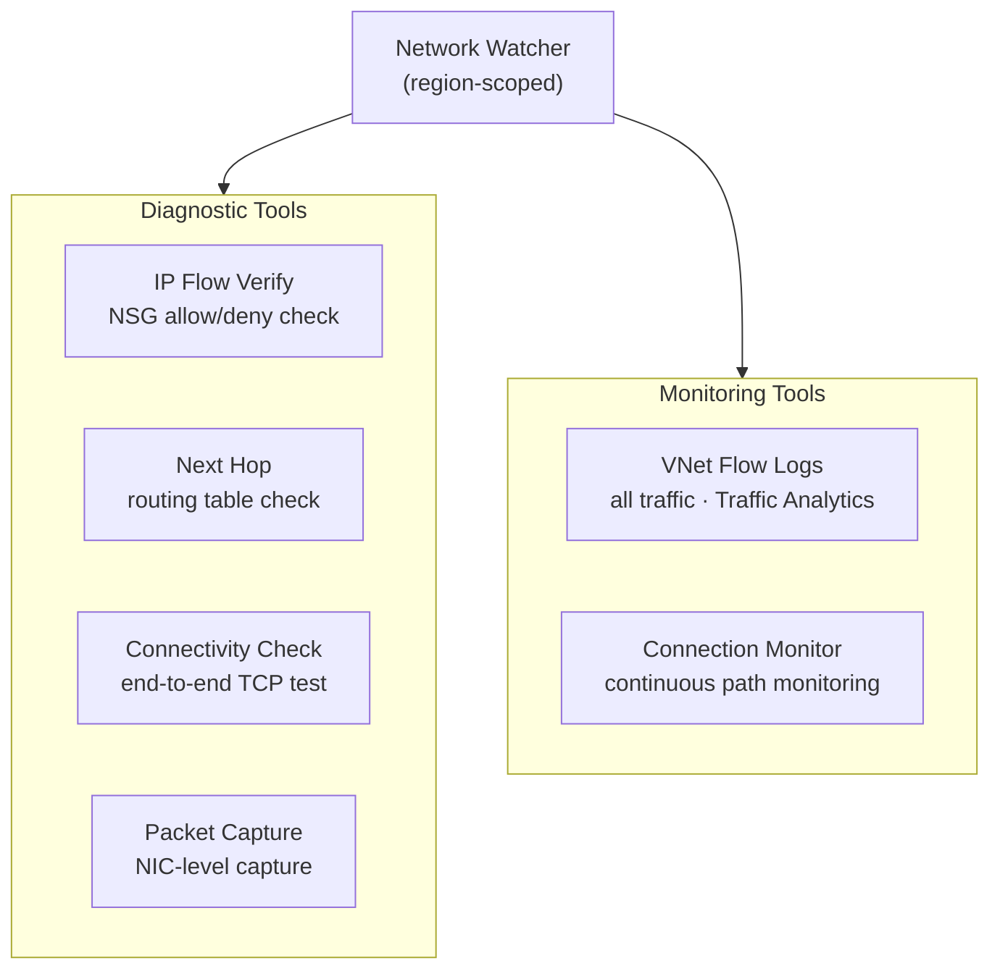

---
tags:
  - azure
  - networking
---
# Network Watcher


<div class="kb-summary">
Azure Network Watcher provides tools for monitoring, diagnosing, and gaining insights into network traffic in Azure. It is region-scoped and must be enabled in each region where you want to use it.

*Applies to: Azure*
</div>
```text
┌─────────────────────────────────────── Cloud Azure Networking ────────────────────────────────────────┐
│                                                                                                       │
│   ┌───────────────────────────────────────────────────────────────────────────────────────────────┐   │
│   │                             Azure: Cloud Azure Networking platform                            │   │
│   │                                  Protocols: Various protocols                                 │   │
│   │                     Management: Cloud Azure Networking management console                     │   │
│   │                Sections: Architecture · Operations · Security · Troubleshooting               │   │
│   └───────────────────────────────────────────────────────────────────────────────────────────────┘   │
│                                                                                                       │
│    Architecture → Operations → Security → Troubleshooting → Escalation                                │
│                                                                                                       │
│                  ▼                                ▼                                ▼                  │
│                                                                                                       │
│   ┌─────────────────────────────┐  ┌─────────────────────────────┐  ┌─────────────────────────────┐   │
│   │            Layer            │  │          Component          │  │            Notes            │   │
│   │             Core            │  │       Primary service       │  │        Main function        │   │
│   │          Management         │  │        Control plane        │  │         Admin access        │   │
│   │          Monitoring         │  │         Health/perf         │  │      Alerts/dashboards      │   │
│   │           Security          │  │         Auth/encrypt        │  │        Access control       │   │
│   │         Integration         │  │        APIs/plug-ins        │  │         Third-party         │   │
│   └─────────────────────────────┘  └─────────────────────────────┘  └─────────────────────────────┘   │
│                                                                                                       │
│                          ▼                                                 ▼                          │
│                                                                                                       │
│   ┌───────────────────────────────────────────────────────────────────────────────────────────────┐   │
│   │      Layer       │    Component     │      Function     │      Notes       │       Auth       │   │
│   │       Core       │ Primary service  │   Main function   │     See docs     │       RBAC       │   │
│   │    Management    │  Control plane   │    Admin access   │     See docs     │       RBAC       │   │
│   │    Monitoring    │   Health/perf    │  Alerts/dashboard │     See docs     │       RBAC       │   │
│   │     Security     │   Auth/encrypt   │   Access control  │     See docs     │       RBAC       │   │
│   └───────────────────────────────────────────────────────────────────────────────────────────────┘   │
│                                                                                                       │
│    Physical: Cloud Azure Networking infrastructure · management network · monitoring                  │
│                                                                                                       │
│    Key terms:                                                                                         │
│                                                                                                       │
│    Azure              = Cloud Azure Networking platform overview and core concepts                    │
│    Management         = management console and command-line interface for administration              │
│    Monitoring         = health and performance monitoring dashboards and alerting                     │
│    Automation         = REST API, scripting, and pipeline integration capabilities                    │
│    Security           = access control, authentication, and encryption configuration                  │
│    Backup             = backup and recovery procedures and schedule configuration                     │
│    Upgrade            = software version upgrades and firmware patching procedures                    │
│    Troubleshooting    = diagnostic procedures and common issue resolution steps                       │
│    Escalation         = vendor support escalation path and severity triage process                    │
│    Documentation      = vendor knowledge base and official product documentation                      │
│    Change management  = change ticket requirements for production modifications                       │
│    Audit log          = admin action logging for compliance and security review                       │
│                                                                                                       │
└───────────────────────────────────────────────────────────────────────────────────────────────────────┘
```


## Network Watcher Toolset



## Enabling Network Watcher

```bash
# Network Watcher is auto-enabled when you create a VNet, but you can enable explicitly
az network watcher configure \
  --resource-group NetworkWatcherRG \
  --locations eastus \
  --enabled true

# List Network Watcher instances
az network watcher list \
  --output table
```

## Connection Troubleshoot

Tests the connectivity between a source (VM) and a destination (IP/FQDN/Azure resource) and returns latency and hop-by-hop path.

```bash
# Test connectivity from a VM to a public endpoint
az network watcher test-connectivity \
  --source-resource /subscriptions/<sub-id>/resourceGroups/myRG/providers/Microsoft.Compute/virtualMachines/myVM \
  --dest-address 8.8.8.8 \
  --dest-port 443 \
  --resource-group NetworkWatcherRG \
  --watcher-name myNetworkWatcher

# Test VM-to-VM connectivity
az network watcher test-connectivity \
  --source-resource /subscriptions/<sub-id>/resourceGroups/myRG/providers/Microsoft.Compute/virtualMachines/vm1 \
  --dest-resource /subscriptions/<sub-id>/resourceGroups/myRG/providers/Microsoft.Compute/virtualMachines/vm2 \
  --dest-port 22 \
  --resource-group NetworkWatcherRG \
  --watcher-name myNetworkWatcher
```

## IP Flow Verify

Checks whether a packet is allowed or denied by an NSG rule for a specific direction and 5-tuple (source IP, source port, destination IP, destination port, protocol).

```bash
# Check if inbound HTTPS traffic is allowed on a VM
az network watcher test-ip-flow \
  --direction Inbound \
  --local 10.0.1.4:443 \
  --protocol TCP \
  --remote 203.0.113.10:54321 \
  --vm myVM \
  --resource-group myRG \
  --nic myVM-nic

# Check outbound traffic
az network watcher test-ip-flow \
  --direction Outbound \
  --local 10.0.1.4:54321 \
  --protocol TCP \
  --remote 1.1.1.1:443 \
  --vm myVM \
  --resource-group myRG
```

## Next Hop

Identifies the next hop for a packet from a VM, revealing the effective route (VNet Gateway, Internet, Virtual Appliance, etc.).

```bash
# Find next hop for traffic destined for 8.8.8.8
az network watcher show-next-hop \
  --resource-group myRG \
  --vm myVM \
  --source-ip 10.0.1.4 \
  --dest-ip 8.8.8.8

# Find next hop for traffic to on-prem
az network watcher show-next-hop \
  --resource-group myRG \
  --vm myVM \
  --source-ip 10.0.1.4 \
  --dest-ip 192.168.10.0
```

## Packet Capture

Captures network packets on a VM for deep analysis. Output saved to storage or the VM locally.

```bash
# Start a packet capture (captures 100MB or 600s, whichever comes first)
az network watcher packet-capture create \
  --resource-group myRG \
  --vm myVM \
  --name myCapture \
  --storage-account /subscriptions/<sub-id>/resourceGroups/myRG/providers/Microsoft.Storage/storageAccounts/myStorageAccount \
  --time-limit 600 \
  --total-bytes-per-session 104857600

# Check capture status
az network watcher packet-capture show-status \
  --resource-group NetworkWatcherRG \
  --watcher-name myNetworkWatcher \
  --packet-capture-name myCapture

# Stop a capture
az network watcher packet-capture stop \
  --resource-group NetworkWatcherRG \
  --watcher-name myNetworkWatcher \
  --packet-capture-name myCapture
```

## Network Watcher Capabilities

| Capability            | Description                                               |
|-----------------------|-----------------------------------------------------------|
| IP Flow Verify        | NSG allow/deny check for a specific 5-tuple               |
| Connection Troubleshoot| End-to-end connectivity test with hop detail             |
| Next Hop              | Effective routing decision for a destination IP           |
| Packet Capture        | On-demand packet capture to storage or VM disk            |
| NSG Flow Logs         | Traffic analytics on NSG accept/deny decisions            |
| VPN Diagnostics       | VPN gateway and connection health checks                  |
| Topology              | Visual map of VNet resources and relationships            |

## Effective Security Rules

```bash
# Show effective NSG rules on a VM NIC
az network nic show-effective-nsg \
  --resource-group myRG \
  --name myVM-nic \
  --output json

# Show effective routes on a VM NIC
az network nic show-effective-route-table \
  --resource-group myRG \
  --name myVM-nic \
  --output table
```
