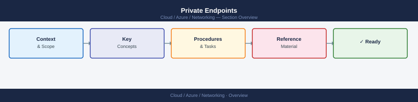
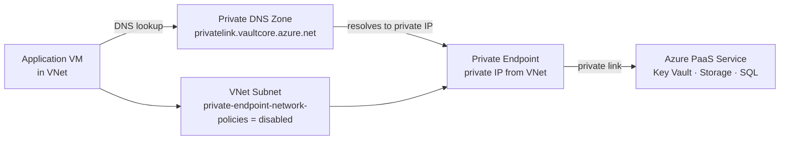

---
tags:
  - azure
  - networking
---
# Private Endpoints


<div class="kb-summary">
A Private Endpoint is a network interface that uses a private IP from your VNet to connect to an Azure PaaS service (e.g., Storage Account, Key Vault, SQL Database) over Azure Private Link. Traffic stays on the Microsoft backbone and never crosses the public internet.

*Applies to: Azure*
</div>



```d2
direction: right

center: "Azure" {shape: hexagon}
private_endpoint_architecture: "Private Endpoint Architecture" {shape: rectangle}
creating_a_private_endpoint: "Creating a Private Endpoint" {shape: rectangle}
supported_group_ids_subresources: "Supported Group IDs (subresources)" {shape: rectangle}
dns_configuration: "DNS Configuration" {shape: rectangle}
approving_a_private_endpoint_connect: "Approving a Private Endpoint Connection" {shape: rectangle}
network_policy_for_private_endpoints: "Network Policy for Private Endpoints" {shape: rectangle}

center -> private_endpoint_architecture
center -> creating_a_private_endpoint
center -> supported_group_ids_subresources
center -> dns_configuration
center -> approving_a_private_endpoint_connect
center -> network_policy_for_private_endpoints
```

## Private Endpoint Architecture



## Creating a Private Endpoint

```bash
# Disable network policy on the subnet (required before creating a private endpoint)
az network vnet subnet update \
  --resource-group myRG \
  --vnet-name myVNet \
  --name mySubnet \
  --disable-private-endpoint-network-policies true

# Create a private endpoint for a Key Vault
az network private-endpoint create \
  --name pe-keyvault \
  --resource-group myRG \
  --vnet-name myVNet \
  --subnet mySubnet \
  --private-connection-resource-id /subscriptions/<sub-id>/resourceGroups/myRG/providers/Microsoft.KeyVault/vaults/myKeyVault \
  --group-id vault \
  --connection-name pe-kv-connection \
  --location eastus

# Create a private endpoint for a Storage Account (blob)
az network private-endpoint create \
  --name pe-storage-blob \
  --resource-group myRG \
  --vnet-name myVNet \
  --subnet mySubnet \
  --private-connection-resource-id /subscriptions/<sub-id>/resourceGroups/myRG/providers/Microsoft.Storage/storageAccounts/myStorageAccount \
  --group-id blob \
  --connection-name pe-storage-connection \
  --location eastus
```

## Supported Group IDs (subresources)

| Service           | Group ID(s)                              |
|-------------------|------------------------------------------|
| Key Vault         | vault                                    |
| Storage Account   | blob, file, table, queue, dfs            |
| SQL Database      | sqlServer                                |
| Cosmos DB         | Sql, MongoDB, Cassandra, Gremlin, Table  |
| Service Bus       | namespace                                |
| Event Hub         | namespace                                |
| ACR               | registry                                 |
| App Service       | sites                                    |

## DNS Configuration

Private endpoints require DNS to resolve the service FQDN to the private IP. Azure automatically creates DNS records if you link the private DNS zone.

```bash
# Create a private DNS zone for Key Vault
az network private-dns zone create \
  --resource-group myRG \
  --name "privatelink.vaultcore.azure.net"

# Link the private DNS zone to the VNet
az network private-dns link vnet create \
  --resource-group myRG \
  --zone-name "privatelink.vaultcore.azure.net" \
  --name myVNetLink \
  --virtual-network myVNet \
  --registration-enabled false

# Create a DNS zone group on the private endpoint (auto-registers DNS record)
az network private-endpoint dns-zone-group create \
  --resource-group myRG \
  --endpoint-name pe-keyvault \
  --name default \
  --private-dns-zone /subscriptions/<sub-id>/resourceGroups/myRG/providers/Microsoft.Network/privateDnsZones/privatelink.vaultcore.azure.net \
  --zone-name privatelink.vaultcore.azure.net
```

## Approving a Private Endpoint Connection

For services with manual approval, the connection must be approved by the resource owner.

```bash
# List pending private endpoint connections on a Key Vault
az network private-endpoint-connection list \
  --resource-group myRG \
  --name myKeyVault \
  --type Microsoft.KeyVault/vaults \
  --output table

# Approve a pending connection
az network private-endpoint-connection approve \
  --resource-group myRG \
  --resource-name myKeyVault \
  --name <connection-name> \
  --type Microsoft.KeyVault/vaults \
  --description "Approved by infra team"

# Reject a connection
az network private-endpoint-connection reject \
  --resource-group myRG \
  --resource-name myKeyVault \
  --name <connection-name> \
  --type Microsoft.KeyVault/vaults \
  --description "Rejected - not approved"
```

## Network Policy for Private Endpoints

```bash
# Verify network policies are disabled on the subnet
az network vnet subnet show \
  --resource-group myRG \
  --vnet-name myVNet \
  --name mySubnet \
  --query privateEndpointNetworkPolicies \
  --output tsv

# List all private endpoints in a resource group
az network private-endpoint list \
  --resource-group myRG \
  --output table

# Show private endpoint NIC and IP
az network private-endpoint show \
  --resource-group myRG \
  --name pe-keyvault \
  --query "customDnsConfigs" \
  --output json
```

## Verification

```bash
# From a VM in the VNet, verify DNS resolves to private IP
# ssh into VM, then:
nslookup myKeyVault.vault.azure.net
# Expected: returns 10.x.x.x (private IP), not a public IP
```
