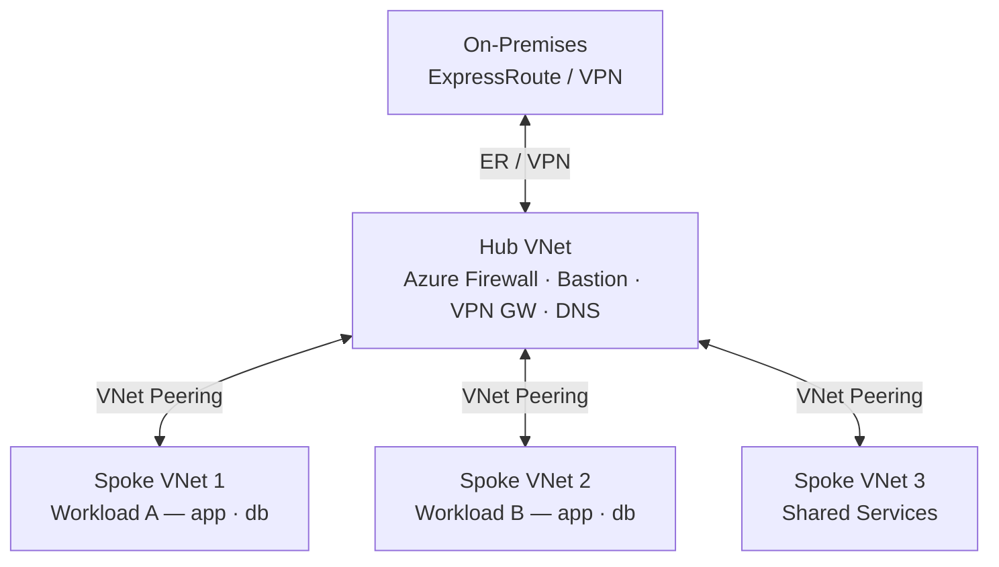

# Virtual Network

An Azure Virtual Network (VNet) is the fundamental building block for private networking in Azure. Resources in a VNet can communicate with each other, with on-premises networks, and with the internet, all controlled by routing and security policies.

## Hub-and-Spoke VNet Topology



## VNet Creation

```bash
# Create a VNet with a default subnet
az network vnet create \
  --resource-group myRG \
  --name myVNet \
  --address-prefix 10.0.0.0/16 \
  --subnet-name default \
  --subnet-prefix 10.0.0.0/24 \
  --location eastus

# Create a VNet with custom DNS servers
az network vnet create \
  --resource-group myRG \
  --name myVNet \
  --address-prefix 10.0.0.0/16 \
  --subnet-name default \
  --subnet-prefix 10.0.0.0/24 \
  --dns-servers 10.0.0.4 10.0.0.5

# List VNets in a subscription
az network vnet list \
  --output table

# Show VNet details
az network vnet show \
  --resource-group myRG \
  --name myVNet \
  --output json
```

## Address Space Management

```bash
# Add a second address space to an existing VNet
az network vnet update \
  --resource-group myRG \
  --name myVNet \
  --add addressSpace.addressPrefixes 10.1.0.0/16

# Update DNS server settings
az network vnet update \
  --resource-group myRG \
  --name myVNet \
  --dns-servers 10.0.0.4 10.0.0.5

# Remove a custom DNS server (reset to Azure default)
az network vnet update \
  --resource-group myRG \
  --name myVNet \
  --dns-servers ""
```

## VNet Peering

VNet peering connects two VNets so that resources can communicate using private IPs. Peering is non-transitive by default and can be regional or global (cross-region).

```bash
# Create peering from VNet A to VNet B
az network vnet peering create \
  --resource-group myRG \
  --name vnetA-to-vnetB \
  --vnet-name vnetA \
  --remote-vnet /subscriptions/<sub-id>/resourceGroups/myRG/providers/Microsoft.Network/virtualNetworks/vnetB \
  --allow-vnet-access true \
  --allow-forwarded-traffic true

# Create peering from VNet B to VNet A (peering is not automatically bidirectional)
az network vnet peering create \
  --resource-group myRG \
  --name vnetB-to-vnetA \
  --vnet-name vnetB \
  --remote-vnet /subscriptions/<sub-id>/resourceGroups/myRG/providers/Microsoft.Network/virtualNetworks/vnetA \
  --allow-vnet-access true \
  --allow-forwarded-traffic true

# List peerings for a VNet
az network vnet peering list \
  --resource-group myRG \
  --vnet-name vnetA \
  --output table
```

## Peering Flags

| Flag                         | Effect                                                  |
|------------------------------|---------------------------------------------------------|
| `--allow-vnet-access`        | Allow traffic between peered VNets                     |
| `--allow-forwarded-traffic`  | Accept forwarded traffic from the remote VNet's NVA    |
| `--allow-gateway-transit`    | Allow remote VNet to use this VNet's gateway            |
| `--use-remote-gateways`      | Use the remote VNet's gateway (hub-spoke pattern)       |

## VNet DNS Settings

| DNS Mode          | Configuration                                            |
|-------------------|----------------------------------------------------------|
| Azure default     | No DNS servers set — uses 168.63.129.16                  |
| Custom DNS        | Set VM/on-prem DNS IPs in VNet DNS server settings       |
| Private DNS zone  | Link the zone to the VNet for automatic resolution       |

```bash
# Check effective DNS configuration
az network vnet show \
  --resource-group myRG \
  --name myVNet \
  --query "dhcpOptions.dnsServers" \
  --output json
```

## Checking Available Address Space

```bash
# Check addresses available in a VNet
az network vnet check-ip-address \
  --resource-group myRG \
  --name myVNet \
  --ip-address 10.0.1.100

# List all subnets and their prefixes
az network vnet subnet list \
  --resource-group myRG \
  --vnet-name myVNet \
  --output table
```

## Tagging and Governance

```bash
# Tag a VNet for environment tracking
az network vnet update \
  --resource-group myRG \
  --name myVNet \
  --set tags.environment=production tags.owner=network-team

# Delete a VNet (removes all subnets — use with caution)
az network vnet delete \
  --resource-group myRG \
  --name myVNet \
  --yes
```
