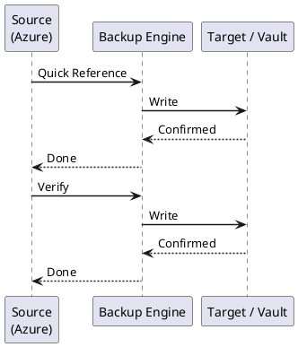

---
tags:
  - azure
  - operations
description: "Azure Backup and Restore — Recovery Services vault management, VM backup policies, snapshot schedules (hourly/daily/weekly), volume-level and file-level..."
---
# Azure — Backup & Restore

<div class="kb-summary">
Azure Backup and Restore — Recovery Services vault management, VM backup policies, snapshot schedules (hourly/daily/weekly), volume-level and file-level restore procedures, replication to DR site, and quarterly test restore cadence.

*Applies to: Azure*
</div>

> Azure Backup jobs, restore procedures, and Recovery Services vault management.

See also: [Backup & DR](../../backup-dr/index.md) for full Azure Backup and Azure Site Recovery reference.

---



## Before you begin

- **Access:** Admin credentials on all affected systems
- **Timing:** safe to run during business hours unless a step is marked ⚠ (causes interruption)
- **Dependencies:** no active upgrades or migrations on the same infrastructure
- **Logging:** capture command output — paste into the change record on completion

---

## Quick Reference

```bash
# List Recovery Services vaults
az backup vault list --output table

# List protected items in a vault
az backup item list --vault-name <vault> -g <rg> --output table

# List backup jobs (last 24h)
az backup job list --vault-name <vault> -g <rg> \
  --query '[?properties.startTime >= `2026-01-01`].[properties.jobType,properties.status,properties.startTime]' \
  -o table

# Check failed backup jobs
az backup job list --vault-name <vault> -g <rg> \
  --query '[?properties.status==`Failed`].[properties.jobType,properties.startTime,properties.errorDetails]' \
  -o table

# Trigger ad-hoc backup
az backup protection backup-now --vault-name <vault> -g <rg> \
  --item-name <vm-name> --container-name <container> \
  --backup-management-type AzureIaasVM --retain-until 2026-12-31

# Restore VM disk
az backup restore restore-disks \
  --vault-name <vault> -g <rg> \
  --container-name <container> --item-name <vm-name> \
  --rp-name <recovery-point-name> \
  --storage-account <staging-sa>
```


```text title="Expected output"
Name                          Location    ResourceGroup
-----------------------------  ----------  ---------------
prod-recovery-vault-eastus    eastus      rg-backup-prod
dr-recovery-vault-westus2     westus2     rg-backup-dr
dev-recovery-vault-eastus     eastus      rg-backup-dev

Name                          ProtectionState    HealthStatus
-----------------------------  ------------------  ----------------
web-server-01                 Protected           Healthy
db-server-02                  Protected           Healthy
app-vm-03                      Protected           Healthy

JobType              Status      StartTime
-------------------  ----------  -----------------------
BackupJob            Completed   2026-01-15T08:30:22Z
BackupJob            Completed   2026-01-14T08:15:45Z
BackupJob            Completed   2026-01-13T08:22:10Z

JobType              StartTime                ErrorDetails
-------------------  -----------------------  -----------------------------------------------
BackupJob            2026-01-12T06:45:30Z     Snapshot creation failed: insufficient disk space
BackupJob            2026-01-10T07:12:15Z     VM agent not responding

Backup job triggered with Job ID: 123e4567-e89b-12d3-a456-426614174000

Restore job initiated. Job ID: 987f6543-a21c-45d6-b789-123456789abc
```

!!! warning "Common errors"
    | Error | Fix |
    |---|---|
    | `ResourceNotFound : The Resource 'Microsoft.RecoveryServices/vaults/<vault>' under resource group '<rg>' was not found.` | Verify the vault name and resource group name are correct and the vault exists in the specified region. |
    | `InvalidParameterValue : The item name '<vm-name>' is not found in the vault.` | Ensure the VM is registered and protected in the vault; check the exact item name using `az backup item list`. |
    | `InvalidParameterValue : The recovery point '<recovery-point-name>' does not exist for the item.` | List available recovery points with `az backup recoverypoint list --vault-name <vault> -g <rg> --container-name <container> --item-name <vm-name>` and use a valid recovery point name. |
---

## Verify

- Confirm the operation completed without errors in the log or management UI
- Verify the expected state change is visible (service running, object created, config applied)
- Document the outcome in the change record

---

## See also

- [Azure — Procedures](../procedures/)
- [Azure — Health Checks](../health-checks/)
- [Azure — Common Issues](../../troubleshooting/common-issues/)
