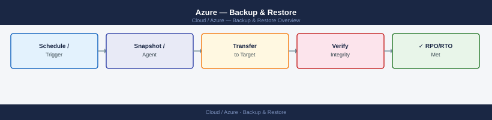
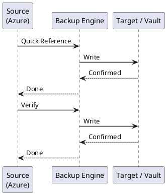

---
tags:
  - azure
  - operations
---
# Azure — Backup & Restore


<div class="kb-summary">
Azure Backup and Restore — Recovery Services vault management, VM backup policies, snapshot schedules (hourly/daily/weekly), volume-level and file-level restore procedures, replication to DR site, and quarterly test restore cadence.

*Applies to: Azure*
</div>



> Azure Backup jobs, restore procedures, and Recovery Services vault management.

See also: [Backup & DR](../../backup-dr/index.md) for full Azure Backup and Azure Site Recovery reference.

---



## Before you begin

- **Access:** Admin credentials on all affected systems
- **Timing:** safe to run during business hours unless a step is marked ⚠ (causes interruption)
- **Dependencies:** no active upgrades or migrations on the same infrastructure
- **Logging:** capture command output — paste into the change record on completion

---

## Quick Reference

```bash
# List Recovery Services vaults
az backup vault list --output table

# List protected items in a vault
az backup item list --vault-name <vault> -g <rg> --output table

# List backup jobs (last 24h)
az backup job list --vault-name <vault> -g <rg> \
  --query '[?properties.startTime >= `2026-01-01`].[properties.jobType,properties.status,properties.startTime]' \
  -o table

# Check failed backup jobs
az backup job list --vault-name <vault> -g <rg> \
  --query '[?properties.status==`Failed`].[properties.jobType,properties.startTime,properties.errorDetails]' \
  -o table

# Trigger ad-hoc backup
az backup protection backup-now --vault-name <vault> -g <rg> \
  --item-name <vm-name> --container-name <container> \
  --backup-management-type AzureIaasVM --retain-until 2026-12-31

# Restore VM disk
az backup restore restore-disks \
  --vault-name <vault> -g <rg> \
  --container-name <container> --item-name <vm-name> \
  --rp-name <recovery-point-name> \
  --storage-account <staging-sa>
```

---

## Verify

- Confirm the operation completed without errors in the log or management UI
- Verify the expected state change is visible (service running, object created, config applied)
- Document the outcome in the change record

---

## See also

- [Azure — Procedures](../procedures/)
- [Azure — Health Checks](../health-checks/)
- [Azure — Common Issues](../../troubleshooting/common-issues/)
