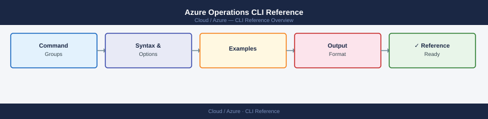

---
tags:
  - azure
  - operations
---
# Azure Operations CLI Reference


<div class="kb-summary">
A practical reference for day-to-day Azure CLI usage: authentication, subscription management, resource group operations, output formatting, and productivity tools.

*Applies to: Azure*
</div>



---

```d2
direction: right

center: "Azure" {shape: rectangle}
authentication_and_login: "Authentication and Login" {shape: rectangle}
account_and_subscription_management: "Account and Subscription Management" {shape: rectangle}
resource_group_operations: "Resource Group Operations" {shape: rectangle}
output_formats: "Output Formats" {shape: rectangle}
useful_queries_with_query: "Useful Queries with --query" {shape: rectangle}
az_find_command_discovery: "az find — Command Discovery" {shape: rectangle}

center -> authentication_and_login
center -> account_and_subscription_management
center -> resource_group_operations
center -> output_formats
center -> useful_queries_with_query
center -> az_find_command_discovery
```

## Before you begin

- **Access:** Admin credentials on all affected systems
- **Timing:** safe to run during business hours unless a step is marked ⚠ (causes interruption)
- **Dependencies:** no active upgrades or migrations on the same infrastructure
- **Logging:** capture command output — paste into the change record on completion

---

## Authentication and Login

```bash
# Interactive browser login
az login

# Login with a specific tenant
az login --tenant <tenant-id>

# Login with a service principal (client secret)
az login --service-principal \
  --username <app-id> \
  --password <client-secret> \
  --tenant <tenant-id>

# Login with a service principal (certificate)
az login --service-principal \
  --username <app-id> \
  --certificate /path/to/cert.pem \
  --tenant <tenant-id>

# Check current login status
az account show

# Logout
az logout
```

---

## Account and Subscription Management

```bash
# List all subscriptions accessible to the logged-in identity
az account list --output table

# Set the active subscription
az account set --subscription <subscription-id-or-name>

# Show current subscription details
az account show --output json

# List subscriptions with specific fields
az account list \
  --query "[].{Name:name, ID:id, State:state}" \
  --output table

# Get the current subscription ID
az account show --query id --output tsv
```

| Command | Description |
|---|---|
| `az account list` | List all subscriptions |
| `az account set` | Switch active subscription |
| `az account show` | Show active subscription |
| `az account get-access-token` | Get a bearer token for the current session |

---

## Resource Group Operations

```bash
# Create a resource group
az group create \
  --name <rg-name> \
  --location <region>

# List all resource groups
az group list --output table

# Show details of a specific resource group
az group show --name <rg-name>

# Delete a resource group (non-interactive)
az group delete --name <rg-name> --yes --no-wait

# List all resources inside a resource group
az resource list \
  --resource-group <rg-name> \
  --output table

# Move a resource between resource groups
az resource move \
  --destination-group <target-rg> \
  --ids <resource-id>

# Tag a resource group
az group update \
  --name <rg-name> \
  --tags env=prod owner=platform-team
```

---

## Output Formats

Azure CLI supports four primary output formats. The default is `json`.

```bash
# JSON (default, machine-readable)
az vm list --output json

# Table (human-readable)
az vm list --output table

# TSV (tab-separated, good for scripts)
az vm list --query "[].{Name:name}" --output tsv

# YAML
az vm list --output yaml

# Set a default output format
az configure --defaults output=table
```

| Format | Flag | Best For |
|---|---|---|
| JSON | `--output json` | Scripting, APIs, full data |
| Table | `--output table` | Human reading, quick review |
| TSV | `--output tsv` | Shell variable assignment, loops |
| YAML | `--output yaml` | Readability with structure |
| None | `--output none` | Suppress output in automation |

---

## Useful Queries with --query

The `--query` flag uses JMESPath syntax to filter and reshape output.

```bash
# Get only VM names and locations
az vm list --query "[].{Name:name, Location:location}" --output table

# Filter VMs by power state
az vm list \
  --resource-group <rg-name> \
  --query "[?powerState=='VM running'].name" \
  --output tsv

# Get the first public IP address
az network public-ip list \
  --query "[0].ipAddress" \
  --output tsv

# Get storage account names starting with 'prod'
az storage account list \
  --query "[?starts_with(name, 'prod')].name" \
  --output tsv

# Count all VMs across all resource groups
az vm list --query "length(@)"

# Get all resource IDs in a resource group
az resource list \
  --resource-group <rg-name> \
  --query "[].id" \
  --output tsv

# Extract a nested value (NIC private IP)
az vm show \
  --resource-group <rg-name> \
  --name <vm-name> \
  --query "networkProfile.networkInterfaces[0].id" \
  --output tsv
```

---

## az find — Command Discovery

`az find` uses AI-backed search to help locate the right command when the exact syntax is unclear.

```bash
# Find commands related to a topic
az find "backup vault"

# Find examples for a specific command
az find "az vm create"

# Find commands for a service
az find "key vault secret"
```

---

## az interactive — Autocomplete Shell

`az interactive` launches a rich shell with autocomplete, parameter hints, and inline documentation.

```bash
# Install the interactive extension
az extension add --name interactive

# Launch the interactive shell
az interactive
```

Inside the interactive shell:

| Key / Action | Effect |
|---|---|
| Tab | Autocomplete command or parameter |
| F1 | Open docs for the current command |
| `%` prefix | Run a native shell command |
| `exit` | Quit the interactive session |

---

## Configuration and Defaults

```bash
# Set default resource group and location
az configure --defaults group=<rg-name> location=eastus

# View current defaults
az configure --list-defaults

# Clear all defaults
az configure --defaults group='' location=''

# Upgrade CLI to the latest version
az upgrade

# Show the installed CLI version
az version
```

---

## Verify

- Confirm the operation completed without errors in the log or management UI
- Verify the expected state change is visible (service running, object created, config applied)
- Document the outcome in the change record

---

## See also

- [Azure — Procedures](../procedures/)
- [Azure — Scripts](../scripts/)
- [Azure — Health Checks](../health-checks/)
