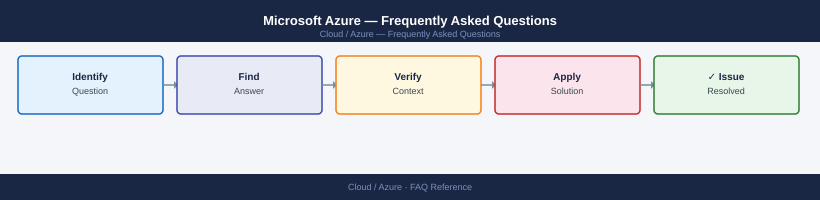

---
tags:
  - azure
  - faq
  - operations
---
# Microsoft Azure — Frequently Asked Questions

Common questions about Microsoft Azure operations, configuration, and troubleshooting. For step-by-step procedures, see the <a href="index.md">Operations</a> section.

## General

**Q: How do I check which Azure CLI version I am using?**
A: Run `az --version`. Update with `az upgrade`. The Azure PowerShell module version can be checked with `Get-Module Az -ListAvailable`.

**Q: How do I check the current Microsoft Azure version?**
A: `az --version`

## Configuration

**Q: What is the default Azure subscription context and how do I change it?**
A: The default subscription is set during `az login`. Change with `az account set --subscription '<subscription-id>'`. Verify with `az account show`. Use service principals for automation.

**Q: How do I enable Azure Defender for Servers?**
A: In the Azure Portal, go to Microsoft Defender for Cloud → Environment Settings → select the subscription → enable Defender for Servers Plan 2. This enables vulnerability assessment and JIT VM access.

## Operations

**Q: How do I update VMs in an Azure Scale Set without downtime?**
A: Use rolling upgrade policy on the VMSS (Manual, Automatic, or Rolling). For Rolling, set `maxBatchInstancePercent` and `pauseTimeBetweenBatches`. Trigger with `az vmss update-instances` or via ARM template.

**Q: What is the correct procedure to add a new Virtual Network?**
A: Create via Portal, Bicep, or Terraform. Plan address space carefully — Azure reserves 5 IPs per subnet. Enable VNet peering for cross-VNet connectivity. Use Private DNS Zones for private endpoint resolution.

## Troubleshooting

**Q: Azure Monitor shows 'DTU limit reached' for SQL Database. What does it mean?**
A: The SQL Database tier's DTU cap is being hit consistently. Upgrade to a higher DTU tier or switch to vCore model for more granular scaling. Check `sys.dm_db_resource_stats` for historical usage.

**Q: Application latency increased in Azure — where do I start?**
A: Check Azure Monitor metrics and Application Insights if instrumented. Review Azure SQL Query Performance Insight. Check App Service Plan CPU/memory. Review ExpressRoute or VPN gateway metrics.

## Backup and Recovery

**Q: How often should I back up Azure resources?**
A: Use Azure Backup for VMs (daily), SQL in VM, and Azure Files. Enable soft delete for Recovery Services Vault. Enable geo-redundant storage (GRS) for the vault. Test restores quarterly.

**Q: Can I restore a single file from an Azure VM backup without restoring the full VM?**
A: Yes — in Recovery Services Vault, select the restore point, choose 'File Recovery', mount the backup disk as an iSCSI target, and copy the specific files. The mount is available for 12 hours.

## See Also

- [Microsoft Azure Operations](index.md)
- [Microsoft Azure Troubleshooting](../../troubleshooting//)
