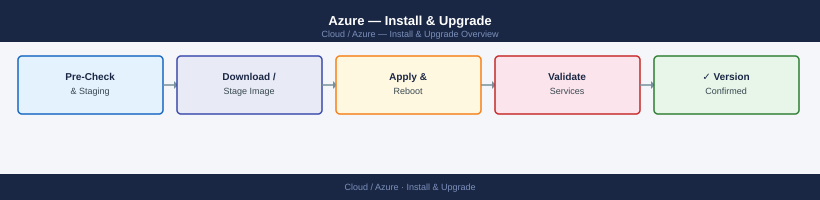
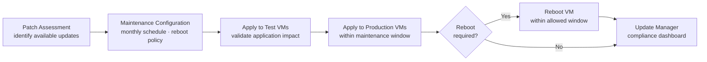

---
tags:
  - azure
  - operations
---
# Azure — Install & Upgrade


<div class="kb-summary">
VM image management, patching via Azure Update Manager, and service upgrades.

*Applies to: Azure*
</div>



---

```d2
direction: right

plan: "Plan" {shape: oval}
azure_vm_patching_workflow: "Azure VM Patching Workflow" {shape: rectangle}
vm_patching: "VM Patching" {shape: rectangle}
aks_upgrade: "AKS Upgrade" {shape: rectangle}
service_retirement_tracking: "Service Retirement Tracking" {shape: rectangle}
subscription_lifecycle: "Subscription Lifecycle" {shape: rectangle}
resource_group_expiry_nonproduction: "Resource Group Expiry (Non-Production)" {shape: rectangle}
validate: "Validate" {shape: oval}

plan -> azure_vm_patching_workflow
azure_vm_patching_workflow -> vm_patching
vm_patching -> aks_upgrade
aks_upgrade -> service_retirement_tracking
service_retirement_tracking -> subscription_lifecycle
subscription_lifecycle -> resource_group_expiry_nonproduction
resource_group_expiry_nonproduction -> validate
```

## Before you begin

- **Access:** Admin credentials on all affected systems
- **Timing:** safe to run during business hours unless a step is marked ⚠ (causes interruption)
- **Dependencies:** no active upgrades or migrations on the same infrastructure
- **Logging:** capture command output — paste into the change record on completion

---

## Azure VM Patching Workflow



## VM Patching

VM OS images are patched via Azure Update Manager on a monthly schedule:

```bash
# Check patch assessment for a VM
az maintenance assignment list --resource-group <rg> --provider-name Microsoft.Compute \
    --resource-type virtualMachines --resource-name <vm-name>

# Trigger on-demand assessment
az maintenance apply-updates create --resource-group <rg> \
    --provider-name Microsoft.Compute --resource-type virtualMachines --resource-name <vm-name>

# Check patch compliance status
az update-management-v2 assess --resource-group <rg> --vm-name <vm-name>
```

Patching waves:
- Development: Patch Tuesday + 1 day (auto-reboot allowed)
- Staging: Patch Tuesday + 3 days
- Production: maintenance window (manual reboot approval required)

## AKS Upgrade

AKS supports N-2 minor Kubernetes versions. Clusters on unsupported versions receive no patches:

```bash
# Check available upgrades
az aks get-upgrades --name <cluster-name> -g <rg> --output table

# Upgrade control plane first
az aks upgrade --name <cluster-name> -g <rg> --kubernetes-version 1.30 --no-wait

# Monitor upgrade progress
az aks show --name <cluster-name> -g <rg> --query 'provisioningState'

# Upgrade node pools after control plane completes
az aks nodepool upgrade --cluster-name <cluster-name> -g <rg> \
    --name <nodepool-name> --kubernetes-version 1.30
```

## Service Retirement Tracking

Monitor Azure service retirements:
- Azure Portal → Home → Recommendations → Retirements
- Subscribe to Azure Updates: [azure.microsoft.com/en-us/updates](https://azure.microsoft.com/en-us/updates/)
- Azure Advisor: Operational Excellence recommendations

```bash
# Check Advisor recommendations
az advisor recommendation list --category OperationalExcellence \
    --query "[?contains(shortDescription.solution, 'Upgrade')]"
```

## Subscription Lifecycle

```bash
# List all subscriptions in tenant
az account list --all --output table

# Move subscription to different management group
az management-group subscriptions add --name <sub-id> --management-group <mg-id>

# Decommission subscription
# 1. Cancel all resources
# 2. Remove from management groups
# 3. Cancel subscription (requires Billing Admin role)
az account set --subscription <sub-id>
# Cancel in Azure Portal → Subscriptions → Cancel
```

90-day hold period after cancellation before permanent deletion.

## Resource Group Expiry (Non-Production)

Tag non-production resource groups with expiry:

```bash
# Tag with expiry date
az group update --name <rg-name> --tags ExpiryDate=2026-12-31 Environment=dev

# Script to find expired RGs (run monthly)
az group list --query "[?tags.ExpiryDate < '$(date +%Y-%m-%d)'].{Name:name,ExpiryDate:tags.ExpiryDate}" --output table
```

Expired RGs are notified to owner 14 days before deletion.

## Entra ID App Registration Lifecycle

```bash
# List app registrations with credential expiry
az ad app list --all --query "[*].{AppId:appId,DisplayName:displayName}" -o table

# Check credential expiry dates
az ad app credential list --id <app-id>

# Rotate client secret
az ad app credential reset --id <app-id> --credential-description "rotation-$(date +%Y%m)"
```

Alert 60 days before credential expiry — expired credentials break CI/CD pipelines silently.

---

## Verify

- Confirm the operation completed without errors in the log or management UI
- Verify the expected state change is visible (service running, object created, config applied)
- Document the outcome in the change record

---

## See also

- [Azure — Deploy](../../deploy/)
