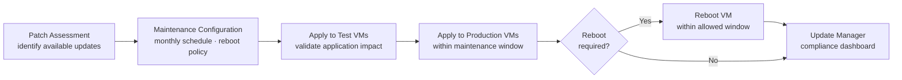

# Azure — Install & Upgrade


<div class="kb-summary">
> VM image management, patching via Azure Update Manager, and service upgrades.
</div>
```
┌──────────────────────────── Cloud Azure Operations — Install and Upgrade ─────────────────────────────┐
│                                                                                                       │
│   ┌───────────────────────────────────────────────────────────────────────────────────────────────┐   │
│   │          Azure installation and upgrade: deployment and version management procedures         │   │
│   │         Pre-upgrade: back up configuration, check compatibility, review release notes         │   │
│   │      Upgrade: rolling upgrade preserves service; non-disruptive on dual-controller arrays     │   │
│   │           Post-upgrade: verify all services running; run health check; notify users           │   │
│   └───────────────────────────────────────────────────────────────────────────────────────────────┘   │
│                                                                                                       │
│    Plan → backup config → upgrade staging → upgrade production → validate                             │
│                                                                                                       │
│                  ▼                                ▼                                ▼                  │
│                                                                                                       │
│   ┌─────────────────────────────┐  ┌─────────────────────────────┐  ┌─────────────────────────────┐   │
│   │            Layer            │  │          Component          │  │            Notes            │   │
│   │             Core            │  │       Primary service       │  │        Main function        │   │
│   │          Management         │  │        Control plane        │  │         Admin access        │   │
│   │          Monitoring         │  │         Health/perf         │  │      Alerts/dashboards      │   │
│   │           Security          │  │         Auth/encrypt        │  │        Access control       │   │
│   │         Integration         │  │        APIs/plug-ins        │  │         Third-party         │   │
│   └─────────────────────────────┘  └─────────────────────────────┘  └─────────────────────────────┘   │
│                                                                                                       │
│                          ▼                                                 ▼                          │
│                                                                                                       │
│   ┌───────────────────────────────────────────────────────────────────────────────────────────────┐   │
│   │      Layer       │    Component     │      Function     │      Notes       │       Auth       │   │
│   │       Core       │ Primary service  │   Main function   │     See docs     │       RBAC       │   │
│   │    Management    │  Control plane   │    Admin access   │     See docs     │       RBAC       │   │
│   │    Monitoring    │   Health/perf    │  Alerts/dashboard │     See docs     │       RBAC       │   │
│   │     Security     │   Auth/encrypt   │   Access control  │     See docs     │       RBAC       │   │
│   └───────────────────────────────────────────────────────────────────────────────────────────────┘   │
│                                                                                                       │
│    Physical: Cloud Azure Operations infrastructure · management network · monitoring                  │
│                                                                                                       │
│    Key terms:                                                                                         │
│                                                                                                       │
│    Azure              = Cloud Azure Operations platform overview and core concepts                    │
│    Management         = management console and command-line interface for administration              │
│    Monitoring         = health and performance monitoring dashboards and alerting                     │
│    Automation         = REST API, scripting, and pipeline integration capabilities                    │
│    Security           = access control, authentication, and encryption configuration                  │
│    Backup             = backup and recovery procedures and schedule configuration                     │
│    Upgrade            = software version upgrades and firmware patching procedures                    │
│    Troubleshooting    = diagnostic procedures and common issue resolution steps                       │
│    Escalation         = vendor support escalation path and severity triage process                    │
│    Documentation      = vendor knowledge base and official product documentation                      │
│    Change management  = change ticket requirements for production modifications                       │
│    Audit log          = admin action logging for compliance and security review                       │
│                                                                                                       │
└───────────────────────────────────────────────────────────────────────────────────────────────────────┘
```


---

## Azure VM Patching Workflow



## VM Patching

VM OS images are patched via Azure Update Manager on a monthly schedule:

```bash
# Check patch assessment for a VM
az maintenance assignment list --resource-group <rg> --provider-name Microsoft.Compute \
    --resource-type virtualMachines --resource-name <vm-name>

# Trigger on-demand assessment
az maintenance apply-updates create --resource-group <rg> \
    --provider-name Microsoft.Compute --resource-type virtualMachines --resource-name <vm-name>

# Check patch compliance status
az update-management-v2 assess --resource-group <rg> --vm-name <vm-name>
```

Patching waves:
- Development: Patch Tuesday + 1 day (auto-reboot allowed)
- Staging: Patch Tuesday + 3 days
- Production: maintenance window (manual reboot approval required)

## AKS Upgrade

AKS supports N-2 minor Kubernetes versions. Clusters on unsupported versions receive no patches:

```bash
# Check available upgrades
az aks get-upgrades --name <cluster-name> -g <rg> --output table

# Upgrade control plane first
az aks upgrade --name <cluster-name> -g <rg> --kubernetes-version 1.30 --no-wait

# Monitor upgrade progress
az aks show --name <cluster-name> -g <rg> --query 'provisioningState'

# Upgrade node pools after control plane completes
az aks nodepool upgrade --cluster-name <cluster-name> -g <rg> \
    --name <nodepool-name> --kubernetes-version 1.30
```

## Service Retirement Tracking

Monitor Azure service retirements:
- Azure Portal → Home → Recommendations → Retirements
- Subscribe to Azure Updates: [azure.microsoft.com/updates](https://azure.microsoft.com/updates)
- Azure Advisor: Operational Excellence recommendations

```bash
# Check Advisor recommendations
az advisor recommendation list --category OperationalExcellence \
    --query "[?contains(shortDescription.solution, 'Upgrade')]"
```

## Subscription Lifecycle

```bash
# List all subscriptions in tenant
az account list --all --output table

# Move subscription to different management group
az management-group subscriptions add --name <sub-id> --management-group <mg-id>

# Decommission subscription
# 1. Cancel all resources
# 2. Remove from management groups
# 3. Cancel subscription (requires Billing Admin role)
az account set --subscription <sub-id>
# Cancel in Azure Portal → Subscriptions → Cancel
```

90-day hold period after cancellation before permanent deletion.

## Resource Group Expiry (Non-Production)

Tag non-production resource groups with expiry:

```bash
# Tag with expiry date
az group update --name <rg-name> --tags ExpiryDate=2026-12-31 Environment=dev

# Script to find expired RGs (run monthly)
az group list --query "[?tags.ExpiryDate < '$(date +%Y-%m-%d)'].{Name:name,ExpiryDate:tags.ExpiryDate}" --output table
```

Expired RGs are notified to owner 14 days before deletion.

## Entra ID App Registration Lifecycle

```bash
# List app registrations with credential expiry
az ad app list --all --query "[*].{AppId:appId,DisplayName:displayName}" -o table

# Check credential expiry dates
az ad app credential list --id <app-id>

# Rotate client secret
az ad app credential reset --id <app-id> --credential-description "rotation-$(date +%Y%m)"
```

Alert 60 days before credential expiry — expired credentials break CI/CD pipelines silently.
