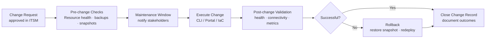

# Azure — Procedures


<div class="kb-summary">
> Day-to-day operational tasks across compute, storage, and networking.
</div>
```text
┌─────────────────────────── Cloud Azure Operations — Operational Procedures ───────────────────────────┐
│                                                                                                       │
│   ┌───────────────────────────────────────────────────────────────────────────────────────────────┐   │
│   │             Azure operational procedures: standard tasks for day-2 administration             │   │
│   │           Covers: provisioning, expansion, maintenance, DR testing, and decommission          │   │
│   │           Pre/post checks required for all maintenance activities affecting storage           │   │
│   │            All procedures require approved change management tickets in production            │   │
│   └───────────────────────────────────────────────────────────────────────────────────────────────┘   │
│                                                                                                       │
│    Open change → pre-check → execute → verify → post-check → close                                    │
│                                                                                                       │
│                  ▼                                ▼                                ▼                  │
│                                                                                                       │
│   ┌─────────────────────────────┐  ┌─────────────────────────────┐  ┌─────────────────────────────┐   │
│   │            Layer            │  │          Component          │  │            Notes            │   │
│   │             Core            │  │       Primary service       │  │        Main function        │   │
│   │          Management         │  │        Control plane        │  │         Admin access        │   │
│   │          Monitoring         │  │         Health/perf         │  │      Alerts/dashboards      │   │
│   │           Security          │  │         Auth/encrypt        │  │        Access control       │   │
│   │         Integration         │  │        APIs/plug-ins        │  │         Third-party         │   │
│   └─────────────────────────────┘  └─────────────────────────────┘  └─────────────────────────────┘   │
│                                                                                                       │
│                          ▼                                                 ▼                          │
│                                                                                                       │
│   ┌───────────────────────────────────────────────────────────────────────────────────────────────┐   │
│   │    Procedure     │    Pre-check     │       Steps       │      Verify      │    Post-check    │   │
│   │    Provision     │  Capacity free?  │   Create volume   │   Host access    │   Monitor I/O    │   │
│   │      Expand      │   Pool space?    │    Grow volume    │    FS resize     │   Verify size    │   │
│   │     Snapshot     │   Policy set?    │   Take snapshot   │   Snap listed    │   Consistency    │   │
│   │     Failover     │  Repl. in sync?  │    Break repl.    │    App online    │    Verify RTO    │   │
│   └───────────────────────────────────────────────────────────────────────────────────────────────┘   │
│                                                                                                       │
│    Physical: Cloud Azure Operations infrastructure · management network · monitoring                  │
│                                                                                                       │
│    Key terms:                                                                                         │
│                                                                                                       │
│    Azure              = Cloud Azure Operations platform overview and core concepts                    │
│    Management         = management console and command-line interface for administration              │
│    Monitoring         = health and performance monitoring dashboards and alerting                     │
│    Automation         = REST API, scripting, and pipeline integration capabilities                    │
│    Security           = access control, authentication, and encryption configuration                  │
│    Backup             = backup and recovery procedures and schedule configuration                     │
│    Upgrade            = software version upgrades and firmware patching procedures                    │
│    Troubleshooting    = diagnostic procedures and common issue resolution steps                       │
│    Escalation         = vendor support escalation path and severity triage process                    │
│    Documentation      = vendor knowledge base and official product documentation                      │
│    Change management  = change ticket requirements for production modifications                       │
│    Audit log          = admin action logging for compliance and security review                       │
│                                                                                                       │
└───────────────────────────────────────────────────────────────────────────────────────────────────────┘
```


---

## Azure Operations Change Flow



## Runbook Templates

A standard structure for Azure operational runbooks. Copy this template for any planned change, maintenance window, or incident response procedure.

---

### Runbook Metadata

Fill in this section before every runbook is executed.

| Field | Value |
|---|---|
| **Runbook Title** | |
| **Owner** | |
| **Secondary Contact** | |
| **Date / Change Window** | |
| **Change Request ID** | |
| **Risk Level** | Low / Medium / High |
| **Estimated Duration** | |
| **Rollback Possible?** | Yes / No |
| **Approval Sign-off** | |

```bash
# Confirm current subscription before starting
az account show --query "{Subscription:name, ID:id}" --output table

# Confirm operator identity
az ad signed-in-user show --query "userPrincipalName" --output tsv
```

---

### Pre-Checks

Validate the environment is in the expected state before making any changes.

```bash
# Verify resource group exists
az group show --name <rg-name> --query "properties.provisioningState" --output tsv

# Check current VM power state
az vm show \
  --resource-group <rg-name> \
  --name <vm-name> \
  --show-details \
  --query "powerState" --output tsv

# Verify disk is not currently attached to another VM
az disk show \
  --resource-group <rg-name> \
  --name <disk-name> \
  --query "diskState" --output tsv

# Check resource locks that might block the operation
az lock list --resource-group <rg-name> --output table

# Take a snapshot before destructive operations
az snapshot create \
  --resource-group <rg-name> \
  --name <snapshot-name> \
  --source <disk-id>
```

Pre-check checklist:

| Check | Expected Result | Actual Result | Pass/Fail |
|---|---|---|---|
| Subscription active | Enabled | | |
| Target resource exists | Present | | |
| No conflicting resource locks | None | | |
| Snapshot/backup taken | Completed | | |
| Downstream dependencies notified | Confirmed | | |

---

### Step-by-Step Procedure

Number each step. Record the actual command run and its output.

#### Step 1 — Stop the workload (if required)

```bash
az vm deallocate \
  --resource-group <rg-name> \
  --name <vm-name> \
  --no-wait

# Wait for deallocated state
az vm wait \
  --resource-group <rg-name> \
  --name <vm-name> \
  --custom "instanceView.statuses[?code=='PowerState/deallocated']"
```

#### Step 2 — Apply the change

```bash
# Example: resize a VM
az vm resize \
  --resource-group <rg-name> \
  --name <vm-name> \
  --size Standard_D4s_v3

# Example: update a tag
az resource update \
  --ids <resource-id> \
  --set tags.env=prod

# Example: attach a new managed disk
az vm disk attach \
  --resource-group <rg-name> \
  --vm-name <vm-name> \
  --name <disk-name>
```

#### Step 3 — Restart and verify

```bash
az vm start \
  --resource-group <rg-name> \
  --name <vm-name>

az vm show \
  --resource-group <rg-name> \
  --name <vm-name> \
  --show-details \
  --query "powerState" --output tsv
```

---

### Rollback Procedure

Document the exact reversal steps. If rollback is not possible, state the reason.

```bash
# Example: revert VM size
az vm resize \
  --resource-group <rg-name> \
  --name <vm-name> \
  --size Standard_D2s_v3

# Example: restore disk from snapshot
az disk create \
  --resource-group <rg-name> \
  --name <restored-disk-name> \
  --source <snapshot-id>

# Example: delete a newly created resource
az resource delete --ids <resource-id> --yes
```

Rollback decision criteria:

| Condition | Action |
|---|---|
| VM fails to start after resize | Revert to original SKU |
| Application health check fails | Restore from snapshot |
| Performance degradation > 20% | Rollback and escalate |
| Change window exceeded | Stop, rollback, reschedule |

---

### Validation

Run these checks after the procedure to confirm success.

```bash
# Confirm new VM size
az vm show \
  --resource-group <rg-name> \
  --name <vm-name> \
  --query "hardwareProfile.vmSize" --output tsv

# Confirm VM is running
az vm get-instance-view \
  --resource-group <rg-name> \
  --name <vm-name> \
  --query "instanceView.statuses[1].displayStatus" --output tsv

# Check activity log for errors in the last hour
az monitor activity-log list \
  --resource-group <rg-name> \
  --start-time $(date -u -d '1 hour ago' +%Y-%m-%dT%H:%M:%SZ) \
  --query "[?level=='Error'].{Time:eventTimestamp, Op:operationName.value, Status:status.value}" \
  --output table
```

---

### Sign-Off Checklist

| Item | Confirmed By | Time |
|---|---|---|
| Change applied successfully | | |
| Validation checks passed | | |
| Monitoring confirms no alerts | | |
| Snapshot/backup cleaned up (if temp) | | |
| Change request closed | | |
| Stakeholders notified | | |

---

## Azure Automation

Azure Automation — runbook automation, update management, configuration management (DSC), and change tracking.

### Key Capabilities

| Capability | Description |
|---|---|
| Runbooks | PowerShell, Python, or Graphical workflows |
| Update Management | Automated OS patching across Azure and on-premises VMs |
| Change Tracking | Track software, file, registry, and service changes |
| DSC (State Config) | Desired State Configuration for VM compliance |
| Shared resources | Credentials, variables, schedules, connections, modules |

### Common Azure CLI Commands

```bash
# List automation accounts
az automation account list \
  --query '[*].{Name:name,RG:resourceGroup,Location:location,State:state}' -o table

# List runbooks
az automation runbook list -g <rg> --automation-account-name <aa-name> \
  --query '[*].{Name:name,Type:runbookType,State:state,Modified:lastModifiedTime}' -o table

# Start a runbook job
az automation job create -g <rg> --automation-account-name <aa-name> \
  --runbook-name <runbook-name> \
  --parameters '{"param1":"value1"}'

# List recent jobs for a runbook
az automation job list -g <rg> --automation-account-name <aa-name> \
  --query '[?runbook.name==`<runbook-name>`].{ID:jobId,Status:status,Start:startTime,End:endTime}' -o table

# Get job output
az automation job get-output -g <rg> --automation-account-name <aa-name> \
  --id <job-id>

# List schedules
az automation schedule list -g <rg> --automation-account-name <aa-name> \
  --query '[*].{Name:name,Enabled:isEnabled,Frequency:frequency,NextRun:nextRun}' -o table
```

### Update Management

```bash
# List VMs onboarded to Update Management
az automation software-update-configuration list -g <rg> --automation-account-name <aa-name> \
  --query '[*].{Name:name,Schedule:scheduleInfo.frequency,Included:updateConfiguration.azureVirtualMachines}' -o table

# View update assessment results
az automation software-update-configuration machine-run list \
  -g <rg> --automation-account-name <aa-name> \
  --filter "status eq 'Failed'" \
  --query '[*].{VM:targetComputerId,Status:status,Failed:softwareUpdateConfigurationName}' -o table
```

### Runbook Example — Restart Azure VM

```powershell
param(
    [string]$ResourceGroupName,
    [string]$VMName
)

# Use system-assigned managed identity (no stored credentials needed)
Connect-AzAccount -Identity

$vm = Get-AzVM -ResourceGroupName $ResourceGroupName -Name $VMName
if ($vm.PowerState -eq "VM running") {
    Restart-AzVM -ResourceGroupName $ResourceGroupName -Name $VMName
    Write-Output "Restarted VM: $VMName"
} else {
    Write-Output "VM $VMName is not in running state: $($vm.PowerState)"
}
```

### Hybrid Runbook Worker

For running runbooks against on-premises systems:
```bash
# List hybrid worker groups
az automation hybrid-runbook-worker-group list -g <rg> --automation-account-name <aa-name> \
  --query '[*].{Name:name,Type:groupType}' -o table
```

### Troubleshooting

| Symptom | Check | Action |
|---|---|---|
| Runbook job failing | Job output / exception | `az automation job get-output` — check error details |
| Authentication failure in runbook | Managed identity assigned? | Assign automation account managed identity a role on the target resource |
| Scheduled job not running | Schedule enabled? | Verify schedule `isEnabled=true`; check next run time |
| Update Management not scanning VM | Log Analytics agent | Verify MMA/AMA agent is healthy and workspace matches automation account |
| Hybrid Runbook Worker offline | Worker process | Restart `HybridRunbookWorkerService` on the on-premises host |

---

## Create a Virtual Machine (Azure CLI)

```bash
# Set common variables
RG=my-resource-group
LOCATION=uksouth
VM=my-vm-01

# Create the resource group if it does not exist
az group create --name $RG --location $LOCATION

# Create the VM
az vm create \
  --resource-group $RG \
  --name $VM \
  --image Ubuntu2204 \
  --size Standard_D2s_v3 \
  --admin-username azureuser \
  --ssh-key-values ~/.ssh/id_rsa.pub \
  --vnet-name my-vnet \
  --subnet my-subnet \
  --nsg my-nsg \
  --public-ip-sku Standard \
  --tags Env=prod Owner=ops

# Verify the VM is running
az vm show -g $RG -n $VM \
  --show-details \
  --query '{Name:name,State:powerState,IP:publicIps,PrivateIP:privateIps}' \
  -o table
```

Common `--size` options:

| Series | Use case |
|---|---|
| Standard_B2s | Dev/test, burstable |
| Standard_D2s_v3 | General purpose |
| Standard_F4s_v2 | CPU-intensive |
| Standard_E4s_v3 | Memory-intensive |

---

## Resize a Virtual Machine

```bash
RG=my-resource-group
VM=my-vm-01

# --- Step 1: Check available sizes in the VM's current region/zone ---
az vm list-vm-resize-options \
  --resource-group $RG \
  --name $VM \
  --query '[].name' -o table

# --- Step 2: Deallocate (stop + release compute) ---
az vm deallocate \
  --resource-group $RG \
  --name $VM

# Wait for deallocated state
az vm wait \
  --resource-group $RG \
  --name $VM \
  --custom "instanceView.statuses[?code=='PowerState/deallocated']"

# --- Step 3: Resize ---
az vm resize \
  --resource-group $RG \
  --name $VM \
  --size Standard_D4s_v3

# --- Step 4: Start ---
az vm start \
  --resource-group $RG \
  --name $VM

# Confirm new size
az vm show \
  --resource-group $RG \
  --name $VM \
  --query "hardwareProfile.vmSize" -o tsv
```

> If the target size is unavailable in the current cluster, Azure may move the VM to a new host during resize. Confirm the application restarts cleanly after the resize.

---

## Create and Attach a Managed Disk

```bash
RG=my-resource-group
VM=my-vm-01
DISK=data-disk-01

# Get the AZ of the target VM (disk must match)
AZ=$(az vm show -g $RG -n $VM --query 'zones[0]' -o tsv)

# Create a Premium SSD managed disk
az disk create \
  --resource-group $RG \
  --name $DISK \
  --size-gb 256 \
  --sku Premium_LRS \
  --zone $AZ \
  --tags Purpose=data Owner=ops

# Attach to the VM
az vm disk attach \
  --resource-group $RG \
  --vm-name $VM \
  --name $DISK

# --- In-guest: extend partition (SSH into the VM) ---
# List block devices
lsblk

# Partition and format the new disk (example: /dev/sdc)
sudo parted /dev/sdc --script mklabel gpt mkpart primary xfs 0% 100%
sudo mkfs.xfs /dev/sdc1

# Mount
sudo mkdir -p /data
sudo mount /dev/sdc1 /data

# Persist across reboots
echo '/dev/sdc1 /data xfs defaults,nofail 0 2' | sudo tee -a /etc/fstab

# Verify disk is visible on the VM
az vm show -g $RG -n $VM \
  --query 'storageProfile.dataDisks[].{Name:name,LUN:lun,SizeGB:diskSizeGb,SKU:managedDisk.storageAccountType}' \
  -o table
```

---

## Create a Network Security Group Rule

```bash
RG=my-resource-group
NSG=my-nsg

# Inbound rule — allow HTTPS from anywhere
az network nsg rule create \
  --resource-group $RG \
  --nsg-name $NSG \
  --name Allow-HTTPS-Inbound \
  --priority 100 \
  --direction Inbound \
  --access Allow \
  --protocol Tcp \
  --source-address-prefixes '*' \
  --source-port-ranges '*' \
  --destination-address-prefixes '*' \
  --destination-port-ranges 443

# Inbound rule — allow SSH from a specific IP range
az network nsg rule create \
  --resource-group $RG \
  --nsg-name $NSG \
  --name Allow-SSH-CorpNet \
  --priority 110 \
  --direction Inbound \
  --access Allow \
  --protocol Tcp \
  --source-address-prefixes 10.0.0.0/8 \
  --destination-port-ranges 22

# Outbound rule — deny internet egress for sensitive VMs
az network nsg rule create \
  --resource-group $RG \
  --nsg-name $NSG \
  --name Deny-Internet-Outbound \
  --priority 4000 \
  --direction Outbound \
  --access Deny \
  --protocol '*' \
  --source-address-prefixes 'VirtualNetwork' \
  --destination-address-prefixes Internet \
  --destination-port-ranges '*'

# Verify current rules
az network nsg rule list \
  --resource-group $RG \
  --nsg-name $NSG \
  --query '[].{Name:name,Priority:priority,Dir:direction,Access:access,Protocol:protocol,DestPort:destinationPortRange}' \
  -o table
```

Priority rules: lower number = higher priority. Range is 100–4096. Azure evaluates rules in priority order and stops at the first match.

---

## Configure Azure Backup for a VM

```bash
VAULT=my-recovery-vault
RG=my-resource-group
VM=my-vm-01
POLICY=DefaultPolicy

# Create Recovery Services vault (if not existing)
az backup vault create \
  --resource-group $RG \
  --name $VAULT \
  --location uksouth

# List available backup policies
az backup policy list \
  --resource-group $RG \
  --vault-name $VAULT \
  --query '[].name' -o table

# Enable backup protection for the VM
az backup protection enable-for-vm \
  --resource-group $RG \
  --vault-name $VAULT \
  --vm $VM \
  --policy-name $POLICY

# Verify protection status
az backup item show \
  --resource-group $RG \
  --vault-name $VAULT \
  --container-name "iaasvmcontainerv2;$RG;$VM" \
  --name "vm;iaasvmcontainerv2;$RG;$VM" \
  --backup-management-type AzureIaasVM \
  --query '{VM:properties.friendlyName,Status:properties.protectionStatus,LastBackup:properties.lastBackupTime}' \
  -o table

# Trigger an on-demand backup
az backup protection backup-now \
  --resource-group $RG \
  --vault-name $VAULT \
  --container-name "iaasvmcontainerv2;$RG;$VM" \
  --item-name "vm;iaasvmcontainerv2;$RG;$VM" \
  --backup-management-type AzureIaasVM \
  --retain-until 2025-12-31
```

---

## Set Up Azure Monitor Alert

```bash
RG=my-resource-group
VM=my-vm-01

# Get the VM resource ID
VM_ID=$(az vm show -g $RG -n $VM --query id -o tsv)

# Create an action group (email notification target)
az monitor action-group create \
  --resource-group $RG \
  --name ops-email-group \
  --short-name opsalerts \
  --action email ops-lead ops-lead@example.com

# Get action group resource ID
AG_ID=$(az monitor action-group show -g $RG -n ops-email-group --query id -o tsv)

# Create a metrics alert — CPU > 80% for 5 minutes
az monitor metrics alert create \
  --name "High-CPU-$VM" \
  --resource-group $RG \
  --scopes $VM_ID \
  --condition "avg Percentage CPU > 80" \
  --window-size 5m \
  --evaluation-frequency 1m \
  --severity 2 \
  --description "CPU utilisation exceeded 80% for 5 minutes" \
  --action $AG_ID

# Create a metrics alert — Available Memory < 1 GB
az monitor metrics alert create \
  --name "Low-Memory-$VM" \
  --resource-group $RG \
  --scopes $VM_ID \
  --condition "avg Available Memory Bytes < 1073741824" \
  --window-size 5m \
  --evaluation-frequency 1m \
  --severity 2 \
  --action $AG_ID

# Verify alerts
az monitor metrics alert list \
  --resource-group $RG \
  --query '[].{Name:name,Severity:severity,Enabled:enabled,Condition:criteria.allOf[0].metricName}' \
  -o table
```

Severity levels: 0 (Critical) → 1 (Error) → 2 (Warning) → 3 (Informational) → 4 (Verbose).

---

## Create a Storage Account and Container

```bash
RG=my-resource-group
SA=mystorageacct$RANDOM   # must be globally unique, 3-24 lowercase alphanumeric
CONTAINER=app-data

# Create storage account
az storage account create \
  --resource-group $RG \
  --name $SA \
  --location uksouth \
  --kind StorageV2 \
  --sku Standard_LRS \
  --access-tier Hot \
  --min-tls-version TLS1_2 \
  --allow-blob-public-access false \
  --https-only true

# Get the storage account key
SA_KEY=$(az storage account keys list -g $RG -n $SA --query '[0].value' -o tsv)

# Create a private blob container
az storage container create \
  --name $CONTAINER \
  --account-name $SA \
  --account-key $SA_KEY \
  --public-access off

# Enable blob versioning
az storage account blob-service-properties update \
  --resource-group $RG \
  --account-name $SA \
  --enable-versioning true

# Verify
az storage account show \
  --resource-group $RG \
  --name $SA \
  --query '{Name:name,SKU:sku.name,Kind:kind,AccessTier:accessTier,HTTPS:supportsHttpsTrafficOnly}' \
  -o table

az storage container list \
  --account-name $SA \
  --account-key $SA_KEY \
  --query '[].{Name:name,LeaseState:properties.leaseState,PublicAccess:properties.publicAccess}' \
  -o table
```

| SKU | Replication | Use case |
|---|---|---|
| Standard_LRS | 3x within one datacenter | Dev/test, low cost |
| Standard_ZRS | 3x across availability zones | Zone-resilient |
| Standard_GRS | LRS + async copy to paired region | Regional DR |
| Premium_LRS | SSD-backed, low latency | High-throughput workloads |

---

## Configure Entra ID (Azure AD) Group and Role Assignment

```bash
RG=my-resource-group

# --- Step 1: Create a security group in Entra ID ---
az ad group create \
  --display-name "Platform-Ops-Team" \
  --mail-nickname "platform-ops-team" \
  --description "Azure platform operations team — prod subscription access"

# Get the group object ID
GROUP_ID=$(az ad group show --group "Platform-Ops-Team" --query id -o tsv)

# --- Step 2: Add members to the group ---
USER_ID=$(az ad user show --id user@example.com --query id -o tsv)
az ad group member add --group "Platform-Ops-Team" --member-id $USER_ID

# --- Step 3: Assign a built-in RBAC role at subscription scope ---
SUB_ID=$(az account show --query id -o tsv)

az role assignment create \
  --assignee-object-id $GROUP_ID \
  --assignee-principal-type Group \
  --role "Contributor" \
  --scope "/subscriptions/$SUB_ID"

# --- Step 4: Assign a role at resource group scope (more restrictive) ---
az role assignment create \
  --assignee-object-id $GROUP_ID \
  --assignee-principal-type Group \
  --role "Virtual Machine Contributor" \
  --scope "/subscriptions/$SUB_ID/resourceGroups/$RG"

# Verify role assignments for the group
az role assignment list \
  --assignee $GROUP_ID \
  --query '[].{Role:roleDefinitionName,Scope:scope}' \
  -o table
```

Common built-in roles:

| Role | Scope of access |
|---|---|
| Owner | Full access including role assignments |
| Contributor | Full CRUD except role assignments |
| Reader | Read-only |
| Virtual Machine Contributor | Create/manage VMs, not the VNet or Storage |
| Storage Blob Data Contributor | Read/write blob data (not account management) |
