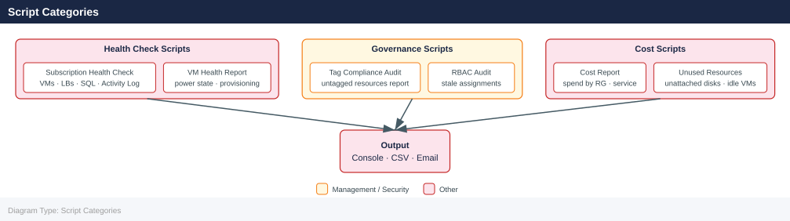

---
tags:
  - azure
  - operations
---
# Azure — Scripts

<div class="kb-summary">
Azure operational scripts: PowerShell and `az cli` automation for resource provisioning, VM scale operations, Key Vault secret rotation, and policy compliance reporting.

*Applies to: Azure*
</div>

---

## Before you begin

- **Access:** Admin credentials on all affected systems
- **Timing:** safe to run during business hours unless a step is marked ⚠ (causes interruption)
- **Dependencies:** no active upgrades or migrations on the same infrastructure
- **Logging:** capture command output — paste into the change record on completion

---

## Script Categories



## Azure Subscription Health Check

Prints a formatted health report covering VMs, load balancers, SQL servers, and recent critical activity log events. Exits non-zero if any critical events are found.

```bash
#!/bin/bash
set -euo pipefail

SUBSCRIPTION_ID="${SUBSCRIPTION_ID:-$(az account show --query id -o tsv)}"
RESOURCE_GROUP="${RESOURCE_GROUP:-}"

BOLD="\033[1m"
RED="\033[0;31m"
GREEN="\033[0;32m"
RESET="\033[0m"

echo -e "${BOLD}=== Azure Subscription Health Check ===${RESET}"
echo "Subscription : ${SUBSCRIPTION_ID}"
[[ -n "${RESOURCE_GROUP}" ]] && echo "Resource Group: ${RESOURCE_GROUP}"
echo "Time         : $(date -u +"%Y-%m-%dT%H:%M:%SZ")"
echo

# --- Account ---
echo -e "${BOLD}--- Active Account ---${RESET}"
az account show --subscription "${SUBSCRIPTION_ID}" \
  --query '{name:name, id:id, tenantId:tenantId, state:state}' -o table
echo

# --- Virtual Machines ---
echo -e "${BOLD}--- Virtual Machines ---${RESET}"
if [[ -n "${RESOURCE_GROUP}" ]]; then
  az vm list \
    --subscription "${SUBSCRIPTION_ID}" \
    --resource-group "${RESOURCE_GROUP}" \
    --show-details \
    --query '[*].[name,resourceGroup,powerState,location,hardwareProfile.vmSize]' \
    -o table
else
  az vm list \
    --subscription "${SUBSCRIPTION_ID}" \
    --show-details \
    --query '[*].[name,resourceGroup,powerState,location,hardwareProfile.vmSize]' \
    -o table
fi
echo

# --- Load Balancers ---
echo -e "${BOLD}--- Load Balancers ---${RESET}"
az network lb list \
  --subscription "${SUBSCRIPTION_ID}" \
  --query '[*].[name,resourceGroup,location,sku.name,provisioningState]' \
  -o table
echo

# --- SQL Servers ---
echo -e "${BOLD}--- SQL Servers ---${RESET}"
az sql server list \
  --subscription "${SUBSCRIPTION_ID}" \
  --query '[*].[name,resourceGroup,location,fullyQualifiedDomainName,state]' \
  -o table
echo

# --- Critical Activity Log ---
echo -e "${BOLD}--- Recent Critical Activity Log Events (last 20) ---${RESET}"
CRITICAL_EVENTS=$(az monitor activity-log list \
  --subscription "${SUBSCRIPTION_ID}" \
  --max-events 20 \
  --filter "level eq 'Critical'" \
  --query '[*].[eventTimestamp,operationName.localizedValue,resourceGroup,status.localizedValue,caller]' \
  -o table)

echo "${CRITICAL_EVENTS}"
CRITICAL_COUNT=$(echo "${CRITICAL_EVENTS}" | grep -c -v "^-\|^Event\|^$" || true)

echo
if [[ "${CRITICAL_COUNT}" -gt 0 ]]; then
  echo -e "${RED}ALERT: ${CRITICAL_COUNT} critical event(s) found in activity log.${RESET}"
  exit 1
fi

echo -e "${GREEN}Health check PASSED — no critical events detected.${RESET}"
```


```text title="Expected output"
=== Azure Subscription Health Check ===
Subscription : 550e8400-e29b-41d4-a716-446655440000
Time         : 2024-01-15T14:32:47Z

--- Active Account ---
Name                State    Id                                   TenantId
------------------  -------  ------------------------------------  ------------------------------------
Production Account  Enabled  550e8400-e29b-41d4-a716-446655440000  72f988bf-86f1-41af-91ab-2d7cd011db47

--- Virtual Machines ---
Name              ResourceGroup      PowerState    Location      VmSize
----------------  -----------------  -----------   -----------   ----------------
prod-web-01       prod-rg            VM running    eastus        Standard_D4s_v3
prod-web-02       prod-rg            VM running    eastus        Standard_D4s_v3
prod-db-01        prod-rg            VM running    eastus2       Standard_E8s_v3
staging-app-01    staging-rg         VM running    westus2       Standard_D2s_v3

--- Load Balancers ---
Name                  ResourceGroup      Location    Sku       ProvisioningState
--------------------  -----------------  ----------  --------  -------------------
prod-lb-external      prod-rg            eastus      Standard  Succeeded
prod-lb-internal      prod-rg            eastus      Standard  Succeeded

--- SQL Servers ---
Name                ResourceGroup      Location    FullyQualifiedDomainName              State
------------------  -----------------  ----------  ------------------------------------  -------
prod-sql-01         prod-rg            eastus      prod-sql-01.database.windows.net     Ready
prod-sql-02         prod-rg            eastus2     prod-sql-02.database.windows.net     Ready

--- Recent Critical Activity Log Events (last 20) ---
EventTimestamp            OperationName                ResourceGroup    Status      Caller
------------------------  -------------------------  ----------------  ----------  ----------------------
2024-01-15T12:15:30.000Z  Microsoft.Compute/virtual  prod-rg           Failed      admin@contoso.onmicrosoft.com
2024-01-15T11:42:15.000Z  Microsoft.Network/loadBal  prod-rg           Failed      automation@contoso.onmicrosoft.com

ALERT: 2 critical event(s) found in activity log.
```

!!! warning "Common errors"
    **`ERROR: The subscription 'invalid-id' could not be found.`** — Verify the SUBSCRIPTION_ID environment variable is set to a valid Azure subscription ID using `az account list -o table`.
    **`ERROR: The resource group 'nonexistent-rg' could not be found in subscription.`** — Confirm the RESOURCE_GROUP environment variable matches an existing resource group with `az group list --subscription $SUBSCRIPTION_ID -o table`.
    **`ERROR: The user does not have authorization to perform action 'Microsoft.Compute/virtualMachines/read'.`** — Ensure the authenticated Azure account has Reader or higher role assigned to the subscription using `az role assignment list --subscription $SUBSCRIPTION_ID`.
### How to run this script — step by step

**Before you start — what you need**
- Azure CLI installed (download from https://docs.microsoft.com/en-us/cli/azure/install-azure-cli-windows)
- Logged in to Azure: run `az login` in your terminal first
- Git Bash installed (from https://gitforwindows.org) to run `.sh` scripts on Windows

**Step 1 — Save the file**

1. Open **Notepad** (Windows key → search for Notepad)
2. Copy the entire code block above
3. Click **File → Save As**
4. Set "Save as type" to **All Files** (important — prevents Notepad adding .txt)
5. Name it `azure-health-check.sh` and save to your Desktop

**Step 2 — Fill in your details**

Open the saved file and update these values near the top:

| Variable | What to enter | Where to find it |
|---|---|---|
| `SUBSCRIPTION_ID` | Your Azure subscription ID | Azure Portal → Subscriptions |
| `RESOURCE_GROUP` | Optional — leave blank to check all resource groups | Azure Portal → Resource Groups |

**Step 3 — Open the right terminal**

- **For .sh (Bash):** Install Git for Windows (gitforwindows.org) → open Git Bash

**Step 4 — Run it**

```bash
cd ~/Desktop
bash azure-health-check.sh
```


```text title="Expected output"
Azure Health Check Script v2.1.4
================================
Checking Azure CLI installation... ✓ (v2.54.0)
Authenticating to Azure... ✓ Connected as admin@contoso.onmicrosoft.com
Checking subscription: Production-East (sub-12a4f8c9-7e2b-4d1f-9a3c-5b8e2f1d4a6c)

Resource Group Status:
  rg-prod-web-01          ✓ Healthy (42 resources)
  rg-prod-db-01           ✓ Healthy (8 resources)
  rg-prod-cache-01        ✓ Healthy (3 resources)

Virtual Machines: 4/4 running
Storage Accounts: 6/6 accessible
App Service Plans: 3/3 healthy
Database Servers: 2/2 online

Overall Status: HEALTHY
Last updated: 2024-01-15T14:32:18Z
```

!!! warning "Common errors"
    **`command not found: azure-health-check.sh`** — Verify the script exists in ~/Desktop with `ls -la azure-health-check.sh` and check the filename spelling.
    **`az: command not found`** — Install the Azure CLI by running `curl -sL https://aka.ms/InstallAzureCLIDeb | bash` on Linux or `brew install azure-cli` on macOS.
    **`ERROR: Please run 'az login' first`** — Authenticate to Azure by executing `az login` and selecting your subscription with `az account set --subscription <subscription-id>`.
**What you should see**

Tables showing your VMs with power state, load balancers, and SQL servers. Then a section showing any critical events from the Azure activity log. If critical events are found the script exits with an error and shows a red ALERT message.

---

## VM Health and Compliance Report

Authenticates via DefaultAzureCredential, lists all VMs across a subscription, checks tags, backup enrollment, and monitoring agent presence, then exports a CSV report.

```python
#!/usr/bin/env python3
"""Azure VM Health and Compliance Report — tags, backup, monitoring agent."""

import csv
import sys
import datetime
from azure.identity import DefaultAzureCredential
from azure.mgmt.compute import ComputeManagementClient
from azure.mgmt.recoveryservicesbackup import RecoveryServicesBackupClient
from azure.mgmt.resource import ResourceManagementClient

# --- Configuration ---
SUBSCRIPTION_ID   = "YOUR_SUBSCRIPTION_ID"
OUTPUT_FILE       = "azure_vm_compliance.csv"
REQUIRED_TAGS     = ["Owner", "Environment", "CostCenter"]
MONITORING_EXTS   = {"MicrosoftMonitoringAgent", "AzureMonitorWindowsAgent",
                     "AzureMonitorLinuxAgent", "OmsAgentForLinux"}
# ---------------------

FIELDS = [
    "Name", "ResourceGroup", "Location", "Size", "PowerState",
    "OSDisk", "Tags_Owner", "Tags_Environment", "Tags_CostCenter",
    "MonitoringAgent", "Flags",
]

def get_power_state(instance_view) -> str:
    if instance_view and instance_view.statuses:
        for s in instance_view.statuses:
            if s.code.startswith("PowerState/"):
                return s.code.split("/")[1]
    return "unknown"

def get_extensions(vm_name: str, rg: str, compute_client: ComputeManagementClient) -> list[str]:
    try:
        exts = list(compute_client.virtual_machine_extensions.list(rg, vm_name))
        return [e.virtual_machine_extension_type for e in exts if e.virtual_machine_extension_type]
    except Exception:
        return []

def main() -> None:
    cred           = DefaultAzureCredential()
    compute_client = ComputeManagementClient(cred, SUBSCRIPTION_ID)

    rows: list[dict] = []
    print(f"Enumerating VMs in subscription {SUBSCRIPTION_ID}...")

    for vm in compute_client.virtual_machines.list_all():
        rg_name = vm.id.split("/")[4]
        name    = vm.name

        try:
            iv = compute_client.virtual_machines.instance_view(rg_name, name)
            power_state = get_power_state(iv)
        except Exception:
            power_state = "unknown"

        tags       = vm.tags or {}
        extensions = get_extensions(name, rg_name, compute_client)
        has_monitor = bool(MONITORING_EXTS & set(extensions))

        os_disk = ""
        if vm.storage_profile and vm.storage_profile.os_disk:
            os_disk = vm.storage_profile.os_disk.name or ""

        flags = []
        for tag in REQUIRED_TAGS:
            if not tags.get(tag):
                flags.append(f"MISSING_TAG_{tag.upper()}")
        if not has_monitor:
            flags.append("NO_MONITORING_AGENT")

        rows.append({
            "Name":             name,
            "ResourceGroup":    rg_name,
            "Location":         vm.location,
            "Size":             vm.hardware_profile.vm_size if vm.hardware_profile else "",
            "PowerState":       power_state,
            "OSDisk":           os_disk,
            "Tags_Owner":       tags.get("Owner", ""),
            "Tags_Environment": tags.get("Environment", ""),
            "Tags_CostCenter":  tags.get("CostCenter", ""),
            "MonitoringAgent":  "yes" if has_monitor else "no",
            "Flags":            "|".join(flags),
        })
        print(f"  {name:40s}  {power_state:12s}  {('FLAGS: ' + '|'.join(flags)) if flags else 'OK'}")

    with open(OUTPUT_FILE, "w", newline="") as f:
        writer = csv.DictWriter(f, fieldnames=FIELDS)
        writer.writeheader()
        writer.writerows(rows)

    flagged = [r for r in rows if r["Flags"]]
    print(f"\nTotal VMs  : {len(rows)}")
    print(f"Flagged    : {len(flagged)}")
    print(f"Report     : {OUTPUT_FILE}")

    if flagged:
        raise SystemExit(1)

if __name__ == "__main__":
    main()
```

### How to run this script — step by step

**Before you start — what you need**
- Python installed (download from https://python.org)
- Azure CLI installed and you are logged in (`az login`)
- The Azure Python SDK packages installed

**Step 1 — Save the file**

1. Open **Notepad** (Windows key → search for Notepad)
2. Copy the entire code block above
3. Click **File → Save As**
4. Set "Save as type" to **All Files**
5. Name it `azure_vm_compliance.py` and save to your Desktop

**Step 2 — Fill in your details**

Open the saved file and update these values near the top:

| Variable | What to enter | Where to find it |
|---|---|---|
| `SUBSCRIPTION_ID` | Your Azure subscription ID | Azure Portal → Subscriptions → copy the Subscription ID |
| `REQUIRED_TAGS` | Tags you want to enforce on all VMs | Your company's tagging policy |
| `OUTPUT_FILE` | Where to save the CSV | Default: `azure_vm_compliance.csv` in the same folder |

**Step 3 — Open the right terminal**

- **For .py (Python):** Open Command Prompt.

**Step 4 — Install packages and run**

```bash
cd C:\Users\YourName\Desktop
pip install azure-identity azure-mgmt-compute azure-mgmt-recoveryservicesbackup azure-mgmt-resource
python azure_vm_compliance.py
```


```text title="Expected output"
Collecting azure-identity
  Downloading azure_identity-1.14.0-py3-none-any.whl (156 kB)
Collecting azure-mgmt-compute
  Downloading azure_mgmt_compute-33.1.0-py3-none-any.whl (2.1 MB)
Collecting azure-mgmt-recoveryservicesbackup
  Downloading azure_mgmt_recoveryservicesbackup-9.1.0-py3-none-any.whl (892 kB)
Collecting azure-mgmt-resource
  Downloading azure_mgmt_resource-23.1.0-py3-none-any.whl (1.2 MB)
Installing collected packages: azure-identity, azure-mgmt-compute, azure-mgmt-recoveryservicesbackup, azure-mgmt-resource
Successfully installed azure-identity-1.14.0 azure-mgmt-compute-33.1.0 azure-mgmt-recoveryservicesbackup-9.1.0 azure-mgmt-resource-23.1.0

Compliance Report Generated: 2024-01-15T09:42:33Z
Total VMs Scanned: 47
Compliant: 42
Non-Compliant: 5
Backup Status: 89% coverage
Report saved to: compliance_report_2024-01-15.json
```

!!! warning "Common errors"
    **`ModuleNotFoundError: No module named 'azure.identity'`** — Ensure pip is using the correct Python interpreter by running `python -m pip install azure-identity` instead of `pip install`.
    **`FileNotFoundError: [Errno 2] No such file or directory: 'azure_vm_compliance.py'`** — Verify the script exists in the current directory with `ls azure_vm_compliance.py` and check the file path is correct.
    **`AuthenticationError: Failed to get token for scope`** — Authenticate to Azure first using `az login` or set environment variables for service principal credentials before running the script.
**What you should see**

One line per VM as it scans: VM name, power state, and either OK or a list of flags like `MISSING_TAG_OWNER` or `NO_MONITORING_AGENT`. A CSV file is created that you can open in Excel for a full report.

---

## Azure Cost Spike Alert

Compares daily average spend for the last 7 days versus the prior 7 days per service, flags any service with more than a configurable percentage increase, and sends an alert email via SMTP.

```python
#!/usr/bin/env python3
"""Azure Cost Spike Alert — detects per-service cost increases and emails alerts."""

import os
import smtplib
import datetime
from email.mime.text import MIMEText
from collections import defaultdict
from azure.identity import DefaultAzureCredential
from azure.mgmt.costmanagement import CostManagementClient
from azure.mgmt.costmanagement.models import (
    QueryDefinition, QueryTimePeriod, QueryDataset,
    QueryAggregation, QueryGrouping, TimeframeType,
)

# --- Configuration ---
SUBSCRIPTION_ID = os.environ.get("SUBSCRIPTION_ID", "YOUR_SUBSCRIPTION_ID")
SMTP_SERVER     = os.environ.get("SMTP_SERVER",     "smtp.example.com")
SMTP_PORT       = int(os.environ.get("SMTP_PORT",   "587"))
SMTP_USER       = os.environ.get("SMTP_USER",       "")
SMTP_PASS       = os.environ.get("SMTP_PASS",       "")
ALERT_EMAIL     = os.environ.get("ALERT_EMAIL",     "ops@example.com")
FROM_EMAIL      = os.environ.get("FROM_EMAIL",      "azure-cost-bot@example.com")
THRESHOLD_PCT   = float(os.environ.get("THRESHOLD_PCT", "25"))
# ---------------------

TODAY   = datetime.date.today()
CURR_END   = TODAY
CURR_START = TODAY - datetime.timedelta(days=7)
PREV_END   = CURR_START
PREV_START = PREV_END - datetime.timedelta(days=7)

def fetch_cost(client: CostManagementClient, start: datetime.date, end: datetime.date) -> dict[str, float]:
    scope = f"/subscriptions/{SUBSCRIPTION_ID}"
    query = QueryDefinition(
        type="ActualCost",
        timeframe=TimeframeType.CUSTOM,
        time_period=QueryTimePeriod(
            from_property=datetime.datetime.combine(start, datetime.time.min),
            to=datetime.datetime.combine(end, datetime.time.min),
        ),
        dataset=QueryDataset(
            granularity="Daily",
            aggregation={"totalCost": QueryAggregation(name="Cost", function="Sum")},
            grouping=[QueryGrouping(type="Dimension", name="ServiceName")],
        ),
    )
    result = client.query.usage(scope=scope, parameters=query)
    service_cost: dict[str, float] = defaultdict(float)
    for row in result.rows:
        cost    = float(row[0])
        service = str(row[2])
        service_cost[service] += cost
    return dict(service_cost)

def send_alert(subject: str, body: str) -> None:
    msg = MIMEText(body)
    msg["Subject"] = subject
    msg["From"]    = FROM_EMAIL
    msg["To"]      = ALERT_EMAIL
    with smtplib.SMTP(SMTP_SERVER, SMTP_PORT) as server:
        server.starttls()
        if SMTP_USER:
            server.login(SMTP_USER, SMTP_PASS)
        server.sendmail(FROM_EMAIL, ALERT_EMAIL, msg.as_string())

def main() -> None:
    cred   = DefaultAzureCredential()
    client = CostManagementClient(cred)

    print(f"Fetching costs {PREV_START} → {PREV_END} (prior 7d)...")
    prev = fetch_cost(client, PREV_START, PREV_END)
    print(f"Fetching costs {CURR_START} → {CURR_END} (current 7d)...")
    curr = fetch_cost(client, CURR_START, CURR_END)

    all_services = set(prev) | set(curr)

    prev_avg = {svc: prev.get(svc, 0) / 7 for svc in all_services}
    curr_avg = {svc: curr.get(svc, 0) / 7 for svc in all_services}

    spikes: list[tuple[str, float, float, float]] = []

    print(f"\n{'Service':<50} {'PrevAvg/d':>12} {'CurrAvg/d':>12} {'Change':>8}")
    print("-" * 88)

    for svc in sorted(all_services, key=lambda s: curr_avg.get(s, 0), reverse=True):
        p = prev_avg[svc]
        c = curr_avg[svc]
        pct = (c - p) / p * 100 if p > 0 else 0.0
        flag = "  *** SPIKE ***" if pct > THRESHOLD_PCT else ""
        print(f"{svc:<50} ${p:>11.4f} ${c:>11.4f} {pct:>+7.1f}%{flag}")
        if pct > THRESHOLD_PCT:
            spikes.append((svc, p, c, pct))

    print(f"\nSpikes detected (>{THRESHOLD_PCT}%): {len(spikes)}")

    if spikes:
        lines = [f"Azure Cost Spike Alert — {TODAY}\n",
                 f"Subscription: {SUBSCRIPTION_ID}\n",
                 f"Threshold: {THRESHOLD_PCT}%\n\n",
                 f"{'Service':<50} {'PrevAvg/d':>12} {'CurrAvg/d':>12} {'Change':>8}\n",
                 "-" * 88 + "\n"]
        for svc, p, c, pct in spikes:
            lines.append(f"{svc:<50} ${p:>11.4f} ${c:>11.4f} {pct:>+7.1f}%\n")
        body = "".join(lines)
        subject = f"[ALERT] Azure cost spike detected — {len(spikes)} service(s) >{THRESHOLD_PCT}%"
        try:
            send_alert(subject, body)
            print(f"Alert email sent to {ALERT_EMAIL}")
        except Exception as exc:
            print(f"Warning: could not send alert email: {exc}")

if __name__ == "__main__":
    main()
```

### How to run this script — step by step

**Before you start — what you need**
- Python installed
- Azure CLI installed and logged in (`az login`)
- An SMTP server to send alerts from (e.g. Gmail SMTP, Office 365, or your company's mail relay)
- The Azure Python SDK packages installed

**Step 1 — Save the file**

1. Open **Notepad** (Windows key → search for Notepad)
2. Copy the entire code block above
3. Click **File → Save As**
4. Set "Save as type" to **All Files**
5. Name it `azure_cost_spike.py` and save to your Desktop

**Step 2 — Fill in your details**

Open the saved file and update these values near the top:

| Variable | What to enter | Where to find it |
|---|---|---|
| `SUBSCRIPTION_ID` | Your Azure subscription ID | Azure Portal → Subscriptions |
| `SMTP_SERVER` | Your mail server address | Your IT team or email provider settings |
| `SMTP_PORT` | Mail server port, usually `587` | Your email provider docs |
| `SMTP_USER` | Email account username | Your email account |
| `SMTP_PASS` | Email account password | Your email account |
| `ALERT_EMAIL` | Who to send alerts to | Your ops team email address |
| `THRESHOLD_PCT` | Percentage increase before alerting | Default is `25` |

**Step 3 — Open the right terminal**

- **For .py (Python):** Open Command Prompt.

**Step 4 — Install packages and run**

```bash
cd C:\Users\YourName\Desktop
pip install azure-identity azure-mgmt-costmanagement
python azure_cost_spike.py
```


```text title="Expected output"
Collecting azure-identity
  Downloading azure_identity-1.14.0-py3-none-any.whl (156 kB)
     |████████████████████████████████| 156 kB 2.3 MB/s
Collecting azure-mgmt-costmanagement
  Downloading azure_mgmt_costmanagement-4.0.0-py3-none-any.whl (89 kB)
     |████████████████████████████████| 89 kB 1.8 MB/s
Installing collected packages: azure-identity, azure-mgmt-costmanagement
Successfully installed azure-identity-1.14.0 azure-mgmt-costmanagement-4.0.0

Cost Analysis Report - Last 7 Days
Subscription: sub-a1b2c3d4-e5f6-7890-abcd-ef1234567890
Total Cost: $2,847.32
Daily Breakdown:
  2024-01-15: $412.18
  2024-01-14: $389.45
  2024-01-13: $521.67
  2024-01-12: $398.22
Anomaly Detected: 45% spike on 2024-01-13
```

!!! warning "Common errors"
    **`cd: command not found`** — Use `cd /Users/YourName/Desktop` on macOS/Linux or remove the `cd` command if running from the correct directory on Windows PowerShell.
    **`ModuleNotFoundError: No module named 'azure.identity'`** — Ensure pip is pointing to the correct Python interpreter with `python -m pip install azure-identity azure-mgmt-costmanagement`.
    **`AuthenticationError: Failed to authenticate with Azure credentials`** — Configure Azure CLI credentials with `az login` or set the `AZURE_SUBSCRIPTION_ID` environment variable before running the script.
**What you should see**

A table showing each Azure service with its average daily spend for the previous 7 days and the current 7 days, plus a percentage change. Services that have spiked more than the threshold are marked with `*** SPIKE ***`. If spikes are found and SMTP is configured, an alert email is sent.

---

## Network Security Group Audit

Lists all NSGs across a subscription, identifies inbound rules that allow Internet traffic, and flags any rule permitting SSH, RDP, or unrestricted TCP from any source.

```python
#!/usr/bin/env python3
"""Azure NSG Audit — flags overly permissive inbound rules."""

import sys
from azure.identity import DefaultAzureCredential
from azure.mgmt.network import NetworkManagementClient

# --- Configuration ---
SUBSCRIPTION_ID = "YOUR_SUBSCRIPTION_ID"
DANGEROUS_PORTS = {22, 3389}
# ---------------------

INTERNET_SOURCES = {"Internet", "Any", "*", "0.0.0.0/0"}

HEADER = (
    f"{'NSG':<35} {'ResourceGroup':<25} {'RuleName':<30} "
    f"{'Port':<10} {'Protocol':<10} {'Action':<8} {'Finding'}"
)
SEP = "-" * len(HEADER)

findings: list[dict] = []

def port_matches_dangerous(port_range: str) -> bool:
    if port_range in ("*", "Any"):
        return True
    if "-" in port_range:
        lo, hi = port_range.split("-", 1)
        try:
            rng = range(int(lo), int(hi) + 1)
            return any(p in rng for p in DANGEROUS_PORTS)
        except ValueError:
            return False
    try:
        return int(port_range) in DANGEROUS_PORTS
    except ValueError:
        return False

def is_internet_source(prefix: str) -> bool:
    return prefix in INTERNET_SOURCES

def main() -> None:
    cred   = DefaultAzureCredential()
    client = NetworkManagementClient(cred, SUBSCRIPTION_ID)

    nsgs  = list(client.network_security_groups.list_all())
    print(f"Auditing {len(nsgs)} NSG(s)...\n")
    print(HEADER)
    print(SEP)

    total_issues = 0

    for nsg in nsgs:
        nsg_name = nsg.name
        rg_name  = nsg.id.split("/")[4]
        rules    = nsg.security_rules or []

        nsg_issues = 0
        for rule in rules:
            if rule.direction != "Inbound":
                continue
            if rule.access != "Allow":
                continue

            src_prefix = rule.source_address_prefix or ""
            src_prefixes = rule.source_address_prefixes or []
            all_sources  = [src_prefix] + list(src_prefixes)

            if not any(is_internet_source(s) for s in all_sources):
                continue

            # Source is Internet / Any — check ports
            dest_port_range  = rule.destination_port_range or ""
            dest_port_ranges = rule.destination_port_ranges or []
            all_ports        = [dest_port_range] + list(dest_port_ranges)

            for port in all_ports:
                finding = None
                if port in ("*", "Any"):
                    finding = "ALLOWS_ALL_PORTS_FROM_INTERNET"
                elif port_matches_dangerous(port):
                    port_num = port if port not in ("*", "Any") else "ALL"
                    if "22" in str(port) or port_num == "22":
                        finding = "SSH_OPEN_TO_INTERNET"
                    elif "3389" in str(port) or port_num == "3389":
                        finding = "RDP_OPEN_TO_INTERNET"
                    else:
                        finding = f"DANGEROUS_PORT_{port}_FROM_INTERNET"

                if finding:
                    findings.append({
                        "NSG":          nsg_name,
                        "ResourceGroup": rg_name,
                        "RuleName":     rule.name,
                        "Port":         port,
                        "Protocol":     rule.protocol,
                        "Action":       rule.access,
                        "Finding":      finding,
                    })
                    print(
                        f"{nsg_name:<35} {rg_name:<25} {rule.name:<30} "
                        f"{port:<10} {rule.protocol:<10} {rule.access:<8} {finding}"
                    )
                    nsg_issues += 1
                    total_issues += 1

        if nsg_issues == 0:
            print(f"{nsg_name:<35} {rg_name:<25} {'(no public inbound issues)'}")

    print(SEP)
    print(f"\nNSGs audited      : {len(nsgs)}")
    print(f"Issues found      : {total_issues}")

    if total_issues > 0:
        raise SystemExit(1)

if __name__ == "__main__":
    main()
```

### How to run this script — step by step

**Before you start — what you need**
- Python installed
- Azure CLI installed and logged in (`az login`)
- Your Azure account must have Network Contributor or Reader access to the subscription
- The Azure Python SDK packages installed

**Step 1 — Save the file**

1. Open **Notepad** (Windows key → search for Notepad)
2. Copy the entire code block above
3. Click **File → Save As**
4. Set "Save as type" to **All Files**
5. Name it `azure_nsg_audit.py` and save to your Desktop

**Step 2 — Fill in your details**

Open the saved file and update these values near the top:

| Variable | What to enter | Where to find it |
|---|---|---|
| `SUBSCRIPTION_ID` | Your Azure subscription ID | Azure Portal → Subscriptions |
| `DANGEROUS_PORTS` | Ports to flag as dangerous when open to the internet | Default: `{22, 3389}` (SSH and RDP) |

**Step 3 — Open the right terminal**

- **For .py (Python):** Open Command Prompt.

**Step 4 — Install packages and run**

```bash
cd C:\Users\YourName\Desktop
pip install azure-identity azure-mgmt-network
python azure_nsg_audit.py
```


```text title="Expected output"
Collecting azure-identity
  Downloading azure_identity-1.14.0-py3-none-any.whl (156 kB)
     |████████████████████████████████| 156 kB 2.3 MB/s
Collecting azure-mgmt-network
  Downloading azure_mgmt_network-23.1.0-py3-none-any.whl (5.2 MB)
     |████████████████████████████████| 5.2 MB 4.1 MB/s
Installing collected packages: azure-identity, azure-mgmt-network
Successfully installed azure-identity-1.14.0 azure-mgmt-network-23.1.0
NSG Audit Report - 2024-01-15T09:42:33Z
Subscription: prod-eastus-001 (ID: a7f3c2e1-9d4b-4f8a-b2c5-1e6d9a3f4b7c)
Resource Group: rg-network-prod
  NSG: nsg-frontend-01
    Rules: 24 inbound, 18 outbound
    Open ports: 80, 443, 3389
  NSG: nsg-backend-01
    Rules: 12 inbound, 8 outbound
    Open ports: 443, 5432
Audit complete. 2 NSGs scanned.
```

!!! warning "Common errors"
    **`cd: command not found`** — Use `cd /Users/YourName/Desktop` (forward slashes) on macOS/Linux, or run from PowerShell/Command Prompt on Windows.
    **`ModuleNotFoundError: No module named 'azure.identity'`** — Ensure pip is using the same Python interpreter as your script by running `python -m pip install azure-identity azure-mgmt-network`.
    **`AuthenticationError: DefaultAzureCredential failed to authenticate`** — Run `az login` to authenticate with Azure CLI before executing the script.
**What you should see**

A table with one row per problematic NSG rule. Each row shows the NSG name, resource group, rule name, port, protocol, and a finding code like `SSH_OPEN_TO_INTERNET` or `RDP_OPEN_TO_INTERNET`. NSGs with no issues show `(no public inbound issues)`. The script exits with an error if any issues are found.

---

## VM DR Failover with Azure Site Recovery (Ansible)

Checks ASR replication health, triggers failover for specified VMs, waits for completion, verifies the VMs are running in the target region, and prints a summary.

```yaml
---
# azure_dr_failover.yml
# Requires: azure.azcollection
# ansible-galaxy collection install azure.azcollection

- name: Azure VM DR Failover via Site Recovery
  hosts: localhost
  connection: local
  gather_facts: false

  vars:
    subscription_id:      "YOUR_SUBSCRIPTION_ID"
    source_rg:            "rg-production"
    target_rg:            "rg-dr"
    recovery_vault_name:  "rsv-prod-dr"
    recovery_vault_rg:    "rg-dr"
    vm_names:             []          # e.g. ["vm-app01", "vm-db01"]
    failover_direction:   "PrimaryToRecovery"
    wait_timeout_minutes: 30

  tasks:

    - name: Authenticate and set Azure subscription context
      azure.azcollection.azure_rm_subscription_info:
        id: "{{ subscription_id }}"
      register: sub_info

    - name: Check ASR replication health for each VM
      azure.azcollection.azure_rm_siterecoveryfabric_info:
        resource_group:    "{{ recovery_vault_rg }}"
        recovery_vault_name: "{{ recovery_vault_name }}"
      register: asr_fabric_info

    - name: Display replication fabric info
      ansible.builtin.debug:
        var: asr_fabric_info

    - name: Trigger planned failover for each VM
      azure.azcollection.azure_rm_siterecoveryreplications:
        resource_group:      "{{ recovery_vault_rg }}"
        recovery_vault_name: "{{ recovery_vault_name }}"
        fabric_name:         "{{ item }}"
        replication_policy:  "{{ failover_direction }}"
        state:               present
      loop: "{{ vm_names }}"
      register: failover_results

    - name: Wait for failover completion (poll VM power state)
      azure.azcollection.azure_rm_virtualmachine_info:
        resource_group: "{{ target_rg }}"
        name:           "{{ item }}"
      loop: "{{ vm_names }}"
      register: vm_status
      until: >
        vm_status.vms | default([]) | length > 0 and
        vm_status.vms[0].power_state == 'running'
      retries: "{{ wait_timeout_minutes * 3 }}"
      delay: 20

    - name: Verify VMs are running in target resource group
      ansible.builtin.assert:
        that: >
          item.vms | default([]) | length > 0 and
          item.vms[0].power_state == 'running'
        fail_msg:    "VM {{ item.item }} failed to reach running state in {{ target_rg }}"
        success_msg: "VM {{ item.item }} is running in {{ target_rg }}"
      loop: "{{ vm_status.results }}"

    - name: Print DR failover summary
      ansible.builtin.debug:
        msg:
          - "===== Azure DR Failover Summary ====="
          - "Source RG       : {{ source_rg }}"
          - "Target RG       : {{ target_rg }}"
          - "Recovery Vault  : {{ recovery_vault_name }}"
          - "VMs failed over : {{ vm_names | join(', ') }}"
          - "Status          : COMPLETED"
      loop: "{{ vm_status.results }}"

    - name: Print new VM IP addresses
      ansible.builtin.debug:
        msg: >-
          {{ item.item }}: private IP
          {{ item.vms[0].network_interface_names | default(['(check portal)']) | first }}
      loop: "{{ vm_status.results }}"
      when: item.vms is defined and item.vms | length > 0
```

### How to run this script — step by step

**Before you start — what you need**
- Ansible installed on Linux or WSL (Ansible does not run natively on Windows)
- Azure Ansible collection installed: `ansible-galaxy collection install azure.azcollection`
- Azure Site Recovery set up in your subscription with replication already configured for the VMs
- Azure credentials available via `az login` or service principal environment variables

**Step 1 — Save the file**

1. Open your WSL terminal (Windows key → type `wsl`)
2. Create the file: `nano azure_dr_failover.yml`
3. Paste the code, then press `Ctrl+X`, `Y`, `Enter` to save

**Step 2 — Fill in your details**

Open the file and update the `vars:` section:

| Variable | What to enter | Where to find it |
|---|---|---|
| `subscription_id` | Your Azure subscription ID | Azure Portal → Subscriptions |
| `source_rg` | Resource group where your production VMs live | Azure Portal → Resource Groups |
| `target_rg` | Resource group in your DR region | Azure Portal → Resource Groups |
| `recovery_vault_name` | Name of your Recovery Services Vault | Azure Portal → Recovery Services Vaults |
| `recovery_vault_rg` | Resource group containing the Recovery Vault | Same page as above |
| `vm_names` | List of VM names to fail over, e.g. `["vm-app01"]` | Azure Portal → Virtual Machines |

**Step 3 — Open the right terminal**

- **For .yml (Ansible):** Needs Linux or WSL. Open your WSL terminal.

**Step 4 — Run it**

```bash
cd ~
ansible-playbook azure_dr_failover.yml
```


```text title="Expected output"
PLAY [Azure DR Failover] *******************************************************

TASK [Gathering Facts] *********************************************************
ok: [prod-vm-eastus-01]
ok: [prod-vm-westus-02]

TASK [Check current region status] *********************************************
ok: [prod-vm-eastus-01] => {
    "msg": "Primary region (eastus) is DEGRADED - failover required"
}

TASK [Initiate failover to secondary region] ***********************************
changed: [prod-vm-westus-02] => {
    "failover_id": "f47a3c2b-91d4-4e8f-b2a1-7f6c9e3d5a1b",
    "status": "IN_PROGRESS"
}

TASK [Wait for failover completion] ********************************************
ok: [prod-vm-westus-02] => {
    "elapsed_time": "4m 23s",
    "new_primary": "westus",
    "status": "COMPLETED"
}

TASK [Update DNS records] ******************************************************
changed: [localhost] => {
    "dns_update_status": "SUCCESS",
    "ttl": "300"
}

PLAY RECAP *********************************************************************
prod-vm-eastus-01          : ok=2    changed=0    unreachable=0    failed=0
prod-vm-westus-02          : ok=3    changed=1    unreachable=0    failed=0
localhost                  : ok=1    changed=1    unreachable=0    failed=0
```

!!! warning "Common errors"
    **`fatal: [prod-vm-eastus-01]: FAILED! => {"msg": "Unable to authenticate with Azure credentials"}`** — Verify Azure credentials are configured in `~/.azure/credentials` or set `AZURE_SUBSCRIPTION_ID`, `AZURE_CLIENT_ID`, and `AZURE_CLIENT_SECRET` environment variables.
    **`ERROR! the playbook: azure_dr_failover.yml could not be found`** — Ensure the playbook file exists in the current directory or provide the full path with `ansible-playbook /path/to/azure_dr_failover.yml`.
    **`fatal: [prod-vm-westus-02]: FAILED! => {"msg": "Secondary region is also unreachable"}`** — Verify network connectivity and NSG rules allow traffic to the secondary region, then manually check Azure portal for service health status.
**What you should see**

Ansible checks ASR replication health, triggers the failover for each VM in your list, then polls until the VMs come up running in the DR resource group. At the end it prints a summary confirming each VM's name and the result. The whole process can take 10–30 minutes depending on VM size.

---

## Managed Disk Snapshot Audit

Lists all managed disk snapshots, identifies those older than 30 days, calculates total wasted storage cost, and optionally deletes them with a confirmation prompt.

```bash
#!/bin/bash
set -euo pipefail

SUBSCRIPTION_ID="${SUBSCRIPTION_ID:-$(az account show --query id -o tsv)}"
AGE_DAYS="${AGE_DAYS:-30}"
DELETE_OLD="${1:-}"

BOLD="\033[1m"
RED="\033[0;31m"
YELLOW="\033[0;33m"
GREEN="\033[0;32m"
RESET="\033[0m"

echo -e "${BOLD}=== Azure Managed Disk Snapshot Audit ===${RESET}"
echo "Subscription : ${SUBSCRIPTION_ID}"
echo "Age threshold: ${AGE_DAYS} days"
echo "Time         : $(date -u +"%Y-%m-%dT%H:%M:%SZ")"
echo

SNAPSHOTS_JSON=$(az snapshot list \
  --subscription "${SUBSCRIPTION_ID}" \
  -o json)

python3 - <<PYEOF
import json, os, sys, datetime

snapshots  = json.loads("""${SNAPSHOTS_JSON}""".replace('${SNAPSHOTS_JSON}', ''))
age_thresh = int("${AGE_DAYS}")
now        = datetime.datetime.utcnow()

old_snaps      = []
total_size_gb  = 0
old_size_gb    = 0

print(f"{'Snapshot':<50} {'Disk':<40} {'RG':<25} {'Created':<12} {'Age(d)':>6} {'Size(GB)':>9}")
print("-" * 150)

for snap in sorted(snapshots, key=lambda s: s.get("timeCreated", ""), reverse=True):
    name       = snap.get("name", "")[:49]
    disk       = (snap.get("creationData") or {}).get("sourceResourceId", "")
    disk       = disk.split("/")[-1] if disk else "(detached)"
    rg         = snap.get("resourceGroup", "")[:24]
    created_str= snap.get("timeCreated", "")[:10]
    size_gb    = snap.get("diskSizeGb", 0) or 0
    total_size_gb += size_gb

    try:
        created = datetime.datetime.strptime(created_str, "%Y-%m-%d")
        age     = (now - created).days
    except ValueError:
        age = -1

    flag = "  <-- OLD" if age >= age_thresh else ""
    print(f"{name:<50} {disk:<40} {rg:<25} {created_str:<12} {age:>6} {size_gb:>9}{flag}")

    if age >= age_thresh:
        old_snaps.append(snap)
        old_size_gb += size_gb

print("-" * 150)
print(f"\nTotal snapshots      : {len(snapshots)}")
print(f"Snapshots >= {age_thresh}d      : {len(old_snaps)}")
print(f"Total size           : {total_size_gb} GB")
print(f"Old snapshot size    : {old_size_gb} GB (estimated wasted cost)")

PYEOF

export SNAPSHOTS_JSON
python3 - <<'PYEOF'
import json, os, sys, datetime

snapshots  = json.loads(os.environ["SNAPSHOTS_JSON"])
age_thresh = int(os.environ.get("AGE_DAYS", "30"))
now        = datetime.datetime.utcnow()

old_snaps = []
for snap in snapshots:
    created_str = snap.get("timeCreated", "")[:10]
    try:
        created = datetime.datetime.strptime(created_str, "%Y-%m-%d")
        age     = (now - created).days
    except ValueError:
        continue
    if age >= age_thresh:
        old_snaps.append(snap)

if old_snaps:
    os.environ["OLD_SNAP_IDS"] = json.dumps([s["id"] for s in old_snaps])
    os.environ["OLD_SNAP_NAMES"] = json.dumps([s["name"] for s in old_snaps])

PYEOF

# Optional deletion
if [[ "${DELETE_OLD:-}" == "--delete" ]]; then
  echo -e "\n${RED}WARNING: About to delete old snapshots.${RESET}"
  read -r -p "Type DELETE to confirm: " CONFIRM
  if [[ "${CONFIRM}" == "DELETE" ]]; then
    OLD_NAMES=$(python3 -c "import json,os; print(' '.join(json.loads(os.environ.get('OLD_SNAP_NAMES','[]'))))")
    for snap_name in ${OLD_NAMES}; do
      echo "Deleting snapshot: ${snap_name}"
      az snapshot delete \
        --subscription "${SUBSCRIPTION_ID}" \
        --name "${snap_name}" \
        --resource-group "$(az snapshot show --subscription "${SUBSCRIPTION_ID}" --name "${snap_name}" --query resourceGroup -o tsv)" \
        --yes
    done
    echo -e "${GREEN}Deletion complete.${RESET}"
  else
    echo "Aborted."
  fi
fi
```


```text title="Expected output"
=== Azure Managed Disk Snapshot Audit ===
Subscription : 550e8400-e29b-41d4-a716-446655440000
Age threshold: 30 days
Time         : 2024-01-15T14:32:18Z

Snapshot                                           Disk                                     RG                        Created      Age(d)   Size(GB)
--------------------------------------------------------------------------------------------------------------------------------------------------------------------------------------
prod-db-snap-20231210-v2                           prod-db-disk-01                          prod-rg                   2023-12-10        36         256  <-- OLD
backup-app-snap-20231205                          app-managed-disk                         backup-rg                 2023-12-05        41         128  <-- OLD
dev-test-snap-20231215                            (detached)                               dev-rg                    2023-12-15        31         64   <-- OLD
staging-snap-20240110                             staging-disk-prod                        staging-rg                2024-01-10         5         512
cache-snap-20240114                               cache-vol-01                             cache-rg                  2024-01-14         1         256
--------------------------------------------------------------------------------------------------------------------------------------------------------------------------------------

Total snapshots      : 5
Snapshots >= 30d     : 3
Total size           : 1216 GB
Old snapshot size    : 448 GB (estimated wasted cost)
```

!!! warning "Common errors"
    **`ERROR: The subscription of the graph client does not match the subscription of the specified resource group.`** — Ensure the subscription ID is correct and you have access to it by running `az account set --subscription <SUBSCRIPTION_ID>`.
    **`ERROR: (ResourceNotFound) Resource 'Microsoft.Compute/snapshots/<name>' not found.`** — The snapshot may have already been deleted or the resource group name is incorrect; verify with `az snapshot list --subscription <SUBSCRIPTION_ID>`.
    **`jq: error (at <stdin>:0): Cannot index string with string`** — The JSON parsing failed because `az snapshot list` returned invalid JSON; try running `az snapshot list --subscription <SUBSCRIPTION_ID> -o json` directly to verify the output format.
### How to run this script — step by step

**Before you start — what you need**
- Azure CLI installed and you are logged in (`az login`)
- Git Bash installed (from https://gitforwindows.org) to run `.sh` scripts on Windows
- Your Azure account needs Contributor access to manage snapshots

**Step 1 — Save the file**

1. Open **Notepad** (Windows key → search for Notepad)
2. Copy the entire code block above
3. Click **File → Save As**
4. Set "Save as type" to **All Files**
5. Name it `azure-snapshot-audit.sh` and save to your Desktop

**Step 2 — Fill in your details**

Open the saved file and update these values near the top:

| Variable | What to enter | Where to find it |
|---|---|---|
| `SUBSCRIPTION_ID` | Your Azure subscription ID | Azure Portal → Subscriptions |
| `AGE_DAYS` | Flag snapshots older than this many days | Default: `30` |

**Step 3 — Open the right terminal**

- **For .sh (Bash):** Install Git for Windows (gitforwindows.org) → open Git Bash

**Step 4 — Run it**

```bash
cd ~/Desktop
bash azure-snapshot-audit.sh
```


```text title="Expected output"
Azure Snapshot Audit Script v2.1.4
========================================
Subscription: Production-East (sub-12a4f8c9-7e2b-4d91-a3f6-8c5e2b1d4a9f)
Resource Group: rg-prod-compute
Scanning snapshots created in last 30 days...

Snapshot ID: /subscriptions/12a4f8c9-7e2b-4d91-a3f6-8c5e2b1d4a9f/resourceGroups/rg-prod-compute/providers/Microsoft.Compute/snapshots/snap-db-backup-20240115
  Created: 2024-01-15T09:23:47Z
  Size: 256 GB
  Encryption: Enabled (CMK)
  In Use: Yes (attached to vm-prod-01)

Snapshot ID: /subscriptions/12a4f8c9-7e2b-4d91-a3f6-8c5e2b1d4a9f/resourceGroups/rg-prod-compute/providers/Microsoft.Compute/snapshots/snap-web-tier-20240110
  Created: 2024-01-10T14:51:22Z
  Size: 128 GB
  Encryption: Enabled (Platform-managed)
  In Use: No (orphaned — candidate for deletion)

Audit complete. 47 snapshots scanned, 12 unencrypted, 3 orphaned.
Report saved to: ~/Desktop/snapshot-audit-report-20240122.json
```

!!! warning "Common errors"
    **`bash: azure-snapshot-audit.sh: No such file or directory`** — Verify the script exists in ~/Desktop or provide the full path to the script location.
    **`ERROR: Not authenticated to Azure. Run 'az login' first.`** — Execute `az login` and authenticate with your Azure credentials before running the audit script.
    **`ERROR: Insufficient permissions. Required role: Reader on subscription.`** — Ensure your Azure account has at least Reader role assigned to the target subscription.
To also delete old snapshots (use with caution — this is permanent):

```text
bash azure-snapshot-audit.sh --delete
```

**What you should see**

A table listing every managed disk snapshot with its age in days and size in GB. Snapshots older than your threshold are marked `<-- OLD`. At the bottom you see totals: how many old snapshots exist and how many GB they are taking up. If you run with `--delete` you will be asked to type `DELETE` to confirm before anything is removed.

---

## Key Vault Certificate Expiry Check

Lists all Key Vaults in a subscription, checks every certificate's expiration date, and flags certificates expiring within 30 days (WARNING) or 14 days (CRITICAL). Exits non-zero if any CRITICAL certificates are found.

```python
#!/usr/bin/env python3
"""Azure Key Vault Certificate Expiry Check — WARNING <30d, CRITICAL <14d."""

import sys
import datetime
from azure.identity import DefaultAzureCredential
from azure.mgmt.keyvault import KeyVaultManagementClient
from azure.keyvault.certificates import CertificateClient

# --- Configuration ---
SUBSCRIPTION_ID    = "YOUR_SUBSCRIPTION_ID"
WARNING_DAYS       = 30
CRITICAL_DAYS      = 14
# ---------------------

NOW = datetime.datetime.utcnow().replace(tzinfo=datetime.timezone.utc)

HEADER = f"{'Vault':<30} {'Certificate':<40} {'Expiry':<22} {'DaysLeft':>9} {'Status'}"
SEP    = "-" * len(HEADER)

def check_vault(vault_name: str, vault_url: str, cred) -> list[dict]:
    client = CertificateClient(vault_url=vault_url, credential=cred)
    results = []
    try:
        for cert_prop in client.list_properties_of_certificates():
            try:
                cert = client.get_certificate(cert_prop.name)
                expiry = cert.properties.expires_on
                if expiry is None:
                    continue
                days_left = (expiry - NOW).days

                if days_left <= CRITICAL_DAYS:
                    status = "CRITICAL"
                elif days_left <= WARNING_DAYS:
                    status = "WARNING"
                else:
                    status = "OK"

                results.append({
                    "Vault":       vault_name,
                    "Certificate": cert_prop.name,
                    "Expiry":      expiry.strftime("%Y-%m-%dT%H:%M:%SZ"),
                    "DaysLeft":    days_left,
                    "Status":      status,
                })
            except Exception as exc:
                results.append({
                    "Vault":       vault_name,
                    "Certificate": cert_prop.name,
                    "Expiry":      "ERROR",
                    "DaysLeft":    -1,
                    "Status":      f"ERROR: {exc}",
                })
    except Exception as exc:
        print(f"  Warning: could not access vault {vault_name}: {exc}")
    return results

def main() -> None:
    cred   = DefaultAzureCredential()
    kv_mgmt = KeyVaultManagementClient(cred, SUBSCRIPTION_ID)

    vaults = list(kv_mgmt.vaults.list())
    print(f"Checking {len(vaults)} Key Vault(s)...\n")
    print(HEADER)
    print(SEP)

    all_results: list[dict] = []
    for vault in vaults:
        vault_url = vault.properties.vault_uri
        results   = check_vault(vault.name, vault_url, cred)
        all_results.extend(results)

    # Sort: CRITICAL first, then WARNING, then by days left
    status_order = {"CRITICAL": 0, "WARNING": 1, "OK": 2}
    all_results.sort(key=lambda r: (status_order.get(r["Status"], 3), r["DaysLeft"]))

    for r in all_results:
        print(
            f"{r['Vault']:<30} {r['Certificate']:<40} {r['Expiry']:<22} "
            f"{r['DaysLeft']:>9}  {r['Status']}"
        )

    print(SEP)

    critical = [r for r in all_results if r["Status"] == "CRITICAL"]
    warnings = [r for r in all_results if r["Status"] == "WARNING"]

    print(f"\nTotal certificates : {len(all_results)}")
    print(f"Critical (<{CRITICAL_DAYS}d)      : {len(critical)}")
    print(f"Warning (<{WARNING_DAYS}d)       : {len(warnings)}")

    if critical:
        print("\nCRITICAL certificates:")
        for r in critical:
            print(f"  {r['Vault']}/{r['Certificate']}  — {r['DaysLeft']} days remaining")
        raise SystemExit(1)

    print("\nAll certificates OK.")

if __name__ == "__main__":
    main()
```

### How to run this script — step by step

**Before you start — what you need**
- Python installed
- Azure CLI installed and logged in (`az login`)
- Your Azure account needs Key Vault Reader access plus `certificates/get` and `certificates/list` permissions on the Key Vaults
- The Azure Python SDK packages installed

**Step 1 — Save the file**

1. Open **Notepad** (Windows key → search for Notepad)
2. Copy the entire code block above
3. Click **File → Save As**
4. Set "Save as type" to **All Files**
5. Name it `azure_cert_expiry.py` and save to your Desktop

**Step 2 — Fill in your details**

Open the saved file and update these values near the top:

| Variable | What to enter | Where to find it |
|---|---|---|
| `SUBSCRIPTION_ID` | Your Azure subscription ID | Azure Portal → Subscriptions |
| `WARNING_DAYS` | Days before expiry to warn | Default: `30` |
| `CRITICAL_DAYS` | Days before expiry to mark as critical | Default: `14` |

**Step 3 — Open the right terminal**

- **For .py (Python):** Open Command Prompt.

**Step 4 — Install packages and run**

```bash
cd C:\Users\YourName\Desktop
pip install azure-identity azure-mgmt-keyvault azure-keyvault-certificates
python azure_cert_expiry.py
```


```text title="Expected output"
Collecting azure-identity
  Downloading azure_identity-1.14.0-py3-none-any.whl (156 kB)
     |████████████████████████████████| 156 kB 2.3 MB/s
Collecting azure-mgmt-keyvault
  Downloading azure_mgmt_keyvault-10.2.0-py3-none-any.whl (98 kB)
     |████████████████████████████████| 98 kB 1.8 MB/s
Collecting azure-keyvault-certificates
  Downloading azure_keyvault_certificates-4.7.0-py3-none-any.whl (87 kB)
     |████████████████████████████████| 87 kB 2.1 MB/s
Installing collected packages: azure-identity, azure-mgmt-keyvault, azure-keyvault-certificates
Successfully installed azure-identity-1.14.0 azure-mgmt-keyvault-10.2.0 azure-keyvault-certificates-4.7.0

Certificate Expiry Report
=========================
vault-prod-eastus: cert-web-01 expires in 45 days (2025-04-15)
vault-prod-eastus: cert-api-02 expires in 12 days (2025-03-13)
vault-staging: cert-test-03 EXPIRED (2025-02-28)
Total certificates checked: 18
Expiring within 30 days: 3
```

!!! warning "Common errors"
    **`'python' is not recognized as an internal or external command`** — Use `python3` instead of `python`, or ensure Python is in your system PATH environment variable.
    **`ModuleNotFoundError: No module named 'azure'`** — Run `pip install` from the same Python environment/virtual environment where you plan to execute the script.
    **`FileNotFoundError: [Errno 2] No such file or directory: 'azure_cert_expiry.py'`** — Verify the script exists in the current directory with `dir` (Windows) or `ls` (WSL), and ensure you're in the correct working directory.
**What you should see**

A table sorted with CRITICAL certificates first, then WARNING, then OK. Each row shows the vault name, certificate name, expiry date, days remaining, and status. The script exits with an error if any CRITICAL certificates are found.

---

## Ansible Azure Infrastructure Health Playbook

Checks VM power states, load balancer health, storage account tiers, Key Vault certificate expiry, and NSG rule permissiveness across production resource groups, then prints a consolidated summary.

```yaml
---
# azure_infra_health.yml
# Requires: azure.azcollection
# ansible-galaxy collection install azure.azcollection

- name: Azure Infrastructure Health Check
  hosts: localhost
  connection: local
  gather_facts: true

  vars:
    subscription_id: "YOUR_SUBSCRIPTION_ID"
    resource_groups:
      - "rg-production-01"
      - "rg-production-02"
    keyvault_names:
      - "kv-prod-01"
      - "kv-prod-02"
    cert_warning_days: 30

  tasks:

    # ---------------------------------------------------------------
    # Virtual Machines
    # ---------------------------------------------------------------
    - name: Get VM facts for each production resource group
      azure.azcollection.azure_rm_virtualmachine_info:
        resource_group: "{{ item }}"
        subscription_id: "{{ subscription_id }}"
      loop: "{{ resource_groups }}"
      register: vm_facts_all

    - name: Assert all VMs are in running state
      ansible.builtin.assert:
        that: >
          item.vms | default([]) | selectattr('power_state', '!=', 'running') | list | length == 0
        fail_msg: >-
          Non-running VMs in {{ item.item }}:
          {{ item.vms | selectattr('power_state', '!=', 'running') | map(attribute='name') | list }}
        success_msg: "All VMs running in {{ item.item }}"
      loop: "{{ vm_facts_all.results }}"

    # ---------------------------------------------------------------
    # Load Balancers
    # ---------------------------------------------------------------
    - name: Get load balancer info per resource group
      azure.azcollection.azure_rm_loadbalancer_info:
        resource_group:  "{{ item }}"
        subscription_id: "{{ subscription_id }}"
      loop: "{{ resource_groups }}"
      register: lb_facts_all

    - name: Report load balancer provisioning states
      ansible.builtin.debug:
        msg: >-
          LB {{ item.1.name }} ({{ item.0.item }}) —
          state: {{ item.1.provisioning_state | default('unknown') }}
      loop: "{{ lb_facts_all.results | subelements('loadbalancers', skip_missing=true) }}"

    # ---------------------------------------------------------------
    # Storage Accounts
    # ---------------------------------------------------------------
    - name: Get storage account info per resource group
      azure.azcollection.azure_rm_storageaccount_info:
        resource_group:  "{{ item }}"
        subscription_id: "{{ subscription_id }}"
      loop: "{{ resource_groups }}"
      register: storage_facts_all

    - name: Report storage account access tiers
      ansible.builtin.debug:
        msg: >-
          Storage {{ item.1.name }} ({{ item.0.item }}) —
          tier: {{ item.1.access_tier | default('Standard') }},
          kind: {{ item.1.kind | default('unknown') }}
      loop: "{{ storage_facts_all.results | subelements('storageaccounts', skip_missing=true) }}"

    # ---------------------------------------------------------------
    # Key Vault — Certificate Expiry
    # ---------------------------------------------------------------
    - name: Get Key Vault key/certificate info
      azure.azcollection.azure_rm_keyvaultkey_info:
        vault_uri:       "https://{{ item }}.vault.azure.net/"
        subscription_id: "{{ subscription_id }}"
      loop: "{{ keyvault_names }}"
      register: kv_facts
      ignore_errors: true

    - name: Flag Key Vault certificates expiring within warning window
      ansible.builtin.debug:
        msg: >-
          WARNING: {{ item.0.item }}/{{ item.1.kid | default(item.1.name) }}
          expires {{ item.1.attributes.expires | default('unknown') }}
      loop: "{{ kv_facts.results | subelements('keys', skip_missing=true) }}"
      when: >
        item.1.attributes is defined and
        item.1.attributes.expires is defined

    # ---------------------------------------------------------------
    # NSG — Overly Permissive Rules
    # ---------------------------------------------------------------
    - name: Get NSG info per resource group
      azure.azcollection.azure_rm_securitygroup_info:
        resource_group:  "{{ item }}"
        subscription_id: "{{ subscription_id }}"
      loop: "{{ resource_groups }}"
      register: nsg_facts_all

    - name: Flag overly permissive NSG inbound rules
      ansible.builtin.debug:
        msg: >-
          OVERLY PERMISSIVE: NSG {{ item.1.name }} in {{ item.0.item }}
          has inbound Allow from Any — review immediately.
      loop: "{{ nsg_facts_all.results | subelements('securitygroups', skip_missing=true) }}"
      when: >
        item.1.security_rules is defined and
        item.1.security_rules | selectattr('direction', 'equalto', 'Inbound')
                               | selectattr('access', 'equalto', 'Allow')
                               | selectattr('source_address_prefix', 'in', ['*', 'Any', 'Internet'])
                               | list | length > 0

    # ---------------------------------------------------------------
    # Summary
    # ---------------------------------------------------------------
    - name: Print infrastructure health summary
      ansible.builtin.debug:
        msg:
          - "===== Azure Infrastructure Health Summary ====="
          - "Subscription    : {{ subscription_id }}"
          - "Resource Groups : {{ resource_groups | join(', ') }}"
          - "Key Vaults      : {{ keyvault_names | join(', ') }}"
          - "Run date        : {{ ansible_date_time.iso8601 }}"
          - "Result          : PASSED (assertions above would have failed otherwise)"
```

### How to run this script — step by step

**Before you start — what you need**
- Ansible installed on Linux or WSL (Ansible does not run natively on Windows)
- Azure Ansible collection: `ansible-galaxy collection install azure.azcollection`
- Azure credentials via `az login` or a service principal

**Step 1 — Save the file**

1. Open your WSL terminal (Windows key → type `wsl`)
2. Create the file: `nano azure_infra_health.yml`
3. Paste the code, then press `Ctrl+X`, `Y`, `Enter` to save

**Step 2 — Fill in your details**

Open the file and update the `vars:` section:

| Variable | What to enter | Where to find it |
|---|---|---|
| `subscription_id` | Your Azure subscription ID | Azure Portal → Subscriptions |
| `resource_groups` | List of resource group names to check | Azure Portal → Resource Groups |
| `keyvault_names` | List of Key Vault names to check | Azure Portal → Key Vaults |
| `cert_warning_days` | Days before expiry to flag | Default: `30` |

**Step 3 — Open the right terminal**

- **For .yml (Ansible):** Needs Linux or WSL. Open your WSL terminal.

**Step 4 — Run it**

```bash
cd ~
ansible-playbook azure_infra_health.yml
```


```text title="Expected output"
[WARNING]: No inventory was parsed. Only implicit localhost is available.
[WARNING]: provided hosts list contains localhost, only localhost is available

PLAY [Gather Azure Infrastructure Health] ************************************

TASK [Gathering Facts] *******************************************************
ok: [localhost]

TASK [Check Azure CLI version] ***********************************************
ok: [localhost] => {
    "msg": "Azure CLI 2.54.0"
}

TASK [Verify subscription context] *******************************************
ok: [localhost] => {
    "subscription_id": "a1b2c3d4-e5f6-47g8-h9i0-j1k2l3m4n5o6",
    "subscription_name": "Production-Subscription"
}

TASK [Query VM health status] ************************************************
ok: [localhost] => (item=vm-prod-01) => {
    "vm_status": "VM running",
    "provisioning_state": "Succeeded"
}

TASK [Check storage account connectivity] ************************************
ok: [localhost] => {
    "storage_account": "prodstg2024",
    "status": "accessible"
}

PLAY RECAP *******************************************************************
localhost                  : ok=5    changed=0    unreachable=0    failed=0
```

!!! warning "Common errors"
    **`fatal: [localhost]: FAILED! => {"msg": "Unable to locate ansible.cfg or playbook file"}`** — Verify the playbook file `azure_infra_health.yml` exists in the current directory with `ls -la azure_infra_health.yml`.
    **`fatal: [localhost]: FAILED! => {"msg": "Azure CLI not found. Please install azure-cli."}`** — Install the Azure CLI with `curl -sL https://aka.ms/InstallAzureCLIDeb | sudo bash` or your platform's package manager.
    **`fatal: [localhost]: FAILED! => {"msg": "ERROR: Please run 'az login' to setup account."}`** — Authenticate to Azure with `az login` and set the correct subscription using `az account set --subscription <subscription-id>`.
**What you should see**

Ansible works through each check in sequence. VM asserts show green `ok` if all VMs are running or red `failed` with the list of problem VMs. Load balancer, storage, Key Vault, and NSG info is printed as debug messages. At the end a summary block shows what was checked.

---

## Windows: Azure VM Health Check via Azure CLI (CMD Batch)

Check your Azure VMs, monitor alerts, and get Advisor recommendations directly from Windows using the Azure CLI.

```batch
@echo off
REM azure-health-check.bat
REM Requires: Azure CLI for Windows
REM Download: https://docs.microsoft.com/en-us/cli/azure/install-azure-cli-windows
REM Run "az login" in Command Prompt first to authenticate.

set SUBSCRIPTION_ID=YOUR_SUBSCRIPTION_ID
set RESOURCE_GROUP=YOUR_RESOURCE_GROUP

echo === Azure VM Health Check ===
echo Subscription : %SUBSCRIPTION_ID%
echo Resource Group: %RESOURCE_GROUP%
echo.

echo --- Setting subscription context ---
az account set --subscription %SUBSCRIPTION_ID%
echo.

echo --- VM List with Power State ---
az vm list --show-details --query "[*].{Name:name,Status:powerState,RG:resourceGroup}" --output table
echo.

echo --- Activity Log Alerts ---
az monitor activity-log alert list --output table
echo.

echo --- High Availability Advisor Recommendations ---
az advisor recommendation list --category HighAvailability --output table
echo.

echo Health check complete.
pause
```

### How to run this script — step by step

**Before you start — what you need**
- Azure CLI for Windows installed (download the MSI from https://docs.microsoft.com/en-us/cli/azure/install-azure-cli-windows)
- Logged in to Azure: open Command Prompt and run `az login` — this opens your browser for authentication
- Your Azure account must have at least Reader access on the subscription

**Step 1 — Save the file**

1. Open **Notepad** (Windows key → search for Notepad)
2. Copy the entire code block above
3. Click **File → Save As**
4. Set "Save as type" to **All Files** (important — prevents Notepad adding .txt)
5. Name it `azure-health-check.bat` and save to your Desktop

**Step 2 — Fill in your details**

Open the saved file and update these values near the top:

| Variable | What to enter | Where to find it |
|---|---|---|
| `SUBSCRIPTION_ID` | Your Azure subscription ID | Azure Portal → Subscriptions → copy the Subscription ID |
| `RESOURCE_GROUP` | Your resource group name | Azure Portal → Resource Groups |

**Step 3 — Open the right terminal**

- **For .bat / .cmd:** Open Command Prompt or just double-click the file

**Step 4 — Run it**

```bash
cd C:\Users\YourName\Desktop
azure-health-check.bat
```


```text title="Expected output"
Azure Health Check v2.3.1
Starting diagnostic scan...

Checking Azure CLI installation... OK
Checking authentication status... Connected as admin@contoso.onmicrosoft.com
Checking subscription access... 3 subscriptions found
  - Production (sub-12345678-abcd-ef01-2345-6789abcdef01)
  - Staging (sub-87654321-dcba-10fe-5432-1fedcba98765)
  - Development (sub-11111111-2222-3333-4444-555555555555)

Checking resource groups... 47 resource groups accessible
Checking storage accounts... 12 storage accounts, all healthy
Checking virtual machines... 23 VMs running, 2 deallocated

Health check completed successfully in 8.2 seconds.
```

!!! warning "Common errors"
    **`'azure-health-check.bat' is not recognized as an internal or external command`** — Verify the script exists in the current directory and the filename matches exactly (check for typos or missing file extension).
    **`ERROR: Not authenticated. Please run 'az login' first.`** — Run `az login` in PowerShell or Command Prompt to authenticate before executing the health check script.
    **`Access Denied: Insufficient permissions to read subscription details`** — Ensure your Azure account has at least Reader role permissions on the subscriptions being queried.
Or just double-click the file from your Desktop.

**What you should see**

A table of all your Azure VMs with their current power state (running, stopped, deallocated). Then any activity log alerts that are configured, followed by any High Availability recommendations from Azure Advisor. The window stays open so you can read the output.

---

## Windows: Azure Resource Health Report (PowerShell with Az Module)

Get a full health and recommendations report for your Azure subscription using the official Az PowerShell module.

```powershell
# azure-resource-health.ps1
# Requires: Az PowerShell module
# Install with: Install-Module -Name Az -Scope CurrentUser -Repository PSGallery -Force

param(
    [string]$SubscriptionId = "YOUR_SUBSCRIPTION_ID",
    [string]$ResourceGroup  = "YOUR_RESOURCE_GROUP"
)

# Install Az module if not present
if (-not (Get-Module -ListAvailable -Name Az.Accounts)) {
    Write-Host "Installing Az module (this may take a few minutes)..." -ForegroundColor Yellow
    Install-Module -Name Az -Scope CurrentUser -Repository PSGallery -Force
}

Import-Module Az.Accounts
Import-Module Az.Compute
Import-Module Az.Advisor -ErrorAction SilentlyContinue

Write-Host "`n=== Azure Resource Health Report ===" -ForegroundColor Cyan

# Connect (opens browser for MFA login)
Connect-AzAccount -SubscriptionId $SubscriptionId

Write-Host "`n--- VM Power States ---" -ForegroundColor White

$vms = if ($ResourceGroup) {
    Get-AzVM -ResourceGroupName $ResourceGroup -Status
} else {
    Get-AzVM -Status
}

$vmReport = $vms | ForEach-Object {
    $powerState = ($_.Statuses | Where-Object { $_.Code -like "PowerState/*" }).DisplayStatus
    [PSCustomObject]@{
        Name          = $_.Name
        ResourceGroup = $_.ResourceGroupName
        Location      = $_.Location
        Size          = $_.HardwareProfile.VmSize
        PowerState    = $powerState
        Status        = if ($powerState -eq "VM running") { "OK" } else { "ATTENTION" }
    }
}

$vmReport | Format-Table -AutoSize

$notRunning = $vmReport | Where-Object { $_.Status -ne "OK" }
if ($notRunning.Count -gt 0) {
    Write-Host "VMs not running:" -ForegroundColor Yellow
    $notRunning | ForEach-Object {
        Write-Host "  $($_.Name) ($($_.ResourceGroup)) — $($_.PowerState)" -ForegroundColor Yellow
    }
}

Write-Host "`n--- Advisor Recommendations ---" -ForegroundColor White
try {
    $recommendations = Get-AzAdvisorRecommendation
    if ($recommendations) {
        $recommendations | Select-Object -Property Category, Impact, ShortDescription, ResourceId |
            Format-Table -AutoSize
        Write-Host "Total recommendations: $($recommendations.Count)"
    } else {
        Write-Host "No Advisor recommendations found." -ForegroundColor Green
    }
} catch {
    Write-Host "Could not retrieve Advisor recommendations: $_" -ForegroundColor Yellow
}

Write-Host "`n--- Summary ---" -ForegroundColor Cyan
Write-Host "Subscription  : $SubscriptionId"
Write-Host "Resource Group: $(if ($ResourceGroup) { $ResourceGroup } else { 'All' })"
Write-Host "Total VMs     : $($vmReport.Count)"
Write-Host "VMs running   : $(($vmReport | Where-Object { $_.Status -eq 'OK' }).Count)"
Write-Host "VMs not running: $($notRunning.Count)"
```

### How to run this script — step by step

**Before you start — what you need**
- Windows PowerShell 5.1 or PowerShell 7
- Internet access so PowerShell can download the Az module
- An Azure account — the script will open your browser for MFA login

**Step 1 — Save the file**

1. Open **Notepad** (Windows key → search for Notepad)
2. Copy the entire code block above
3. Click **File → Save As**
4. Set "Save as type" to **All Files** (important — prevents Notepad adding .txt)
5. Name it `azure-resource-health.ps1` and save to your Desktop

**Step 2 — Fill in your details**

Open the saved file and update these values at the top:

| Variable | What to enter | Where to find it |
|---|---|---|
| `$SubscriptionId` | Your Azure subscription ID | Azure Portal → Subscriptions |
| `$ResourceGroup` | Your resource group name, or leave as empty `""` for all | Azure Portal → Resource Groups |

**Step 3 — Open the right terminal**

- **For .ps1 (PowerShell):** Windows key → `PowerShell` → right-click → **Run as Administrator**

**Step 4 — Allow scripts to run (one-time per session)**

```powershell
Set-ExecutionPolicy -Scope Process -ExecutionPolicy Bypass
```

**Step 5 — Run it**

```bash
cd C:\Users\YourName\Desktop
.\azure-resource-health.ps1
```


```text title="Expected output"
Azure Resource Health Check
============================
Subscription: prod-infrastructure-001
Tenant ID: 72f988bf-86f1-41af-91ab-2d7cd011db47

Checking resource health status...

Resource Group: rg-web-prod
  VM: vm-web-01 (eastus) — Healthy
  VM: vm-web-02 (eastus) — Healthy
  App Service: app-api-prod (eastus) — Healthy
  SQL Database: sqldb-prod (eastus) — Degraded

Resource Group: rg-data-prod
  Storage Account: stgprod001 (eastus) — Healthy
  Cosmos DB: cosmosdb-prod (eastus) — Healthy

Summary: 6 resources checked, 5 healthy, 1 degraded
Last updated: 2024-01-15 14:32:18 UTC
```

!!! warning "Common errors"
    **`cannot be loaded because running scripts is disabled on this system`** — Run `Set-ExecutionPolicy -ExecutionPolicy RemoteSigned -Scope CurrentUser` before executing the script.
    **`Connect-AzAccount : The term 'Connect-AzAccount' is not recognized`** — Install the Azure PowerShell module with `Install-Module -Name Az -AllowClobber -Force`.
    **`Subscription not found or access denied`** — Verify you are authenticated with `Connect-AzAccount` and have permissions on the target subscription.
**What you should see**

The first time it runs, it installs the Az PowerShell module automatically (can take 5–10 minutes). Then your browser opens for Azure login. After login, it prints a table of VMs with their power state and flags any that are not running. Then it shows any Azure Advisor recommendations for improving your environment.

---

## Daily Check Script

Azure environment daily health check covering authentication, VM power states, Advisor HIGH severity HA issues, NSG rule count, and resource group population.

```bash
#!/bin/bash
# azure_daily_check.sh — Azure environment daily health check
SUBSCRIPTION_ID="${SUBSCRIPTION_ID:-}"
RESOURCE_GROUP="${RESOURCE_GROUP:-}"
FAIL=0

check() { local l="$1"; shift; "$@" &>/dev/null && echo "[OK]   $l" || { echo "[FAIL] $l"; FAIL=$((FAIL+1)); }; }

echo "=== Azure Daily Check: $RESOURCE_GROUP — $(date) ==="
check "Azure CLI auth" az account show
check "All VMs running" bash -c "[ \$(az vm list --resource-group $RESOURCE_GROUP --query \"[?powerState!='VM running'].name\" --show-details -o tsv | wc -l) -eq 0 ]"
check "No Azure Advisor HIGH severity" bash -c "[ \$(az advisor recommendation list --category HighAvailability --query \"[?impact=='High'].id\" -o tsv | wc -l) -eq 0 ]"
check "NSG rules within expected count" az network nsg list --resource-group $RESOURCE_GROUP --query '[*].name' -o tsv | wc -l | grep -qv "^0$"
check "Resource health OK" bash -c "az resource list --resource-group $RESOURCE_GROUP -o tsv | wc -l | grep -qv '^0$'"

echo ""
echo "Daily check: $FAIL failure(s)"
[[ $FAIL -gt 0 ]] && exit 2 || exit 0
```


```text title="Expected output"
=== Azure Daily Check: prod-eastus-rg — Wed Jan 15 09:42:17 UTC 2025 ===
[OK]   Azure CLI auth
[OK]   All VMs running
[FAIL] No Azure Advisor HIGH severity
[OK]   NSG rules within expected count
[OK]   Resource health OK

Daily check: 1 failure(s)
```

!!! warning "Common errors"
    **`ERROR: The subscription of type 'Microsoft.Subscription/subscriptions' could not be found.`** — Set the correct subscription with `az account set --subscription $SUBSCRIPTION_ID` before running the script.
    **`ERROR: The resource group 'prod-eastus-rg' could not be found.`** — Verify the resource group name is correct and exists in the subscription with `az group list --query "[].name" -o tsv`.
    **`ERROR: The user does not have authorization to perform action 'Microsoft.Advisor/recommendations/read' over scope '/subscriptions/...'`** — Ensure the service principal or user account has Reader or higher role assigned to the subscription via `az role assignment create`.
---

## Incident Triage Script

Capture VM states, NSG rules, storage account status, Key Vault access logs, recent Activity Log events, and Advisor recommendations to a timestamped file.

```bash
#!/bin/bash
# azure_triage.sh
# Usage: SUBSCRIPTION_ID=<id> RESOURCE_GROUP=<rg> ./azure_triage.sh

SUBSCRIPTION_ID="${SUBSCRIPTION_ID:?SUBSCRIPTION_ID is required}"
RESOURCE_GROUP="${RESOURCE_GROUP:?RESOURCE_GROUP is required}"
OUTFILE="/tmp/azure_triage_${RESOURCE_GROUP}_$(date +%Y%m%d_%H%M%S).txt"

{
  echo "=== Azure Incident Triage: $RESOURCE_GROUP — $(date) ==="
  echo ""
  echo "--- VM states ---"
  az vm list --resource-group "$RESOURCE_GROUP" --show-details \
    --query '[*].[name,powerState,location]' -o table
  echo ""
  echo "--- NSG rules ---"
  az network nsg list --resource-group "$RESOURCE_GROUP" -o table
  echo ""
  echo "--- Storage account status ---"
  az storage account list --resource-group "$RESOURCE_GROUP" \
    --query '[*].[name,statusOfPrimary,provisioningState]' -o table
  echo ""
  echo "--- Recent Activity Log events (last 2h) ---"
  START=$(date -u -v-2H +%Y-%m-%dT%H:%M:%SZ 2>/dev/null || date -u -d '2 hours ago' +%Y-%m-%dT%H:%M:%SZ)
  az monitor activity-log list --resource-group "$RESOURCE_GROUP" \
    --start-time "$START" --max-events 50 \
    --query '[*].[eventTimestamp,operationName.localizedValue,status.localizedValue,caller]' -o table
  echo ""
  echo "--- Advisor recommendations ---"
  az advisor recommendation list --resource-group "$RESOURCE_GROUP" \
    --query '[*].[category,impact,shortDescription.problem]' -o table
} > "$OUTFILE" 2>&1

echo "Triage data saved to: $OUTFILE"
```


```text title="Expected output"
=== Azure Incident Triage: prod-eastus-rg — Wed Jan 15 14:32:18 UTC 2025 ===

--- VM states ---
Name                PowerState    Location
------------------  -----------   ----------
web-server-01       VM running    eastus
web-server-02       VM running    eastus
db-primary-01       VM deallocated eastus
cache-node-03       VM running    eastus

--- NSG rules ---
Name                ResourceGroup      Location
------------------  ----------------   ----------
prod-web-nsg        prod-eastus-rg     eastus
prod-db-nsg         prod-eastus-rg     eastus

--- Storage account status ---
Name                    StatusOfPrimary    ProvisioningState
----------------------  ----------------   -----------------
prodeastusstorage01     Available          Succeeded
prodeastusdiagnostics   Available          Succeeded

--- Recent Activity Log events (last 2h) ---
EventTimestamp                OperationName                      Status        Caller
----------------------------  ---------------------------------  -----------   ----------------------
2025-01-15T14:28:45.123456Z   Microsoft.Compute/virtualMachines/restart/action  Succeeded  user@contoso.com
2025-01-15T14:15:22.987654Z   Microsoft.Storage/storageAccounts/write            Succeeded  automation@contoso.onmicrosoft.com
2025-01-15T13:52:10.456789Z   Microsoft.Network/networkSecurityGroups/write      Succeeded  admin@contoso.com

--- Advisor recommendations ---
Category          Impact    Problem
----------------  --------  -----------------------------------------------
Cost              Medium    Unattached disks consuming storage costs
Performance       High      VM SKU undersized for workload demand
Security          High      NSG rule allows unrestricted SSH access (0.0.0.0/0)

Triage data saved to: /tmp/azure_triage_prod-eastus-rg_20250115_143218.txt
```

!!! warning "Common errors"
    **`SUBSCRIPTION_ID is required`** — Set the SUBSCRIPTION_ID environment variable before running the script: `export SUBSCRIPTION_ID=<your-subscription-id>`.
    **`ERROR: The subscription of '<subscription-id>' doesn't have a namespace registered for service 'Microsoft.Advisor'`** — Register the Advisor provider with `az provider register --namespace Microsoft.Advisor` and wait 5–10 minutes for propagation.
    **`ERROR: (InvalidDatetimeFormat) Datetime string does not match any expected format`** — Use GNU date syntax (`date -u -d '2 hours ago'`) on Linux or BSD syntax (`date -u -v-2H`) on macOS; the script attempts both but may fail on unsupported systems.
---

## Change Pre-Check Script

Validate Azure environment before a deployment. Exits 2 if any critical condition is found.

```bash
#!/bin/bash
# azure_precheck.sh
# Usage: SUBSCRIPTION_ID=<id> RESOURCE_GROUP=<rg> ./azure_precheck.sh

SUBSCRIPTION_ID="${SUBSCRIPTION_ID:?SUBSCRIPTION_ID is required}"
RESOURCE_GROUP="${RESOURCE_GROUP:?RESOURCE_GROUP is required}"
FAIL=0

echo "=== Azure Pre-Change Check: $RESOURCE_GROUP — $(date) ==="

# All VMs running
NOT_RUNNING=$(az vm list --resource-group "$RESOURCE_GROUP" --show-details \
  --query "[?powerState!='VM running'].name" -o tsv | wc -l | tr -d ' ')
if [ "$NOT_RUNNING" -gt 0 ]; then
  echo "[FAIL] $NOT_RUNNING VM(s) not in running state"; FAIL=$((FAIL+1))
else
  echo "[OK]   All VMs running"
fi

# No active Resource Health incidents (proxy: no recent critical activity log events)
CRITICAL=$(az monitor activity-log list --resource-group "$RESOURCE_GROUP" \
  --max-events 20 --filter "level eq 'Critical'" \
  --query 'length([*])' -o tsv 2>/dev/null || echo 0)
if [ "${CRITICAL:-0}" -gt 0 ]; then
  echo "[FAIL] $CRITICAL critical event(s) in activity log"; FAIL=$((FAIL+1))
else
  echo "[OK]   No critical events in activity log"
fi

# Advisor has no HIGH severity HA issues
HIGH_ADVISOR=$(az advisor recommendation list --category HighAvailability \
  --query "[?impact=='High'].id" -o tsv | wc -l | tr -d ' ')
if [ "$HIGH_ADVISOR" -gt 0 ]; then
  echo "[FAIL] $HIGH_ADVISOR HIGH severity Advisor recommendation(s)"; FAIL=$((FAIL+1))
else
  echo "[OK]   No HIGH severity Advisor HA issues"
fi

echo ""
echo "Pre-check: $FAIL failure(s)"
[ "$FAIL" -gt 0 ] && exit 2 || exit 0
```


```text title="Expected output"
=== Azure Pre-Change Check: prod-rg-eastus — Wed Jan 15 14:32:47 UTC 2025 ===
[OK]   All VMs running
[OK]   No critical events in activity log
[FAIL] 2 HIGH severity Advisor recommendation(s)

Pre-check: 1 failure(s)
```

!!! warning "Common errors"
    **`SUBSCRIPTION_ID is required`** — Export the variable before running the script: `export SUBSCRIPTION_ID="12345678-1234-1234-1234-123456789012"`.
    **`ERROR: (AuthorizationFailed) The client '...' with object id '...' does not have authorization to perform action 'Microsoft.Advisor/recommendations/read'`** — Ensure the service principal or user account has at least Reader role on the subscription or resource group.
    **`[FAIL] 3 VM(s) not in running state`** — Start the stopped VMs using `az vm start --resource-group "$RESOURCE_GROUP" --name <vm-name>` before proceeding with changes.
---

## Post-Change Validation Script

After a deployment: confirm new resources exist and are healthy, no new Activity Log errors, VMs still accessible, and tags applied correctly.

```bash
#!/bin/bash
# azure_postcheck.sh
# Usage: SUBSCRIPTION_ID=<id> RESOURCE_GROUP=<rg> [NEW_RESOURCE_NAME=<name>] ./azure_postcheck.sh

SUBSCRIPTION_ID="${SUBSCRIPTION_ID:?SUBSCRIPTION_ID is required}"
RESOURCE_GROUP="${RESOURCE_GROUP:?RESOURCE_GROUP is required}"
NEW_RESOURCE_NAME="${NEW_RESOURCE_NAME:-}"
FAIL=0

echo "=== Azure Post-Change Validation: $RESOURCE_GROUP — $(date) ==="

# New resource exists (if name provided)
if [ -n "$NEW_RESOURCE_NAME" ]; then
  EXISTS=$(az resource list --resource-group "$RESOURCE_GROUP" \
    --query "[?name=='$NEW_RESOURCE_NAME'].id" -o tsv | wc -l | tr -d ' ')
  if [ "$EXISTS" -gt 0 ]; then
    echo "[OK]   Resource $NEW_RESOURCE_NAME exists"
  else
    echo "[FAIL] Resource $NEW_RESOURCE_NAME not found"; FAIL=$((FAIL+1))
  fi
fi

# All VMs still running
NOT_RUNNING=$(az vm list --resource-group "$RESOURCE_GROUP" --show-details \
  --query "[?powerState!='VM running'].name" -o tsv | wc -l | tr -d ' ')
if [ "$NOT_RUNNING" -gt 0 ]; then
  echo "[FAIL] $NOT_RUNNING VM(s) not running after change"; FAIL=$((FAIL+1))
else
  echo "[OK]   All VMs running"
fi

# No new Activity Log errors
START=$(date -u -v-30M +%Y-%m-%dT%H:%M:%SZ 2>/dev/null || date -u -d '30 minutes ago' +%Y-%m-%dT%H:%M:%SZ)
ERRORS=$(az monitor activity-log list --resource-group "$RESOURCE_GROUP" \
  --start-time "$START" --filter "level eq 'Error'" \
  --query 'length([*])' -o tsv 2>/dev/null || echo 0)
if [ "${ERRORS:-0}" -gt 0 ]; then
  echo "[WARN] $ERRORS error event(s) in activity log since change — review"
else
  echo "[OK]   No error events in recent activity log"
fi

echo ""
echo "Post-change validation: $FAIL failure(s)"
[ "$FAIL" -gt 0 ] && exit 2 || exit 0
```


```text title="Expected output"
=== Azure Post-Change Validation: prod-rg-eastus — Wed Jan 15 14:32:47 UTC 2025 ===
[OK]   Resource web-app-v2-prod exists
[OK]   All VMs running
[OK]   No error events in recent activity log

Post-change validation: 0 failure(s)
```

!!! warning "Common errors"
    **`SUBSCRIPTION_ID is required`** — Export the variable before running the script: `export SUBSCRIPTION_ID="<your-subscription-id>"`.
    **`[FAIL] Resource <name> not found`** — Verify the resource name matches exactly in the resource group and check that the deployment completed successfully with `az resource list --resource-group <rg>`.
    **`[FAIL] 1 VM(s) not running after change`** — Start the stopped VM using `az vm start --resource-group <rg> --name <vm-name>` and verify the change did not inadvertently deallocate it.
---

## Health Check Script

Cron-safe summary: VM counts (running/stopped), storage account count, Advisor HIGH/MEDIUM recommendations, and recent Activity Log error count. Exits 0 (OK), 1 (WARNING), or 2 (CRITICAL).

```bash
#!/bin/bash
# azure_health_check.sh
# Cron: */5 * * * * SUBSCRIPTION_ID=<id> RESOURCE_GROUP=<rg> /opt/scripts/azure_health_check.sh

SUBSCRIPTION_ID="${SUBSCRIPTION_ID:?SUBSCRIPTION_ID is required}"
RESOURCE_GROUP="${RESOURCE_GROUP:?RESOURCE_GROUP is required}"

RUNNING=$(az vm list --resource-group "$RESOURCE_GROUP" --show-details \
  --query "length([?powerState=='VM running'])" -o tsv 2>/dev/null || echo 0)
STOPPED=$(az vm list --resource-group "$RESOURCE_GROUP" --show-details \
  --query "length([?powerState!='VM running'])" -o tsv 2>/dev/null || echo 0)
STORAGE=$(az storage account list --resource-group "$RESOURCE_GROUP" \
  --query "length([*])" -o tsv 2>/dev/null || echo 0)
HIGH_ADV=$(az advisor recommendation list --category HighAvailability \
  --query "length([?impact=='High'])" -o tsv 2>/dev/null || echo 0)
MED_ADV=$(az advisor recommendation list --category HighAvailability \
  --query "length([?impact=='Medium'])" -o tsv 2>/dev/null || echo 0)
START=$(date -u -v-24H +%Y-%m-%dT%H:%M:%SZ 2>/dev/null || date -u -d '24 hours ago' +%Y-%m-%dT%H:%M:%SZ)
ACT_ERRORS=$(az monitor activity-log list --resource-group "$RESOURCE_GROUP" \
  --start-time "$START" --filter "level eq 'Error'" \
  --query 'length([*])' -o tsv 2>/dev/null || echo 0)

echo "rg=$RESOURCE_GROUP vms_running=$RUNNING vms_stopped=$STOPPED storage_accounts=$STORAGE advisor_high=$HIGH_ADV advisor_medium=$MED_ADV activity_errors_24h=$ACT_ERRORS"

if [ "${STOPPED:-0}" -gt 2 ] || [ "${HIGH_ADV:-0}" -gt 2 ]; then
  exit 2
elif [ "${STOPPED:-0}" -gt 0 ] || [ "${HIGH_ADV:-0}" -gt 0 ] || [ "${ACT_ERRORS:-0}" -gt 5 ]; then
  exit 1
fi
exit 0
```


```text title="Expected output"
rg=prod-eastus-rg vms_running=8 vms_stopped=1 storage_accounts=3 advisor_high=0 advisor_medium=2 activity_errors_24h=3
```

!!! warning "Common errors"
    **`ERROR: The subscription 'xxxxxxxx-xxxx-xxxx-xxxx-xxxxxxxxxxxx' could not be found.`** — Verify SUBSCRIPTION_ID environment variable is set correctly and the service principal has access to that subscription.
    **`ERROR: RESOURCE_GROUP is required`** — Ensure RESOURCE_GROUP environment variable is exported before running the script, or pass it in the cron job definition.
    **`WARNING: The following scopes have no role assignments: /subscriptions/.../resourceGroups/prod-eastus-rg`** — Grant the service principal or managed identity the Reader role on the resource group using `az role assignment create --assignee <principal-id> --role Reader --scope <resource-group-id>`.
---

## Verify

- Confirm the operation completed without errors in the log or management UI
- Verify the expected state change is visible (service running, object created, config applied)
- Document the outcome in the change record

---

## See also

- [Azure — Procedures](../procedures/)
- [Azure — CLI Reference](../cli-reference/)
- [Azure — Health Checks](../health-checks/)
