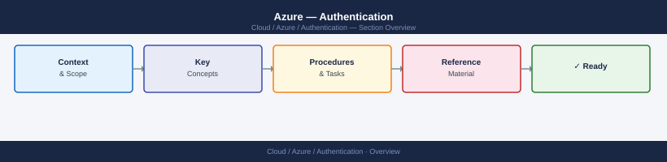
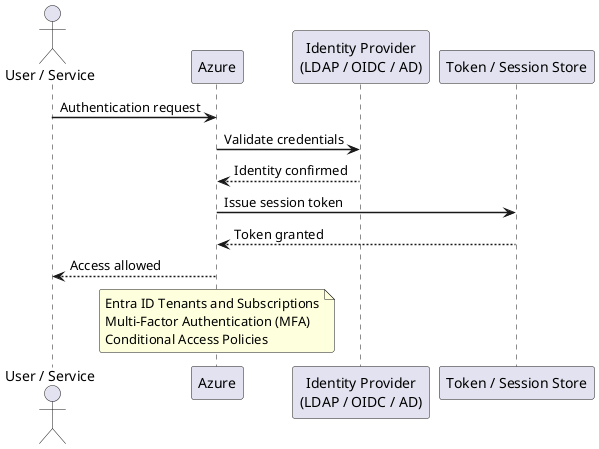

---
tags:
  - azure
  - security
---
# Azure — Authentication


<div class="kb-summary">
Azure authentication is managed through Microsoft Entra ID (formerly Azure Active Directory). All Azure resource access, API calls, and administrative actions authenticate through Entra ID.

*Applies to: Azure*
</div>



---



## Before you begin

- **Access:** Admin credentials on all affected systems
- **Change management:** security changes require CAB approval in most environments
- **Rollback plan:** document current state before any security control change
- **Testing:** validate in a non-production environment first where possible

---

## Entra ID Tenants and Subscriptions

| Concept | Description |
|---|---|
| Tenant | A dedicated Entra ID directory — one per organisation |
| Subscription | Billing and resource container — linked to one tenant |
| Managed domain | `<tenantname>.onmicrosoft.com` — always available |
| Custom domain | `corp.local` or `corp.com` — verified via DNS TXT record |

```bash
# Show current tenant info
az account show --output table

# List all subscriptions in the tenant
az account list --output table

# Switch to a specific subscription
az account set --subscription <sub-id>
```

---

## Multi-Factor Authentication (MFA)

MFA should be enforced for all users via Conditional Access — not via per-user MFA (legacy setting).

```bash
# Check per-user MFA status (legacy — should be migrated to Conditional Access)
az rest \
  --method GET \
  --url "https://graph.microsoft.com/v1.0/users?$select=displayName,userPrincipalName,strongAuthenticationRequirements"
```

**MFA methods (in order of security preference):**

| Method | Security Level | Notes |
|---|---|---|
| FIDO2 security key | Highest | Phishing-resistant; preferred for admins |
| Microsoft Authenticator (passwordless) | High | Push approval + biometric |
| Microsoft Authenticator (TOTP) | High | Time-based OTP |
| OATH hardware token | Medium-high | Physical device |
| SMS / voice call | Low | Vulnerable to SIM swap — avoid for admins |

---

## Conditional Access Policies

Conditional Access is the policy engine for access decisions: if `(user/group + app + condition)` then `(grant/block + controls)`.

```bash
# List all Conditional Access policies
az rest \
  --method GET \
  --url "https://graph.microsoft.com/v1.0/identity/conditionalAccess/policies" | \
  python3 -c "
import json, sys
data = json.load(sys.stdin)
for p in data['value']:
    print(f'{p[\"id\"]:40} {p[\"state\"]:15} {p[\"displayName\"]}')
"
```

### Baseline Policies (Minimum Recommended)

| Policy Name | Condition | Grant |
|---|---|---|
| Require MFA — All Users | All users, all apps, all locations | Require MFA |
| Require MFA — Admin Roles | Directory roles (Global Admin, etc.) | Require MFA + compliant device |
| Block Legacy Authentication | All users, legacy auth clients | Block |
| Require compliant device — Corp Apps | All users, selected apps | Require Intune compliant device |
| Block high-risk sign-in | High sign-in risk (Identity Protection) | Block |
| Block risky users | High user risk | Block + require password change |

### Create a Policy via API

```bash
az rest \
  --method POST \
  --url "https://graph.microsoft.com/v1.0/identity/conditionalAccess/policies" \
  --headers "Content-Type=application/json" \
  --body '{
    "displayName": "Require MFA for All Users",
    "state": "enabled",
    "conditions": {
      "users": {
        "includeUsers": ["All"]
      },
      "applications": {
        "includeApplications": ["All"]
      }
    },
    "grantControls": {
      "operator": "OR",
      "builtInControls": ["mfa"]
    }
  }'
```

---

## Entra ID Authentication Logs

```bash
# Sign-in logs — last 24 hours for a specific user
az rest \
  --method GET \
  --url "https://graph.microsoft.com/v1.0/auditLogs/signIns?\$filter=userPrincipalName eq '<upn>' and createdDateTime ge $(date -u -v-1d +%Y-%m-%dT%H:%M:%SZ)" | \
  python3 -m json.tool

# Failed sign-ins (status.errorCode != 0)
az rest \
  --method GET \
  --url "https://graph.microsoft.com/v1.0/auditLogs/signIns?\$filter=status/errorCode ne 0 and createdDateTime ge $(date -u -v-1d +%Y-%m-%dT%H:%M:%SZ)&\$top=50"

# Sign-ins from risky locations (Identity Protection)
az rest \
  --method GET \
  --url "https://graph.microsoft.com/v1.0/identityProtection/riskyUsers"
```

---

## Service Principal Authentication

Service principals authenticate to Azure using one of three methods:

| Method | Security | Use |
|---|---|---|
| Client secret | Lower | Simple automation, short-lived secrets only |
| Certificate | Higher | CI/CD pipelines, long-running automation |
| Federated identity (OIDC) | Highest | GitHub Actions, AKS workload identity |

```bash
# Login as service principal with secret
az login \
  --service-principal \
  --username <app-id> \
  --password <client-secret> \
  --tenant <tenant-id>

# Login as service principal with certificate
az login \
  --service-principal \
  --username <app-id> \
  --certificate /path/to/cert.pem \
  --tenant <tenant-id>

# List app registrations with expiring secrets/certificates
az ad app list --output json | python3 -c "
import json, sys
from datetime import datetime, timezone
data = json.load(sys.stdin)
now = datetime.now(timezone.utc)
for app in data:
    for cred in app.get('passwordCredentials', []) + app.get('keyCredentials', []):
        end = cred.get('endDateTime', '')
        if end:
            exp = datetime.fromisoformat(end.replace('Z', '+00:00'))
            days_left = (exp - now).days
            if days_left < 90:
                print(f'{days_left:4}d  {app[\"displayName\"]}  {cred.get(\"displayName\",\"\")}')
" 2>/dev/null | sort -n
```

---

## Workload Identity (OIDC Federation)

For GitHub Actions and AKS workloads, use federated identity credentials instead of secrets. The workload exchanges an OIDC token for an Azure access token — no secret is stored anywhere.

```bash
# Create federated credential for GitHub Actions
az ad app federated-credential create \
  --id <app-object-id> \
  --parameters '{
    "name": "github-actions-prod",
    "issuer": "https://token.actions.githubusercontent.com",
    "subject": "repo:org/repo:environment:production",
    "description": "GitHub Actions production deploy",
    "audiences": ["api://AzureADTokenExchange"]
  }'

# Create federated credential for AKS workload identity
az ad app federated-credential create \
  --id <app-object-id> \
  --parameters '{
    "name": "aks-workload",
    "issuer": "https://oidc.prod-aks.azure.com/<cluster-oidc-issuer>/",
    "subject": "system:serviceaccount:<namespace>:<service-account>",
    "audiences": ["api://AzureADTokenExchange"]
  }'
```

---

## Break-Glass Accounts

Break-glass accounts are emergency admin accounts used when Conditional Access or MFA is unavailable.

| Requirement | Detail |
|---|---|
| Count | Two accounts minimum |
| Role | Global Administrator (permanent) |
| Excluded from | All Conditional Access policies |
| Not synced from | On-premises AD (cloud-only accounts) |
| MFA | Use FIDO2 key stored in physically secure location |
| Password | Complex, stored in sealed envelope in physical vault |
| Monitoring | Alert on any sign-in via Azure Monitor |

```bash
# Alert rule: fire on break-glass account sign-in
az monitor scheduled-query create \
  --name "Break-Glass Account Sign-In Alert" \
  --resource-group <rg-monitoring> \
  --scopes <log-analytics-workspace-id> \
  --condition "count > 0" \
  --condition-query "SigninLogs | where UserPrincipalName in ('breakglass1@corp.onmicrosoft.com', 'breakglass2@corp.onmicrosoft.com')" \
  --evaluation-frequency "PT5M" \
  --window-size "PT5M" \
  --severity 0 \
  --action-groups <action-group-id>
```

---

## Entra ID Connect (Hybrid Identity)

When syncing on-premises AD to Entra ID:

```bash
# Check sync status (run on Entra Connect server)
Import-Module ADSync
Get-ADSyncConnectorRunStatus

# Force a delta sync
Start-ADSyncSyncCycle -PolicyType Delta

# Force a full sync
Start-ADSyncSyncCycle -PolicyType Initial

# Check sync errors
Get-ADSyncConnectorStatistics -ConnectorName "corp.local"
```

**Authentication modes:**

| Mode | Description | MFA location |
|---|---|---|
| Password Hash Sync (PHS) | Hash of password synced to Entra ID | Entra ID MFA |
| Pass-through Authentication (PTA) | Auth forwarded to on-prem AD agents | On-prem AD + Entra ID MFA |
| Federation (ADFS) | All auth goes to on-prem ADFS | ADFS MFA |

PHS is the recommended mode for most organisations — it provides cloud-only authentication resilience if on-premises connectivity is lost.
---

## Related Reference

- [Standard LDAP Integration](../../../../security/ldap-integration/index.md) — field reference, service account standards, TLS requirements, and connectivity testing

---

## See also

- [Azure — Access Control](../access-control/)
- [Azure — Hardening](../hardening/)
- [Azure — Encryption](../encryption/)
