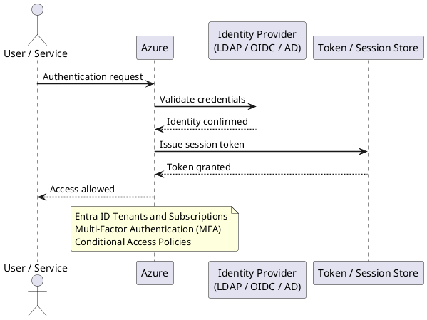

---
tags:
  - azure
  - security
description: "Azure authentication is managed through Microsoft Entra ID (formerly Azure Active Directory). All Azure resource access, API calls, and administrative..."
---
# Azure — Authentication

<div class="kb-summary">
Azure authentication is managed through Microsoft Entra ID (formerly Azure Active Directory). All Azure resource access, API calls, and administrative actions authenticate through Entra ID.

*Applies to: Azure*
</div>

---



## Before you begin

- **Access:** Admin credentials on all affected systems
- **Change management:** security changes require CAB approval in most environments
- **Rollback plan:** document current state before any security control change
- **Testing:** validate in a non-production environment first where possible

---

## Entra ID Tenants and Subscriptions

| Concept | Description |
|---|---|
| Tenant | A dedicated Entra ID directory — one per organisation |
| Subscription | Billing and resource container — linked to one tenant |
| Managed domain | `<tenantname>.onmicrosoft.com` — always available |
| Custom domain | `corp.local` or `corp.com` — verified via DNS TXT record |

```bash
# Show current tenant info
az account show --output table

# List all subscriptions in the tenant
az account list --output table

# Switch to a specific subscription
az account set --subscription <sub-id>
```


```text title="Expected output"
Name                                   CloudName    SubscriptionId                       TenantId                             State
------------------------------------   -----------  ------------------------------------  ------------------------------------  -------
Production-Primary                     AzureCloud   a1b2c3d4-e5f6-47g8-h9i0-j1k2l3m4n5o6  f9e8d7c6-b5a4-93i2-h1g0-f9e8d7c6b5a4  Enabled

SubscriptionId                         SubscriptionName           TenantId                             State
------------------------------------   -------------------------  ------------------------------------  -------
a1b2c3d4-e5f6-47g8-h9i0-j1k2l3m4n5o6  Production-Primary         f9e8d7c6-b5a4-93i2-h1g0-f9e8d7c6b5a4  Enabled
b2c3d4e5-f6g7-48h9-i0j1-k2l3m4n5o6p7  Development-Secondary      f9e8d7c6-b5a4-93i2-h1g0-f9e8d7c6b5a4  Enabled
c3d4e5f6-g7h8-49i0-j1k2-l3m4n5o6p7q8  Staging-Testing            f9e8d7c6-b5a4-93i2-h1g0-f9e8d7c6b5a4  Enabled

(no output — command completes silently)
```

!!! warning "Common errors"
    **`ERROR: The subscription of '<sub-id>' does not exist.`** — Verify the subscription ID is correct by running `az account list` and copy the exact SubscriptionId value.
    **`ERROR: AADSTS50058: Silent sign-in request failed. The user needs to be authenticated.`** — Run `az login` to re-authenticate before attempting to switch subscriptions.
---

## Multi-Factor Authentication (MFA)

MFA should be enforced for all users via Conditional Access — not via per-user MFA (legacy setting).

```bash
# Check per-user MFA status (legacy — should be migrated to Conditional Access)
az rest \
  --method GET \
  --url "https://graph.microsoft.com/v1.0/users?$select=displayName,userPrincipalName,strongAuthenticationRequirements"
```


```text title="Expected output"
{
  "value": [
    {
      "displayName": "Alice Johnson",
      "userPrincipalName": "alice.johnson@contoso.com",
      "strongAuthenticationRequirements": [
        {
          "requirementType": "mfa",
          "state": "enabled"
        }
      ]
    },
    {
      "displayName": "Bob Smith",
      "userPrincipalName": "bob.smith@contoso.com",
      "strongAuthenticationRequirements": []
    },
    {
      "displayName": "Carol White",
      "userPrincipalName": "carol.white@contoso.com",
      "strongAuthenticationRequirements": [
        {
          "requirementType": "mfa",
          "state": "enabled"
        }
      ]
    }
  ]
}
```

!!! warning "Common errors"
    **`Authorization_RequestDenied`** — Ensure your service principal or user account has Directory.Read.All permission in Microsoft Graph API.
    **`Invalid OData query option '$select'`** — Remove the `$select` parameter or use only properties supported by the /users endpoint (strongAuthenticationRequirements may not be available in all API versions).
**MFA methods (in order of security preference):**

| Method | Security Level | Notes |
|---|---|---|
| FIDO2 security key | Highest | Phishing-resistant; preferred for admins |
| Microsoft Authenticator (passwordless) | High | Push approval + biometric |
| Microsoft Authenticator (TOTP) | High | Time-based OTP |
| OATH hardware token | Medium-high | Physical device |
| SMS / voice call | Low | Vulnerable to SIM swap — avoid for admins |

---

## Conditional Access Policies

Conditional Access is the policy engine for access decisions: if `(user/group + app + condition)` then `(grant/block + controls)`.

```bash
# List all Conditional Access policies
az rest \
  --method GET \
  --url "https://graph.microsoft.com/v1.0/identity/conditionalAccess/policies" | \
  python3 -c "
import json, sys
data = json.load(sys.stdin)
for p in data['value']:
    print(f'{p[\"id\"]:40} {p[\"state\"]:15} {p[\"displayName\"]}')
"
```


```text title="Expected output"
6b5c8a2f-4e91-4d3c-9f2a-1b7e3c5d8f9a    enabled         Require MFA for Admin Portal
8c7d9e1f-5f02-4e4d-0g3b-2c8f4d6e9g0b    enabled         Block Legacy Authentication
9d8e0f2g-6g13-5f5e-1h4c-3d9g5e7f0h1c    disabled        Require Compliant Device - Pilot
0e9f1g3h-7h24-6g6f-2i5d-4e0h6f8g1i2d    enabled         Restrict Access from Unknown Locations
1f0g2h4i-8i35-7h7g-3j6e-5f1i7g9h2j3e    enabled         Require Password Change on Risk
...
```

!!! warning "Common errors"
    **`ERROR: The user or app needs permission to call the API. Check the permissions and try again.`** — Ensure the authenticated account has `Policy.Read.All` permission in Microsoft Graph API.
    **`ERROR: Invalid JSON input`** — Verify the Python script has correct indentation and `data['value']` key exists in the response.
### Baseline Policies (Minimum Recommended)

| Policy Name | Condition | Grant |
|---|---|---|
| Require MFA — All Users | All users, all apps, all locations | Require MFA |
| Require MFA — Admin Roles | Directory roles (Global Admin, etc.) | Require MFA + compliant device |
| Block Legacy Authentication | All users, legacy auth clients | Block |
| Require compliant device — Corp Apps | All users, selected apps | Require Intune compliant device |
| Block high-risk sign-in | High sign-in risk (Identity Protection) | Block |
| Block risky users | High user risk | Block + require password change |

### Create a Policy via API

```bash
az rest \
  --method POST \
  --url "https://graph.microsoft.com/v1.0/identity/conditionalAccess/policies" \
  --headers "Content-Type=application/json" \
  --body '{
    "displayName": "Require MFA for All Users",
    "state": "enabled",
    "conditions": {
      "users": {
        "includeUsers": ["All"]
      },
      "applications": {
        "includeApplications": ["All"]
      }
    },
    "grantControls": {
      "operator": "OR",
      "builtInControls": ["mfa"]
    }
  }'
```


```text title="Expected output"
{
  "id": "12a4b5c6-7d8e-9f0a-1b2c-3d4e5f6a7b8c",
  "displayName": "Require MFA for All Users",
  "state": "enabled",
  "createdDateTime": "2024-01-15T10:32:47.123Z",
  "modifiedDateTime": "2024-01-15T10:32:47.123Z",
  "conditions": {
    "users": {
      "includeUsers": [
        "All"
      ]
    },
    "applications": {
      "includeApplications": [
        "All"
      ]
    }
  },
  "grantControls": {
    "operator": "OR",
    "builtInControls": [
      "mfa"
    ]
  }
}
```

!!! warning "Common errors"
    **`Authorization_RequestDenied: Insufficient privileges to complete the operation.`** — Ensure your Azure account has the "Conditional Access Administrator" role assigned in Azure AD.
    **`Invalid JSON in request body`** — Validate the JSON syntax using `jq` locally before submission: `cat body.json | jq .`
    **`Resource not found: https://graph.microsoft.com/v1.0/identity/conditionalAccess/policies`** — Verify you are authenticated with `az account show` and that your tenant supports Conditional Access (Premium P1 license required).
---

## Entra ID Authentication Logs

```bash
# Sign-in logs — last 24 hours for a specific user
az rest \
  --method GET \
  --url "https://graph.microsoft.com/v1.0/auditLogs/signIns?\$filter=userPrincipalName eq '<upn>' and createdDateTime ge $(date -u -v-1d +%Y-%m-%dT%H:%M:%SZ)" | \
  python3 -m json.tool

# Failed sign-ins (status.errorCode != 0)
az rest \
  --method GET \
  --url "https://graph.microsoft.com/v1.0/auditLogs/signIns?\$filter=status/errorCode ne 0 and createdDateTime ge $(date -u -v-1d +%Y-%m-%dT%H:%M:%SZ)&\$top=50"

# Sign-ins from risky locations (Identity Protection)
az rest \
  --method GET \
  --url "https://graph.microsoft.com/v1.0/identityProtection/riskyUsers"
```


```text title="Expected output"
{
  "value": [
    {
      "id": "a1b2c3d4-e5f6-7890-abcd-ef1234567890",
      "userPrincipalName": "john.smith@contoso.com",
      "createdDateTime": "2024-01-15T14:32:18Z",
      "ipAddress": "203.0.113.45",
      "location": {
        "city": "Seattle",
        "state": "WA",
        "countryOrRegion": "US"
      },
      "status": {
        "errorCode": 0,
        "failureReason": null
      },
      "deviceDetail": {
        "browser": "Chrome 121.0",
        "operatingSystem": "Windows 10"
      }
    },
    {
      "id": "b2c3d4e5-f6a7-8901-bcde-f12345678901",
      "userPrincipalName": "john.smith@contoso.com",
      "createdDateTime": "2024-01-14T09:15:42Z",
      "ipAddress": "198.51.100.22",
      "status": {
        "errorCode": 0
      }
    }
  ]
}
{
  "value": [
    {
      "id": "c3d4e5f6-a7b8-9012-cdef-123456789012",
      "userPrincipalName": "alice.johnson@contoso.com",
      "createdDateTime": "2024-01-15T11:47:03Z",
      "ipAddress": "192.0.2.88",
      "status": {
        "errorCode": 50058,
        "failureReason": "Silent sign-in request failed"
      }
    },
    {
      "id": "d4e5f6a7-b8c9-0123-def0-234567890123",
      "userPrincipalName": "bob.williams@contoso.com",
      "createdDateTime": "2024-01-15T08:22:19Z",
      "status": {
        "errorCode": 50126,
        "failureReason": "Invalid username or password"
      }
    }
  ]
}
{
  "value": [
    {
      "id": "e5f6a7b8-c9d0-1234-ef01-345678901234",
      "userPrincipalName": "carol.davis@contoso.com",
      "riskLevel": "high",
      "riskState": "atRisk",
      "riskDetail": "adminConfirmedUserCompromised",
      "userDisplayName": "Carol Davis"
    },
    {
      "id": "f6a7b8c9-d0e1-2345-f012-456789012345",
      "userPrincipalName": "david.miller@contoso.com",
      "riskLevel": "medium",
      "riskState": "atRisk",
      "riskDetail": "unfamiliarProperties"
    }
  ]
}
```

!!! warning "Common errors"
    **`Authorization_RequestD
---

## Service Principal Authentication

Service principals authenticate to Azure using one of three methods:

| Method | Security | Use |
|---|---|---|
| Client secret | Lower | Simple automation, short-lived secrets only |
| Certificate | Higher | CI/CD pipelines, long-running automation |
| Federated identity (OIDC) | Highest | GitHub Actions, AKS workload identity |

```bash
# Login as service principal with secret
az login \
  --service-principal \
  --username <app-id> \
  --password <client-secret> \
  --tenant <tenant-id>

# Login as service principal with certificate
az login \
  --service-principal \
  --username <app-id> \
  --certificate /path/to/cert.pem \
  --tenant <tenant-id>

# List app registrations with expiring secrets/certificates
az ad app list --output json | python3 -c "
import json, sys
from datetime import datetime, timezone
data = json.load(sys.stdin)
now = datetime.now(timezone.utc)
for app in data:
    for cred in app.get('passwordCredentials', []) + app.get('keyCredentials', []):
        end = cred.get('endDateTime', '')
        if end:
            exp = datetime.fromisoformat(end.replace('Z', '+00:00'))
            days_left = (exp - now).days
            if days_left < 90:
                print(f'{days_left:4}d  {app[\"displayName\"]}  {cred.get(\"displayName\",\"\")}')
" 2>/dev/null | sort -n
```


```text title="Expected output"
{
  "cloudName": "AzureCloud",
  "homeTenantId": "72f988bf-86f1-41af-91ab-2d7cd011db47",
  "id": "550e8400-e29b-41d4-a716-446655440000",
  "isDefault": true,
  "name": "Production-Subscription",
  "state": "Enabled",
  "tenantId": "72f988bf-86f1-41af-91ab-2d7cd011db47",
  "user": {
    "name": "app-id-12345678-1234-1234-1234-123456789012",
    "type": "servicePrincipal"
  }
}
  15d  DataProcessingApp  db-connection-secret
  42d  ReportingService  api-auth-cert
  67d  LegacyIntegration  legacy-sp-key
  88d  MonitoringAgent  heartbeat-credential
```

!!! warning "Common errors"
    **`ERROR: The following arguments are required: --password/-p or --certificate/-c`** — Provide either `--password` with the client secret or `--certificate` with the path to the PEM certificate file.
    **`ERROR: AADSTS700016: Application with identifier 'invalid-app-id' was not found in the directory`** — Verify the app ID is correct and exists in the specified tenant by running `az ad app list --filter "appId eq '<app-id>'"`.
    **`ERROR: Certificate file not found: /path/to/cert.pem`** — Ensure the certificate path is absolute and the file exists; use `ls -la /path/to/cert.pem` to verify.
---

## Workload Identity (OIDC Federation)

For GitHub Actions and AKS workloads, use federated identity credentials instead of secrets. The workload exchanges an OIDC token for an Azure access token — no secret is stored anywhere.

```bash
# Create federated credential for GitHub Actions
az ad app federated-credential create \
  --id <app-object-id> \
  --parameters '{
    "name": "github-actions-prod",
    "issuer": "https://token.actions.githubusercontent.com",
    "subject": "repo:org/repo:environment:production",
    "description": "GitHub Actions production deploy",
    "audiences": ["api://AzureADTokenExchange"]
  }'

# Create federated credential for AKS workload identity
az ad app federated-credential create \
  --id <app-object-id> \
  --parameters '{
    "name": "aks-workload",
    "issuer": "https://oidc.prod-aks.azure.com/<cluster-oidc-issuer>/",
    "subject": "system:serviceaccount:<namespace>:<service-account>",
    "audiences": ["api://AzureADTokenExchange"]
  }'
```


```text title="Expected output"
{
  "audiences": [
    "api://AzureADTokenExchange"
  ],
  "description": "GitHub Actions production deploy",
  "id": "a7f2c891-3d4e-4b2a-9e1f-6c5d8a2b1e9f",
  "issuer": "https://token.actions.githubusercontent.com",
  "name": "github-actions-prod",
  "subject": "repo:org/repo:environment:production"
}
{
  "audiences": [
    "api://AzureADTokenExchange"
  ],
  "id": "b4e9d7c2-5f1a-4c8e-b3d6-2a9f7e1c5b8d",
  "issuer": "https://oidc.prod-aks.azure.com/a1b2c3d4e5f6g7h8i9j0k1l2m3n4o5p6/",
  "name": "aks-workload",
  "subject": "system:serviceaccount:default:azure-workload-identity-sa"
}
```

!!! warning "Common errors"
    **`Invalid object id '<app-object-id>'. Object id must be a valid UUID.`** — Replace `<app-object-id>` with the actual application object ID from `az ad app list --query "[].id"`.
    **`Malformed JSON in --parameters: Expecting value: line 1 column 1 (char 0)`** — Ensure the JSON string is properly escaped or use `@filename.json` syntax to load from a file instead of inline.
    **`The issuer URL 'https://oidc.prod-aks.azure.com/<cluster-oidc-issuer>/' is not a valid issuer.`** — Replace `<cluster-oidc-issuer>` with the actual OIDC issuer ID from `az aks show --resource-group <rg> --name <cluster> --query "oidcIssuerProfile.issuerUrl"`.
---

## Break-Glass Accounts

Break-glass accounts are emergency admin accounts used when Conditional Access or MFA is unavailable.

| Requirement | Detail |
|---|---|
| Count | Two accounts minimum |
| Role | Global Administrator (permanent) |
| Excluded from | All Conditional Access policies |
| Not synced from | On-premises AD (cloud-only accounts) |
| MFA | Use FIDO2 key stored in physically secure location |
| Password | Complex, stored in sealed envelope in physical vault |
| Monitoring | Alert on any sign-in via Azure Monitor |

```bash
# Alert rule: fire on break-glass account sign-in
az monitor scheduled-query create \
  --name "Break-Glass Account Sign-In Alert" \
  --resource-group <rg-monitoring> \
  --scopes <log-analytics-workspace-id> \
  --condition "count > 0" \
  --condition-query "SigninLogs | where UserPrincipalName in ('breakglass1@corp.onmicrosoft.com', 'breakglass2@corp.onmicrosoft.com')" \
  --evaluation-frequency "PT5M" \
  --window-size "PT5M" \
  --severity 0 \
  --action-groups <action-group-id>
```


```text title="Expected output"
{
  "id": "/subscriptions/a1b2c3d4-e5f6-4a7b-8c9d-0e1f2a3b4c5d/resourceGroups/rg-monitoring/providers/Microsoft.Insights/scheduledQueryRules/Break-Glass Account Sign-In Alert",
  "name": "Break-Glass Account Sign-In Alert",
  "type": "Microsoft.Insights/scheduledQueryRules",
  "location": "eastus",
  "enabled": true,
  "severity": 0,
  "evaluationFrequency": "PT5M",
  "windowSize": "PT5M",
  "scopes": [
    "/subscriptions/a1b2c3d4-e5f6-4a7b-8c9d-0e1f2a3b4c5d/resourcegroups/rg-monitoring/providers/microsoft.operationalinsights/workspaces/law-security-prod"
  ],
  "criteria": {
    "allOf": [
      {
        "query": "SigninLogs | where UserPrincipalName in ('breakglass1@corp.onmicrosoft.com', 'breakglass2@corp.onmicrosoft.com')",
        "timeAggregation": "Count",
        "operator": "GreaterThan",
        "threshold": 0
      }
    ]
  },
  "actions": {
    "actionGroups": [
      "/subscriptions/a1b2c3d4-e5f6-4a7b-8c9d-0e1f2a3b4c5d/resourcegroups/rg-monitoring/providers/microsoft.insights/actiongroups/ag-security-oncall"
    ]
  }
}
```

!!! warning "Common errors"
    **`ResourceNotFound: The resource '/subscriptions/.../workspaces/<log-analytics-workspace-id>' could not be found.`** — Replace `<log-analytics-workspace-id>` with the full resource ID of your Log Analytics workspace (run `az monitor log-analytics workspace list -g <rg-monitoring> --query "[].id"` to find it).
    **`InvalidTemplate: The template is invalid. Details: 'condition-query' is not a recognized property.`** — Use `--condition` with KQL syntax directly; the parameter should be `--condition "count > 0"` paired with the query in `--scopes` or use `--rule-type` to specify the query rule type.
    **`AuthorizationFailed: The client '<user-id>' with object id '<object-id>' does not have authorization to perform action 'Microsoft.Insights/scheduledQueryRules/write' over scope '/subscriptions/.../resourceGroups/rg-monitoring'.`** — Assign the user or service principal the "Monitoring Contributor" role on the resource group with `az role assignment create --assignee <user-id> --role "Monitoring Contributor" -g <rg-monitoring>`.
---

## Entra ID Connect (Hybrid Identity)

When syncing on-premises AD to Entra ID:

```bash
# Check sync status (run on Entra Connect server)
Import-Module ADSync
Get-ADSyncConnectorRunStatus

# Force a delta sync
Start-ADSyncSyncCycle -PolicyType Delta

# Force a full sync
Start-ADSyncSyncCycle -PolicyType Initial

# Check sync errors
Get-ADSyncConnectorStatistics -ConnectorName "corp.local"
```


```text title="Expected output"
RunspaceId                           : 12a4b8c9-3d5e-4f2a-9b1c-7e6d5a4c3b2a
ConnectorName                        : corp.local
ConnectorRunStatus                   : Idle
LastSyncCycleStartTime               : 2024-01-15T14:32:18.5432109Z
LastSyncCycleEndTime                 : 2024-01-15T14:35:42.1234567Z
LastSyncCycleDurationInSeconds       : 204
LastSyncCycleType                    : Delta
LastSyncCycleResult                  : Success

Sync cycle started successfully.

Sync cycle started successfully.

ConnectorName                        : corp.local
ConnectorIdentifier                 : 12a4b8c9-3d5e-4f2a-9b1c-7e6d5a4c3b2a
ConnectorType                        : ActiveDirectory
ObjectsAdded                         : 3
ObjectsUpdated                       : 12
ObjectsDeleted                       : 1
ObjectsError                         : 0
ExportErrors                         : 0
ExportWarnings                       : 0
```

!!! warning "Common errors"
    **`The term 'Get-ADSyncConnectorRunStatus' is not recognized as the name of a cmdlet, function, script file, or operable program.`** — Ensure ADSync module is installed on the Entra Connect server and run the command with elevated (Administrator) privileges.
    **`A sync cycle is already in progress. Please wait for the current cycle to complete before starting a new one.`** — Wait for the current sync to finish (check LastSyncCycleEndTime) or use `Stop-ADSyncSyncCycle` to cancel it first.
    **`The specified connector 'corp.local' was not found.`** — Verify the exact connector name using `Get-ADSyncConnector | Select-Object Name` and use the correct name in the ConnectorName parameter.
**Authentication modes:**

| Mode | Description | MFA location |
|---|---|---|
| Password Hash Sync (PHS) | Hash of password synced to Entra ID | Entra ID MFA |
| Pass-through Authentication (PTA) | Auth forwarded to on-prem AD agents | On-prem AD + Entra ID MFA |
| Federation (ADFS) | All auth goes to on-prem ADFS | ADFS MFA |

PHS is the recommended mode for most organisations — it provides cloud-only authentication resilience if on-premises connectivity is lost.
---

## Related Reference

- [Standard LDAP Integration](../../../../security/ldap-integration/index.md) — field reference, service account standards, TLS requirements, and connectivity testing

---

## See also

- [Azure — Access Control](../access-control/)
- [Azure — Hardening](../hardening/)
- [Azure — Encryption](../encryption/)
