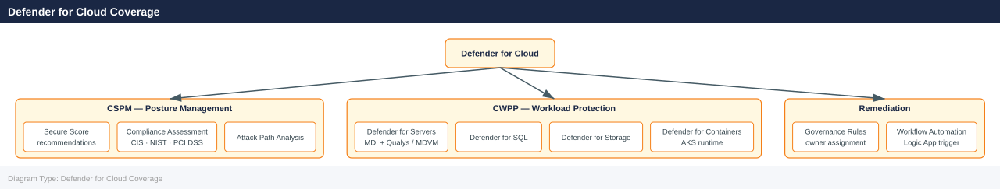

---
tags:
  - azure
  - security
description: "Microsoft Defender for Cloud (formerly Security Center / Azure Defender) is a cloud security posture management (CSPM) and cloud workload protection..."
---
# Defender for Cloud

<div class="kb-summary">
Microsoft Defender for Cloud (formerly Security Center / Azure Defender) is a cloud security posture management (CSPM) and cloud workload protection platform (CWPP).

*Applies to: Azure*
</div>

 It provides security recommendations, threat protection, regulatory compliance assessment, and attack path analysis.

## Before you begin

- **Access:** Admin credentials on all affected systems
- **Change management:** security changes require CAB approval in most environments
- **Rollback plan:** document current state before any security control change
- **Testing:** validate in a non-production environment first where possible

---

## Defender for Cloud Coverage



## Security Posture Overview

```bash
# Get current Defender for Cloud settings for a subscription
az security auto-provisioning-setting list \
  --output table

# Enable auto-provisioning of the monitoring agent
az security auto-provisioning-setting update \
  --name mma \
  --auto-provision On

# List all security assessments (recommendations) for a subscription
az security assessment list \
  --output table

# List assessments with unhealthy state only
az security assessment list \
  --query "[?status.code=='Unhealthy']" \
  --output table
```


```text title="Expected output"
Name                                    AutoProvision
--------------------------------------  ----------------
mma                                     Off
wdatp                                   Off
mdfc_sql                                Off
vuln_assessment                         Off

AutoProvisioningSetting 'mma' updated successfully.

Id                                      Name                          Status
--------------------------------------  ---------------------------  ----------
/subscriptions/a1b2c3d4-e5f6-7890-abcd-ef1234567890/providers/Microsoft.Security/assessments/e1e5add6-7ce4-4cbf-ba16-beb282e92b67  Disk encryption should be enabled on VMs  Healthy
/subscriptions/a1b2c3d4-e5f6-7890-abcd-ef1234567890/providers/Microsoft.Security/assessments/f47e8060-e5f6-4a1b-8c9d-2e3f4a5b6c7d  MFA should be enabled on accounts with owner permissions  Unhealthy
/subscriptions/a1b2c3d4-e5f6-7890-abcd-ef1234567890/providers/Microsoft.Security/assessments/a1b2c3d4-e5f6-7890-abcd-ef1234567890  Adaptive application controls should be enabled  Unhealthy
/subscriptions/a1b2c3d4-e5f6-7890-abcd-ef1234567890/providers/Microsoft.Security/assessments/9c8d7e6f-5a4b-3c2d-1e0f-abcdef123456  SQL servers should have vulnerability assessments enabled  Unhealthy
...

Id                                      Name                          Status
--------------------------------------  ---------------------------  ----------
/subscriptions/a1b2c3d4-e5f6-7890-abcd-ef1234567890/providers/Microsoft.Security/assessments/f47e8060-e5f6-4a1b-8c9d-2e3f4a5b6c7d  MFA should be enabled on accounts with owner permissions  Unhealthy
/subscriptions/a1b2c3d4-e5f6-7890-abcd-ef1234567890/providers/Microsoft.Security/assessments/a1b2c3d4-e5f6-7890-abcd-ef1234567890  Adaptive application controls should be enabled  Unhealthy
/subscriptions/a1b2c3d4-e5f6-7890-abcd-ef1234567890/providers/Microsoft.Security/assessments/9c8d7e6f-5a4b-3c2d-1e0f-abcdef123456  SQL servers should have vulnerability assessments enabled  Unhealthy
```

!!! warning "Common errors"
    **`ERROR: (AuthorizationFailed) The client 'user@contoso.com' with object id 'a1b2c3d4-e5f6-7890-abcd-ef1234567890' does not have authorization to perform action 'Microsoft.Security/autoProvisioningSettings/read' over scope '/subscriptions/a1b2c3d4-e5f6-7890-abcd-ef1234567890'.`** — Ensure your user account has the Security
## Defender Plans

Defender for Cloud has free (CSPM) and paid (Defender) plans per resource type. Enabling a plan activates threat detection, just-in-time VM access, file integrity monitoring, and other protections.

```bash
# Enable Defender for Servers (Plan 2)
az security pricing create \
  --name VirtualMachines \
  --tier Standard

# Enable Defender for Storage
az security pricing create \
  --name StorageAccounts \
  --tier Standard

# Enable Defender for Key Vault
az security pricing create \
  --name KeyVaults \
  --tier Standard

# List current pricing tiers (shows which plans are enabled)
az security pricing list \
  --output table
```


```text title="Expected output"
{
  "id": "/subscriptions/12345678-1234-1234-1234-123456789012/providers/Microsoft.Security/pricings/VirtualMachines",
  "name": "VirtualMachines",
  "pricingTier": "Standard",
  "freeTrialRemainingDays": 0
}
{
  "id": "/subscriptions/12345678-1234-1234-1234-123456789012/providers/Microsoft.Security/pricings/StorageAccounts",
  "name": "StorageAccounts",
  "pricingTier": "Standard",
  "freeTrialRemainingDays": 0
}
{
  "id": "/subscriptions/12345678-1234-1234-1234-123456789012/providers/Microsoft.Security/pricings/KeyVaults",
  "name": "KeyVaults",
  "pricingTier": "Standard",
  "freeTrialRemainingDays": 0
}
Name                 PricingTier    FreeTrialRemainingDays
-------------------  -----------    ----------------------
VirtualMachines      Standard       0
StorageAccounts      Standard       0
KeyVaults            Standard       0
SqlServers           Free           0
AppServices          Free           0
```

!!! warning "Common errors"
    **`Operation failed with status: 'Forbidden'. Details: AuthorizationFailed`** — Ensure your Azure account has Owner or Security Admin role on the subscription.
    **`The pricing resource 'VirtualMachines' already exists`** — The plan is already enabled; use `az security pricing update` instead to change tiers.
## Defender Plans by Resource Type

| Plan Name               | Protects                                      |
|-------------------------|-----------------------------------------------|
| VirtualMachines         | VMs (Linux/Windows), JIT, FIM                 |
| SqlServers              | Azure SQL, SQL on VMs                         |
| AppServices             | App Service plans                             |
| StorageAccounts         | Blob, File, ADLS Gen2                         |
| KeyVaults               | Key Vault access anomalies                    |
| KubernetesService       | AKS clusters                                  |
| ContainerRegistry       | ACR image vulnerability scanning             |
| Dns                     | Azure DNS query anomalies                     |
| Arm                     | ARM subscription-level attack detection       |

## Recommendations and Remediation

```bash
# Show details of a specific recommendation
az security assessment show \
  --name <assessment-name> \
  --assessed-resource-id /subscriptions/<sub-id>/resourceGroups/myRG/providers/Microsoft.Compute/virtualMachines/myVM \
  --output json

# List security contacts
az security contact list \
  --output table

# Set a security contact email
az security contact create \
  --name default \
  --email security@example.com \
  --phone "+1-555-0100" \
  --alert-notifications On \
  --alerts-to-admins On
```


```text title="Expected output"
{
  "id": "/subscriptions/12345678-1234-1234-1234-123456789012/resourceGroups/myRG/providers/Microsoft.Compute/virtualMachines/myVM/providers/Microsoft.Security/assessments/8e3af657-a8ff-443c-a75c-2fe8c4bcb635",
  "name": "8e3af657-a8ff-443c-a75c-2fe8c4bcb635",
  "type": "Microsoft.Security/assessments",
  "properties": {
    "displayName": "Ensure that 'Automatic provisioning of monitoring agent' is 'On'",
    "status": {
      "code": "Unhealthy",
      "cause": "OffByPolicy",
      "firstEvaluationDate": "2024-01-15T09:22:14.000000+00:00",
      "statusChangeDate": "2024-02-10T14:33:45.000000+00:00"
    },
    "resourceDetails": {
      "id": "/subscriptions/12345678-1234-1234-1234-123456789012/resourceGroups/myRG/providers/Microsoft.Compute/virtualMachines/myVM"
    }
  }
}

Name       Email                  Phone           AlertNotifications  AlertsToAdmins
---------  ---------------------  --------------  ------------------  ---------------
default    security@example.com   +1-555-0100     On                  On

(no output — command completes silently)
```

!!! warning "Common errors"
    **`The resource 'Microsoft.Security/securityContacts/default' does not exist.`** — Ensure the subscription has at least one security contact already created before updating; use `az security contact list` to verify.
    **`Invalid email address format: 'security@example.com'.`** — Provide a valid email address matching standard format (e.g., user@domain.com).
    **`The provided subscription does not have an active Microsoft Defender for Cloud plan.`** — Enable Defender for Cloud on the subscription via the Azure Portal or `az security auto-provisioning-setting update` before managing security contacts.
## Regulatory Compliance

Defender for Cloud maps recommendations to compliance frameworks (e.g., ISO 27001, PCI DSS, NIST SP 800-53, CIS Azure Benchmark).

```bash
# List available regulatory compliance standards
az security regulatory-compliance-standards list \
  --output table

# List controls for a specific standard
az security regulatory-compliance-controls list \
  --standard-name "Azure-CIS-1.1.0" \
  --output table

# List assessments under a specific control
az security regulatory-compliance-assessments list \
  --standard-name "Azure-CIS-1.1.0" \
  --control-name "1" \
  --output table
```


```text title="Expected output"
StandardName                          StandardId                            Description
────────────────────────────────────  ──────────────────────────────────  ──────────────────────────────────
Azure-CIS-1.1.0                       cis-azure-1.1.0                    CIS Microsoft Azure Foundations Benchmark v1.1.0
PCI-DSS-3.2.1                         pci-dss-3.2.1                      PCI DSS v3.2.1
HIPAA                                 hipaa                               Health Insurance Portability and Accountability Act
SOC2                                  soc2                                Service Organization Control 2
ISO27001-2013                         iso27001-2013                       ISO/IEC 27001:2013

ControlName    ControlId    Description
─────────────  ───────────  ──────────────────────────────────────────
1              1.1          Ensure that multi-factor authentication is enabled for all Azure users
2              1.2          Ensure that 'Require MFA' is 'On' for all non-privileged users
3              1.3          Ensure that 'Require MFA' is 'On' for all privileged users
4              2.1          Ensure that 'Secure transfer required' is 'Enabled' for storage accounts
5              2.2          Ensure default network access rule for Storage Blobs is set to deny

AssessmentName                        AssessmentId                         AssessmentType    State
────────────────────────────────────  ──────────────────────────────────  ──────────────────  ──────
mfa-enabled-for-users                 a1b2c3d4-e5f6-7890-abcd-ef1234567890  BuiltIn            Passed
mfa-enabled-for-admins                b2c3d4e5-f6a7-8901-bcde-f12345678901  BuiltIn            Failed
conditional-access-configured        c3d4e5f6-a7b8-9012-cdef-123456789012  BuiltIn            Passed
```

!!! warning "Common errors"
    **`ResourceNotFound: The requested resource 'Azure-CIS-1.1.0' does not exist.`** — Verify the standard name is correct by running `az security regulatory-compliance-standards list` first.
    **`AuthorizationFailed: The client 'user@example.com' with object id 'xxxxxxxx-xxxx-xxxx-xxxx-xxxxxxxxxxxx' does not have authorization to perform action 'Microsoft.Security/regulatoryComplianceStandards/read' over scope '/subscriptions/xxxxxxxx-xxxx-xxxx-xxxx-xxxxxxxxxxxx'.`** — Ensure your account has the Security Reader or higher role assigned in the target subscription.
## Alerts and Threat Detection

```bash
# List active security alerts
az security alert list \
  --output table

# Show a specific alert
az security alert show \
  --resource-group myRG \
  --location eastus \
  --name <alert-name> \
  --output json

# Dismiss an alert
az security alert update \
  --resource-group myRG \
  --location eastus \
  --name <alert-name> \
  --status Dismissed
```


```text title="Expected output"
Name                                    ResourceGroup    Location    Status      Severity
--------------------------------------  ---------------  ----------  ----------  ----------
Suspicious_Process_Execution_001        myRG             eastus      Active      High
Potential_Malware_Detection_042         myRG             eastus      Active      Critical
Brute_Force_Attack_Attempt_015          myRG             eastus      Active      Medium
Unauthorized_API_Access_089             myRG             eastus      Active      High
Suspicious_Network_Connection_056       myRG             eastus      Active      Medium

{
  "id": "/subscriptions/12345678-1234-1234-1234-123456789012/resourceGroups/myRG/providers/Microsoft.Security/locations/eastus/alerts/Suspicious_Process_Execution_001",
  "name": "Suspicious_Process_Execution_001",
  "type": "Microsoft.Security/locations/alerts",
  "resourceGroup": "myRG",
  "location": "eastus",
  "status": "Active",
  "severity": "High",
  "description": "A suspicious process was detected running with elevated privileges",
  "detectionTime": "2024-01-15T09:42:31.5432109Z",
  "lastUpdateTime": "2024-01-15T09:42:31.5432109Z"
}

(no output — command completes silently)
```

!!! warning "Common errors"
    **`ResourceNotFound : The resource 'Microsoft.Security/locations/eastus/alerts/<alert-name>' under resource group 'myRG' was not found.`** — Verify the alert name exists by running `az security alert list` and use the exact name from the output.
    **`AuthorizationFailed : The client 'user@contoso.com' with object id '12345678-1234-1234-1234-123456789012' does not have authorization to perform action 'Microsoft.Security/locations/alerts/read' over scope '/subscriptions/12345678-1234-1234-1234-123456789012'.`** — Ensure your Azure account has the Security Reader or Security Admin role assigned at the subscription level.
## Just-in-Time VM Access

JIT access reduces exposure by opening RDP/SSH ports only when requested, for a defined duration, to specific source IPs.

```bash
# Enable JIT on a VM
az security jit-policy create \
  --resource-group myRG \
  --location eastus \
  --name default \
  --virtual-machines '[{"id":"/subscriptions/<sub-id>/resourceGroups/myRG/providers/Microsoft.Compute/virtualMachines/myVM","ports":[{"number":22,"protocol":"TCP","allowedSourceAddressPrefix":"*","maxRequestAccessDuration":"PT3H"}]}]'

# Initiate a JIT access request
az security jit-policy initiate \
  --resource-group myRG \
  --location eastus \
  --name default \
  --virtual-machines '[{"id":"/subscriptions/<sub-id>/resourceGroups/myRG/providers/Microsoft.Compute/virtualMachines/myVM","ports":[{"number":22,"endTimeUtc":"2026-05-07T14:00:00Z","allowedSourceAddressPrefix":"203.0.113.10"}]}]'
```


```text title="Expected output"
{
  "id": "/subscriptions/a1b2c3d4-e5f6-4a5b-8c9d-0e1f2a3b4c5d/resourceGroups/myRG/providers/Microsoft.Security/locations/eastus/jitNetworkAccessPolicies/default",
  "name": "default",
  "type": "Microsoft.Security/locations/jitNetworkAccessPolicies",
  "properties": {
    "virtualMachines": [
      {
        "id": "/subscriptions/a1b2c3d4-e5f6-4a5b-8c9d-0e1f2a3b4c5d/resourceGroups/myRG/providers/Microsoft.Compute/virtualMachines/myVM",
        "ports": [
          {
            "number": 22,
            "protocol": "TCP",
            "allowedSourceAddressPrefix": "*",
            "maxRequestAccessDuration": "PT3H"
          }
        ]
      }
    ],
    "requests": []
  }
}
{
  "id": "/subscriptions/a1b2c3d4-e5f6-4a5b-8c9d-0e1f2a3b4c5d/resourceGroups/myRG/providers/Microsoft.Security/locations/eastus/jitNetworkAccessPolicies/default/initiate",
  "properties": {
    "virtualMachines": [
      {
        "id": "/subscriptions/a1b2c3d4-e5f6-4a5b-8c9d-0e1f2a3b4c5d/resourceGroups/myRG/providers/Microsoft.Compute/virtualMachines/myVM",
        "ports": [
          {
            "number": 22,
            "endTimeUtc": "2026-05-07T14:00:00Z",
            "allowedSourceAddressPrefix": "203.0.113.10",
            "status": "Initiated"
          }
        ]
      }
    ]
  }
}
```

!!! warning "Common errors"
    **`(ResourceNotFound) The Resource 'Microsoft.Compute/virtualMachines/myVM' under resource group 'myRG' was not found.`** — Verify the VM exists in the specified resource group and subscription using `az vm list -g myRG`.
    **`(InvalidJitPolicyVirtualMachineId) Virtual machine ID format is invalid.`** — Replace `<sub-id>` with your actual subscription ID from `az account show --query id -o tsv`.
    **`(AuthorizationFailed) The client does not have permission to perform action 'Microsoft.Security/locations/jitNetworkAccessPolicies/write'.`** — Ensure your account has the Security Admin or Contributor role on the subscription using `az role assignment list --assignee <your-email>`.