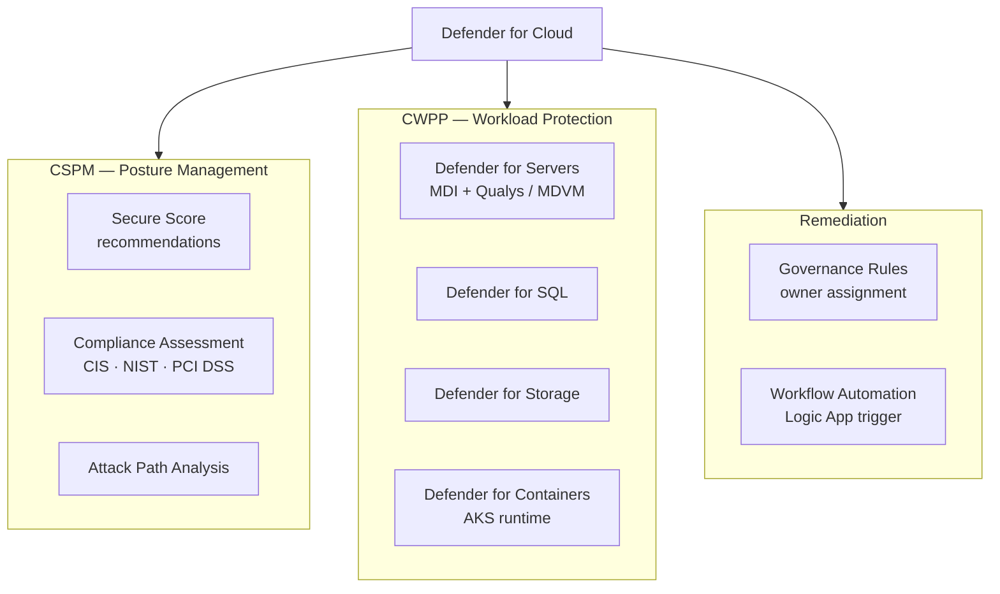

# Defender for Cloud


<div class="kb-summary">
Microsoft Defender for Cloud (formerly Security Center / Azure Defender) is a cloud security posture management (CSPM) and cloud workload protection platform (CWPP).
</div>
```text
┌──────────────────────────────────────── Cloud Azure Security ─────────────────────────────────────────┐
│                                                                                                       │
│   ┌───────────────────────────────────────────────────────────────────────────────────────────────┐   │
│   │                              Azure: Cloud Azure Security platform                             │   │
│   │                                  Protocols: Various protocols                                 │   │
│   │                      Management: Cloud Azure Security management console                      │   │
│   │                Sections: Architecture · Operations · Security · Troubleshooting               │   │
│   └───────────────────────────────────────────────────────────────────────────────────────────────┘   │
│                                                                                                       │
│    Architecture → Operations → Security → Troubleshooting → Escalation                                │
│                                                                                                       │
│                  ▼                                ▼                                ▼                  │
│                                                                                                       │
│   ┌─────────────────────────────┐  ┌─────────────────────────────┐  ┌─────────────────────────────┐   │
│   │            Layer            │  │          Component          │  │            Notes            │   │
│   │             Core            │  │       Primary service       │  │        Main function        │   │
│   │          Management         │  │        Control plane        │  │         Admin access        │   │
│   │          Monitoring         │  │         Health/perf         │  │      Alerts/dashboards      │   │
│   │           Security          │  │         Auth/encrypt        │  │        Access control       │   │
│   │         Integration         │  │        APIs/plug-ins        │  │         Third-party         │   │
│   └─────────────────────────────┘  └─────────────────────────────┘  └─────────────────────────────┘   │
│                                                                                                       │
│                          ▼                                                 ▼                          │
│                                                                                                       │
│   ┌───────────────────────────────────────────────────────────────────────────────────────────────┐   │
│   │      Layer       │    Component     │      Function     │      Notes       │       Auth       │   │
│   │       Core       │ Primary service  │   Main function   │     See docs     │       RBAC       │   │
│   │    Management    │  Control plane   │    Admin access   │     See docs     │       RBAC       │   │
│   │    Monitoring    │   Health/perf    │  Alerts/dashboard │     See docs     │       RBAC       │   │
│   │     Security     │   Auth/encrypt   │   Access control  │     See docs     │       RBAC       │   │
│   └───────────────────────────────────────────────────────────────────────────────────────────────┘   │
│                                                                                                       │
│    Physical: Cloud Azure Security infrastructure · management network · monitoring                    │
│                                                                                                       │
│    Key terms:                                                                                         │
│                                                                                                       │
│    Azure              = Cloud Azure Security platform overview and core concepts                      │
│    Management         = management console and command-line interface for administration              │
│    Monitoring         = health and performance monitoring dashboards and alerting                     │
│    Automation         = REST API, scripting, and pipeline integration capabilities                    │
│    Security           = access control, authentication, and encryption configuration                  │
│    Backup             = backup and recovery procedures and schedule configuration                     │
│    Upgrade            = software version upgrades and firmware patching procedures                    │
│    Troubleshooting    = diagnostic procedures and common issue resolution steps                       │
│    Escalation         = vendor support escalation path and severity triage process                    │
│    Documentation      = vendor knowledge base and official product documentation                      │
│    Change management  = change ticket requirements for production modifications                       │
│    Audit log          = admin action logging for compliance and security review                       │
│                                                                                                       │
└───────────────────────────────────────────────────────────────────────────────────────────────────────┘
```


 It provides security recommendations, threat protection, regulatory compliance assessment, and attack path analysis.

## Defender for Cloud Coverage



## Security Posture Overview

```bash
# Get current Defender for Cloud settings for a subscription
az security auto-provisioning-setting list \
  --output table

# Enable auto-provisioning of the monitoring agent
az security auto-provisioning-setting update \
  --name mma \
  --auto-provision On

# List all security assessments (recommendations) for a subscription
az security assessment list \
  --output table

# List assessments with unhealthy state only
az security assessment list \
  --query "[?status.code=='Unhealthy']" \
  --output table
```

## Defender Plans

Defender for Cloud has free (CSPM) and paid (Defender) plans per resource type. Enabling a plan activates threat detection, just-in-time VM access, file integrity monitoring, and other protections.

```bash
# Enable Defender for Servers (Plan 2)
az security pricing create \
  --name VirtualMachines \
  --tier Standard

# Enable Defender for Storage
az security pricing create \
  --name StorageAccounts \
  --tier Standard

# Enable Defender for Key Vault
az security pricing create \
  --name KeyVaults \
  --tier Standard

# List current pricing tiers (shows which plans are enabled)
az security pricing list \
  --output table
```

## Defender Plans by Resource Type

| Plan Name               | Protects                                      |
|-------------------------|-----------------------------------------------|
| VirtualMachines         | VMs (Linux/Windows), JIT, FIM                 |
| SqlServers              | Azure SQL, SQL on VMs                         |
| AppServices             | App Service plans                             |
| StorageAccounts         | Blob, File, ADLS Gen2                         |
| KeyVaults               | Key Vault access anomalies                    |
| KubernetesService       | AKS clusters                                  |
| ContainerRegistry       | ACR image vulnerability scanning             |
| Dns                     | Azure DNS query anomalies                     |
| Arm                     | ARM subscription-level attack detection       |

## Recommendations and Remediation

```bash
# Show details of a specific recommendation
az security assessment show \
  --name <assessment-name> \
  --assessed-resource-id /subscriptions/<sub-id>/resourceGroups/myRG/providers/Microsoft.Compute/virtualMachines/myVM \
  --output json

# List security contacts
az security contact list \
  --output table

# Set a security contact email
az security contact create \
  --name default \
  --email security@example.com \
  --phone "+1-555-0100" \
  --alert-notifications On \
  --alerts-to-admins On
```

## Regulatory Compliance

Defender for Cloud maps recommendations to compliance frameworks (e.g., ISO 27001, PCI DSS, NIST SP 800-53, CIS Azure Benchmark).

```bash
# List available regulatory compliance standards
az security regulatory-compliance-standards list \
  --output table

# List controls for a specific standard
az security regulatory-compliance-controls list \
  --standard-name "Azure-CIS-1.1.0" \
  --output table

# List assessments under a specific control
az security regulatory-compliance-assessments list \
  --standard-name "Azure-CIS-1.1.0" \
  --control-name "1" \
  --output table
```

## Alerts and Threat Detection

```bash
# List active security alerts
az security alert list \
  --output table

# Show a specific alert
az security alert show \
  --resource-group myRG \
  --location eastus \
  --name <alert-name> \
  --output json

# Dismiss an alert
az security alert update \
  --resource-group myRG \
  --location eastus \
  --name <alert-name> \
  --status Dismissed
```

## Just-in-Time VM Access

JIT access reduces exposure by opening RDP/SSH ports only when requested, for a defined duration, to specific source IPs.

```bash
# Enable JIT on a VM
az security jit-policy create \
  --resource-group myRG \
  --location eastus \
  --name default \
  --virtual-machines '[{"id":"/subscriptions/<sub-id>/resourceGroups/myRG/providers/Microsoft.Compute/virtualMachines/myVM","ports":[{"number":22,"protocol":"TCP","allowedSourceAddressPrefix":"*","maxRequestAccessDuration":"PT3H"}]}]'

# Initiate a JIT access request
az security jit-policy initiate \
  --resource-group myRG \
  --location eastus \
  --name default \
  --virtual-machines '[{"id":"/subscriptions/<sub-id>/resourceGroups/myRG/providers/Microsoft.Compute/virtualMachines/myVM","ports":[{"number":22,"endTimeUtc":"2026-05-07T14:00:00Z","allowedSourceAddressPrefix":"203.0.113.10"}]}]'
```
