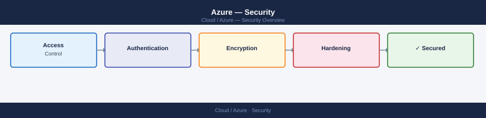

---
tags:
  - azure
  - security
---
# Azure — Security

Azure security posture — Defender for Cloud, Key Vault, Entra ID hardening, NSG policies, Privileged Identity Management, and secure score.

*Applies to: Azure*

<a class="kb-card" href="authentication/">
  <strong>Authentication</strong>
  Entra ID, SSO, MFA, Conditional Access, and PIM.
</a>

<a class="kb-card" href="access-control/">
  <strong>Access Control</strong>
  Azure RBAC, management group policies, and service principals.
</a>

<a class="kb-card" href="encryption/">
  <strong>Encryption</strong>
  Key Vault, customer-managed keys, data-at-rest, and Private Link.
</a>

<a class="kb-card" href="hardening/"><strong>Hardening</strong>Defender for Cloud, Secure Score, NSG hardening, and security baselines.</a>
<a class="kb-card" href="key-vault/"><strong>Key Vault</strong>Key Vault architecture, key/secret/certificate management, RBAC, and soft delete.</a>
<a class="kb-card" href="keys/"><strong>Keys</strong>Key types, RSA/EC key operations, rotation, and key version management in Key Vault.</a>
<a class="kb-card" href="secrets/"><strong>Secrets</strong>Secret management, versioning, access policies, and rotation workflows.</a>
<a class="kb-card" href="certificates/"><strong>Certificates</strong>Certificate lifecycle, issuers, auto-rotation, and import/export procedures.</a>
<a class="kb-card" href="secure-score/"><strong>Secure Score</strong>Defender for Cloud secure score — tracking, improving recommendations, and exemptions.</a>
<a class="kb-card" href="private-link/"><strong>Private Link</strong>Private Endpoints for PaaS services, DNS configuration, and NSG integration.</a>
<a class="kb-card" href="tls-validation/"><strong>TLS Validation</strong>Enforcing TLS 1.2+ on storage accounts, App Gateway, APIM, and App Service.</a>
<a class="kb-card" href="defender-for-cloud/"><strong>Defender for Cloud</strong>CSPM posture management, workload protection plans, and alert triage.</a>

