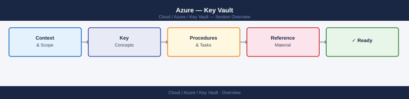

---
tags:
  - azure
  - security
---
# Azure — Key Vault


<div class="kb-summary">
Azure Key Vault is a managed service for storing and controlling access to secrets, encryption keys, and certificates. It provides hardware security module (HSM) backing, RBAC-based access control, soft-delete protection, and audit logging.

*Applies to: Azure*
</div>



```d2
direction: right

center: "Azure" {shape: hexagon}
vault_vs_managed_hsm: "Vault vs Managed HSM" {shape: rectangle}
access_model: "Access Model" {shape: rectangle}
creating_a_key_vault: "Creating a Key Vault" {shape: rectangle}
managing_secrets: "Managing Secrets" {shape: rectangle}
soft_delete_and_purge_protection: "Soft Delete and Purge Protection" {shape: rectangle}
networking_private_endpoint: "Networking — Private Endpoint" {shape: rectangle}

center -> vault_vs_managed_hsm
center -> access_model
center -> creating_a_key_vault
center -> managing_secrets
center -> soft_delete_and_purge_protection
center -> networking_private_endpoint
```

## Before you begin

- **Access:** Admin credentials on all affected systems
- **Change management:** security changes require CAB approval in most environments
- **Rollback plan:** document current state before any security control change
- **Testing:** validate in a non-production environment first where possible

---

## Vault vs Managed HSM

| Feature | Key Vault (Standard) | Key Vault (Premium) | Managed HSM |
|---|---|---|---|
| Secrets / Certs | Yes | Yes | No |
| Keys (software) | Yes | Yes | No |
| Keys (HSM-backed) | No | Yes | Yes |
| FIPS 140-2 level | Level 1 | Level 2 | Level 3 |
| Dedicated HSM | No | No | Yes |
| Use case | General secrets and certs | HSM-backed keys alongside secrets | High-security key material only |

## Access Model

Key Vault supports two permission models (set at vault creation; cannot be changed):

| Model | How access is granted | Recommended |
|---|---|---|
| **Vault access policy** | Legacy; per-vault principal-based permissions | No |
| **Azure RBAC** | Standard Azure RBAC via role assignments | Yes |

**Use RBAC.** It enables centralized access management, PIM eligibility, and Conditional Access.

Key RBAC roles for Key Vault:

| Role | Scope | Actions |
|---|---|---|
| Key Vault Administrator | Control + data plane | Full access to all object types |
| Key Vault Secrets Officer | Data plane | Create, delete, manage secrets |
| Key Vault Secrets User | Data plane | Read secret values |
| Key Vault Crypto Officer | Data plane | Create, delete, manage keys |
| Key Vault Crypto User | Data plane | Use keys for crypto operations |
| Key Vault Certificates Officer | Data plane | Create, manage certificates |
| Key Vault Reader | Control plane | Read vault metadata (not values) |

## Creating a Key Vault

```bash
# Create vault (RBAC model, soft-delete 90 days, purge protection)
az keyvault create \
  --name <vault-name> \
  --resource-group <rg> \
  --location <region> \
  --enable-rbac-authorization true \
  --soft-delete-retention-days 90 \
  --enable-purge-protection true

# Grant yourself Secrets Officer
az role assignment create \
  --assignee <your-object-id> \
  --role "Key Vault Secrets Officer" \
  --scope /subscriptions/<sub-id>/resourceGroups/<rg>/providers/Microsoft.KeyVault/vaults/<vault-name>
```

## Managing Secrets

```bash
# Create/update a secret
az keyvault secret set \
  --vault-name <vault-name> \
  --name "db-password" \
  --value "S3cur3P@ss!"

# Get a secret value
az keyvault secret show \
  --vault-name <vault-name> \
  --name "db-password" \
  --query value --output tsv

# List all secrets (names only, not values)
az keyvault secret list --vault-name <vault-name> --output table

# Set an expiry date
az keyvault secret set-attributes \
  --vault-name <vault-name> \
  --name "db-password" \
  --expires "2027-01-01T00:00:00Z"

# Delete (soft-delete — recoverable within retention period)
az keyvault secret delete --vault-name <vault-name> --name "db-password"

# List deleted secrets
az keyvault secret list-deleted --vault-name <vault-name>

# Recover a deleted secret
az keyvault secret recover --vault-name <vault-name> --name "db-password"

# Purge permanently (only if purge protection is disabled)
az keyvault secret purge --vault-name <vault-name> --name "db-password"
```

## Soft Delete and Purge Protection

**Soft delete** — deleted objects are retained for the configured period (7–90 days). The vault and all objects cannot be immediately destroyed; this prevents accidental loss.

**Purge protection** — prevents permanent deletion of soft-deleted objects during the retention period, even by administrators. Mandatory for vaults used with CMK (customer-managed keys) in Azure services.

```bash
# Show soft-delete state
az keyvault show --name <vault-name> --query properties.enableSoftDelete

# Show purge protection state
az keyvault show --name <vault-name> --query properties.enablePurgeProtection
```

## Networking — Private Endpoint

Restrict Key Vault access to a private network:

```bash
# Disable public network access
az keyvault update \
  --name <vault-name> \
  --resource-group <rg> \
  --public-network-access Disabled

# Create private endpoint
az network private-endpoint create \
  --name "<vault-name>-pe" \
  --resource-group <rg> \
  --vnet-name <vnet> \
  --subnet <subnet> \
  --private-connection-resource-id \
    /subscriptions/<sub-id>/resourceGroups/<rg>/providers/Microsoft.KeyVault/vaults/<vault-name> \
  --group-id vault \
  --connection-name "<vault-name>-connection"
```

After creating the private endpoint, add a DNS A record in the `privatelink.vaultcore.azure.net` private DNS zone pointing to the private endpoint IP.

## Audit Logging

Enable diagnostic settings to send Key Vault audit logs to Log Analytics:

```bash
az monitor diagnostic-settings create \
  --name "keyvault-audit" \
  --resource /subscriptions/<sub-id>/resourceGroups/<rg>/providers/Microsoft.KeyVault/vaults/<vault-name> \
  --workspace <log-analytics-workspace-id> \
  --logs '[{"category":"AuditEvent","enabled":true}]'
```

Query audit logs in Log Analytics:

```kusto
AzureDiagnostics
| where ResourceType == "VAULTS"
| where Category == "AuditEvent"
| project TimeGenerated, OperationName, CallerIPAddress, identity_claim_upn_s, ResultType
| order by TimeGenerated desc
```

## Common Issues

| Symptom | Cause | Resolution |
|---|---|---|
| `Forbidden` when reading a secret | Missing data-plane role (Key Vault Reader is control-plane only) | Assign `Key Vault Secrets User` at vault or secret scope |
| `VaultNotFound` | Vault deleted (soft-delete); or wrong subscription | Check `az keyvault list-deleted`; verify subscription context |
| Cannot purge deleted vault | Purge protection enabled | Wait out the retention period |
| Private endpoint — DNS resolution fails | Private DNS zone not linked to VNet or wrong A record | Verify DNS zone `privatelink.vaultcore.azure.net` is linked and has correct IP |
| Secret access works from VM but not from pipeline | Pipeline identity (SP/managed identity) lacks role assignment | Assign role to the pipeline service principal's object ID |
