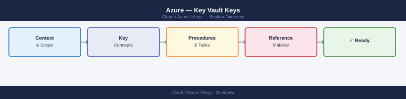

---
tags:
  - azure
  - security
---
# Azure — Key Vault Keys


<div class="kb-summary">
Key Vault keys are cryptographic keys used for encryption, signing, and wrapping operations. Unlike secrets, keys are never exported as plaintext — all cryptographic operations happen within Key Vault (or the HSM).

*Applies to: Azure*
</div>



```d2
direction: right

center: "Azure" {shape: hexagon}
key_types: "Key Types" {shape: rectangle}
key_operations: "Key Operations" {shape: rectangle}
creating_keys: "Creating Keys" {shape: rectangle}
key_rotation: "Key Rotation" {shape: rectangle}
key_versions: "Key Versions" {shape: rectangle}
byok_bring_your_own_key: "BYOK — Bring Your Own Key" {shape: rectangle}

center -> key_types
center -> key_operations
center -> creating_keys
center -> key_rotation
center -> key_versions
center -> byok_bring_your_own_key
```

## Before you begin

- **Access:** Admin credentials on all affected systems
- **Change management:** security changes require CAB approval in most environments
- **Rollback plan:** document current state before any security control change
- **Testing:** validate in a non-production environment first where possible

---

## Key Types

| Type | Algorithm family | Key sizes | Supports HSM backing |
|---|---|---|---|
| **RSA** | RSA | 2048, 3072, 4096 | Yes (Premium/Managed HSM) |
| **EC** | Elliptic Curve | P-256, P-256K, P-384, P-521 | Yes |
| **oct** (symmetric) | AES | 128, 192, 256 | Managed HSM only |

## Key Operations

| Operation | Description |
|---|---|
| `encrypt` / `decrypt` | Encrypt/decrypt data directly with the key |
| `wrapKey` / `unwrapKey` | Wrap/unwrap another key (envelope encryption) |
| `sign` / `verify` | Generate/verify digital signatures |
| `import` | Import external key material |
| `backup` / `restore` | Export encrypted key backup (vault-to-vault within same geography) |

## Creating Keys

```bash
# Create RSA key (software-backed)
az keyvault key create \
  --vault-name <vault-name> \
  --name "my-rsa-key" \
  --kty RSA \
  --size 4096

# Create EC key
az keyvault key create \
  --vault-name <vault-name> \
  --name "my-ec-key" \
  --kty EC \
  --curve P-256

# Create HSM-backed RSA key (Premium vault required)
az keyvault key create \
  --vault-name <vault-name> \
  --name "my-hsm-key" \
  --kty RSA-HSM \
  --size 4096

# Create key with expiry and rotation policy
az keyvault key create \
  --vault-name <vault-name> \
  --name "cmk-storage" \
  --kty RSA \
  --size 4096 \
  --expires "2027-01-01T00:00:00Z"
```

## Key Rotation

```bash
# Manually rotate a key (creates new version; old version retained)
az keyvault key rotate --vault-name <vault-name> --name "my-rsa-key"

# Set automatic rotation policy (rotate every 12 months)
az keyvault key rotation-policy update \
  --vault-name <vault-name> \
  --name "my-rsa-key" \
  --value '{
    "lifetimeActions": [
      {
        "trigger": {"timeAfterCreate": "P12M"},
        "action": {"type": "Rotate"}
      },
      {
        "trigger": {"timeBeforeExpiry": "P30D"},
        "action": {"type": "Notify"}
      }
    ],
    "attributes": {
      "expiryTime": "P18M"
    }
  }'

# Get current rotation policy
az keyvault key rotation-policy show --vault-name <vault-name> --name "my-rsa-key"
```

## Key Versions

Each rotation or import creates a new key version. Azure services using a CMK can be configured to auto-update to the latest version or pin to a specific version.

```bash
# List all versions of a key
az keyvault key list-versions --vault-name <vault-name> --name "my-rsa-key" --output table

# Get a specific version
az keyvault key show \
  --vault-name <vault-name> \
  --name "my-rsa-key" \
  --version <version-id>

# Disable an old key version
az keyvault key set-attributes \
  --vault-name <vault-name> \
  --name "my-rsa-key" \
  --version <old-version-id> \
  --enabled false
```

## BYOK — Bring Your Own Key

Import externally generated key material into Key Vault (HSM-backed vaults only for HSM-protected keys).

```bash
# Download KEK (Key Exchange Key) from the vault
az keyvault key download \
  --vault-name <vault-name> \
  --name "byok-kek" \
  --file kek.pem

# Generate key on-premises with your HSM, wrap with KEK, export as .byok file
# (process is HSM-vendor specific — refer to vendor BYOK guide)

# Import the wrapped key
az keyvault key import \
  --vault-name <vault-name> \
  --name "imported-key" \
  --byok-file wrapped-key.byok \
  --kty RSA-HSM
```

## Using Keys for Crypto Operations

```bash
# Encrypt a value (base64 plaintext input)
az keyvault key encrypt \
  --vault-name <vault-name> \
  --name "my-rsa-key" \
  --algorithm RSA-OAEP \
  --value "$(echo -n 'secret data' | base64)"

# Decrypt (base64 ciphertext input)
az keyvault key decrypt \
  --vault-name <vault-name> \
  --name "my-rsa-key" \
  --algorithm RSA-OAEP \
  --value "<base64-ciphertext>"

# Sign a digest
az keyvault key sign \
  --vault-name <vault-name> \
  --name "my-rsa-key" \
  --algorithm RS256 \
  --digest "$(echo -n 'data to sign' | sha256sum | awk '{print $1}')"
```

## Customer-Managed Keys (CMK)

Azure services (Storage, SQL, Disk Encryption) can use a Key Vault key as a CMK instead of Microsoft-managed keys.

```bash
# Example: Enable CMK for a storage account
az storage account update \
  --name <storage-account> \
  --resource-group <rg> \
  --encryption-key-source Microsoft.Keyvault \
  --encryption-key-vault https://<vault-name>.vault.azure.net \
  --encryption-key-name "cmk-storage" \
  --encryption-key-version ""   # empty = always use latest version
```

## Common Issues

| Symptom | Cause | Resolution |
|---|---|---|
| `Forbidden` on key operation | Missing Crypto User role or wrong operation type | Assign `Key Vault Crypto User`; verify allowed operations on the key |
| CMK service can't access key | Service identity lacks Key Vault Crypto Service Encryption User role | Assign role to the service's managed identity |
| Key rotation breaks CMK service | Service pinned to old key version and auto-update disabled | Configure CMK to use latest version (empty version ID) |
| Cannot delete key | Soft-delete and purge protection prevent immediate deletion | Wait out soft-delete retention; disable old key version instead |
| HSM-backed key creation fails | Vault SKU is Standard (not Premium) | Upgrade vault to Premium or use Managed HSM |
