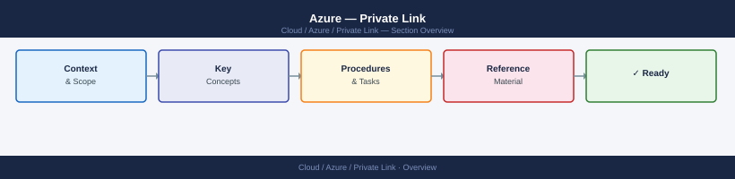

---
tags:
  - azure
  - security
---
# Azure — Private Link


<div class="kb-summary">
Azure Private Link enables private connectivity to Azure PaaS services (Storage, Key Vault, SQL, etc.) over a private endpoint in your VNet — eliminating exposure to the public internet.

*Applies to: Azure*
</div>



## Before you begin

- **Access:** Admin credentials on all affected systems
- **Change management:** security changes require CAB approval in most environments
- **Rollback plan:** document current state before any security control change
- **Testing:** validate in a non-production environment first where possible

---

## Concepts

| Term | Definition |
|---|---|
| **Private Link Service** | The Azure PaaS service resource being accessed privately |
| **Private Endpoint** | A NIC with a private IP in your VNet, connected to the Private Link Service |
| **Private DNS Zone** | Azure DNS zone that resolves the service's public FQDN to the private IP |
| **DNS zone link** | Association between the Private DNS Zone and a VNet |

## Traffic Flow

```text
App (in VNet) → resolves storage.blob.core.windows.net
                → Private DNS Zone overrides → 10.1.0.5 (private endpoint IP)
                → Traffic stays within VNet / Azure backbone
                → Never traverses internet
```

Without Private Link, resolution returns a public IP and traffic exits to the internet (even if using a service endpoint).

## Creating a Private Endpoint

```bash
# Example: Key Vault private endpoint

# 1. Disable public access on the vault
az keyvault update \
  --name <vault-name> \
  --resource-group <rg> \
  --public-network-access Disabled

# 2. Create the private endpoint
az network private-endpoint create \
  --name "<vault-name>-pe" \
  --resource-group <rg> \
  --vnet-name <vnet-name> \
  --subnet <subnet-name> \
  --private-connection-resource-id \
    /subscriptions/<sub-id>/resourceGroups/<rg>/providers/Microsoft.KeyVault/vaults/<vault-name> \
  --group-id vault \
  --connection-name "<vault-name>-connection"

# 3. Get the private endpoint NIC IP
PE_IP=$(az network private-endpoint show \
  --name "<vault-name>-pe" \
  --resource-group <rg> \
  --query 'customDnsConfigs[0].ipAddresses[0]' --output tsv)

echo "Private endpoint IP: $PE_IP"
```

## DNS Configuration

### Private DNS Zone setup

```bash
# Create private DNS zone for Key Vault
az network private-dns zone create \
  --resource-group <rg> \
  --name "privatelink.vaultcore.azure.net"

# Link DNS zone to VNet
az network private-dns link vnet create \
  --resource-group <rg> \
  --zone-name "privatelink.vaultcore.azure.net" \
  --name "<vnet-name>-link" \
  --virtual-network <vnet-name> \
  --registration-enabled false

# Add A record pointing to private endpoint IP
az network private-dns record-set a create \
  --resource-group <rg> \
  --zone-name "privatelink.vaultcore.azure.net" \
  --name <vault-name>

az network private-dns record-set a add-record \
  --resource-group <rg> \
  --zone-name "privatelink.vaultcore.azure.net" \
  --record-set-name <vault-name> \
  --ipv4-address "$PE_IP"
```

### Auto-registration via `privateDnsZoneGroup`

```bash
# Attach private DNS zone group to the endpoint (auto-registers the A record)
az network private-endpoint dns-zone-group create \
  --endpoint-name "<vault-name>-pe" \
  --resource-group <rg> \
  --name "default" \
  --private-dns-zone /subscriptions/<sub-id>/resourceGroups/<rg>/providers/Microsoft.Network/privateDnsZones/privatelink.vaultcore.azure.net \
  --zone-name "privatelink.vaultcore.azure.net"
```

## Private DNS Zones by Service

| Service | Private DNS Zone |
|---|---|
| Key Vault | `privatelink.vaultcore.azure.net` |
| Storage (blob) | `privatelink.blob.core.windows.net` |
| Storage (file) | `privatelink.file.core.windows.net` |
| Storage (queue) | `privatelink.queue.core.windows.net` |
| Azure SQL | `privatelink.database.windows.net` |
| Azure Container Registry | `privatelink.azurecr.io` |
| AKS API server | `<guid>.privatelink.<region>.azmk8s.io` |
| Event Hub / Service Bus | `privatelink.servicebus.windows.net` |
| App Service | `privatelink.azurewebsites.net` |

## Validating Connectivity

```bash
# From a VM in the VNet — verify DNS resolves to private IP
nslookup <vault-name>.vault.azure.net
# Should return 10.x.x.x (private IP), not 52.x.x.x (public)

# Test TCP connectivity to private endpoint
nc -zv <vault-name>.vault.azure.net 443

# From outside the VNet (on-premises via VPN/ExpressRoute)
nslookup <vault-name>.vault.azure.net <dns-server-in-vnet>
```

## On-Premises Access via ExpressRoute / VPN

For on-premises hosts to reach private endpoints, they must:

1. Route traffic over ExpressRoute or VPN to the VNet.
2. Resolve the service FQDN to the private IP — either:
   - Configure on-prem DNS to forward the `privatelink.*` zone to Azure DNS (168.63.129.16), or
   - Add a static A record in on-prem DNS for the service FQDN pointing to the private endpoint IP.

## Common Issues

| Symptom | Cause | Resolution |
|---|---|---|
| Service still resolves to public IP | Private DNS zone not linked to VNet | Verify: `az network private-dns link vnet list --zone-name <zone>` |
| 403 from VM in same VNet | Public access disabled but endpoint connection not approved | Check endpoint connection state: `az network private-endpoint show` → `privateLinkServiceConnectionState.status` should be `Approved` |
| On-prem hosts cannot reach private endpoint | DNS not forwarding to Azure; traffic not routing via VPN/ER | Set up DNS conditional forwarder for `privatelink.*` zones to 168.63.129.16 |
| Endpoint works but traffic slow | NSG on endpoint subnet blocking or hairpinning | Verify NSG allows traffic from app subnet to private endpoint subnet on required port |
| Multiple VNets need access | DNS zone only linked to one VNet | Link the private DNS zone to each VNet that needs resolution |
