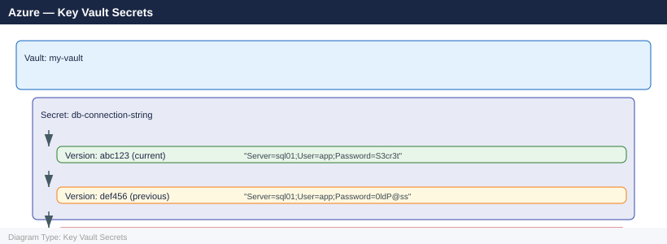

---
tags:
  - azure
  - security
---
# Azure — Key Vault Secrets

<div class="kb-summary">
Key Vault secrets store arbitrary string values — passwords, connection strings, API keys, tokens — with versioning, expiry, access control, and audit logging.

*Applies to: Azure*
</div>

## Before you begin

- **Access:** Admin credentials on all affected systems
- **Change management:** security changes require CAB approval in most environments
- **Rollback plan:** document current state before any security control change
- **Testing:** validate in a non-production environment first where possible

---

## Secret Structure



Each `set` operation creates a new version. The current version is the most recently set enabled version.

## Managing Secrets

```bash
# Create / update a secret (creates new version)
az keyvault secret set \
  --vault-name <vault-name> \
  --name "db-password" \
  --value "S3cur3P@ss!"

# Set with expiry and content type
az keyvault secret set \
  --vault-name <vault-name> \
  --name "api-key" \
  --value "<api-key-value>" \
  --expires "2026-12-31T00:00:00Z" \
  --content-type "application/x-api-key"

# Read current value
az keyvault secret show \
  --vault-name <vault-name> \
  --name "db-password" \
  --query value --output tsv

# Read a specific version
az keyvault secret show \
  --vault-name <vault-name> \
  --name "db-password" \
  --version <version-id> \
  --query value --output tsv

# List secrets (names only — values require Secrets User role)
az keyvault secret list --vault-name <vault-name> --output table

# List all versions of a secret
az keyvault secret list-versions \
  --vault-name <vault-name> \
  --name "db-password" \
  --output table

# Disable a specific version
az keyvault secret set-attributes \
  --vault-name <vault-name> \
  --name "db-password" \
  --version <version-id> \
  --enabled false

# Delete (soft-delete — recoverable)
az keyvault secret delete --vault-name <vault-name> --name "db-password"

# Recover deleted secret
az keyvault secret recover --vault-name <vault-name> --name "db-password"
```


```text title="Expected output"
{
  "attributes": {
    "created": 1704067200,
    "enabled": true,
    "expires": 1767139200,
    "recoveryLevel": "Recoverable+Purgeable",
    "updated": 1704067200
  },
  "contentType": "application/x-api-key",
  "id": "https://prod-vault-01.vault.azure.net/secrets/api-key/a7f2c9e1d4b6f8a3c5e7g9h2j4k6m8n0",
  "name": "api-key",
  "value": null
}
S3cur3P@ss!
Name                 Enabled    Expires             Updated
-------------------  ---------  ------------------  ----------
db-password          True       2026-12-31 00:00    2025-01-09
api-key              True       2026-12-31 00:00    2025-01-09
Name                 Enabled    Version                              Created
-------------------  ---------  ------------------------------------  ----------
db-password          True       a7f2c9e1d4b6f8a3c5e7g9h2j4k6m8n0    2025-01-09
db-password          False      b2e3d4f5g6h7i8j9k0l1m2n3o4p5q6r7    2025-01-08
db-password          True       c9h8i7j6k5l4m3n2o1p0q9r8s7t6u5v4    2025-01-07
(no output — command completes silently)
{
  "attributes": {
    "created": 1704067200,
    "enabled": false,
    "expires": null,
    "recoveryLevel": "Recoverable+Purgeable",
    "updated": 1704153600
  },
  "deletedDate": 1704240000,
  "id": "https://prod-vault-01.vault.azure.net/secrets/db-password",
  "name": "db-password",
  "recoveryId": "https://prod-vault-01.vault.azure.net/deletedSecrets/db-password/a7f2c9e1d4b6f8a3c5e7g9h2j4k6m8n0",
  "scheduledPurgeDate": 1711918800
}
{
  "attributes": {
    "created": 1704067200,
    "enabled": true,
    "recoveryLevel": "Recoverable+Purgeable",
    "updated": 1704240000
  },
  "id": "https://prod-vault-01.vault.azure.net/secrets/db-password/a7f2c9e1d4b6f8a3c5e7g9h2j4k6m8n0",
  "name": "db-password"
}
```

!!! warning "Common errors"
    **`The user, group or application 'appid=12345678-1234-1234-1234-123456789012;oid=87654321-4321-4321-4321-210987654321' does not have secrets set permission on key vault
## Secret References in Azure Services

### App Service — Key Vault Reference

Reference secrets directly in App Service configuration without copying them.

```bash
# Get the secret URI
SECRET_URI=$(az keyvault secret show \
  --vault-name <vault-name> \
  --name "db-password" \
  --query id --output tsv)

# Set App Service config to reference the secret
az webapp config appsettings set \
  --name <app-name> \
  --resource-group <rg> \
  --settings "DB_PASSWORD=@Microsoft.KeyVault(SecretUri=${SECRET_URI})"
```


```text title="Expected output"
/subscriptions/a1b2c3d4-e5f6-47g8-h9i0-j1k2l3m4n5o6/resourceGroups/prod-rg/providers/Microsoft.KeyVault/vaults/prod-vault/secrets/db-password/7f8e9d0c1b2a3f4e5d6c7b8a9f0e1d2c
[
  {
    "name": "DB_PASSWORD",
    "slotSetting": false,
    "value": "@Microsoft.KeyVault(SecretUri=/subscriptions/a1b2c3d4-e5f6-47g8-h9i0-j1k2l3m4n5o6/resourceGroups/prod-rg/providers/Microsoft.KeyVault/vaults/prod-vault/secrets/db-password/7f8e9d0c1b2a3f4e5d6c7b8a9f0e1d2c)"
  }
]
```

!!! warning "Common errors"
    **`ERROR: (ResourceNotFound) The Resource 'Microsoft.KeyVault/vaults/<vault-name>' under resource group '<rg>' was not found.`** — Verify the vault name and resource group are correct, and that your subscription has access to them.
    **`ERROR: The user, group or application does not have the 'get' permission to perform action 'Microsoft.KeyVault/vaults/secrets/getSecret/action' on the requested resource.`** — Grant your user or service principal the "Key Vault Secrets User" role on the vault using `az role assignment create`.
    **`ERROR: (BadRequest) The App Service '<app-name>' could not be found under resource group '<rg>'.`** — Confirm the app name and resource group exist and match your target App Service instance.
The App Service managed identity must have `Key Vault Secrets User` role on the vault.

### AKS — External Secrets Operator (ESO)

```yaml
# ExternalSecret — pulls from Key Vault and creates a Kubernetes Secret
apiVersion: external-secrets.io/v1beta1
kind: ExternalSecret
metadata:
  name: db-credentials
spec:
  refreshInterval: 1h
  secretStoreRef:
    name: azure-keyvault-store
    kind: SecretStore
  target:
    name: db-credentials
  data:
    - secretKey: password
      remoteRef:
        key: db-password
```

### AKS — CSI Secret Store Driver

```yaml
# SecretProviderClass
apiVersion: secrets-store.csi.x-k8s.io/v1
kind: SecretProviderClass
metadata:
  name: azure-kv-secrets
spec:
  provider: azure
  parameters:
    usePodIdentity: "false"
    clientID: "<managed-identity-client-id>"
    keyvaultName: <vault-name>
    objects: |
      array:
        - |
          objectName: db-password
          objectType: secret
    tenantID: <tenant-id>
```

## Secret Rotation

Secret rotation is a manual process (or automated via Event Grid + Azure Functions):

```text
Pattern: dual-secret rotation
  1. Generate new credential and write to secret (new version)
  2. Update application to use new version
  3. Revoke old credential
  4. Disable old secret version
```

```bash
# Write new version
az keyvault secret set --vault-name <vault-name> --name "db-password" --value "<new-password>"

# After confirming app works on new version, disable old version
az keyvault secret set-attributes \
  --vault-name <vault-name> \
  --name "db-password" \
  --version <old-version-id> \
  --enabled false
```


```text title="Expected output"
{
  "attributes": {
    "created": 1699564821,
    "enabled": true,
    "expires": null,
    "notBefore": null,
    "recoveryLevel": "Recoverable+Purgeable",
    "updated": 1699564821
  },
  "id": "https://prod-vault-eastus.vault.azure.net/secrets/db-password/a7f2c9e1d4b6f8a3e5c7d9f1b3a5c7e9",
  "name": "db-password",
  "value": null
}
{
  "attributes": {
    "created": 1699564701,
    "enabled": false,
    "expires": null,
    "notBefore": null,
    "recoveryLevel": "Recoverable+Purgeable",
    "updated": 1699564821
  },
  "id": "https://prod-vault-eastus.vault.azure.net/secrets/db-password/f1e2d3c4b5a6f7e8d9c0b1a2f3e4d5c6",
  "name": "db-password",
  "version": "f1e2d3c4b5a6f7e8d9c0b1a2f3e4d5c6"
}
```

!!! warning "Common errors"
    **`The user, group or application 'appid=<id>;oid=<oid>;iss=...' does not have secrets set permission on key vault 'prod-vault-eastus'`** — Ensure your Azure service principal or user account has the "Key Vault Secrets Officer" role assigned on the vault.
    **`The specified version of the secret does not exist`** — Verify the version ID is correct by running `az keyvault secret list-versions --vault-name <vault-name> --name "db-password"` to list all available versions.
## Monitoring Secret Expiry

```bash
# List secrets expiring within 30 days
az keyvault secret list --vault-name <vault-name> --query \
  "[?attributes.expires != null && attributes.expires < '$(date -u -d '+30 days' +%Y-%m-%dT%H:%M:%SZ)'].{name:name, expires:attributes.expires}" \
  --output table
```


```text title="Expected output"
Name                          Expires
--------------------------------  --------------------------
db-password-prod              2025-02-15T10:30:00+00:00
api-key-staging               2025-02-18T14:22:15+00:00
tls-cert-renewal              2025-02-20T09:15:45+00:00
oauth-client-secret           2025-02-22T16:45:30+00:00
backup-encryption-key         2025-02-25T11:00:00+00:00
```

!!! warning "Common errors"
    **`The user does not have permissions to list secrets in this key vault.`** — Ensure your Azure account has the `Key Vault Secrets Officer` or `Key Vault Administrator` role assigned on the vault via RBAC.
    **`ResourceNotFound: The specified vault does not exist.`** — Verify the vault name is correct and exists in your current subscription with `az keyvault list`.
    **`date: invalid date '+30 days'`** — Use `date -u -d '+30 days' +%Y-%m-%dT%H:%M:%SZ` on Linux or `date -u -v+30d +%Y-%m-%dT%H:%M:%SZ` on macOS.
Log Analytics alert for expiring secrets:

```kusto
AzureDiagnostics
| where ResourceType == "VAULTS" and Category == "AuditEvent"
| where OperationName == "SecretGet" and ResultType == "Success"
| extend SecretName = tostring(id_s)
| summarize LastAccessed=max(TimeGenerated) by SecretName
```

## Common Issues

| Symptom | Cause | Resolution |
|---|---|---|
| App returns empty string for secret reference | Managed identity lacks Secrets User role | Assign `Key Vault Secrets User` to the app's identity |
| App Service reference shows `Microsoft.KeyVault(...)` instead of value | App hasn't restarted after config change, or vault reference URL malformed | Restart app; verify URI format includes `/secrets/` path |
| Secret value is stale in app | App caches config at startup; Key Vault references refresh on app restart | Restart app or use SDK to read secrets dynamically |
| Secret version missing | Deleted and purge-protected vault | List deleted: `az keyvault secret list-deleted --vault-name <vault>` |
| Cannot list secrets | Missing `Key Vault Reader` or `Secrets Officer` on control plane | `az role assignment list --scope /subscriptions/.../vaults/<vault>` |
