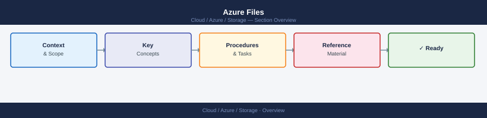
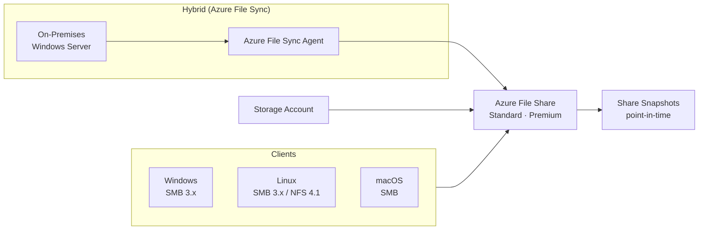

---
tags:
  - azure
---
# Azure Files


<div class="kb-summary">
Azure Files reference covering Overview, Azure Files Architecture, Creating File Shares, Mounting on Linux, Mounting on Windows and 3 more sections.

*Applies to: Azure*
</div>



## Overview

Azure Files provides fully managed cloud file shares accessible via SMB (2.1, 3.0, 3.1.1) and NFS 4.1 protocols. Shares are hosted in Storage Accounts and can be mounted on Windows, Linux, and macOS. Azure File Sync extends Azure Files to on-premises Windows Server environments.

## Azure Files Architecture



## Creating File Shares

```bash
# Set variables
RG="rg-storage-prod"
SA="stprodfiles01"
SHARE="fileshare01"

# Create a file share (standard tier, 100 GiB quota)
az storage share create \
  --account-name $SA \
  --name $SHARE \
  --quota 100

# Create a premium file share (SSD, higher IOPS)
az storage share-rm create \
  --resource-group $RG \
  --storage-account $SA \
  --name "premium-share01" \
  --quota 1024 \
  --enabled-protocols SMB

# List shares in a storage account
az storage share list \
  --account-name $SA \
  --output table

# Get share properties including current usage
az storage share show \
  --account-name $SA \
  --name $SHARE
```

## Mounting on Linux

```bash
# Install CIFS utilities
sudo apt-get install cifs-utils     # Debian/Ubuntu
sudo dnf install cifs-utils         # RHEL/Rocky

# Create mount point
sudo mkdir -p /mnt/azurefiles

# Get storage account key
KEY=$(az storage account keys list \
  --resource-group $RG \
  --account-name $SA \
  --query "[0].value" -o tsv)

# Mount the share
sudo mount -t cifs //$SA.file.core.windows.net/$SHARE /mnt/azurefiles \
  -o vers=3.0,username=$SA,password=$KEY,serverino,nosharesock,actimeo=30

# Add to /etc/fstab for persistence
echo "//$SA.file.core.windows.net/$SHARE /mnt/azurefiles cifs vers=3.0,username=$SA,password=$KEY,serverino,nosharesock,actimeo=30 0 0" \
  | sudo tee -a /etc/fstab
```

## Mounting on Windows

```powershell
# Mount using drive letter Z:
$connectTestResult = Test-NetConnection -ComputerName stprodfiles01.file.core.windows.net -Port 445
if ($connectTestResult.TcpTestSucceeded) {
    $acctKey = (Get-AzStorageAccountKey -ResourceGroupName "rg-storage-prod" -Name "stprodfiles01")[0].Value
    net use Z: \\stprodfiles01.file.core.windows.net\fileshare01 /user:Azure\stprodfiles01 $acctKey /persistent:Yes
}
```

## Azure File Sync

Azure File Sync caches Azure Files share content on Windows Server, reducing WAN traffic:

```bash
# Register a Windows Server with File Sync
az storagesync server register \
  --resource-group $RG \
  --storage-sync-service "sss-prod" \
  --server-endpoint-name "server01-endpoint" \
  --server-local-path "D:\SyncedData" \
  --cloud-tiering Enabled \
  --volume-free-space-percent 20
```

## Share Types and Tiers

| Tier | Protocol | Min Size | Max IOPS | Use Case |
|---|---|---|---|---|
| Standard (Transaction Optimized) | SMB, NFS | 1 GiB | 1,000 baseline | General file shares |
| Standard (Hot) | SMB, NFS | 1 GiB | 1,000 baseline | Frequently accessed |
| Standard (Cool) | SMB | 1 GiB | 1,000 baseline | Archival, lower cost |
| Premium (SSD) | SMB, NFS | 100 GiB | 100 + 1/GiB | Databases, high IOPS |

## Backup and Snapshot

```bash
# Enable backup on a file share via Azure Backup
az backup protection enable-for-azurefileshare \
  --resource-group $RG \
  --vault-name "rsv-prod" \
  --storage-account $SA \
  --azure-file-share $SHARE \
  --policy-name "DailyBackupPolicy"

# List share snapshots
az storage share list \
  --account-name $SA \
  --include-snapshots \
  --output table

# Create a manual snapshot
az storage share snapshot \
  --account-name $SA \
  --name $SHARE

# Restore a file from snapshot
az storage file copy start \
  --account-name $SA \
  --source-share $SHARE \
  --source-snapshot "<snapshot-datetime>" \
  --source-path "folder/file.txt" \
  --destination-share $SHARE \
  --destination-path "folder/file-restored.txt"
```
