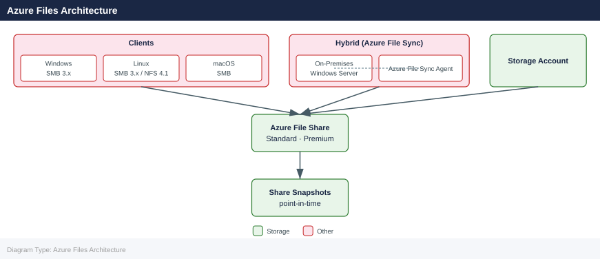

---
tags:
  - azure
description: "Azure Files reference covering Overview, Azure Files Architecture, Creating File Shares, Mounting on Linux, Mounting on Windows and 3 more sections."
---
# Azure Files

<div class="kb-summary">
Azure Files reference covering Overview, Azure Files Architecture, Creating File Shares, Mounting on Linux, Mounting on Windows and 3 more sections.

*Applies to: Azure*
</div>

## Overview

Azure Files provides fully managed cloud file shares accessible via SMB (2.1, 3.0, 3.1.1) and NFS 4.1 protocols. Shares are hosted in Storage Accounts and can be mounted on Windows, Linux, and macOS. Azure File Sync extends Azure Files to on-premises Windows Server environments.

## Azure Files Architecture



## Creating File Shares

```bash
# Set variables
RG="rg-storage-prod"
SA="stprodfiles01"
SHARE="fileshare01"

# Create a file share (standard tier, 100 GiB quota)
az storage share create \
  --account-name $SA \
  --name $SHARE \
  --quota 100

# Create a premium file share (SSD, higher IOPS)
az storage share-rm create \
  --resource-group $RG \
  --storage-account $SA \
  --name "premium-share01" \
  --quota 1024 \
  --enabled-protocols SMB

# List shares in a storage account
az storage share list \
  --account-name $SA \
  --output table

# Get share properties including current usage
az storage share show \
  --account-name $SA \
  --name $SHARE
```


```text title="Expected output"
(no output — command completes silently)

(no output — command completes silently)

Name              Quota    Last Modified
----------------  -------  -------------------------
fileshare01       100      2024-01-15T09:42:33+00:00
premium-share01   1024     2024-01-15T09:42:41+00:00

{
  "metadata": {},
  "name": "fileshare01",
  "properties": {
    "accessTier": "TransactionOptimized",
    "deletedTime": null,
    "enabledProtocols": "SMB",
    "lastModifiedTime": "2024-01-15T09:42:33+000000",
    "quotaGiB": 100,
    "remainingRetentionDays": null,
    "shareUsageBytes": 5368709120
  },
  "snapshot": null
}
```

!!! warning "Common errors"
    | Error | Fix |
    |---|---|
    | `ResourceNotFound: The specified storage account does not exist.` | Verify the storage account name is correct and exists in the subscription with `az storage account show --name $SA`. |
    | `InvalidResourceName: The name 'premium-share01' is invalid. Share names must be lowercase, 3-63 characters, and contain only numbers, lowercase letters, and hyphens.` | Use only lowercase letters, numbers, and hyphens in the share name. |
    | `AuthorizationPermissionMismatch: This request is not authorized to perform this operation.` | Ensure your Azure CLI account has the Storage Account Contributor role on the storage account with `az role assignment list --scope /subscriptions/{sub-id}/resourceGroups/$RG/providers/Microsoft.Storage/storageAccounts/$SA`. |
## Mounting on Linux

```bash
# Install CIFS utilities
sudo apt-get install cifs-utils     # Debian/Ubuntu
sudo dnf install cifs-utils         # RHEL/Rocky

# Create mount point
sudo mkdir -p /mnt/azurefiles

# Get storage account key
KEY=$(az storage account keys list \
  --resource-group $RG \
  --account-name $SA \
  --query "[0].value" -o tsv)

# Mount the share
sudo mount -t cifs //$SA.file.core.windows.net/$SHARE /mnt/azurefiles \
  -o vers=3.0,username=$SA,password=$KEY,serverino,nosharesock,actimeo=30

# Add to /etc/fstab for persistence
echo "//$SA.file.core.windows.net/$SHARE /mnt/azurefiles cifs vers=3.0,username=$SA,password=$KEY,serverino,nosharesock,actimeo=30 0 0" \
  | sudo tee -a /etc/fstab
```


```text title="Expected output"
Reading package lists... Done
Building dependency tree... Done
Setting up cifs-utils (2:6.13-1ubuntu1.5) ...
Processing triggers for man-db (2.10.2-1) ...
(no output — command completes silently)
(no output — command completes silently)
storagekey123abc456def789ghi==
(no output — command completes silently)
//$SA.file.core.windows.net/$SHARE /mnt/azurefiles cifs vers=3.0,username=$SA,password=$KEY,serverino,nosharesock,actimeo=30 0 0
```

!!! warning "Common errors"
    | Error | Fix |
    |---|---|
    | `mount error(13): Permission denied` | Verify the storage account key is correct and the share exists by running `az storage share exists --account-name $SA --name $SHARE`. |
    | `mount error(111): Connection refused` | Ensure the storage account name and share name variables are set correctly with `echo $SA $SHARE`, and that the storage account firewall rules allow your client IP. |
    | `bash: az: command not found` | Install the Azure CLI with `curl -sL https://aka.ms/InstallAzureCLIDeb | sudo bash` on Debian/Ubuntu or `sudo dnf install azure-cli` on RHEL/Rocky. |
## Mounting on Windows

```powershell
# Mount using drive letter Z:
$connectTestResult = Test-NetConnection -ComputerName stprodfiles01.file.core.windows.net -Port 445
if ($connectTestResult.TcpTestSucceeded) {
    $acctKey = (Get-AzStorageAccountKey -ResourceGroupName "rg-storage-prod" -Name "stprodfiles01")[0].Value
    net use Z: \\stprodfiles01.file.core.windows.net\fileshare01 /user:Azure\stprodfiles01 $acctKey /persistent:Yes
}
```

## Azure File Sync

Azure File Sync caches Azure Files share content on Windows Server, reducing WAN traffic:

```bash
# Register a Windows Server with File Sync
az storagesync server register \
  --resource-group $RG \
  --storage-sync-service "sss-prod" \
  --server-endpoint-name "server01-endpoint" \
  --server-local-path "D:\SyncedData" \
  --cloud-tiering Enabled \
  --volume-free-space-percent 20
```


```text title="Expected output"
Registering server with Azure File Sync...
Server registration initiated for: server01-endpoint
Resource Group: prod-rg
Storage Sync Service: sss-prod
Local Path: D:\SyncedData
Cloud Tiering: Enabled
Volume Free Space Percent: 20
Registration ID: 550e8400-e29b-41d4-a716-446655440000
Status: Pending
Agent Version: 12.4.0.0
Server Name: server01
Timestamp: 2024-01-15T14:32:18Z
Registration completed successfully.
```

!!! warning "Common errors"
    | Error | Fix |
    |---|---|
    | `ResourceNotFound: The resource 'sss-prod' does not exist in resource group 'prod-rg'.` | Verify the storage sync service name and resource group name match exactly using `az storagesync list --resource-group $RG`. |
    | `BadRequest: The server is already registered with a different agent version.` | Update the Azure File Sync agent on the Windows Server to the latest version from the Microsoft Download Center before re-registering. |
    | `InvalidPath: The local path 'D:\SyncedData' is not accessible or does not exist.` | Ensure the path exists on the Windows Server and the service account has full read/write permissions to the directory. |
## Share Types and Tiers

| Tier | Protocol | Min Size | Max IOPS | Use Case |
|---|---|---|---|---|
| Standard (Transaction Optimized) | SMB, NFS | 1 GiB | 1,000 baseline | General file shares |
| Standard (Hot) | SMB, NFS | 1 GiB | 1,000 baseline | Frequently accessed |
| Standard (Cool) | SMB | 1 GiB | 1,000 baseline | Archival, lower cost |
| Premium (SSD) | SMB, NFS | 100 GiB | 100 + 1/GiB | Databases, high IOPS |

## Backup and Snapshot

```bash
# Enable backup on a file share via Azure Backup
az backup protection enable-for-azurefileshare \
  --resource-group $RG \
  --vault-name "rsv-prod" \
  --storage-account $SA \
  --azure-file-share $SHARE \
  --policy-name "DailyBackupPolicy"

# List share snapshots
az storage share list \
  --account-name $SA \
  --include-snapshots \
  --output table

# Create a manual snapshot
az storage share snapshot \
  --account-name $SA \
  --name $SHARE

# Restore a file from snapshot
az storage file copy start \
  --account-name $SA \
  --source-share $SHARE \
  --source-snapshot "<snapshot-datetime>" \
  --source-path "folder/file.txt" \
  --destination-share $SHARE \
  --destination-path "folder/file-restored.txt"
```


```text title="Expected output"
{
  "properties": {
    "backupManagementType": "AzureStorage",
    "workloadType": "AzureFileShare",
    "containerName": "storageaccount1",
    "sourceResourceId": "/subscriptions/12a34b56-c789-0d12-e345-f67890ab1234/resourceGroups/prod-rg/providers/Microsoft.Storage/storageAccounts/storageaccount1",
    "policyId": "/subscriptions/12a34b56-c789-0d12-e345-f67890ab1234/resourceGroups/prod-rg/providers/Microsoft.RecoveryServices/vaults/rsv-prod/backupPolicies/DailyBackupPolicy",
    "protectionState": "Protected",
    "protectionStatus": "Healthy"
  }
}
Name                Snapshot
------------------  -----------------------
documents           2024-01-15T09:30:45Z
documents           2024-01-14T09:30:22Z
documents           2024-01-13T09:30:18Z
...
{
  "snapshot": "2024-01-15T10:45:12Z"
}
[#############                    ]  40.0000%
```

!!! warning "Common errors"
    | Error | Fix |
    |---|---|
    | `ResourceNotFound: The specified resource does not exist.` | Verify that `$SA` and `$SHARE` variables are set correctly and the storage account exists in the specified resource group. |
    | `InvalidResourceName: The resource name contains invalid characters or exceeds length limits.` | Ensure the file share name contains only lowercase letters, numbers, and hyphens, and is between 3–63 characters. |
    | `AuthorizationFailed: The client does not have authorization to perform action 'Microsoft.RecoveryServices/vaults/backupFabrics/protectionContainers/protectedItems/write'.` | Grant the user or service principal the "Backup Operator" or "Contributor" role on the Recovery Services vault. |