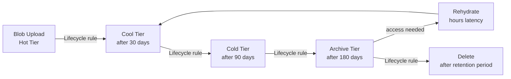

---
tags:
  - azure
---
# Azure Blob Storage

<div class="kb-summary">
Azure Blob Storage reference covering Overview, Blob Lifecycle Management Flow, Access Tiers, Lifecycle Rules, SAS Tokens and 2 more sections.

*Applies to: Azure*
</div>

## Overview

Azure Blob Storage is Microsoft's object store for unstructured data. Blobs are organised into containers within Storage Accounts. Three access tiers (Hot, Cool, Archive) control cost versus retrieval latency. Blob versioning, soft delete, and lifecycle management provide data protection and cost control.

## Blob Lifecycle Management Flow



## Access Tiers

| Tier | Access Latency | Storage Cost | Access Cost | Best For |
|---|---|---|---|---|
| Hot | Milliseconds | Highest | Lowest | Frequently accessed data |
| Cool | Milliseconds | Lower | Higher | Infrequently accessed (>30 days) |
| Cold | Milliseconds | Lower still | Higher | Rarely accessed (>90 days) |
| Archive | Hours (rehydrate first) | Lowest | Highest | Long-term retention (>180 days) |

```bash
# Set the default access tier on a storage account
az storage account update \
  --resource-group rg-storage-prod \
  --name stprodblobs01 \
  --access-tier Cool

# Change access tier on a specific blob
az storage blob set-tier \
  --account-name stprodblobs01 \
  --container-name backups \
  --name "db-backup-2026-01-01.bak" \
  --tier Archive

# Rehydrate an archived blob to Hot tier
az storage blob set-tier \
  --account-name stprodblobs01 \
  --container-name backups \
  --name "db-backup-2026-01-01.bak" \
  --tier Hot \
  --rehydrate-priority High
```

## Lifecycle Rules

Lifecycle management policies automate tier transitions and deletion based on blob age:

```bash
# View existing lifecycle policy
az storage account management-policy show \
  --resource-group rg-storage-prod \
  --account-name stprodblobs01

# Apply a lifecycle policy from a JSON file
az storage account management-policy create \
  --resource-group rg-storage-prod \
  --account-name stprodblobs01 \
  --policy @lifecycle-policy.json
```

Example `lifecycle-policy.json`:

```json
{
  "rules": [
    {
      "name": "tiering-and-expiry",
      "enabled": true,
      "type": "Lifecycle",
      "definition": {
        "filters": {
          "blobTypes": ["blockBlob"],
          "prefixMatch": ["backups/"]
        },
        "actions": {
          "baseBlob": {
            "tierToCool": {"daysAfterModificationGreaterThan": 30},
            "tierToArchive": {"daysAfterModificationGreaterThan": 90},
            "delete": {"daysAfterModificationGreaterThan": 365}
          }
        }
      }
    }
  ]
}
```

## SAS Tokens

Shared Access Signatures (SAS) delegate limited access to storage resources without exposing account keys.

```bash
# Generate a SAS token for a container (read-only, 24 hours)
az storage container generate-sas \
  --account-name stprodblobs01 \
  --name uploads \
  --permissions r \
  --expiry "$(date -u -d '1 day' '+%Y-%m-%dT%H:%MZ')" \
  --output tsv

# Generate a SAS token for a single blob
az storage blob generate-sas \
  --account-name stprodblobs01 \
  --container-name reports \
  --name "monthly-report-2026-04.pdf" \
  --permissions r \
  --expiry "2026-05-14T00:00Z" \
  --output tsv

# Generate an account-level SAS (broader scope)
az storage account generate-sas \
  --account-name stprodblobs01 \
  --services b \
  --resource-types co \
  --permissions rwdlacupx \
  --expiry "2026-05-08T00:00Z" \
  --output tsv
```

## Blob Versioning

```bash
# Enable versioning on a storage account
az storage account blob-service-properties update \
  --account-name stprodblobs01 \
  --resource-group rg-storage-prod \
  --enable-versioning true

# List versions of a specific blob
az storage blob list \
  --account-name stprodblobs01 \
  --container-name documents \
  --include v \
  --query "[?name=='report.docx']" \
  --output table

# Restore a previous version
az storage blob copy start \
  --account-name stprodblobs01 \
  --destination-container documents \
  --destination-blob "report.docx" \
  --source-uri "https://stprodblobs01.blob.core.windows.net/documents/report.docx?versionId=<version-id>"
```

## Soft Delete and Recovery

```bash
# Enable soft delete for blobs (retain for 14 days)
az storage account blob-service-properties update \
  --account-name stprodblobs01 \
  --resource-group rg-storage-prod \
  --enable-delete-retention true \
  --delete-retention-days 14

# List soft-deleted blobs
az storage blob list \
  --account-name stprodblobs01 \
  --container-name documents \
  --include d \
  --query "[?deleted==\`true\`]" \
  --output table

# Undelete a soft-deleted blob
az storage blob undelete \
  --account-name stprodblobs01 \
  --container-name documents \
  --name "deleted-file.txt"
```
