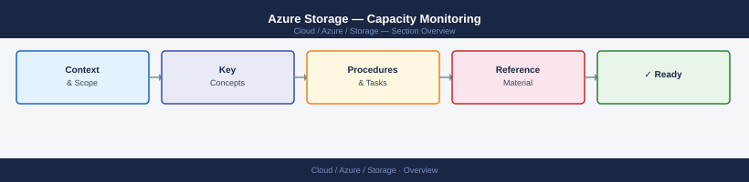

---
tags:
  - azure
---
# Azure Storage — Capacity Monitoring


<div class="kb-summary">
Capacity Monitoring reference covering Overview, Storage Account Metrics, Capacity Alerts, Container-Level Capacity, Forecasting and Trend Analysis and 1 more sections.

*Applies to: Azure*
</div>



## Overview

Monitoring storage capacity in Azure involves tracking used capacity at the account and container level, setting metric alerts before quotas are hit, and projecting growth to plan ahead. Azure Monitor provides built-in storage metrics with 93-day retention.

## Storage Account Metrics

```bash
# Get current used capacity for a storage account (bytes)
az monitor metrics list \
  --resource "/subscriptions/<sub-id>/resourceGroups/rg-storage-prod/providers/Microsoft.Storage/storageAccounts/stprodblobs01" \
  --metric "UsedCapacity" \
  --interval PT1H \
  --output table

# Get blob service used capacity
az monitor metrics list \
  --resource "/subscriptions/<sub-id>/resourceGroups/rg-storage-prod/providers/Microsoft.Storage/storageAccounts/stprodblobs01/blobServices/default" \
  --metric "BlobCapacity" \
  --aggregation Average \
  --interval P1D \
  --output table

# Get file share used capacity
az monitor metrics list \
  --resource "/subscriptions/<sub-id>/resourceGroups/rg-storage-prod/providers/Microsoft.Storage/storageAccounts/stprodfiles01/fileServices/default" \
  --metric "FileCapacity" \
  --aggregation Average \
  --interval P1D \
  --output table
```

Key storage capacity metrics:

| Metric Name | Scope | Description |
|---|---|---|
| `UsedCapacity` | Storage Account | Total bytes used across all services |
| `BlobCapacity` | Blob service | Bytes used by blobs (by tier) |
| `FileCapacity` | File service | Bytes used by file shares |
| `TableCapacity` | Table service | Bytes used by table storage |
| `QueueCapacity` | Queue service | Bytes used by queues |
| `BlobCount` | Blob service | Number of blobs in the account |

## Capacity Alerts

```bash
# Create a metric alert for blob storage capacity (alert at 80% of 1 TiB)
az monitor metrics alert create \
  --name "blob-capacity-80pct" \
  --resource-group rg-storage-prod \
  --scopes "/subscriptions/<sub-id>/resourceGroups/rg-storage-prod/providers/Microsoft.Storage/storageAccounts/stprodblobs01/blobServices/default" \
  --condition "avg BlobCapacity > 858993459200" \
  --window-size 1h \
  --evaluation-frequency 1h \
  --action "/subscriptions/<sub-id>/resourceGroups/rg-storage-prod/providers/microsoft.insights/actionGroups/ag-storage-ops" \
  --description "Blob storage exceeds 80% of 1 TiB"

# List existing metric alerts for storage
az monitor metrics alert list \
  --resource-group rg-storage-prod \
  --output table

# Disable an alert
az monitor metrics alert update \
  --name "blob-capacity-80pct" \
  --resource-group rg-storage-prod \
  --enabled false
```

## Container-Level Capacity

```bash
# List containers with their approximate sizes
az storage container list \
  --account-name stprodblobs01 \
  --output table

# Get container blob count and total size using az CLI stats
az storage blob list \
  --account-name stprodblobs01 \
  --container-name backups \
  --query "length(@)" \
  --output tsv

# Calculate total size of all blobs in a container
az storage blob list \
  --account-name stprodblobs01 \
  --container-name backups \
  --query "sum([].properties.contentLength)" \
  --output tsv

# List blobs sorted by size (largest first)
az storage blob list \
  --account-name stprodblobs01 \
  --container-name backups \
  --query "sort_by(@, &properties.contentLength) | reverse(@)[].{name:name, size:properties.contentLength}" \
  --output table
```

## Forecasting and Trend Analysis

```bash
# Pull 30 days of daily capacity data for trend analysis
az monitor metrics list \
  --resource "/subscriptions/<sub-id>/resourceGroups/rg-storage-prod/providers/Microsoft.Storage/storageAccounts/stprodblobs01/blobServices/default" \
  --metric "BlobCapacity" \
  --aggregation Average \
  --interval P1D \
  --start-time "$(date -u -d '30 days ago' '+%Y-%m-%dT%H:%MZ')" \
  --end-time "$(date -u '+%Y-%m-%dT%H:%MZ')" \
  --output json > capacity-trend.json

# Convert bytes to GiB in output for readability
cat capacity-trend.json | python3 -c "
import json,sys
data = json.load(sys.stdin)
for ts in data['value'][0]['timeseries'][0]['data']:
    gib = (ts.get('average') or 0) / 1073741824
    print(f\"{ts['timeStamp']}: {gib:.2f} GiB\")
"
```

## Storage Account Limits Reference

| Resource | Limit | Notes |
|---|---|---|
| Max storage account capacity | 5 PiB | Default; can request increase |
| Max ingress bandwidth (LRS) | 10 Gbps | Region-dependent |
| Max egress bandwidth (LRS) | 50 Gbps | Region-dependent |
| Max IOPS (block blobs) | 20,000 per account | — |
| Max containers per account | Unlimited | — |
| Max blob size (block blob) | 190.7 TiB | 50,000 blocks x 4 GiB |
