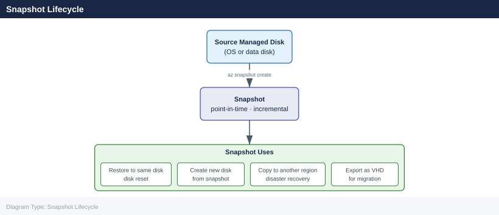

---
tags:
  - azure
description: "Azure Disk Snapshots reference covering Overview, Snapshot Lifecycle, Creating Snapshots, Snapshot vs Full Backup Comparison, Restoring from Snapshot and..."
---
# Azure Disk Snapshots

<div class="kb-summary">
Azure Disk Snapshots reference covering Overview, Snapshot Lifecycle, Creating Snapshots, Snapshot vs Full Backup Comparison, Restoring from Snapshot and 3 more sections.

*Applies to: Azure*
</div>

## Overview

Azure managed disk snapshots capture the full state of a managed disk at a point in time. Incremental snapshots store only changed blocks since the last snapshot, significantly reducing storage costs and copy time. Snapshots are stored as page blobs in Azure Storage and can be used to restore disks or copy across regions.

## Snapshot Lifecycle



## Creating Snapshots

```bash
# Full snapshot of a managed disk
az snapshot create \
  --resource-group rg-compute-prod \
  --name "snap-vm01-osdisk-20260507" \
  --source "/subscriptions/<sub-id>/resourceGroups/rg-compute-prod/providers/Microsoft.Compute/disks/vm01-osdisk" \
  --sku Standard_LRS \
  --location eastus

# Incremental snapshot (recommended — much lower cost)
az snapshot create \
  --resource-group rg-compute-prod \
  --name "snap-vm01-osdisk-20260507-incr" \
  --source "/subscriptions/<sub-id>/resourceGroups/rg-compute-prod/providers/Microsoft.Compute/disks/vm01-osdisk" \
  --incremental true \
  --sku Standard_LRS

# List all snapshots in a resource group
az snapshot list \
  --resource-group rg-compute-prod \
  --output table

# Show snapshot details including size and incremental chain
az snapshot show \
  --resource-group rg-compute-prod \
  --name "snap-vm01-osdisk-20260507-incr"
```


```text title="Expected output"
{
  "id": "/subscriptions/a1b2c3d4-e5f6-4a5b-8c9d-0e1f2a3b4c5d/resourceGroups/rg-compute-prod/providers/Microsoft.Compute/snapshots/snap-vm01-osdisk-20260507",
  "location": "eastus",
  "name": "snap-vm01-osdisk-20260507",
  "provisioningState": "Succeeded",
  "resourceGroup": "rg-compute-prod",
  "sku": {
    "name": "Standard_LRS"
  },
  "timeCreated": "2026-05-07T14:32:18.123456+00:00"
}
{
  "id": "/subscriptions/a1b2c3d4-e5f6-4a5b-8c9d-0e1f2a3b4c5d/resourceGroups/rg-compute-prod/providers/Microsoft.Compute/snapshots/snap-vm01-osdisk-20260507-incr",
  "incremental": true,
  "location": "eastus",
  "name": "snap-vm01-osdisk-20260507-incr",
  "provisioningState": "Succeeded",
  "resourceGroup": "rg-compute-prod",
  "sku": {
    "name": "Standard_LRS"
  },
  "timeCreated": "2026-05-07T14:33:45.654321+00:00"
}
ResourceGroup                Name                                    SourceResourceId                                                                                                                          TimeCreated
--------------------------  ----------------------------------------------  -----------------------------------------------  2026-05-07T14:32:18.123456+00:00
rg-compute-prod             snap-vm01-osdisk-20260507                /subscriptions/a1b2c3d4-e5f6-4a5b-8c9d-0e1f2a3b4c5d/resourceGroups/rg-compute-prod/providers/Microsoft.Compute/disks/vm01-osdisk  2026-05-07T14:32:18.123456+00:00
rg-compute-prod             snap-vm01-osdisk-20260507-incr            /subscriptions/a1b2c3d4-e5f6-4a5b-8c9d-0e1f2a3b4c5d/resourceGroups/rg-compute-prod/providers/Microsoft.Compute/disks/vm01-osdisk  2026-05-07T14:33:45.654321+00:00
{
  "diskSizeBytes": 134217728000,
  "id": "/subscriptions/a1b2c3d4-e5f6-4a5b-8c9d-0e1f2a3b4c5d/resourceGroups/rg-compute-prod/providers/Microsoft.Compute/snapshots/snap-vm01-osdisk-20260507-incr",
  "incremental": true,
  "name": "snap-vm01-osdisk-20260507-incr",
  "provision
```
## Snapshot vs Full Backup Comparison

| Property | Full Snapshot | Incremental Snapshot |
|---|---|---|
| First snapshot size | Full disk size | Full disk size |
| Subsequent sizes | Full disk size again | Changed blocks only |
| Copy speed | Slower (full copy) | Faster (delta only) |
| Storage cost | Higher | Lower |
| Restore capability | From single object | Requires snapshot chain |
| Cross-region copy | Supported | Supported |

## Restoring from Snapshot

```bash
# Create a new managed disk from a snapshot
az disk create \
  --resource-group rg-compute-prod \
  --name "vm01-osdisk-restored" \
  --source "/subscriptions/<sub-id>/resourceGroups/rg-compute-prod/providers/Microsoft.Compute/snapshots/snap-vm01-osdisk-20260507" \
  --sku Premium_LRS \
  --location eastus

# Swap the OS disk of a stopped VM to the restored disk
az vm stop --resource-group rg-compute-prod --name vm01
az vm update \
  --resource-group rg-compute-prod \
  --name vm01 \
  --os-disk "/subscriptions/<sub-id>/resourceGroups/rg-compute-prod/providers/Microsoft.Compute/disks/vm01-osdisk-restored"
az vm start --resource-group rg-compute-prod --name vm01
```


```text title="Expected output"
{
  "id": "/subscriptions/a1b2c3d4-e5f6-4a7b-8c9d-0e1f2a3b4c5d/resourceGroups/rg-compute-prod/providers/Microsoft.Compute/disks/vm01-osdisk-restored",
  "location": "eastus",
  "name": "vm01-osdisk-restored",
  "provisioningState": "Succeeded",
  "sku": {
    "name": "Premium_LRS"
  },
  "timeCreated": "2026-05-07T14:32:18.123456+00:00"
}
Request successful. Waiting for VM to stop...
VM deallocated.
{
  "id": "/subscriptions/a1b2c3d4-e5f6-4a7b-8c9d-0e1f2a3b4c5d/resourceGroups/rg-compute-prod/providers/Microsoft.Compute/virtualMachines/vm01",
  "name": "vm01",
  "osProfile": {
    "computerName": "vm01"
  },
  "storageProfile": {
    "osDisk": {
      "id": "/subscriptions/a1b2c3d4-e5f6-4a7b-8c9d-0e1f2a3b4c5d/resourceGroups/rg-compute-prod/providers/Microsoft.Compute/disks/vm01-osdisk-restored",
      "name": "vm01-osdisk-restored"
    }
  }
}
VM starting...
VM running.
```

!!! warning "Common errors"
    | Error | Fix |
    |---|---|
    | `The resource with id /subscriptions/<sub-id>/resourceGroups/rg-compute-prod/providers/Microsoft.Compute/snapshots/snap-vm01-osdisk-20260507 does not exist.` | Verify the snapshot name and subscription ID match an existing snapshot using `az snapshot list --resource-group rg-compute-prod`. |
    | `The VM 'vm01' cannot have its OS disk updated while it is in the running state.` | Ensure the VM is fully deallocated before updating the OS disk by running `az vm deallocate --resource-group rg-compute-prod --name vm01`. |
## Cross-Region Snapshot Copy

```bash
# Copy a snapshot to another region
az snapshot create \
  --resource-group rg-compute-dr \
  --name "snap-vm01-osdisk-20260507-westus" \
  --source "/subscriptions/<sub-id>/resourceGroups/rg-compute-prod/providers/Microsoft.Compute/snapshots/snap-vm01-osdisk-20260507" \
  --location westus2 \
  --sku Standard_LRS \
  --copy-start true

# Check copy status
az snapshot show \
  --resource-group rg-compute-dr \
  --name "snap-vm01-osdisk-20260507-westus" \
  --query "completionPercent"
```


```text title="Expected output"
{
  "id": "/subscriptions/a1b2c3d4-e5f6-4a7b-8c9d-0e1f2a3b4c5d/resourceGroups/rg-compute-dr/providers/Microsoft.Compute/snapshots/snap-vm01-osdisk-20260507-westus",
  "location": "westus2",
  "name": "snap-vm01-osdisk-20260507-westus",
  "provisioningState": "Succeeded",
  "resourceGroup": "rg-compute-dr",
  "sku": {
    "name": "Standard_LRS",
    "tier": "Standard"
  },
  "timeCreated": "2026-05-07T14:32:18.123456+00:00",
  "type": "Microsoft.Compute/snapshots"
}
100
```

!!! warning "Common errors"
    | Error | Fix |
    |---|---|
    | `The resource with id /subscriptions/<sub-id>/resourceGroups/rg-compute-prod/providers/Microsoft.Compute/snapshots/snap-vm01-osdisk-20260507 could not be found.` | Verify the source snapshot name and resource group exist in the source region using `az snapshot list --resource-group rg-compute-prod`. |
    | `The provided location 'westus2' is not a valid location for the subscription.` | List available regions with `az account list-locations --query "[].name"` and use a valid region name. |
    | `The resource group 'rg-compute-dr' does not exist.` | Create the target resource group first with `az group create --name rg-compute-dr --location westus2`. |
## Snapshot Retention and Cleanup

```bash
# List snapshots older than 30 days
az snapshot list \
  --resource-group rg-compute-prod \
  --query "[?timeCreated < '$(date -u -d '30 days ago' +%Y-%m-%dT%H:%MZ)'].{name:name, created:timeCreated, size:diskSizeGB}" \
  --output table

# Delete a specific snapshot
az snapshot delete \
  --resource-group rg-compute-prod \
  --name "snap-vm01-osdisk-20260407"

# Delete multiple old snapshots matching a pattern
for snap in $(az snapshot list \
  --resource-group rg-compute-prod \
  --query "[?timeCreated < '2026-04-01T00:00Z'].name" \
  --output tsv); do
  echo "Deleting $snap"
  az snapshot delete --resource-group rg-compute-prod --name "$snap" --yes
done
```


```text title="Expected output"
Name                              Created                 Size
--------------------------------  ----------------------  ------
snap-vm01-osdisk-20260310        2026-03-10T14:22Z       128
snap-vm02-datadisk-20260305      2026-03-05T09:15Z       256
snap-db-backup-20260228          2026-02-28T03:47Z       512
snap-vm03-osdisk-20260225        2026-02-25T16:33Z       64

Operation successful. Snapshot snap-vm01-osdisk-20260407 has been deleted.

Deleting snap-vm01-osdisk-20260310
Operation successful. Snapshot snap-vm01-osdisk-20260310 has been deleted.
Deleting snap-vm02-datadisk-20260305
Operation successful. Snapshot snap-vm02-datadisk-20260305 has been deleted.
Deleting snap-db-backup-20260228
Operation successful. Snapshot snap-db-backup-20260228 has been deleted.
```

!!! warning "Common errors"
    | Error | Fix |
    |---|---|
    | `ResourceNotFound : The resource 'Microsoft.Compute/snapshots/snap-vm01-osdisk-20260407' under resource group 'rg-compute-prod' was not found.` | Verify the snapshot name exists with `az snapshot list --resource-group rg-compute-prod` before attempting deletion. |
    | `AuthorizationFailed : The client 'user@contoso.com' with object id 'xxxxxxxx-xxxx-xxxx-xxxx-xxxxxxxxxxxx' does not have authorization to perform action 'Microsoft.Compute/snapshots/delete' over scope '/subscriptions/xxxxxxxx-xxxx-xxxx-xxxx-xxxxxxxxxxxx/resourceGroups/rg-compute-prod/providers/Microsoft.Compute/snapshots/snap-vm01-osdisk-20260310'.` | Ensure your Azure account has Contributor or Owner role on the resource group or subscription. |
    | `CLIError: 'date' is not recognized as an internal or external command` | On Windows, replace the `date` command with PowerShell equivalent or use WSL; on macOS/Linux ensure GNU coreutils is installed. |
## Snapshot Costs

```bash
# Get snapshot storage used (bytes)
az snapshot show \
  --resource-group rg-compute-prod \
  --name "snap-vm01-osdisk-20260507-incr" \
  --query "{name:name, diskSize:diskSizeGB, incrementalSizeGB:incrementalSnapshotFamilyId}" \
  --output json
```


```text title="Expected output"
{
  "name": "snap-vm01-osdisk-20260507-incr",
  "diskSize": 128,
  "incrementalSizeGB": null
}
```

!!! warning "Common errors"
    | Error | Fix |
    |---|---|
    | `ResourceNotFound: The Resource 'Microsoft.Compute/snapshots/snap-vm01-osdisk-20260507-incr' under resource group 'rg-compute-prod' was not found.` | Verify the snapshot name and resource group name are correct with `az snapshot list --resource-group rg-compute-prod`. |
    | `AuthorizationFailed: The client 'user@example.com' with object id 'xxxxxxxx-xxxx-xxxx-xxxx-xxxxxxxxxxxx' does not have authorization to perform action 'Microsoft.Compute/snapshots/read' over scope '/subscriptions/xxxxxxxx-xxxx-xxxx-xxxx-xxxxxxxxxxxx/resourceGroups/rg-compute-prod/providers/Microsoft.Compute/snapshots/snap-vm01-osdisk-20260507-incr'.` | Ensure your Azure account has at least Reader role on the resource group or subscription. |
Snapshot storage pricing reference:

| SKU | Price Tier | Notes |
|---|---|---|
| Standard_LRS | Low | Locally redundant; suitable for backups |
| Standard_ZRS | Medium | Zone-redundant; higher availability |
| Premium_LRS | Higher | Required if source disk is Premium |
