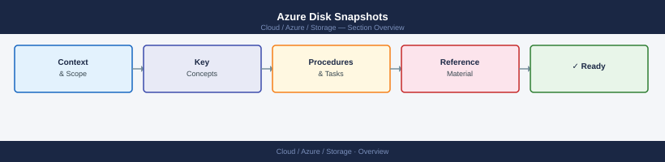
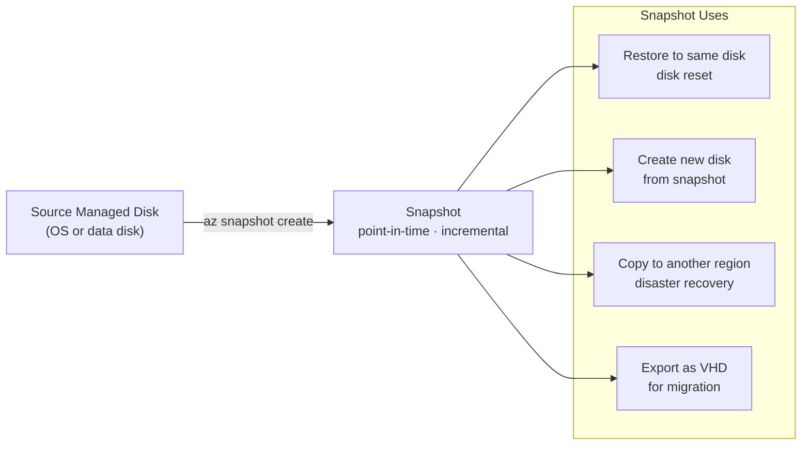

---
tags:
  - azure
---
# Azure Disk Snapshots


<div class="kb-summary">
Azure Disk Snapshots reference covering Overview, Snapshot Lifecycle, Creating Snapshots, Snapshot vs Full Backup Comparison, Restoring from Snapshot and 3 more sections.

*Applies to: Azure*
</div>



```d2
direction: right

center: "Azure" {shape: hexagon}
snapshot_lifecycle: "Snapshot Lifecycle" {shape: rectangle}
creating_snapshots: "Creating Snapshots" {shape: rectangle}
snapshot_vs_full_backup_comparison: "Snapshot vs Full Backup Comparison" {shape: rectangle}
restoring_from_snapshot: "Restoring from Snapshot" {shape: rectangle}
crossregion_snapshot_copy: "Cross-Region Snapshot Copy" {shape: rectangle}
snapshot_retention_and_cleanup: "Snapshot Retention and Cleanup" {shape: rectangle}

center -> snapshot_lifecycle
center -> creating_snapshots
center -> snapshot_vs_full_backup_comparison
center -> restoring_from_snapshot
center -> crossregion_snapshot_copy
center -> snapshot_retention_and_cleanup
```

## Overview

Azure managed disk snapshots capture the full state of a managed disk at a point in time. Incremental snapshots store only changed blocks since the last snapshot, significantly reducing storage costs and copy time. Snapshots are stored as page blobs in Azure Storage and can be used to restore disks or copy across regions.

## Snapshot Lifecycle



## Creating Snapshots

```bash
# Full snapshot of a managed disk
az snapshot create \
  --resource-group rg-compute-prod \
  --name "snap-vm01-osdisk-20260507" \
  --source "/subscriptions/<sub-id>/resourceGroups/rg-compute-prod/providers/Microsoft.Compute/disks/vm01-osdisk" \
  --sku Standard_LRS \
  --location eastus

# Incremental snapshot (recommended — much lower cost)
az snapshot create \
  --resource-group rg-compute-prod \
  --name "snap-vm01-osdisk-20260507-incr" \
  --source "/subscriptions/<sub-id>/resourceGroups/rg-compute-prod/providers/Microsoft.Compute/disks/vm01-osdisk" \
  --incremental true \
  --sku Standard_LRS

# List all snapshots in a resource group
az snapshot list \
  --resource-group rg-compute-prod \
  --output table

# Show snapshot details including size and incremental chain
az snapshot show \
  --resource-group rg-compute-prod \
  --name "snap-vm01-osdisk-20260507-incr"
```

## Snapshot vs Full Backup Comparison

| Property | Full Snapshot | Incremental Snapshot |
|---|---|---|
| First snapshot size | Full disk size | Full disk size |
| Subsequent sizes | Full disk size again | Changed blocks only |
| Copy speed | Slower (full copy) | Faster (delta only) |
| Storage cost | Higher | Lower |
| Restore capability | From single object | Requires snapshot chain |
| Cross-region copy | Supported | Supported |

## Restoring from Snapshot

```bash
# Create a new managed disk from a snapshot
az disk create \
  --resource-group rg-compute-prod \
  --name "vm01-osdisk-restored" \
  --source "/subscriptions/<sub-id>/resourceGroups/rg-compute-prod/providers/Microsoft.Compute/snapshots/snap-vm01-osdisk-20260507" \
  --sku Premium_LRS \
  --location eastus

# Swap the OS disk of a stopped VM to the restored disk
az vm stop --resource-group rg-compute-prod --name vm01
az vm update \
  --resource-group rg-compute-prod \
  --name vm01 \
  --os-disk "/subscriptions/<sub-id>/resourceGroups/rg-compute-prod/providers/Microsoft.Compute/disks/vm01-osdisk-restored"
az vm start --resource-group rg-compute-prod --name vm01
```

## Cross-Region Snapshot Copy

```bash
# Copy a snapshot to another region
az snapshot create \
  --resource-group rg-compute-dr \
  --name "snap-vm01-osdisk-20260507-westus" \
  --source "/subscriptions/<sub-id>/resourceGroups/rg-compute-prod/providers/Microsoft.Compute/snapshots/snap-vm01-osdisk-20260507" \
  --location westus2 \
  --sku Standard_LRS \
  --copy-start true

# Check copy status
az snapshot show \
  --resource-group rg-compute-dr \
  --name "snap-vm01-osdisk-20260507-westus" \
  --query "completionPercent"
```

## Snapshot Retention and Cleanup

```bash
# List snapshots older than 30 days
az snapshot list \
  --resource-group rg-compute-prod \
  --query "[?timeCreated < '$(date -u -d '30 days ago' +%Y-%m-%dT%H:%MZ)'].{name:name, created:timeCreated, size:diskSizeGB}" \
  --output table

# Delete a specific snapshot
az snapshot delete \
  --resource-group rg-compute-prod \
  --name "snap-vm01-osdisk-20260407"

# Delete multiple old snapshots matching a pattern
for snap in $(az snapshot list \
  --resource-group rg-compute-prod \
  --query "[?timeCreated < '2026-04-01T00:00Z'].name" \
  --output tsv); do
  echo "Deleting $snap"
  az snapshot delete --resource-group rg-compute-prod --name "$snap" --yes
done
```

## Snapshot Costs

```bash
# Get snapshot storage used (bytes)
az snapshot show \
  --resource-group rg-compute-prod \
  --name "snap-vm01-osdisk-20260507-incr" \
  --query "{name:name, diskSize:diskSizeGB, incrementalSizeGB:incrementalSnapshotFamilyId}" \
  --output json
```

Snapshot storage pricing reference:

| SKU | Price Tier | Notes |
|---|---|---|
| Standard_LRS | Low | Locally redundant; suitable for backups |
| Standard_ZRS | Medium | Zone-redundant; higher availability |
| Premium_LRS | Higher | Required if source disk is Premium |
