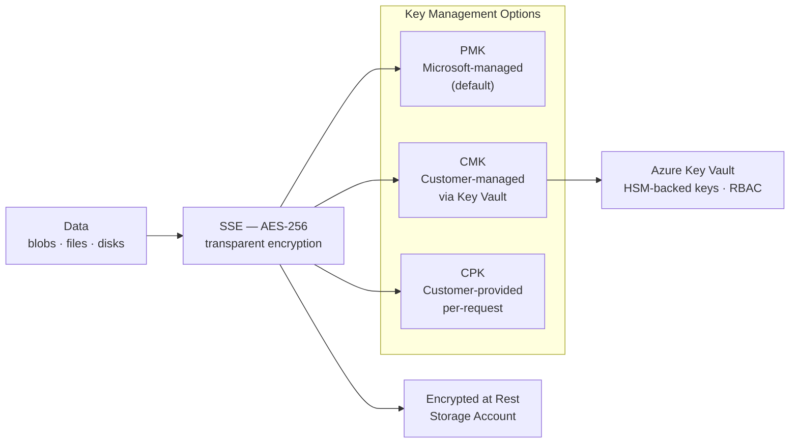

---
tags:
  - azure
---
# Azure Storage Encryption


<div class="kb-summary">
Azure Storage Encryption reference covering Overview, Storage Encryption Key Model, Encryption Key Options, Checking Encryption Status, Enabling Customer-Managed Keys (CMK) and 3 more sections.

*Applies to: Azure*
</div>
```text
┌────────────────────────────────── Cloud Azure Storage — Encryption ───────────────────────────────────┐
│                                                                                                       │
│   ┌───────────────────────────────────────────────────────────────────────────────────────────────┐   │
│   │          Azure encryption: data at rest and in transit encryption for all stored data         │   │
│   │          At rest: AES-256 encryption using controller-managed or external key manager         │   │
│   │          In transit: TLS 1.2+ for management; protocol encryption for data in flight          │   │
│   │         Key management: external KMIP-compatible KMS or built-in key lifecycle manager        │   │
│   └───────────────────────────────────────────────────────────────────────────────────────────────┘   │
│                                                                                                       │
│    Enable encryption → configure KMS → verify → audit → rotate keys                                   │
│                                                                                                       │
│                  ▼                                ▼                                ▼                  │
│                                                                                                       │
│   ┌─────────────────────────────┐  ┌─────────────────────────────┐  ┌─────────────────────────────┐   │
│   │            Layer            │  │          Component          │  │            Notes            │   │
│   │             Core            │  │       Primary service       │  │        Main function        │   │
│   │          Management         │  │        Control plane        │  │         Admin access        │   │
│   │          Monitoring         │  │         Health/perf         │  │      Alerts/dashboards      │   │
│   │           Security          │  │         Auth/encrypt        │  │        Access control       │   │
│   │         Integration         │  │        APIs/plug-ins        │  │         Third-party         │   │
│   └─────────────────────────────┘  └─────────────────────────────┘  └─────────────────────────────┘   │
│                                                                                                       │
│                          ▼                                                 ▼                          │
│                                                                                                       │
│   ┌───────────────────────────────────────────────────────────────────────────────────────────────┐   │
│   │      Layer       │     Standard     │     Key source    │       KMS        │      Notes       │   │
│   │     At rest      │     AES-256      │     Controller    │  Internal/KMIP   │    Always on     │   │
│   │    In transit    │     TLS 1.2+     │      PKI cert     │   Internal CA    │   Mgmt + data    │   │
│   │   Key rotation   │      Annual      │     KMS policy    │   External KMS   │    Automated     │   │
│   │    Key escrow    │     Required     │     KMS vault     │   External KMS   │    DR access     │   │
│   └───────────────────────────────────────────────────────────────────────────────────────────────┘   │
│                                                                                                       │
│    Physical: Cloud Azure Storage infrastructure · management network · monitoring                     │
│                                                                                                       │
│    Key terms:                                                                                         │
│                                                                                                       │
│    Azure              = Cloud Azure Storage platform overview and core concepts                       │
│    Management         = management console and command-line interface for administration              │
│    Monitoring         = health and performance monitoring dashboards and alerting                     │
│    Automation         = REST API, scripting, and pipeline integration capabilities                    │
│    Security           = access control, authentication, and encryption configuration                  │
│    Backup             = backup and recovery procedures and schedule configuration                     │
│    Upgrade            = software version upgrades and firmware patching procedures                    │
│    Troubleshooting    = diagnostic procedures and common issue resolution steps                       │
│    Escalation         = vendor support escalation path and severity triage process                    │
│    Documentation      = vendor knowledge base and official product documentation                      │
│    Change management  = change ticket requirements for production modifications                       │
│    Audit log          = admin action logging for compliance and security review                       │
│                                                                                                       │
└───────────────────────────────────────────────────────────────────────────────────────────────────────┘
```


## Overview

All Azure Storage data is encrypted at rest by default using Storage Service Encryption (SSE). Encryption uses AES-256 and is transparent to applications. Key management options include Platform-Managed Keys (PMK), Customer-Managed Keys (CMK) via Azure Key Vault, and Customer-Provided Keys (CPK) for per-request encryption.

## Storage Encryption Key Model



## Encryption Key Options

| Option | Key Storage | Key Rotation | Use Case |
|---|---|---|---|
| Platform-Managed Keys (PMK) | Microsoft-managed | Automatic | Default; lowest operational overhead |
| Customer-Managed Keys (CMK) | Azure Key Vault | Manual or auto (Key Vault policy) | Compliance requirements, key ownership |
| Customer-Provided Keys (CPK) | Client application | Client-managed | Per-request; keys never stored in Azure |
| Infrastructure Encryption | Double encryption layer | Managed by Microsoft | Highest security posture |

## Checking Encryption Status

```bash
# Check encryption settings for a storage account
az storage account show \
  --resource-group rg-storage-prod \
  --name stprodblobs01 \
  --query "encryption" \
  --output json

# Check if infrastructure encryption is enabled
az storage account show \
  --resource-group rg-storage-prod \
  --name stprodblobs01 \
  --query "encryption.requireInfrastructureEncryption"
```

## Enabling Customer-Managed Keys (CMK)

CMK requires an Azure Key Vault with soft delete and purge protection enabled.

```bash
# Step 1: Create or verify Key Vault with required settings
az keyvault create \
  --resource-group rg-storage-prod \
  --name kv-storage-prod \
  --location eastus \
  --enable-soft-delete true \
  --enable-purge-protection true

# Step 2: Create an RSA key in Key Vault
az keyvault key create \
  --vault-name kv-storage-prod \
  --name storage-cmk \
  --kty RSA \
  --size 4096

# Step 3: Assign managed identity to the storage account
az storage account update \
  --resource-group rg-storage-prod \
  --name stprodblobs01 \
  --assign-identity

# Step 4: Get the managed identity principal ID
PRINCIPAL=$(az storage account show \
  --resource-group rg-storage-prod \
  --name stprodblobs01 \
  --query "identity.principalId" -o tsv)

# Step 5: Grant Key Vault access to the managed identity
az keyvault set-policy \
  --name kv-storage-prod \
  --object-id $PRINCIPAL \
  --key-permissions get wrapKey unwrapKey

# Step 6: Get the Key Vault key URI
KEY_URI=$(az keyvault key show \
  --vault-name kv-storage-prod \
  --name storage-cmk \
  --query "key.kid" -o tsv)

# Step 7: Configure CMK on the storage account
az storage account update \
  --resource-group rg-storage-prod \
  --name stprodblobs01 \
  --encryption-key-source Microsoft.Keyvault \
  --encryption-key-vault "https://kv-storage-prod.vault.azure.net" \
  --encryption-key-name storage-cmk \
  --encryption-key-version ""
```

## Key Rotation

```bash
# Rotate to a new key version in Key Vault
az keyvault key create \
  --vault-name kv-storage-prod \
  --name storage-cmk \
  --kty RSA \
  --size 4096

# Update storage account to use latest key version (empty version = auto-rotate)
az storage account update \
  --resource-group rg-storage-prod \
  --name stprodblobs01 \
  --encryption-key-version ""

# Verify current key version in use
az storage account show \
  --resource-group rg-storage-prod \
  --name stprodblobs01 \
  --query "encryption.keyVaultProperties"
```

## Infrastructure Encryption

Infrastructure encryption adds a second independent encryption layer using a different algorithm at the storage infrastructure level.

```bash
# Infrastructure encryption must be set at account creation — cannot be changed after
az storage account create \
  --resource-group rg-storage-prod \
  --name stprodinfraenc01 \
  --location eastus \
  --sku Standard_GRS \
  --kind StorageV2 \
  --require-infrastructure-encryption true

# Verify infrastructure encryption is active
az storage account show \
  --resource-group rg-storage-prod \
  --name stprodinfraenc01 \
  --query "encryption.requireInfrastructureEncryption"
```

## Transport Encryption (TLS)

```bash
# Enforce HTTPS-only access (disable HTTP)
az storage account update \
  --resource-group rg-storage-prod \
  --name stprodblobs01 \
  --https-only true

# Set minimum TLS version to 1.2
az storage account update \
  --resource-group rg-storage-prod \
  --name stprodblobs01 \
  --min-tls-version TLS1_2

# Verify settings
az storage account show \
  --resource-group rg-storage-prod \
  --name stprodblobs01 \
  --query "{https:supportsHttpsTrafficOnly, tls:minimumTlsVersion}"
```
