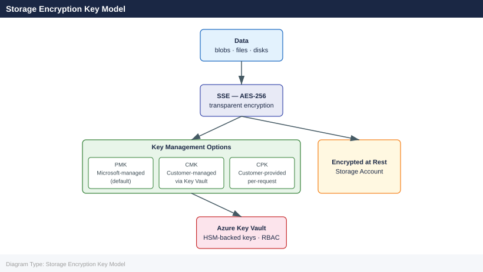

---
tags:
  - azure
---
# Azure Storage Encryption

<div class="kb-summary">
Azure Storage Encryption reference covering Overview, Storage Encryption Key Model, Encryption Key Options, Checking Encryption Status, Enabling Customer-Managed Keys (CMK) and 3 more sections.

*Applies to: Azure*
</div>

```d2
direction: down

storage_encryption_key_model: "Storage Encryption Key Model" {shape: rectangle}
encryption_key_options: "Encryption Key Options" {shape: rectangle}
checking_encryption_status: "Checking Encryption Status" {shape: rectangle}
enabling_customermanaged_keys_cmk: "Enabling Customer-Managed Keys (CMK)" {shape: rectangle}
key_rotation: "Key Rotation" {shape: rectangle}
infrastructure_encryption: "Infrastructure Encryption" {shape: rectangle}

storage_encryption_key_model -> encryption_key_options: hardens
encryption_key_options -> checking_encryption_status: hardens
checking_encryption_status -> enabling_customermanaged_keys_cmk: hardens
enabling_customermanaged_keys_cmk -> key_rotation: hardens
key_rotation -> infrastructure_encryption: hardens
```

## Overview

All Azure Storage data is encrypted at rest by default using Storage Service Encryption (SSE). Encryption uses AES-256 and is transparent to applications. Key management options include Platform-Managed Keys (PMK), Customer-Managed Keys (CMK) via Azure Key Vault, and Customer-Provided Keys (CPK) for per-request encryption.

## Storage Encryption Key Model



## Encryption Key Options

| Option | Key Storage | Key Rotation | Use Case |
|---|---|---|---|
| Platform-Managed Keys (PMK) | Microsoft-managed | Automatic | Default; lowest operational overhead |
| Customer-Managed Keys (CMK) | Azure Key Vault | Manual or auto (Key Vault policy) | Compliance requirements, key ownership |
| Customer-Provided Keys (CPK) | Client application | Client-managed | Per-request; keys never stored in Azure |
| Infrastructure Encryption | Double encryption layer | Managed by Microsoft | Highest security posture |

## Checking Encryption Status

```bash
# Check encryption settings for a storage account
az storage account show \
  --resource-group rg-storage-prod \
  --name stprodblobs01 \
  --query "encryption" \
  --output json

# Check if infrastructure encryption is enabled
az storage account show \
  --resource-group rg-storage-prod \
  --name stprodblobs01 \
  --query "encryption.requireInfrastructureEncryption"
```


```text title="Expected output"
{
  "keySource": "Microsoft.Storage",
  "services": {
    "blob": {
      "enabled": true,
      "lastEnabledTime": "2024-01-15T09:42:33.000000+00:00"
    },
    "file": {
      "enabled": true,
      "lastEnabledTime": "2024-01-15T09:42:33.000000+00:00"
    },
    "queue": {
      "enabled": true,
      "lastEnabledTime": "2024-01-15T09:42:33.000000+00:00"
    },
    "table": {
      "enabled": true,
      "lastEnabledTime": "2024-01-15T09:42:33.000000+00:00"
    }
  }
}
true
```

!!! warning "Common errors"
    **`ResourceNotFound: The Resource 'Microsoft.Storage/storageAccounts/stprodblobs01' under resource group 'rg-storage-prod' was not found.`** — Verify the storage account name and resource group name are correct using `az storage account list --resource-group rg-storage-prod`.
    **`AuthorizationFailed: The client 'user@contoso.com' with object id 'xxxxxxxx-xxxx-xxxx-xxxx-xxxxxxxxxxxx' does not have authorization to perform action 'Microsoft.Storage/storageAccounts/read' over scope '/subscriptions/xxxxxxxx-xxxx-xxxx-xxxx-xxxxxxxxxxxx/resourceGroups/rg-storage-prod/providers/Microsoft.Storage/storageAccounts/stprodblobs01'.`** — Ensure your Azure account has at least Storage Account Contributor or Reader role assigned on the storage account or resource group.
## Enabling Customer-Managed Keys (CMK)

CMK requires an Azure Key Vault with soft delete and purge protection enabled.

```bash
# Step 1: Create or verify Key Vault with required settings
az keyvault create \
  --resource-group rg-storage-prod \
  --name kv-storage-prod \
  --location eastus \
  --enable-soft-delete true \
  --enable-purge-protection true

# Step 2: Create an RSA key in Key Vault
az keyvault key create \
  --vault-name kv-storage-prod \
  --name storage-cmk \
  --kty RSA \
  --size 4096

# Step 3: Assign managed identity to the storage account
az storage account update \
  --resource-group rg-storage-prod \
  --name stprodblobs01 \
  --assign-identity

# Step 4: Get the managed identity principal ID
PRINCIPAL=$(az storage account show \
  --resource-group rg-storage-prod \
  --name stprodblobs01 \
  --query "identity.principalId" -o tsv)

# Step 5: Grant Key Vault access to the managed identity
az keyvault set-policy \
  --name kv-storage-prod \
  --object-id $PRINCIPAL \
  --key-permissions get wrapKey unwrapKey

# Step 6: Get the Key Vault key URI
KEY_URI=$(az keyvault key show \
  --vault-name kv-storage-prod \
  --name storage-cmk \
  --query "key.kid" -o tsv)

# Step 7: Configure CMK on the storage account
az storage account update \
  --resource-group rg-storage-prod \
  --name stprodblobs01 \
  --encryption-key-source Microsoft.Keyvault \
  --encryption-key-vault "https://kv-storage-prod.vault.azure.net" \
  --encryption-key-name storage-cmk \
  --encryption-key-version ""
```


```text title="Expected output"
{
  "id": "/subscriptions/a1b2c3d4-e5f6-4a7b-8c9d-0e1f2a3b4c5d/resourceGroups/rg-storage-prod/providers/Microsoft.KeyVault/vaults/kv-storage-prod",
  "location": "eastus",
  "name": "kv-storage-prod",
  "properties": {
    "enablePurgeProtection": true,
    "enableSoftDelete": true,
    "tenantId": "72f988bf-86f1-41af-91ab-2d7cd011db47"
  }
}
{
  "attributes": {
    "created": 1699564892,
    "enabled": true,
    "updated": 1699564892
  },
  "key": {
    "crv": null,
    "kid": "https://kv-storage-prod.vault.azure.net/keys/storage-cmk/a7f3c2e1b9d4f6a8c5e2b1d9f4a7c3e1",
    "kty": "RSA",
    "n": "0vx7agoebGcQSuuPiLJXZptN9nndrQmbXEps2aiAFbWhM78LhWx4cbbfAAtVT86zwu1RK7aPFFxuhDR1L6tSoc_BJECPebWKRXjBZCiFV4n3oknjhMstn64tZ_2W-5JsGY4Hc5n9yBXArwl93lqt7_RN5w6Cf0h4QyQ5v-65YGjQR0_FDW2QvzqY368QQMicAtaSqzs8KJZgnYb9c7d0zgdAZHzu6qMQvRL5hajrn1n91CbOpbISD08qNLyrdkt-bFTWhAI4vMQFh6WeZu0fM4lFd2NcRwr3XPksINHaQ-G_xBniIqbw0Ls1jF44-csFCur-kEgU8awapJzKnqDKgw",
    "use": "enc"
  }
}
{
  "identity": {
    "principalId": "f8c3d2e1-a9b4-4c7f-8e2d-1a5b9c3f7e2d",
    "tenantId": "72f988bf-86f1-41af-91ab-2d7cd011db47",
    "type": "SystemAssigned"
  },
  "name": "stprodblobs01"
}
f8c3d2e1-a9b4-4c7f-8e2d-1a5b9c3f7e2d
{
  "id": "/subscriptions/a1b2c3d4-e5f6-4a7b-8c9d-0e1f2a3b4c5d/resourceGroups/
```
## Key Rotation

```bash
# Rotate to a new key version in Key Vault
az keyvault key create \
  --vault-name kv-storage-prod \
  --name storage-cmk \
  --kty RSA \
  --size 4096

# Update storage account to use latest key version (empty version = auto-rotate)
az storage account update \
  --resource-group rg-storage-prod \
  --name stprodblobs01 \
  --encryption-key-version ""

# Verify current key version in use
az storage account show \
  --resource-group rg-storage-prod \
  --name stprodblobs01 \
  --query "encryption.keyVaultProperties"
```


```text title="Expected output"
Key created successfully with kid: https://kv-storage-prod.vault.azure.net/keys/storage-cmk/a7f2c9e1b4d6f8a2c5e7g9h1j3k5m7n9.
(no output — command completes silently)
{
  "keyName": "storage-cmk",
  "keyVaultUri": "https://kv-storage-prod.vault.azure.net/",
  "keyVersion": ""
}
```

!!! warning "Common errors"
    **`The user, group or application 'appid=12345678-1234-1234-1234-123456789012;oid=87654321-4321-4321-4321-210987654321' does not have access to key 'storage-cmk' in this vault.`** — Grant the storage account's managed identity Key Vault access with `az keyvault set-policy --name kv-storage-prod --object-id <storage-identity-oid> --key-permissions get unwrapKey wrapKey`.
    **`(ResourceNotFound) The storage account 'stprodblobs01' could not be found.`** — Verify the storage account name and resource group are correct with `az storage account list --resource-group rg-storage-prod`.
## Infrastructure Encryption

Infrastructure encryption adds a second independent encryption layer using a different algorithm at the storage infrastructure level.

```bash
# Infrastructure encryption must be set at account creation — cannot be changed after
az storage account create \
  --resource-group rg-storage-prod \
  --name stprodinfraenc01 \
  --location eastus \
  --sku Standard_GRS \
  --kind StorageV2 \
  --require-infrastructure-encryption true

# Verify infrastructure encryption is active
az storage account show \
  --resource-group rg-storage-prod \
  --name stprodinfraenc01 \
  --query "encryption.requireInfrastructureEncryption"
```


```text title="Expected output"
{
  "id": "/subscriptions/a1b2c3d4-e5f6-4a7b-8c9d-0e1f2a3b4c5d/resourceGroups/rg-storage-prod/providers/Microsoft.Storage/storageAccounts/stprodinfraenc01",
  "name": "stprodinfraenc01",
  "type": "Microsoft.Storage/storageAccounts",
  "location": "eastus",
  "sku": {
    "name": "Standard_GRS"
  },
  "kind": "StorageV2",
  "encryption": {
    "requireInfrastructureEncryption": true
  }
}
true
```

!!! warning "Common errors"
    **`ResourceGroupNotFound : Resource group 'rg-storage-prod' could not be found.`** — Create the resource group first with `az group create --name rg-storage-prod --location eastus`.
    **`StorageAccountAlreadyTaken : The storage account named 'stprodinfraenc01' is already taken.`** — Choose a unique storage account name (must be globally unique across Azure) and retry.
    **`InvalidParameter : The value of parameter 'require-infrastructure-encryption' is invalid.`** — Use lowercase `true` or `false` as string values, or remove quotes if using boolean flags.
## Transport Encryption (TLS)

```bash
# Enforce HTTPS-only access (disable HTTP)
az storage account update \
  --resource-group rg-storage-prod \
  --name stprodblobs01 \
  --https-only true

# Set minimum TLS version to 1.2
az storage account update \
  --resource-group rg-storage-prod \
  --name stprodblobs01 \
  --min-tls-version TLS1_2

# Verify settings
az storage account show \
  --resource-group rg-storage-prod \
  --name stprodblobs01 \
  --query "{https:supportsHttpsTrafficOnly, tls:minimumTlsVersion}"
```


```text title="Expected output"
{
  "https": true,
  "tls": "TLS1_2"
}
```

!!! warning "Common errors"
    **`ResourceNotFound: The Resource 'Microsoft.Storage/storageAccounts/stprodblobs01' under resource group 'rg-storage-prod' was not found.`** — Verify the storage account name and resource group name are correct using `az storage account list --resource-group rg-storage-prod`.
    **`AuthorizationFailed: The client 'user@contoso.com' with object id 'xxxxxxxx-xxxx-xxxx-xxxx-xxxxxxxxxxxx' does not have authorization to perform action 'Microsoft.Storage/storageAccounts/write' over scope '/subscriptions/xxxxxxxx-xxxx-xxxx-xxxx-xxxxxxxxxxxx/resourceGroups/rg-storage-prod/providers/Microsoft.Storage/storageAccounts/stprodblobs01'.`** — Ensure your Azure account has Storage Account Contributor or Owner role on the resource group using `az role assignment list --resource-group rg-storage-prod`.
## See also

- [Azure — Overview](../../)
